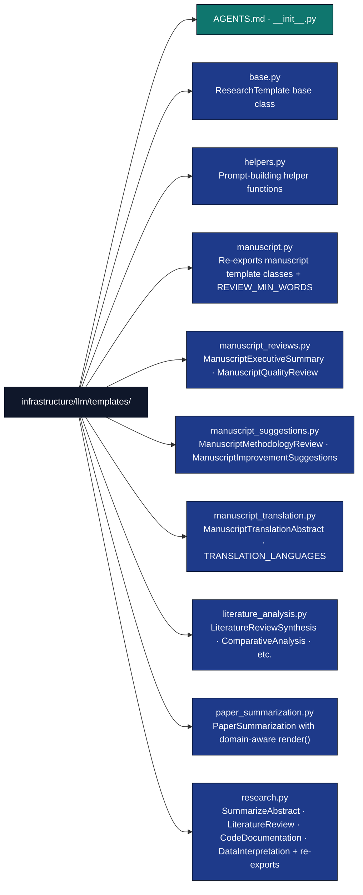

# LLM Templates Module

## Overview

The `infrastructure/llm/templates/` directory contains prompt template classes for LLM operations. Every template subclasses `ResearchTemplate` from `base.py` and renders a prompt string via Python's `string.Template` substitution. Manuscript templates are split across focused submodules and re-exported through `manuscript.py`; research templates live in `research.py` and its submodules.

## Directory Structure



## Key Components

### Base Template Class (`base.py`)

**`ResearchTemplate`** is the only base class in this package. It uses Python's `string.Template` to substitute named variables into `template_str`.

```python
from infrastructure.llm.templates.base import ResearchTemplate
from infrastructure.core.exceptions import LLMTemplateError

class ResearchTemplate:
    template_str: str = ""

    def render(self, **kwargs) -> str:
        """Render template_str with the provided keyword arguments.

        Raises:
            LLMTemplateError: if a required variable is missing.
        """
```

**Subclassing:**

```python
from infrastructure.llm.templates.base import ResearchTemplate

class MyTemplate(ResearchTemplate):
    template_str = "Summarise: ${text}"

prompt = MyTemplate().render(text="paper content here")
```

### Template Helpers (`helpers.py`)

Five functions return formatted instruction blocks suitable for injection into prompt strings:

```python
from infrastructure.llm.templates import (
    format_requirements,
    token_budget_awareness,
    content_requirements,
    section_structure,
    validation_hints,
)
```

#### `format_requirements`

```python
def format_requirements(
    required_headers: list[str],
    markdown_format: bool = True,
    section_requirements: dict[str, str | None] | None = None,
) -> str:
    """Return a FORMAT REQUIREMENTS block listing required section headers."""
```

#### `token_budget_awareness`

```python
def token_budget_awareness(
    total_tokens: int | None = None,
    section_budgets: dict[str, int] | None = None,
    word_targets: dict[str, tuple[int, int]] | None = None,
) -> str:
    """Return a TOKEN BUDGET AWARENESS block specifying output length targets."""
```

#### `content_requirements`

```python
def content_requirements(
    no_hallucination: bool = True,
    cite_sources: bool = True,
    evidence_based: bool = True,
    no_meta_commentary: bool = True,
) -> str:
    """Return a CONTENT QUALITY REQUIREMENTS block."""
```

#### `section_structure`

```python
def section_structure(
    sections: list[str],
    section_descriptions: dict[str, str | None] | None = None,
    required_order: bool = True,
) -> str:
    """Return a SECTION STRUCTURE block listing required sections in order."""
```

#### `validation_hints`

```python
def validation_hints(
    word_count_range: tuple[int, int] | None = None,
    required_elements: list[str] | None = None,
    format_checks: list[str] | None = None,
) -> str:
    """Return a VALIDATION HINTS block describing what will be checked post-generation."""
```

### Manuscript Templates (`manuscript.py` and submodules)

`manuscript.py` re-exports all manuscript classes from three focused submodules and defines `REVIEW_MIN_WORDS`.

**`REVIEW_MIN_WORDS`** — minimum word counts for quality validation:

```python
from infrastructure.llm.templates import REVIEW_MIN_WORDS

# {"executive_summary": 250, "quality_review": 300,
#  "methodology_review": 300, "improvement_suggestions": 200,
#  "translation": 400}
```

**Manuscript template classes** — all share the same `render(text, max_tokens)` signature inherited from `ResearchTemplate`, except `ManuscriptTranslationAbstract` which additionally requires `target_language`:

```python
from infrastructure.llm.templates import (
    ManuscriptExecutiveSummary,      # manuscript_reviews.py
    ManuscriptQualityReview,         # manuscript_reviews.py
    ManuscriptMethodologyReview,     # manuscript_suggestions.py
    ManuscriptImprovementSuggestions,# manuscript_suggestions.py
    ManuscriptTranslationAbstract,   # manuscript_translation.py
    TRANSLATION_LANGUAGES,           # manuscript_translation.py
)

# Standard manuscript review
prompt = ManuscriptQualityReview().render(text=manuscript_text, max_tokens=2048)

# Translation (requires target_language)
prompt = ManuscriptTranslationAbstract().render(
    text=abstract_text,
    target_language=TRANSLATION_LANGUAGES["zh"],
    max_tokens=2048,
)
```

### Research Templates (`research.py` and submodules)

Simple single-variable templates defined directly in `research.py`:

```python
from infrastructure.llm.templates import (
    SummarizeAbstract,     # template_str uses ${text}
    LiteratureReview,      # template_str uses ${summaries}
    CodeDocumentation,     # template_str uses ${code}
    DataInterpretation,    # template_str uses ${stats}
)

prompt = SummarizeAbstract().render(text=abstract_text)
prompt = LiteratureReview().render(summaries=combined_summaries)
prompt = CodeDocumentation().render(code=source_code)
prompt = DataInterpretation().render(stats=statistics_text)
```

### Paper Summarisation Template (`paper_summarization.py`)

`PaperSummarization` has an extended `render()` that adds domain-aware instructions and reference information:

```python
from infrastructure.llm.templates import PaperSummarization

prompt = PaperSummarization().render(
    title="Paper Title",
    authors="Author Names",
    year="2024",
    source="arXiv",
    text=paper_text,
    domain="computer_science",     # optional — e.g. "physics", "biology"
    domain_instructions=None,      # optional; use None for built-in domain hints
    reference_count=42,            # optional — detected citation count
    references_section_found=True, # optional
)
```

### Literature Analysis Templates (`literature_analysis.py`)

Five templates for multi-paper analysis workflows:

```python
from infrastructure.llm.templates import (
    LiteratureReviewSynthesis,
    ScienceCommunicationNarrative,
    ComparativeAnalysis,
    ResearchGapIdentification,
    CitationNetworkAnalysis,
)
```

## Template Registry and Factory

The module exposes a `TEMPLATES` dict and `get_template()` function as the preferred entry point:

```python
from infrastructure.llm.templates import TEMPLATES, get_template

# All registered keys
print(list(TEMPLATES.keys()))
# ['summarize_abstract', 'literature_review', 'code_doc', 'data_interpret',
#  'paper_summarization', 'manuscript_executive_summary', 'manuscript_quality_review',
#  'manuscript_methodology_review', 'manuscript_improvement_suggestions',
#  'manuscript_translation_abstract', 'literature_review_synthesis',
#  'science_communication_narrative', 'comparative_analysis',
#  'research_gap_identification', 'citation_network_analysis']

# Instantiate by key — raises LLMTemplateError for unknown keys
template = get_template("manuscript_quality_review")
prompt = template.render(text=manuscript_text, max_tokens=2048)
```

## Integration with the Review Pipeline

The `review/generator.py` module uses manuscript template classes directly. The typical pipeline path:

```python
# Actual pipeline usage pattern (from review/generation.py)
from infrastructure.llm.templates import ManuscriptQualityReview
from infrastructure.llm.review import generate_review_with_metrics
from infrastructure.llm.core.client import LLMClient

client = LLMClient()
review_text, metrics = generate_review_with_metrics(
    client=client,
    text=manuscript_text,
    review_type="quality_review",
    review_name="quality review",
    template_class=ManuscriptQualityReview,
    model_name="gemma3:4b",
    temperature=0.3,
)
```

## Error Handling

Template rendering raises `LLMTemplateError` (from `infrastructure.core.exceptions`) when a required variable is missing from `render()`:

```python
from infrastructure.core.exceptions import LLMTemplateError

try:
    prompt = SummarizeAbstract().render()  # missing 'text'
except LLMTemplateError as e:
    print(f"Missing variable: {e}")
```

## Testing

Follow the project no-mocks policy — use real template instances and string inputs:

```python
from infrastructure.llm.templates import SummarizeAbstract, get_template
from infrastructure.core.exceptions import LLMTemplateError
import pytest

def test_summarize_abstract_renders():
    prompt = SummarizeAbstract().render(text="Sample abstract text.")
    assert "Sample abstract text." in prompt

def test_get_template_unknown_raises():
    with pytest.raises(LLMTemplateError):
        get_template("nonexistent_template")

def test_paper_summarization_render():
    prompt = PaperSummarization().render(
        title="Test Paper", authors="Author A", year="2024",
        source="arXiv", text="Paper body text."
    )
    assert "Test Paper" in prompt
    assert "Paper body text." in prompt
```

## See Also

**Related Documentation:**

- [`../core/AGENTS.md`](../core/AGENTS.md) - LLM core client and configuration
- [`../prompts/AGENTS.md`](../prompts/AGENTS.md) - Prompt engineering system
- [`../review/AGENTS.md`](../review/AGENTS.md) - Review generation

**System Documentation:**

- [`../../../AGENTS.md`](../../../AGENTS.md) - system overview
- [`../../../docs/usage/manuscript-numbering-system.md`](../../../docs/usage/manuscript-numbering-system.md) - Manuscript handling guide
