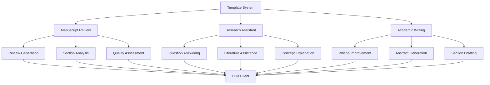

# LLM Templates - Quick Reference

High-level template system for common research tasks.

## Overview

The templates module provides high-level abstractions for common LLM tasks in research workflows. It includes specialized templates for manuscript review, research assistance, and academic writing.

## Quick Start

```python
from infrastructure.llm.templates import ManuscriptReviewTemplate

# Create template instance
template = ManuscriptReviewTemplate()

# Generate review
review = template.generate_review(
    manuscript_path=Path("manuscript.pdf"),
    focus_areas=["methodology", "results"]
)
```

## Available Templates

### Manuscript Review Template

Comprehensive manuscript review:

```python
from infrastructure.llm.templates import ManuscriptReviewTemplate

template = ManuscriptReviewTemplate()

# Full review
review = template.generate_review(
    manuscript_path=Path("manuscript.pdf"),
    review_type="comprehensive"
)

# Focused review
methodology_review = template.review_methodology(
    manuscript_text=text
)
```

### Research Assistant Template

General research assistance:

```python
from infrastructure.llm.templates import ResearchAssistantTemplate

assistant = ResearchAssistantTemplate()

# Answer research question
answer = assistant.answer_question(
    question="What are the key challenges in X?",
    context=relevant_papers
)

# Generate outline
outline = assistant.generate_outline(
    topic="Machine learning applications",
    sections=["introduction", "methods", "results"]
)
```

### Academic Writing Template

Academic writing assistance:

```python
from infrastructure.llm.templates import AcademicWritingTemplate

writer = AcademicWritingTemplate()

# Improve writing
improved = writer.improve_section(
    text=section_text,
    style="academic",
    focus="clarity"
)

# Generate abstract
abstract = writer.generate_abstract(
    paper_content=full_paper_text
)
```

## Template Methods

### Manuscript Review Methods

```python
template = ManuscriptReviewTemplate()

# Executive summary
summary = template.generate_executive_summary(manuscript_text)

# Methodology review
methodology = template.review_methodology(manuscript_text)

# Results evaluation
results = template.evaluate_results(manuscript_text)

# Improvement suggestions
suggestions = template.suggest_improvements(manuscript_text)
```

### Research Assistant Methods

```python
assistant = ResearchAssistantTemplate()

# Literature search assistance
papers = assistant.suggest_papers(topic="quantum computing")

# Concept explanation
explanation = assistant.explain_concept(
    concept="quantum entanglement",
    level="graduate"
)

# Comparison analysis
comparison = assistant.compare_approaches(
    approach1="method A",
    approach2="method B"
)
```

## Configuration

### Template Settings

```python
from infrastructure.llm.templates import ManuscriptReviewTemplate

template = ManuscriptReviewTemplate(
    model_name="gemma3:4b",
    temperature=0.7,
    max_tokens=2000,
    review_depth="comprehensive"
)
```

### Custom Prompts

```python
# Override default prompts
template = ManuscriptReviewTemplate()
template.set_custom_prompt(
    section="methodology",
    prompt="Custom methodology review prompt..."
)
```

## Integration

### Pipeline Integration

```python
# scripts/06_llm_review.py
from infrastructure.llm.templates import ManuscriptReviewTemplate

def run_review(manuscript_path):
    template = ManuscriptReviewTemplate()
    review = template.generate_review(manuscript_path)
    
    # Save review
    save_review(review, output_path)
    return review
```

### Batch Processing

```python
from infrastructure.llm.templates import ManuscriptReviewTemplate

template = ManuscriptReviewTemplate()

# Review multiple manuscripts
manuscripts = list(Path("manuscripts/").glob("*.pdf"))

for manuscript in manuscripts:
    review = template.generate_review(manuscript)
    save_review(review, f"reviews/{manuscript.stem}.json")
```

## Architecture



## See Also

- [AGENTS.md](AGENTS.md) - Complete templates documentation
- [../core/README.md](../core/README.md) - LLM core functionality
- [../prompts/README.md](../prompts/README.md) - Prompt system
- [../review/README.md](../review/README.md) - Review generation