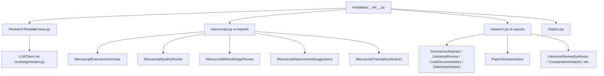

# LLM Templates - Quick Reference

Prompt templates for research tasks, backed by a simple string-substitution engine.

## Overview

The templates module provides reusable prompt classes for common LLM research workflows: manuscript review, translation, paper summarisation, and literature analysis. Each template class subclasses `ResearchTemplate` and renders a prompt string via Python's `string.Template`.

## Quick Start

```python
from infrastructure.llm.templates import get_template

# Retrieve a template by registry key
template = get_template("manuscript_quality_review")

# Render to a prompt string
prompt = template.render(text=manuscript_text, max_tokens=2048)
```

## Available Templates

Templates are keyed in the `TEMPLATES` registry (see `__init__.py`). Use `get_template(name)` to instantiate any of them.

### Manuscript Review Templates

Four templates cover the manuscript review pipeline:

```python
from infrastructure.llm.templates import (
    ManuscriptExecutiveSummary,
    ManuscriptQualityReview,
    ManuscriptMethodologyReview,
    ManuscriptImprovementSuggestions,
)

# Instantiate directly or via get_template()
template = ManuscriptQualityReview()
prompt = template.render(text=manuscript_text, max_tokens=2048)
```

### Manuscript Translation Template

```python
from infrastructure.llm.templates import ManuscriptTranslationAbstract, TRANSLATION_LANGUAGES

# TRANSLATION_LANGUAGES maps language codes to full names
# e.g. {"zh": "Chinese", "hi": "Hindi", "ru": "Russian"}
template = ManuscriptTranslationAbstract()
prompt = template.render(
    text=abstract_text,
    target_language=TRANSLATION_LANGUAGES["zh"],
    max_tokens=2048,
)
```

### Research and Summarisation Templates

```python
from infrastructure.llm.templates import (
    SummarizeAbstract,
    LiteratureReview,
    CodeDocumentation,
    DataInterpretation,
    PaperSummarization,
    LiteratureReviewSynthesis,
    ScienceCommunicationNarrative,
    ComparativeAnalysis,
    ResearchGapIdentification,
    CitationNetworkAnalysis,
)

# Simple single-variable templates
prompt = SummarizeAbstract().render(text=abstract_text)
prompt = LiteratureReview().render(summaries=paper_summaries)
prompt = CodeDocumentation().render(code=source_code)
prompt = DataInterpretation().render(stats=statistics_text)

# PaperSummarization has a richer render() signature
from infrastructure.llm.templates import PaperSummarization

prompt = PaperSummarization().render(
    title="Paper Title",
    authors="Author Names",
    year="2024",
    source="arXiv",
    text=paper_text,
    domain="computer_science",        # optional
    domain_instructions=None,         # optional; defaults to built-in hints
    reference_count=42,               # optional
    references_section_found=True,    # optional
)
```

## Template Registry

The module exposes a `TEMPLATES` dict and `get_template()` factory:

```python
from infrastructure.llm.templates import TEMPLATES, get_template

# List all available template keys
print(list(TEMPLATES.keys()))
# ['summarize_abstract', 'literature_review', 'code_doc', 'data_interpret',
#  'paper_summarization', 'manuscript_executive_summary', 'manuscript_quality_review',
#  'manuscript_methodology_review', 'manuscript_improvement_suggestions',
#  'manuscript_translation_abstract', 'literature_review_synthesis',
#  'science_communication_narrative', 'comparative_analysis',
#  'research_gap_identification', 'citation_network_analysis']

template = get_template("paper_summarization")  # returns PaperSummarization()
```

`get_template` raises `LLMTemplateError` for unknown keys.

## Prompt-Building Helpers

`helpers.py` exports four functions that return formatted instruction blocks for injection into prompt strings:

```python
from infrastructure.llm.templates import (
    format_requirements,
    token_budget_awareness,
    content_requirements,
    section_structure,
    validation_hints,
)

fmt_block = format_requirements(
    required_headers=["## Summary", "## Methods", "## Results"],
    section_requirements={"## Methods": "at least 100 words"},
)

budget_block = token_budget_awareness(
    total_tokens=2048,
    word_targets={"## Summary": (50, 100)},
)

quality_block = content_requirements(
    no_hallucination=True,
    cite_sources=True,
    evidence_based=True,
    no_meta_commentary=True,
)

struct_block = section_structure(
    sections=["Summary", "Methods", "Results"],
    section_descriptions={"Methods": "describe experimental design"},
)

hints_block = validation_hints(
    word_count_range=(300, 800),
    required_elements=["numerical results"],
)
```

## Minimum Word Counts

`REVIEW_MIN_WORDS` defines the minimum acceptable word counts for quality validation of each manuscript review type:

```python
from infrastructure.llm.templates import REVIEW_MIN_WORDS

# {"executive_summary": 250, "quality_review": 300,
#  "methodology_review": 300, "improvement_suggestions": 200,
#  "translation": 400}
```

## Architecture


```mermaid
graph TD
    A[templates/__init__.py] --> B[ResearchTemplate base.py]
    A --> C[manuscript.py re-exports]
    A --> D[research.py re-exports]
    A --> E[helpers.py]

    C --> C1[ManuscriptExecutiveSummary]
    C --> C2[ManuscriptQualityReview]
    C --> C3[ManuscriptMethodologyReview]
    C --> C4[ManuscriptImprovementSuggestions]
    C --> C5[ManuscriptTranslationAbstract]

    D --> D1[SummarizeAbstract / LiteratureReview / CodeDocumentation / DataInterpretation]
    D --> D2[PaperSummarization]
    D --> D3[LiteratureReviewSynthesis / ComparativeAnalysis / etc.]

    B --> F[LLMClient via review/generator.py]
```

## See Also

- [AGENTS.md](AGENTS.md) - templates module reference
- [../core/README.md](../core/README.md) - LLM core client
- [../prompts/README.md](../prompts/README.md) - Prompt system
- [../review/README.md](../review/README.md) - Review generation
