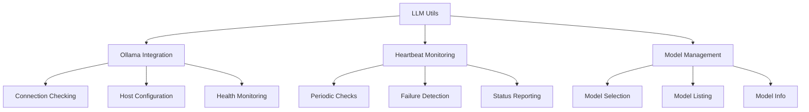

# LLM Utils - Quick Reference

Utility functions for LLM operations and Ollama integration.

## Overview

The utils module provides helper functions for LLM operations, including Ollama connection management, model selection, and heartbeat monitoring.

## Quick Start

```python
from infrastructure.llm.utils import (
    is_ollama_running,
    select_best_model,
    check_ollama_health
)

# Check Ollama status
if is_ollama_running():
    model = select_best_model()
    print(f"Using model: {model}")
```

## Key Functions

### Ollama Connection

```python
from infrastructure.llm.utils.ollama import (
    is_ollama_running,
    get_ollama_host,
    check_ollama_health
)

# Check if Ollama is running
if is_ollama_running():
    print("Ollama is available")

# Get configured host
host = get_ollama_host()  # Default: http://localhost:11434

# Health check
is_healthy, message = check_ollama_health()
```

### Model Selection

```python
from infrastructure.llm.utils.ollama import (
    select_best_model,
    list_available_models,
    get_model_info
)

# Auto-select best available model
best_model = select_best_model()
# Returns: "gemma3:4b" or similar

# List all available models
models = list_available_models()
# Returns: ["gemma3:4b", "llama3.2:3b", ...]

# Get model details
info = get_model_info("gemma3:4b")
# Returns: {"size": "4B", "context": 8192, ...}
```

### Heartbeat Monitoring

```python
from infrastructure.llm.utils.heartbeat import (
    start_heartbeat,
    stop_heartbeat,
    is_heartbeat_active
)

# Start monitoring
start_heartbeat(
    interval=30,  # seconds
    callback=lambda: print("Ollama is alive")
)

# Check status
if is_heartbeat_active():
    print("Heartbeat monitoring active")

# Stop monitoring
stop_heartbeat()
```

## Common Usage Patterns

### Connection Management

```python
from infrastructure.llm.utils.ollama import (
    is_ollama_running,
    wait_for_ollama,
    get_ollama_host
)

# Wait for Ollama to start
if not is_ollama_running():
    print("Waiting for Ollama to start...")
    wait_for_ollama(timeout=60)

# Use configured host
host = get_ollama_host()
client = LLMClient(host=host)
```

### Model Fallback

```python
from infrastructure.llm.utils.ollama import select_best_model

# Try preferred model, fallback to best available
preferred = "gemma3:4b"
available = list_available_models()

if preferred in available:
    model = preferred
else:
    model = select_best_model()
    print(f"Using fallback model: {model}")
```

### Health Monitoring

```python
from infrastructure.llm.utils.heartbeat import HeartbeatMonitor

# Create monitor
monitor = HeartbeatMonitor(
    check_interval=30,
    failure_threshold=3
)

# Start monitoring
monitor.start()

# Check health
if monitor.is_healthy():
    # Proceed with LLM operations
    response = llm_client.query("test")
```

## Configuration

### Environment Variables

```bash
# Ollama connection
export OLLAMA_HOST="http://localhost:11434"
export OLLAMA_MODEL="gemma3:4b"

# Heartbeat settings
export LLM_HEARTBEAT_INTERVAL=30
export LLM_HEARTBEAT_TIMEOUT=5
```

### Programmatic Configuration

```python
from infrastructure.llm.utils.ollama import configure_ollama

# Configure connection
configure_ollama(
    host="http://localhost:11434",
    timeout=30,
    retry_attempts=3
)
```

## Error Handling

### Connection Errors

```python
from infrastructure.llm.utils.ollama import (
    is_ollama_running,
    OllamaConnectionError
)

try:
    if not is_ollama_running():
        raise OllamaConnectionError("Ollama not running")
except OllamaConnectionError as e:
    print(f"Connection error: {e}")
    # Handle error...
```

### Model Errors

```python
from infrastructure.llm.utils.ollama import (
    select_best_model,
    ModelNotFoundError
)

try:
    model = select_best_model()
except ModelNotFoundError:
    print("No models available")
    # Handle error...
```

## Integration

### Pipeline Integration

```python
# scripts/06_llm_review.py
from infrastructure.llm.utils.ollama import (
    is_ollama_running,
    select_best_model
)

def setup_llm():
    if not is_ollama_running():
        logger.error("Ollama not available")
        return None
    
    model = select_best_model()
    return LLMClient(model=model)
```

## Architecture



## See Also

- [AGENTS.md](AGENTS.md) - Complete utils documentation
- [../core/README.md](../core/README.md) - LLM core functionality
- [../cli/README.md](../cli/README.md) - CLI interface