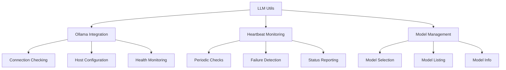

# LLM Utils - Quick Reference

Utility functions for LLM operations and Ollama integration.

## Overview

The utils module provides helper functions for LLM operations, including Ollama connection management, model selection, and heartbeat monitoring.

## Quick Start

```python
from infrastructure.llm.utils import (
    is_ollama_running,
    ensure_ollama_ready,
    select_best_model,
    get_model_names,
    check_model_loaded,
    preload_model,
)

# Check Ollama status
if is_ollama_running():
    models = get_model_names()
    model = select_best_model()
    print(f"Using model: {model} from {models}")
```

## Key Functions

### Ollama Connection

```python
from infrastructure.llm.utils.ollama import (
    is_ollama_running,
    ensure_ollama_ready,
)

# Check if Ollama is running
if is_ollama_running():
    print("Ollama is available")

# Ensure the daemon is ready and has at least one model installed
if ensure_ollama_ready(auto_start=False):
    print("Ollama is ready")
```

### Model Selection

```python
from infrastructure.llm.utils.ollama import (
    select_best_model,
    get_model_names,
    get_model_info
)

# Auto-select best available model
best_model = select_best_model()
# Returns: "gemma3:4b" or similar

# List all available models
models = get_model_names()
# Returns: ["smollm2", "gemma2:2b", "gemma3:4b", ...]

# Get model details
info = get_model_info("gemma3:4b")
# Returns: {"size": "4B", "context": 8192, ...}
```

### Heartbeat Monitoring

```python
from infrastructure.llm.utils.heartbeat import StreamHeartbeatMonitor

monitor = StreamHeartbeatMonitor(
    operation_name="review",
    timeout_seconds=300.0,
    heartbeat_interval=30.0,
)

with monitor:
    print("Heartbeat monitoring active")
```

## Common Usage Patterns

### Connection Management

```python
from infrastructure.llm.utils.ollama import (
    is_ollama_running,
    ensure_ollama_ready,
)

# Wait for Ollama to start
if not is_ollama_running():
    print("Waiting for Ollama to start...")
    ensure_ollama_ready(auto_start=True)

# Use the configured host from OllamaClientConfig.from_env()
from infrastructure.llm.core.config import OllamaClientConfig
from infrastructure.llm.core.client import LLMClient
client = LLMClient(OllamaClientConfig.from_env())
```

### Model Fallback

```python
from infrastructure.llm.utils.ollama import select_best_model

# Try preferred model, fallback to best available
preferred = "gemma3:4b"
available = get_model_names()

if preferred in available:
    model = preferred
else:
    model = select_best_model()
    print(f"Using fallback model: {model}")
```

### Health Monitoring

```python
from infrastructure.llm.utils.heartbeat import StreamHeartbeatMonitor

# Create monitor
monitor = StreamHeartbeatMonitor(
    operation_name="translation",
    timeout_seconds=600,
)

# Start monitoring
monitor.start_monitoring()

# Check health
monitor.update_token_received()
monitor.stop_monitoring()
```

## Configuration

### Environment Variables

```bash
# Ollama connection
export OLLAMA_HOST="http://localhost:11434"
export OLLAMA_MODEL="gemma3:4b"

# Heartbeat settings
export LLM_HEARTBEAT_INTERVAL=30
export LLM_HEARTBEAT_TIMEOUT=5
```

### Programmatic Configuration

```python
from infrastructure.llm.core.config import OllamaClientConfig

# Configure connection
config = OllamaClientConfig.from_env()
print(config.base_url)
```

## Error Handling

### Connection Errors

```python
from infrastructure.llm.utils.ollama import (
    is_ollama_running,
)

try:
    if not is_ollama_running():
        raise RuntimeError("Ollama not running")
except RuntimeError as e:
    print(f"Connection error: {e}")
    # Handle error...
```

### Model Errors

```python
from infrastructure.llm.utils.ollama import (
    select_best_model,
    ModelNotFoundError
)

try:
    model = select_best_model()
except ModelNotFoundError:
    print("No models available")
    # Handle error...
```

## Integration

### Pipeline Integration

```python
# scripts/06_llm_review.py
from infrastructure.llm.utils.ollama import (
    is_ollama_running,
    select_best_model
)

def setup_llm():
    if not is_ollama_running():
        logger.error("Ollama not available")
        return None
    
    model = select_best_model()
    from infrastructure.llm.core.client import LLMClient
    from infrastructure.llm.core.config import OllamaClientConfig
    return LLMClient(OllamaClientConfig(default_model=model))
```

## Architecture


```mermaid
graph TD
    A[LLM Utils] --> B[Ollama Integration]
    A --> C[Heartbeat Monitoring]
    A --> D[Model Management]

    B --> E[Connection Checking]
    B --> F[Host Configuration]
    B --> G[Health Monitoring]

    C --> H[Periodic Checks]
    C --> I[Failure Detection]
    C --> J[Status Reporting]

    D --> K[Model Selection]
    D --> L[Model Listing]
    D --> M[Model Info]
```

## See Also

- [AGENTS.md](AGENTS.md) - utils documentation
- [../core/README.md](../core/README.md) - LLM core functionality
- [../cli/README.md](../cli/README.md) - CLI interface