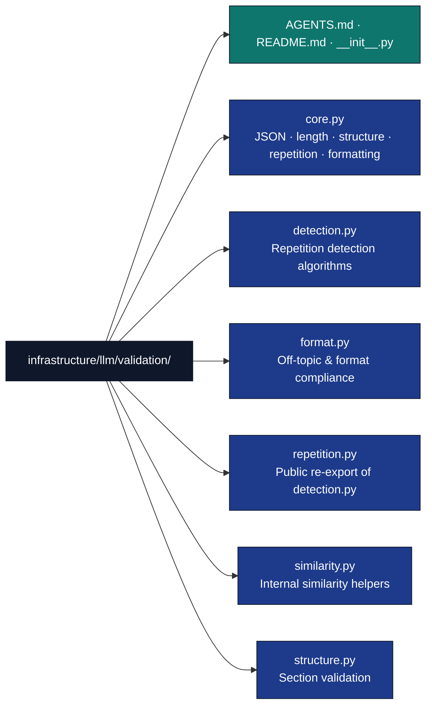

# LLM Validation Module

## Overview

The `infrastructure/llm/validation/` directory contains validation utilities for
ensuring the quality, consistency, and reliability of LLM-generated content.
All validation is performed on LLM *output* (responses), not on prompts.

Public symbols are importable directly from `infrastructure.llm.validation`.

## Directory Structure



## Key Components

### Core Validation (`core.py`)

All functions are importable from `infrastructure.llm.validation.core` or from
the package root `infrastructure.llm.validation`.

#### Error contract

- **Schema-level validators** (`validate_json`, `validate_structure`,
  `validate_complete` in STRUCTURED mode) raise `ValidationError` on failure;
  callers cannot recover from invalid structure.
- **Signal validators** (`validate_length`, `validate_short_response`,
  `validate_long_response`, `validate_formatting`) return `bool`; callers
  choose to warn, log, or retry.
- `validate_complete` raises `ValidationError` for structural problems (empty
  content, bad schema) and returns `bool` for SHORT/LONG format failures.

#### Functions

```python
from infrastructure.llm.validation.core import (
    validate_json,
    validate_length,
    estimate_tokens,
    validate_short_response,
    validate_long_response,
    validate_structure,
    validate_citations,
    validate_formatting,
    validate_complete,
    validate_no_repetition,
    clean_repetitive_output,
)
from infrastructure.llm.core.config import ResponseMode

# Parse JSON output; strips markdown fences before parsing.
# Raises ValidationError on invalid JSON.
data = validate_json(content)

# Check character length bounds; returns bool.
ok = validate_length(content, min_len=0, max_len=None)

# Heuristic token estimate (1 token ≈ 4 chars).
tokens = estimate_tokens(content)

# Validate short response (< 150 tokens by default); returns bool.
ok = validate_short_response(content, max_tokens=150)

# Validate long response (> 500 tokens by default); returns bool.
ok = validate_long_response(content, min_tokens=500)

# Validate dict against a JSON-Schema-style schema dict.
# Returns True or raises ValidationError.
validate_structure(data_dict, schema)

# Extract citations matching (Author Year), [1], or @key patterns.
citations: list[str] = validate_citations(content)

# Lightweight formatting quality check (!!!  ???  double spaces).
# Returns bool; logs warning on failure.
ok = validate_formatting(content)

# Composite validator — dispatches to the right check for each ResponseMode.
# mode: SHORT | LONG | STRUCTURED | RAW | STANDARD
# Returns True / False for SHORT and LONG; True or raises for others.
ok = validate_complete(content, mode=ResponseMode.STANDARD, schema=None)

# Repetition gate — wraps detect_repetition.
# Returns (is_valid: bool, details: dict).
is_valid, details = validate_no_repetition(content, max_allowed_ratio=0.3)

# Remove repeated sections from output using "balanced" mode.
cleaned = clean_repetitive_output(content, max_repetitions=2)
```

### Format Compliance (`format.py`)

Detects off-topic drift and conversational AI phrases that indicate poor
response quality or hallucination.

```python
from infrastructure.llm.validation.format import (
    is_off_topic,
    has_on_topic_signals,
    detect_conversational_phrases,
    check_format_compliance,
    OFF_TOPIC_PATTERNS_START,
    OFF_TOPIC_PATTERNS_ANYWHERE,
    CONVERSATIONAL_PATTERNS,
    ON_TOPIC_SIGNALS,
)

# Two-tier off-topic check.
# 1. Returns False immediately if ≥2 ON_TOPIC_SIGNALS match.
# 2. Then checks OFF_TOPIC_PATTERNS_START (first 100 chars).
# 3. Then checks OFF_TOPIC_PATTERNS_ANYWHERE.
off_topic: bool = is_off_topic(text)

# True if ≥2 on-topic signals are present (overrides off-topic detection).
on_topic: bool = has_on_topic_signals(text)

# Returns list of matched conversational phrases (up to 50 chars each).
phrases: list[str] = detect_conversational_phrases(text)

# Full format compliance check.
# Returns (is_compliant: bool, issues: list[str], details: dict).
is_compliant, issues, details = check_format_compliance(response)
```

**Pattern constants** (all `list[str]` of regex patterns):

| Constant | Purpose |
|----------|---------|
| `OFF_TOPIC_PATTERNS_START` | Email/letter headers, casual greetings, book intro phrases — checked at response start |
| `OFF_TOPIC_PATTERNS_ANYWHERE` | AI refusal phrases, self-identification, external URLs, code-focused responses |
| `CONVERSATIONAL_PATTERNS` | Chatbot-style phrases that indicate poor formal review quality |
| `ON_TOPIC_SIGNALS` | Manuscript review markers (`## overview`, `the manuscript`, etc.) |

### Repetition Detection (`repetition.py` / `detection.py`)

`repetition.py` re-exports the public API from `detection.py`. Import from
`repetition` — `detection.py` and `similarity.py` are internal.

```python
from infrastructure.llm.validation.repetition import (
    RepetitionResult,
    detect_repetition,
    calculate_unique_content_ratio,
    deduplicate_sections,
)

# RepetitionResult is a NamedTuple with three fields.
result: RepetitionResult = detect_repetition(text)
print(result.found)        # bool
print(result.examples)     # list[str] — first 100 chars of each duplicate
print(result.unique_ratio) # float 0.0–1.0

# Positional unpacking is supported (7 call sites rely on it):
found, examples, ratio = detect_repetition(text)

# Unique content ratio (lower = more repetitive).
ratio: float = calculate_unique_content_ratio(text, chunk_size=200)

# Remove repeated sections from output.
# mode: "conservative" (≥0.9 similarity, ≥3 repeats before removal)
#       "balanced"     (uses caller-supplied thresholds as-is)
#       "aggressive"   (≤0.7 similarity, ≤1 repeat before removal)
cleaned = deduplicate_sections(
    text,
    max_repetitions=2,
    mode="conservative",
    similarity_threshold=0.85,
    min_content_preservation=0.7,
)
```

`detect_repetition` uses header-based section splitting (H1–H3, triple
newlines, paragraphs) and a hybrid similarity score combining Jaccard,
TF-cosine, and 3-gram overlap.

### Structure Validation (`structure.py`)

```python
from infrastructure.llm.validation.structure import (
    validate_section_completeness,
    extract_structured_sections,
    validate_response_structure,
)

# Check that required markdown headers are present.
# flexible=True accepts semantic equivalents (e.g. "overview" matches "## Overview").
# Returns (is_complete: bool, missing: list[str], details: dict).
is_complete, missing, details = validate_section_completeness(
    response,
    required_headers=["## Overview", "## Results"],
    flexible=True,
)

# Parse markdown headers into a dict of {header_text: section_content}.
sections: dict[str, str] = extract_structured_sections(response)

# Composite check: word count + section completeness.
# Returns (is_valid: bool, issues: list[str], details: dict).
is_valid, issues, details = validate_response_structure(
    response,
    required_headers=["## Overview", "## Results"],
    min_word_count=200,
    max_word_count=5000,
    flexible_headers=True,
)
```

### Similarity Helpers (`similarity.py`)

**Internal module — do not import directly.** Used by `detection.py`.

Provides `_jaccard_similarity`, `_tf_cosine_similarity`, `_sequence_similarity`,
`_calculate_similarity` (hybrid combiner), and `_normalize_for_comparison`.

## Validation Integration

### Post-Generation Validation

```python
from infrastructure.llm.validation import (
    validate_complete,
    validate_no_repetition,
    is_off_topic,
    clean_repetitive_output,
    validate_response_structure,
)
from infrastructure.llm.core.config import ResponseMode
from infrastructure.core.exceptions import ValidationError

def validate_llm_response(response: str, required_headers: list[str] | None = None) -> str:
    """Validate and clean an LLM response. Returns cleaned text or raises."""

    # Reject off-topic / hallucinated output
    if is_off_topic(response):
        raise ValidationError("Response is off-topic")

    # Clean excessive repetition
    is_valid, details = validate_no_repetition(response)
    if not is_valid:
        response = clean_repetitive_output(response)

    # Structural check
    if required_headers:
        is_valid, issues, _ = validate_response_structure(response, required_headers)
        if not is_valid:
            raise ValidationError(f"Structure issues: {issues}")

    # Final composite check (raises on empty content)
    validate_complete(response, mode=ResponseMode.STANDARD)

    return response
```

### JSON Response Validation

```python
from infrastructure.llm.validation import validate_json, validate_structure
from infrastructure.core.exceptions import ValidationError

schema = {
    "required": ["title", "summary"],
    "properties": {
        "title": {"type": "string"},
        "summary": {"type": "string"},
    },
}

try:
    data = validate_json(response_text)      # strips ```json fences, parses
    validate_structure(data, schema)          # required keys + basic type check
except ValidationError as e:
    print(f"Structured response invalid: {e}")
```

### Repetition Cleaning Pipeline

```python
from infrastructure.llm.validation import (
    detect_repetition,
    deduplicate_sections,
    calculate_unique_content_ratio,
)

# Inspect first
found, examples, ratio = detect_repetition(response_text)
print(f"Unique ratio: {ratio:.0%}, duplicates found: {len(examples)}")

# Clean with different strategies
if ratio < 0.5:
    # Aggressively repetitive — use balanced mode
    cleaned = deduplicate_sections(response_text, mode="balanced", similarity_threshold=0.8)
else:
    # Mildly repetitive — conservative to preserve valid content
    cleaned = deduplicate_sections(response_text, mode="conservative")
```

## Testing

### Unit Tests

Tests live in `tests/infra_tests/` and follow the no-mocks policy: use real
strings and computed values.

```python
from infrastructure.llm.validation import (
    validate_json,
    detect_repetition,
    is_off_topic,
    validate_section_completeness,
)
from infrastructure.core.exceptions import ValidationError
import pytest

def test_validate_json_strips_fences():
    content = "```json\n{\"key\": \"value\"}\n```"
    data = validate_json(content)
    assert data == {"key": "value"}

def test_validate_json_raises_on_bad_input():
    with pytest.raises(ValidationError):
        validate_json("not json at all")

def test_detect_repetition_finds_duplicates():
    text = "## Introduction\nSame content.\n\n## Introduction\nSame content."
    found, examples, ratio = detect_repetition(text)
    assert found
    assert ratio < 1.0

def test_is_off_topic_rejects_ai_refusal():
    assert is_off_topic("I can't help with that request.")

def test_is_off_topic_accepts_manuscript_review():
    review = "## Overview\nThe manuscript presents strong methodology.\nThe authors clearly..."
    assert not is_off_topic(review)

def test_validate_section_completeness():
    response = "## Overview\nContent.\n\n## Results\nData."
    ok, missing, _ = validate_section_completeness(response, ["## Overview", "## Results"])
    assert ok
    assert missing == []
```

## Error Handling

`ValidationError` is defined in `infrastructure.core._exceptions_core` and
re-exported from `infrastructure.core.exceptions`. It is raised by:

- `validate_json` — invalid JSON
- `validate_structure` — missing required field or wrong type
- `validate_complete` — empty content, missing schema in STRUCTURED mode, or failed structure check

Signal validators (`validate_length`, `validate_formatting`, etc.) never raise;
they return `False` and log a warning.

```python
from infrastructure.core.exceptions import ValidationError

try:
    data = validate_json(response_text)
    validate_structure(data, schema)
except ValidationError as e:
    # e.context contains structured details (field name, expected/got types, etc.)
    print(f"Validation failed: {e}")
```

## See Also

**Related Documentation:**

- [`../core/AGENTS.md`](../core/AGENTS.md) - LLM core functionality
- [`../review/AGENTS.md`](../review/AGENTS.md) - Review generation

**System Documentation:**

- [`../../../AGENTS.md`](../../../AGENTS.md) - system overview
- [`../../../docs/development/testing/testing-guide.md`](../../../docs/development/testing/testing-guide.md) - Testing and validation guide
