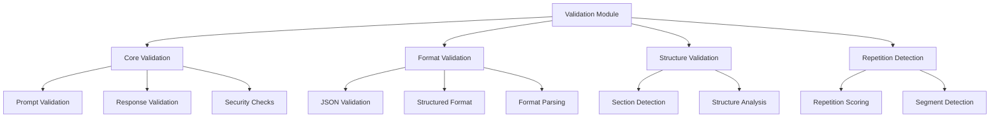

# LLM Validation - Quick Reference

Input validation and quality checks for LLM interactions.

## Overview

The validation module provides comprehensive validation for LLM inputs, outputs, and interactions. It ensures prompt quality, response validation, and security checks.

## Quick Start

```python
from infrastructure.llm.validation import (
    validate_prompt,
    validate_response,
    check_prompt_quality
)

# Validate prompt before sending
is_valid, errors = validate_prompt(prompt_text)

# Validate LLM response
is_valid, issues = validate_response(response_text)

# Check prompt quality
quality_score = check_prompt_quality(prompt_text)
```

## Key Functions

### Prompt Validation

```python
from infrastructure.llm.validation.core import validate_prompt

# Basic validation
is_valid, errors = validate_prompt(
    prompt="Your prompt text",
    max_length=4000,
    require_context=True
)

if not is_valid:
    for error in errors:
        print(f"Validation error: {error}")
```

### Response Validation

```python
from infrastructure.llm.validation.core import validate_response

# Validate response quality
is_valid, issues = validate_response(
    response=llm_response,
    min_length=100,
    require_structure=True
)

if not is_valid:
    print(f"Response issues: {issues}")
```

### Format Validation

```python
from infrastructure.llm.validation.format import validate_format

# Check JSON format
is_valid, parsed = validate_format(
    text=response_text,
    format_type="json"
)

# Check structured format
is_valid, structure = validate_format(
    text=response_text,
    format_type="structured",
    required_keys=["summary", "analysis"]
)
```

### Repetition Detection

```python
from infrastructure.llm.validation.repetition import check_repetition

# Detect repetitive content
has_repetition, segments = check_repetition(
    text=response_text,
    threshold=0.8
)

if has_repetition:
    print(f"Repetitive segments: {segments}")
```

### Structure Validation

```python
from infrastructure.llm.validation.structure import validate_structure

# Validate response structure
is_valid, structure = validate_structure(
    text=response_text,
    required_sections=["introduction", "analysis", "conclusion"]
)

if is_valid:
    print(f"Structure: {structure}")
```

## Common Usage Patterns

### Pre-Query Validation

```python
from infrastructure.llm.validation import validate_prompt

def safe_query(prompt_text):
    # Validate before sending
    is_valid, errors = validate_prompt(
        prompt_text,
        max_length=4000,
        check_security=True
    )
    
    if not is_valid:
        raise ValueError(f"Invalid prompt: {errors}")
    
    # Proceed with query
    return llm_client.query(prompt_text)
```

### Post-Response Validation

```python
from infrastructure.llm.validation import validate_response

def get_validated_response(prompt):
    response = llm_client.query(prompt)
    
    # Validate response
    is_valid, issues = validate_response(
        response,
        min_length=50,
        check_format=True
    )
    
    if not is_valid:
        # Retry or handle issues
        return handle_invalid_response(issues)
    
    return response
```

### Quality Scoring

```python
from infrastructure.llm.validation import check_prompt_quality

# Score prompt quality
score = check_prompt_quality(
    prompt_text,
    factors=["clarity", "specificity", "completeness"]
)

if score < 0.7:
    print("Prompt quality below threshold")
    # Improve prompt...
```

## Validation Rules

### Prompt Rules

- **Length**: Maximum token count (default: 4000)
- **Clarity**: Clear instructions and context
- **Security**: No injection attempts or malicious content
- **Completeness**: Required context provided

### Response Rules

- **Length**: Minimum/maximum length requirements
- **Format**: Adherence to requested format
- **Structure**: Required sections present
- **Quality**: No excessive repetition or errors

## Configuration

### Validation Settings

```python
from infrastructure.llm.validation.core import ValidationConfig

config = ValidationConfig(
    max_prompt_length=4000,
    min_response_length=50,
    require_structure=True,
    check_security=True
)

# Use config
is_valid = validate_prompt(prompt, config=config)
```

### Custom Rules

```python
from infrastructure.llm.validation.core import add_validation_rule

# Add custom validation rule
def custom_rule(text):
    return "required_keyword" in text

add_validation_rule("custom_check", custom_rule)

# Use in validation
is_valid = validate_prompt(prompt, custom_rules=["custom_check"])
```

## Error Handling

### Validation Errors

```python
from infrastructure.llm.validation.core import ValidationError

try:
    validate_prompt(prompt_text)
except ValidationError as e:
    print(f"Validation failed: {e.message}")
    print(f"Errors: {e.errors}")
```

### Response Issues

```python
from infrastructure.llm.validation.core import ResponseValidationError

try:
    validate_response(response_text)
except ResponseValidationError as e:
    print(f"Response issues: {e.issues}")
    # Handle issues...
```

## Integration

### Pipeline Integration

```python
# scripts/06_llm_review.py
from infrastructure.llm.validation import validate_prompt, validate_response

def generate_review(manuscript_text):
    prompt = build_review_prompt(manuscript_text)
    
    # Validate prompt
    if not validate_prompt(prompt)[0]:
        raise ValueError("Invalid prompt")
    
    # Generate response
    response = llm_client.query(prompt)
    
    # Validate response
    if not validate_response(response)[0]:
        # Retry or handle...
        response = retry_query(prompt)
    
    return response
```

## Architecture



## See Also

- [AGENTS.md](AGENTS.md) - Complete validation documentation
- [../core/README.md](../core/README.md) - LLM core functionality
- [../utils/README.md](../utils/README.md) - Utility functions