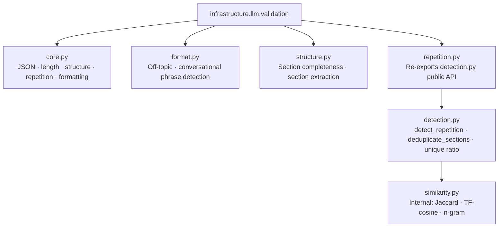

# LLM Validation - Quick Reference

Output validation and quality checks for LLM-generated responses.

## Overview

The validation module validates LLM *output* — not prompts. It checks response length,
JSON structure, formatting quality, repetition, topic drift, and section completeness.
All public symbols are importable directly from `infrastructure.llm.validation`.

## Quick Start

```python
from infrastructure.llm.validation import (
    validate_complete,
    validate_no_repetition,
    is_off_topic,
)
from infrastructure.llm.core.config import ResponseMode

# Validate a standard LLM response
ok = validate_complete(response_text, mode=ResponseMode.STANDARD)

# Check for excessive repetition
is_valid, details = validate_no_repetition(response_text)

# Detect off-topic / hallucinated output
if is_off_topic(response_text):
    print("Response appears off-topic")
```

## Key Functions

### Core Validation (`core.py`)

```python
from infrastructure.llm.validation.core import (
    validate_json,
    validate_length,
    validate_short_response,
    validate_long_response,
    validate_structure,
    validate_citations,
    validate_formatting,
    validate_complete,
    validate_no_repetition,
    clean_repetitive_output,
    estimate_tokens,
)
from infrastructure.llm.core.config import ResponseMode

# Parse and validate JSON output (raises ValidationError on bad JSON)
data = validate_json(response_text)

# Check length bounds (returns bool)
ok = validate_length(response_text, min_len=50, max_len=5000)

# Estimate token count (heuristic: 1 token ≈ 4 chars)
tokens = estimate_tokens(response_text)

# Mode-specific composite check
# Returns True / False for SHORT and LONG modes.
# Returns True or raises ValidationError for STRUCTURED, RAW, STANDARD.
ok = validate_complete(
    response_text,
    mode=ResponseMode.STRUCTURED,
    schema={"required": ["summary"], "properties": {"summary": {"type": "string"}}}
)
```

### Repetition Detection (`repetition.py`)

```python
from infrastructure.llm.validation.repetition import (
    RepetitionResult,
    detect_repetition,
    calculate_unique_content_ratio,
    deduplicate_sections,
)

# Detect repetitive content — returns a NamedTuple
result: RepetitionResult = detect_repetition(response_text)
found, examples, unique_ratio = result  # positional unpacking also works

# Unique content ratio (0.0–1.0; lower means more repetition)
ratio = calculate_unique_content_ratio(response_text)

# Remove repeated sections in-place
cleaned = deduplicate_sections(response_text, mode="conservative")
# mode options: "conservative" (default), "balanced", "aggressive"
```

### Format Compliance (`format.py`)

```python
from infrastructure.llm.validation.format import (
    is_off_topic,
    has_on_topic_signals,
    detect_conversational_phrases,
    check_format_compliance,
    OFF_TOPIC_PATTERNS_START,
    OFF_TOPIC_PATTERNS_ANYWHERE,
    CONVERSATIONAL_PATTERNS,
    ON_TOPIC_SIGNALS,
)

# Two-tier off-topic detection (checks start + anywhere patterns,
# overridden if ≥2 on-topic signals are present)
if is_off_topic(response_text):
    print("LLM went off-topic or hallucinated")

# Check for on-topic signals (requires ≥2 matches to return True)
on_topic = has_on_topic_signals(response_text)

# List conversational AI phrases found in the response
phrases = detect_conversational_phrases(response_text)

# Full format compliance check (returns is_compliant, issues, details)
is_compliant, issues, details = check_format_compliance(response_text)
```

### Structure Validation (`structure.py`)

```python
from infrastructure.llm.validation.structure import (
    validate_section_completeness,
    extract_structured_sections,
    validate_response_structure,
)

# Check that required markdown headers are present
is_complete, missing, details = validate_section_completeness(
    response_text,
    required_headers=["## Overview", "## Results"],
    flexible=True,  # accepts semantic equivalents
)

# Extract markdown sections into a dict
sections: dict[str, str] = extract_structured_sections(response_text)

# Comprehensive check: headers + word count
is_valid, issues, details = validate_response_structure(
    response_text,
    required_headers=["## Overview", "## Results"],
    min_word_count=200,
    max_word_count=5000,
)
```

## Common Usage Patterns

### Post-Response Validation

```python
from infrastructure.llm.validation import (
    validate_complete,
    validate_no_repetition,
    is_off_topic,
    clean_repetitive_output,
)
from infrastructure.llm.core.config import ResponseMode
from infrastructure.core.exceptions import ValidationError

def get_validated_response(llm_client, prompt):
    response = llm_client.query(prompt)

    # Reject off-topic output immediately
    if is_off_topic(response):
        raise ValueError("Response is off-topic")

    # Check for excessive repetition; clean if needed
    is_valid, details = validate_no_repetition(response)
    if not is_valid:
        response = clean_repetitive_output(response)

    # Structural validation (raises ValidationError on empty / bad schema)
    try:
        validate_complete(response, mode=ResponseMode.STANDARD)
    except ValidationError as e:
        raise ValueError(f"Invalid response: {e}") from e

    return response
```

### JSON Response Validation

```python
from infrastructure.llm.validation import validate_json, validate_structure
from infrastructure.core.exceptions import ValidationError

schema = {
    "required": ["title", "summary"],
    "properties": {
        "title": {"type": "string"},
        "summary": {"type": "string"},
    },
}

try:
    data = validate_json(response_text)       # parse JSON (strips markdown fences)
    validate_structure(data, schema)           # check required fields + types
except ValidationError as e:
    print(f"Structured response invalid: {e}")
```

## Error Handling

`ValidationError` is raised by schema-level validators (`validate_json`,
`validate_structure`, `validate_complete` in STRUCTURED mode, and
`validate_complete` when content is empty). It lives in
`infrastructure.core.exceptions` and is re-exported by the LLM core.

Signal validators (`validate_length`, `validate_short_response`,
`validate_long_response`, `validate_formatting`) return `bool` — callers
choose whether to warn, log, or retry.

```python
from infrastructure.core.exceptions import ValidationError

try:
    data = validate_json(response_text)
except ValidationError as e:
    print(f"JSON parse failed: {e}")
```

## Validation Rules

### Response Rules

- **Length**: `validate_length` (min/max chars), `estimate_tokens` (heuristic)
- **Format**: `validate_formatting` checks for LLM over-emphasis artifacts (`!!!`, `???`) and double spaces
- **Structure**: Required markdown sections via `validate_section_completeness`
- **Repetition**: `detect_repetition` uses hybrid Jaccard/TF-cosine/n-gram similarity
- **Topic drift**: `is_off_topic` uses pattern lists (`OFF_TOPIC_PATTERNS_START`, `OFF_TOPIC_PATTERNS_ANYWHERE`) with on-topic signal override

## Architecture


```mermaid
graph TD
    A[infrastructure.llm.validation] --> B[core.py<br/>JSON · length · structure · repetition · formatting]
    A --> C[format.py<br/>Off-topic · conversational phrase detection]
    A --> D[structure.py<br/>Section completeness · section extraction]
    A --> E[repetition.py<br/>Re-exports detection.py public API]

    E --> F[detection.py<br/>detect_repetition · deduplicate_sections · unique ratio]
    F --> G[similarity.py<br/>Internal: Jaccard · TF-cosine · n-gram]
```

`similarity.py` is an internal module; import from `repetition` instead.

## See Also

- [AGENTS.md](AGENTS.md) - full module reference
- [../core/README.md](../core/README.md) - LLM core functionality
