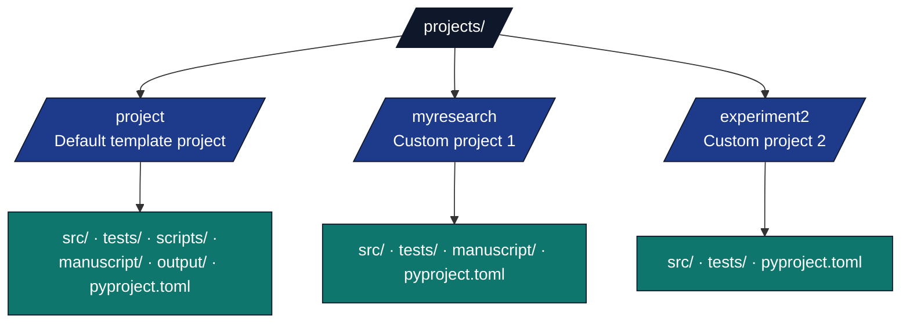

# infrastructure/project/ - Project Management Module

## Purpose

The `infrastructure/project/` module provides project discovery, validation, and metadata extraction for multi-project support. This enables the template to manage multiple independent research projects within a single repository.

## Key Components

### Project Discovery (`discovery.py`)

**Core Functions:**

- `discover_projects(repo_root, projects_dir="projects")` - Find all valid projects in the active projects directory
- `resolve_project_root(repo_root, project_name)` - Resolve a project root. A qualified `<subfolder>/<name>` path (head in `templates/`, `active/`, `working/`, `published/`, `archive/`, `other/`) resolves directly under `projects/<subfolder>/<name>`. A bare name prefers `projects/active/<name>` (if it carries project markers), then `projects/working/<name>`, then a flat standalone `projects/<name>`, falling back to `projects/active/<name>`
- `validate_project_structure(project_dir)` - Validate required directories exist
- `get_project_metadata(project_dir)` - Extract configuration from pyproject.toml and config.yaml (includes `[tool.template]` flags such as `skip_combined_pytest`)

### Template Drift (`drift/`)

- `run_drift_checks(repo_root, projects)` - exemplar doc/code drift battery (used by `scripts/check_template_drift.py`)
- `Finding`, `Report` - structured drift findings
- `check_project_scripts` / `check_repo_scripts` (`orchestrator.py`) - AST thin-orchestrator enforcement
- Line-count gate: `infrastructure.validation.line_count.scan_project_scripts` (via `scripts/gates/module_line_count_check.py`)

### Working-project batch render (`working_render.py`)

- `list_working_projects(repo)` — names under `projects/working/`
- `run_project_pipeline(repo, name, *, skip_infra)` — core DAG via `PipelineExecutor`
- `audit_project(repo, name, results, duration_sec)` — `ProjectAudit` record (structure, PDF paths, validation)
- `classify_status(...)` / `write_audit_report(repo, audits)` — rubric status + JSON/Markdown under `output/`
- Thin CLI: `scripts/maintenance/render_working_projects.py` (not discovered by `./run.sh --all-projects`)

### Project Introspection (`info.py`)

- `collect_project_info(project_name, repo_root)` - manuscript/source/output/tests counts
- `display_project_info(info, logger=...)` - formatted logging for `scripts/maintenance/show_project_info.py`

### Workspace Management (`workspace.py`)

- `sync_workspace()`, `update_workspace()`, `add_dependency()`, `show_workspace_tree()`, `show_workspace_status()` — used by `scripts/maintenance/manage_workspace.py`

### Git Guards (`git_guards.py`)

- `offending_tracked_projects(repo_root)` — non-exemplar paths tracked under `projects/`
- `tracked_generated_artifacts(repo_root)` — committed files under disposable `output/` trees
- `is_generated_artifact_path(path)` — path classifier for generated outputs
- Used by `scripts/check_tracked_projects.py` and `scripts/check_tracked_generated_artifacts.py`

### CodeGraph Local Integration (`codegraph.py`)

- `build_codegraph_init_command(path)` — build the recommended local
  `codegraph init <path> --index` command without executing it.
- `build_codegraph_files_command(path)` — build the JSON file-list command used
  for scope checks.
- `verify_codegraph_scope_payload(payload)` — parse CodeGraph file JSON and
  report any indexed non-template path under `projects/`.
- Used by `scripts/maintenance/codegraph_local.py`; see
  [`docs/guides/codegraph-local.md`](../../docs/guides/codegraph-local.md).

CodeGraph indexes (`.codegraph/`) are generated local state and must never be
committed. The generated-artifact guard treats `.codegraph/*` as an offender.

**Project pyproject.toml flags (`[tool.template]`):**

```toml
[tool.template]
skip_combined_pytest = true  # omit from combined multi-project pytest union
```

**Internal helpers (not exported from `infrastructure.project`)**:

- `get_default_project(repo_root, projects_dir="projects")` - Get the default template project if present

### Project Setup Hook (`setup_hook.py`)

A project may ship an optional one-time bootstrap script that is executed
during Stage 0 (`scripts/00_setup_environment.py`). Common uses: install a
toolchain (e.g. Lean/elan), prime a model cache, fetch a dataset.

**Public API:**

- `find_setup_hook(project_dir) -> Path | None` — locate `scripts/setup_hook.py` (preferred) or `scripts/setup_hook.sh` (POSIX-only).
- `preflight_setup_hook(project_dir) -> tuple[bool, list[str]]` — read the optional `setup_hook.yaml` manifest and verify declared `required_tools` are on `PATH`, declared `required_env` vars are set, and honour `skip_if_env`.
- `run_project_setup_hook(project_dir) -> bool` — runs preflight, then the hook (or short-circuits in dry-run).

**Hook resolution & portability:**

| Platform | `setup_hook.py` | `setup_hook.sh` |
| -------- | --------------- | --------------- |
| Linux/macOS | preferred | accepted (executed via `bash`) |
| Windows | **required** | **skipped** with a warning — POSIX shells are not guaranteed |

Authors targeting cross-platform CI must provide `setup_hook.py`.

**Optional `setup_hook.yaml` manifest** (lives next to the hook in `scripts/`):

```yaml
# All fields are optional.
description: "Free-text purpose"
required_tools: ["elan", "lake"]   # binaries that must be on PATH
required_env: ["HF_TOKEN"]          # env vars that must be set (presence only)
timeout_sec: 1800                   # overrides PROJECT_SETUP_HOOK_TIMEOUT_SEC for this project
skip_if_env: ["CI_NO_HOOKS"]        # truthy env vars that disable the hook entirely
```

Backward-compatible: a project without `setup_hook.yaml` behaves exactly as before — the hook simply runs to completion (or times out).

**Environment knobs:**

| Variable | Purpose | Default |
| --- | --- | --- |
| `PROJECT_SETUP_HOOK_TIMEOUT_SEC` | Global default timeout (s). Manifest `timeout_sec` overrides. | `3600` |
| `PROJECT_SETUP_HOOK_DRY_RUN` | If truthy (`1`/`true`/`yes`/`on`), preflight runs and the resolved invocation is logged, but the hook is **not** executed. Returns `True`. | unset |

**Failure-mode summary** (used by `00_setup_environment.py`):

| Condition | `run_project_setup_hook` returns |
| --- | --- |
| No hook present | `True` (no-op) |
| `skip_if_env` truthy | `True` (skipped) |
| Preflight failure (missing tool/env) | `False` (single actionable error logged; hook **not** invoked) |
| `PROJECT_SETUP_HOOK_DRY_RUN=1` (preflight ok) | `True` (hook **not** invoked) |
| Hook exits non-zero | `False` |
| Hook timeout | `False` |
| Hook exits 0 | `True` |

**ProjectInfo Dataclass:**
```python
@dataclass
class ProjectInfo:
    name: str              # Project directory name
    path: Path             # Absolute path to project
    has_src: bool          # Has src/ directory
    has_tests: bool        # Has tests/ directory  
    has_scripts: bool      # Has scripts/ directory
    has_manuscript: bool   # Has manuscript/ directory
    metadata: dict         # Extracted metadata
    program: str           # Parent program directory name ("" for standalone projects)
    
    @property
    def is_valid(self) -> bool:
        """Check if project has minimum required structure."""

    @property
    def qualified_name(self) -> str:
        """Display name (name or program/name for nested projects)."""
```

## Project Structure Requirements

### Required Directories

A valid project **must** have:
- `src/` - Source code with Python modules
- `tests/` - Test suite

### Optional Directories

Recommended but not required:
- `scripts/` - Analysis scripts (discovered by `02_run_analysis.py`)
- `manuscript/` - Research manuscript markdown files
- `output/` - Generated outputs (created automatically)

### Example Project Structure



## Discovery Scope and Project Organization

### Rendered vs Non-Rendered Subfolders

All projects live under typed subfolders of `projects/`. The infrastructure distinguishes between **rendered subfolders** (`templates/`, optional `active/`) and **non-rendered subfolders** (`working/`, `archive/`, plus optional legacy `published/`/`other/`):

#### ✅ **Rendered Subfolders (`projects/templates/`, optional `projects/active/`)**
- **Scanned** by `discover_projects()` as program directories (projects get qualified names `templates/<name>`, `active/<name>`)
- **Validated** for structure requirements
- **Listed** in `run.sh` interactive menu
- **Executed** by pipeline scripts

#### ❌ **Non-Rendered Subfolders (`projects/working/`, `projects/archive/`, optional legacy mirrors)**
- **NOT scanned** by `discover_projects()` (skipped via `NON_RENDERED_SUBDIRS`)
- **NOT listed** in `run.sh` menu
- **NOT executed** by pipeline scripts
- **Preserved** for working, archived, or optional legacy sidecar work

```python
# discover_projects() scans projects/ and treats templates/ + optional active/ as program directories;
# working/, archive/, and optional legacy published/other/ are skipped (NON_RENDERED_SUBDIRS).
projects = discover_projects(repo_root)

# Advanced: scan a different directory explicitly
working_projects = discover_projects(repo_root, projects_dir="projects/working")
```

### Nested Projects (“program directories”)

`discover_projects()` supports nested layouts where a top-level directory is a **program**
containing multiple projects. If a direct child of `projects/` is not itself a valid project,
it will be scanned for valid subprojects and returned with `ProjectInfo.program` set and
`ProjectInfo.qualified_name` formatted as `program/name`.

## Usage

### Discovering All Projects

```python
from infrastructure.project import discover_projects

repo_root = Path("/path/to/template")
projects = discover_projects(repo_root)

for project in projects:
    print(f"Found: {project.name} at {project.path}")
    print(f"  Valid: {project.is_valid}")
    print(f"  Has manuscript: {project.has_manuscript}")
```

### Validating a Project

```python
from infrastructure.project import validate_project_structure

project_dir = Path("projects/myresearch")
is_valid, message = validate_project_structure(project_dir)

if is_valid:
    print(f"✓ {message}")
else:
    print(f"✗ {message}")
```

### Extracting Project Metadata

```python
from infrastructure.project import get_project_metadata

metadata = get_project_metadata(Path("projects/project"))

print(f"Name: {metadata['name']}")
print(f"Version: {metadata['version']}")
print(f"Description: {metadata['description']}")
print(f"Authors: {', '.join(metadata['authors'])}")
```

## Integration with Pipeline

### Script Discovery (02_run_analysis.py)

```python
from infrastructure.project import discover_projects

# Discover all projects
projects = discover_projects(repo_root)

# Run analysis for specific project
project_name = args.project
project_root = repo_root / "projects" / project_name

scripts = discover_analysis_scripts(project_root)
```

### Test Execution (01_run_tests.py)

```python
from infrastructure.project import validate_project_structure

project_root = repo_root / "projects" / args.project

# Validate before running tests
is_valid, message = validate_project_structure(project_root)
if not is_valid:
    logger.error(f"Invalid project: {message}")
    return 1

# Run tests
cmd = [sys.executable, "-m", "pytest", str(project_root / "tests")]
```

## Metadata Sources

Metadata is extracted from multiple sources in priority order:

### 1. pyproject.toml (Primary)

```toml
[project]
name = "myresearch"
version = "0.1.0"
description = "Novel optimization framework"
authors = [
    {name = "Dr. Jane Smith", email = "jane@example.com"}
]
```

### 2. manuscript/config.yaml (Secondary)

```yaml
paper:
  title: "Novel Optimization Framework"
  
authors:
  - name: "Dr. Jane Smith"
    orcid: "0000-0000-0000-0000"
```

### 3. Default Values (Fallback)

If no configuration files found:
```python
{
    "name": "{project_directory_name}",
    "description": "",
    "version": "0.1.0",
    "authors": []
}
```

## Validation Rules

### Project Discovery

Projects are discovered if:
- Located in `projects/` directory
- Not hidden (doesn't start with `.`)
- Has valid structure (passes `validate_project_structure()`)

### Structure Validation

A project is valid if:
- ✅ Directory exists and is readable
- ✅ Has `src/` directory
- ✅ Has `tests/` directory
- ✅ `src/` contains at least one `.py` file

A project is invalid if:
- ❌ Missing `src/` or `tests/` directories
- ❌ `src/` directory is empty (no Python files)
- ❌ Directory is not accessible

## Creating New Projects

### Option 1: Copy Template

```bash
# Copy the default template project
cp -r projects/templates/template_code_project projects/active/myresearch

# Customize pyproject.toml
vim projects/myresearch/pyproject.toml

# Add your code
vim projects/myresearch/src/mymodule.py
```

### Option 2: Manual Creation

```bash
# Create project structure
mkdir -p projects/myresearch/{src,tests,scripts,manuscript}

# Create pyproject.toml
cat > projects/myresearch/pyproject.toml << EOF
[project]
name = "myresearch"
version = "0.1.0"
description = "My research project"

[build-system]
requires = ["setuptools>=61.0"]
build-backend = "setuptools.build_meta"
EOF

# Add initial module
touch projects/myresearch/src/__init__.py
touch projects/myresearch/src/mymodule.py

# Add initial test
touch projects/myresearch/tests/__init__.py
touch projects/myresearch/tests/test_mymodule.py
```

### Option 3: Migration Script

```bash
# Use the provided migration helper
uv run python -c "
from infrastructure.project import validate_project_structure
from pathlib import Path

project_dir = Path('projects/myresearch')
is_valid, message = validate_project_structure(project_dir)
print(f'Project validation: {message}')
"
```

## Best Practices

### Do's ✅

- Keep each project independent (no cross-project imports)
- Use consistent directory structure across projects
- Include pyproject.toml with project metadata
- Add README.md to each project explaining its purpose
- Use meaningful project names (not `project1`, `project2`)

### Don'ts ❌

- Don't create projects without required `src/` and `tests/` directories
- Don't share code between projects (use infrastructure/ for shared utilities)
- Don't commit `output/` directories (added to `.gitignore`)
- Don't use spaces or special characters in project names

## Error Handling

### Common Validation Errors

**Missing src/ directory:**
```python
(False, "Missing required directory: src")
```
**Solution:** Create `src/` directory with at least one `.py` file

**No Python files in src/:**
```python
(False, "src/ directory contains no Python files")
```
**Solution:** Add Python modules to `src/`

**Project not found:**
```python
(False, "Project directory does not exist: projects/myproject")
```
**Solution:** Check project name spelling or create project

### Debug Mode

Enable debug logging to see project discovery details:

```python
import logging
logging.getLogger("infrastructure.project.discovery").setLevel(logging.DEBUG)

projects = discover_projects(repo_root)
# Outputs:
#   DEBUG: Discovered project: project at /path/to/projects/project
#   DEBUG: Discovered project: myresearch at /path/to/projects/myresearch
#   DEBUG: Skipping invalid: Missing required directory: src
```

## Testing

The module includes tests under `tests/infra_tests/project/`:

```bash
# Run project discovery tests
uv run python -m pytest tests/infra_tests/project/test_discovery.py -v

# Run the full project test suite (discovery, validation, metadata)
uv run python -m pytest tests/infra_tests/project/ -v

# Representative tests:
# test_project_scaffold_factory.py::test_discover_projects_finds_flat_project - Finds valid projects
# test_validation.py::TestValidateProjectStructure::test_returns_true_for_valid_structure - Validates required directories
# test_info.py::test_collect_project_info_happy_path - Extracts metadata correctly
# test_validation.py::TestValidateProjectStructure::test_returns_false_for_nonexistent_dir - Handles invalid projects gracefully
```

## See Also

- [`infrastructure/core/script_discovery.py`](../core/script_discovery.py) - Analysis script discovery
- [`infrastructure/core/files/operations.py`](../core/files/operations.py) - File operations with project support
- [`scripts/AGENTS.md`](../../scripts/AGENTS.md) - Generic entry point orchestrators
- [`AGENTS.md`](../../AGENTS.md) - system documentation

## Summary

The `infrastructure/project/` module enables multi-project support by:
- ✅ Discovering valid projects in `projects/` directory
- ✅ Validating project structure requirements
- ✅ Extracting metadata from configuration files
- ✅ Providing ProjectInfo dataclass for project information
- ✅ Supporting both default and custom projects
- ✅ Enabling project selection in pipeline scripts
