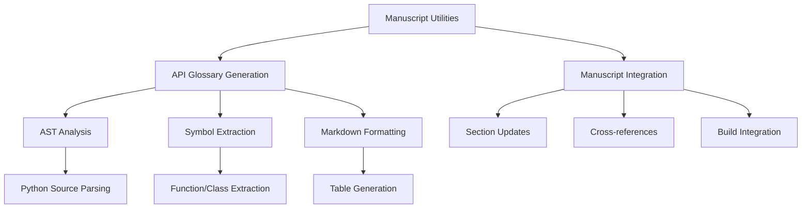

# Manuscript Utilities - Quick Reference

Automated API documentation and technical appendices for research manuscripts.

## Overview

The manuscript utilities provide automated generation of API documentation and technical appendices that integrate seamlessly into research manuscripts.

## Key Features

- **API Glossary Generation**: Auto-generated technical appendices from source code
- **Manuscript Integration**: Seamless integration into Section 98 of manuscripts
- **AST-based Analysis**: Python source code parsing for comprehensive documentation
- **Markdown Formatting**: Research manuscript-compatible output

## Quick Start

```python
from infrastructure.documentation.glossary_gen import generate_api_glossary

# Generate API glossary from source code
glossary = generate_api_glossary('project/src/')

# Save to manuscript appendix
with open('project/manuscript/98_symbols_glossary.md', 'w') as f:
    f.write(glossary)
```

## Automatic Integration

The manuscript utilities integrate automatically with the build pipeline:

```bash
# Generate manuscript with API glossary
python3 scripts/03_render_pdf.py

# Validate manuscript including glossary
python3 scripts/04_validate_output.py
```

## API Reference

### Glossary Generation

```python
from infrastructure.documentation.glossary_gen import generate_api_glossary

# Generate from project source
glossary = generate_api_glossary('project/src/')

# Generate with options
glossary = generate_api_glossary(
    'project/src/',
    include_private=False,    # Exclude private functions
    sort_by='module'          # Sort by module name
)
```

### Manuscript Integration

```python
from infrastructure.documentation.markdown_integration import update_manuscript_glossary

# Update manuscript appendix
update_manuscript_glossary(
    Path('project/manuscript/98_symbols_glossary.md'),
    glossary_content
)
```

## Generated Content

The API glossary includes:

- **Function signatures** with parameters and return types
- **Class definitions** with inheritance information
- **Module organization** and symbol categorization
- **Docstring summaries** extracted from source code
- **Cross-reference links** to source locations

## Output Format

```markdown
# API Symbols Glossary

This glossary is auto-generated from the public API in `src/`.

<!-- BEGIN: AUTO-API-GLOSSARY -->
| Symbol | Type | Module | Description |
|--------|------|--------|-------------|
| `analyze_data` | function | `project.src.analysis` | Analyze research data with statistical methods |
| `DataProcessor` | class | `project.src.processing` | Main data processing class with validation |
<!-- END: AUTO-API-GLOSSARY -->
```

## Configuration

### Build Integration

The utilities respect manuscript configuration:

```yaml
# project/manuscript/config.yaml
manuscript:
  generate_glossary: true
  glossary_section: 98
  include_private_symbols: false
```

### Environment Variables

```bash
# Control glossary generation
export GENERATE_API_GLOSSARY=true
export GLOSSARY_SECTION=98
```

## Testing

```bash
# Test glossary generation
pytest tests/infrastructure/test_documentation.py -k glossary -v

# Test manuscript integration
pytest tests/infrastructure/test_manuscript_integration.py -v
```

## Troubleshooting

### Common Issues

**Empty glossary:**
- Check that `project/src/` contains Python files
- Verify files have docstrings and proper structure

**Integration failures:**
- Ensure `98_symbols_glossary.md` exists with proper markers
- Check file permissions for writing

**Markdown errors:**
- Validate generated markdown syntax
- Check for special characters in docstrings

## Architecture



## See Also

- [AGENTS.md](AGENTS.md) - Complete technical documentation
- [../documentation/README.md](../documentation/README.md) - Documentation module overview
- [../../scripts/AGENTS.md](../../scripts/AGENTS.md) - Build pipeline integration