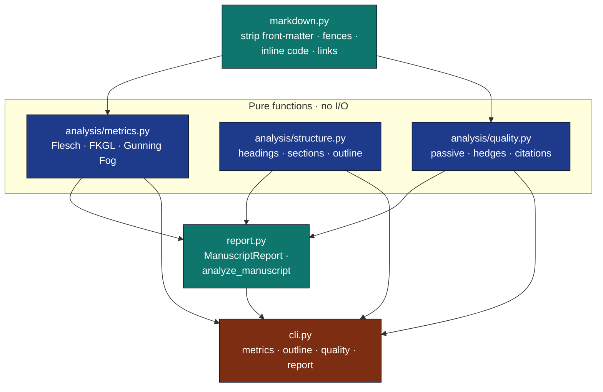

# Prose Module

## Purpose

Editorial-grade prose analysis for research manuscripts: readability
metrics, structural outline, quality flags, and aggregated reports.
Sister module to [`infrastructure/reference/`](../reference/) (citation
export) and [`infrastructure/search/`](../search/) (literature
discovery). Together these three form the **discovery → export →
synthesis → review** chain that backs the project exemplars.

## Architecture



## Files

| File | Role |
|---|---|
| `analysis/metrics.py` | `compute_metrics`, `count_syllables`, sentence/word/paragraph splitters. |
| `analysis/structure.py` | `analyze_structure`, `parse_headings`, `render_outline`. |
| `analysis/quality.py` | `analyze_quality`, passive/hedge/citation/long-sentence detectors. |
| `markdown.py` | `normalise_for_prose`, `strip_*`, `read_manuscript_dir`. |
| `report.py` | `ManuscriptReport`, `analyze_files`, `analyze_manuscript`, `write_report`. |
| `cli.py` | `metrics` / `outline` / `quality` / `report` subcommands. |

## Invariants

- **Pure functions in `analysis/` and `markdown.py`.** No file I/O, no
  network. Tests can pass any text.
- **Deterministic.** Same input → same output, byte-for-byte.
- **Heuristics, not linguistics.** Passive voice = "be + past participle"
  pair. Hedges = fixed wordlist. Syllables = vowel-group counts. Good for
  editorial signal; not a replacement for a parser.
- **Markdown-aware but Markdown-light.** `normalise_for_prose` is the
  only place that knows about Markdown syntax; analysers operate on plain
  text.
- **Citation extraction is Pandoc-flavoured.** Recognises both
  `[@key1; @key2]` and bare `@key`. Won't match LaTeX `\cite{...}` —
  that's the Reference module's job.
- **All I/O lives in `report.py` and `cli.py`.** Nowhere else.

## Editing checklist

- [ ] Added a new metric → add a field to `ProseMetrics` (frozen
  dataclass), populate in `compute_metrics`, add a test in
  `tests/infra_tests/prose/test_metrics.py`.
- [ ] Added a new quality flag → add to `QualityReport`, populate in
  `analyze_quality`, add a parametrised test.
- [ ] Touched `normalise_for_prose` → re-run
  `test_markdown_helpers.py::TestStripping` and confirm round-trips
  through manuscripts.
- [ ] Added a CLI subcommand → wire it up in `build_parser`, add a
  subprocess test in `test_cli.py`.

## Testing

```bash
uv run pytest tests/infra_tests/prose/ -v
```

50+ tests, no mocks: real text inputs, real `tmp_path` files, real
subprocess invocation of the CLI.

## Configuration

No environment variables. Pure-Python, stdlib-only.

## Integration

The Prose module is consumed by:

* `projects/templates/template_prose_project/` — full exemplar pipeline using
  prose + reference modules.
* `projects/templates/template_code_project/` and other projects — invoke the CLI
  in their analysis stage to attach a `prose_report.json` artefact.
* Manuscript review workflows — the `ManuscriptReport` JSON is small,
  greppable, diff-friendly.

## Best practices

### Strip Markdown before measuring

```python
from infrastructure.prose import compute_metrics, normalise_for_prose

# Wrong: code fences inflate word count.
metrics = compute_metrics(raw_markdown)

# Right.
metrics = compute_metrics(normalise_for_prose(raw_markdown))
```

### Aggregate over manuscript dirs, not single files

`analyze_manuscript` reads every `*.md` under a directory and returns a
weighted aggregate. Per-file metrics are noisy; manuscript-wide signals
are stable.

### Pin thresholds in CI

```bash
uv run python -m infrastructure.prose.cli quality \
    --long-sentence-threshold 35 path.md
```

## See also

- [`README.md`](README.md) — quick reference.
- [`SKILL.md`](SKILL.md) — agent-oriented API.
- [`infrastructure/reference/`](../reference/) — citation export sister
  module.
- [`projects/templates/template_prose_project/`](../../projects/templates/template_prose_project/)
  — exemplar project.
