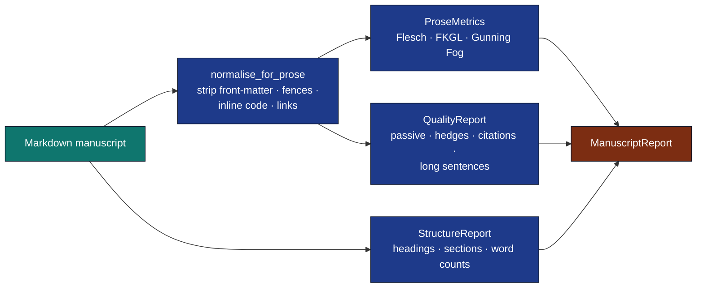

# Prose Module

Editorial-grade prose analysis: readability, structure, quality flags,
and manuscript-wide aggregation.



## Readability metrics

```python
from infrastructure.prose import compute_metrics, normalise_for_prose

text = "The cat sat on the mat. Dogs run fast."
metrics = compute_metrics(normalise_for_prose(text))
print(metrics.flesch_reading_ease)        # 100+ — very easy
print(metrics.flesch_kincaid_grade)        # ~1
print(metrics.gunning_fog)                 # ~1.6
```

## Heading structure

```python
from infrastructure.prose import analyze_structure, render_outline

report = analyze_structure(open("manuscript/02_methodology.md").read())
print(report.has_h1, report.max_depth, report.has_skipped_level)
print(render_outline(report))
```

## Quality flags

```python
from infrastructure.prose import analyze_quality

q = analyze_quality(text)
q.passive_count, q.hedge_count, q.citation_count, q.long_sentence_count
q.citation_density_per_1000   # citations per 1000 words
```

## Whole-manuscript report

```python
from infrastructure.prose import analyze_manuscript, write_report

report = analyze_manuscript("projects/my_project/manuscript")
write_report(report, "output/prose_report.json")
print(report.total_words, report.avg_flesch_kincaid_grade)
```

## CLI

```bash
# Metrics for a single file
uv run python -m infrastructure.prose.cli metrics path/to/section.md

# Heading outline
uv run python -m infrastructure.prose.cli outline path/to/section.md

# Editorial quality
uv run python -m infrastructure.prose.cli quality path/to/section.md \
    --long-sentence-threshold 30

# Whole-manuscript JSON report
uv run python -m infrastructure.prose.cli report \
    projects/my_project/manuscript \
    --output output/prose_report.json
```

## Design notes

* **Pure functions, deterministic.** No I/O outside the `report` and
  `cli` layers. `compute_metrics`, `analyze_structure`, `analyze_quality`
  are stable across versions.
* **Heuristics only.** Passive-voice detection uses "be + past
  participle"; hedge detection is a fixed word list; syllable counting
  is a vowel-group rule. Each is good enough for a writer-friendly
  signal, not for linguistic research.
* **Handles Markdown.** `normalise_for_prose` strips front-matter,
  fenced code, inline code, and link URLs so metrics reflect prose, not
  scaffolding.
* **Citation extraction.** `extract_citation_keys` recognises both
  `[@key1; @key2]` and bare `@key` forms used by Pandoc.
