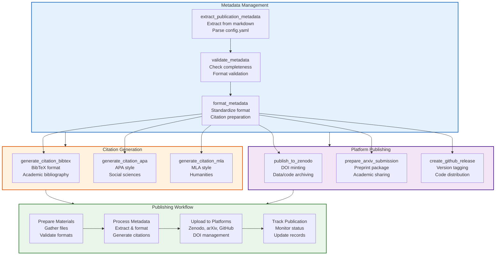

# Publishing Module - Quick Reference

Tools for academic publishing, citations, and platform integration.

## Quick Start

```python
from infrastructure.publishing import (
    extract_publication_metadata,
    generate_citation_bibtex,
    publish_to_zenodo
)

# Extract metadata
metadata = extract_publication_metadata([Path("manuscript.md")])

# Generate citations
bibtex = generate_citation_bibtex(metadata)
print(bibtex)

# Publish to Zenodo
doi = publish_to_zenodo(
    metadata,
    [Path("output/pdf/manuscript.pdf")],
    os.getenv("ZENODO_TOKEN")
)
print(f"Published with DOI: {doi}")
```

## Modules



- **core** - Publishing workflows and metadata management
- **api** - Platform API clients (Zenodo, arXiv, GitHub)

## Key Classes

### PublicationMetadata
- `title` - Publication title
- `authors` - Author list
- `abstract` - Paper abstract
- `keywords` - Keyword list
- `doi` - Optional DOI
- `journal` - Optional journal name
- `license` - License type

### API Clients
- `ZenodoClient` - Zenodo platform integration
- `ZenodoConfig` - Zenodo configuration

## Key Functions

### Metadata Management
- `extract_publication_metadata()` - Parse manuscript for metadata
- `validate_doi()` - Check DOI format and validity
- `create_publication_package()` - Prepare publication package
- `validate_publication_readiness()` - Check completeness

### Citation Generation
- `generate_citation_bibtex()` - BibTeX format
- `generate_citation_apa()` - APA format
- `generate_citation_mla()` - MLA format
- `generate_citations_markdown()` - All formats with markdown

### Publication Checklists
- `create_submission_checklist()` - Journal/conference submission
- `create_academic_profile_data()` - ORCID/ResearchGate data
- `generate_publication_summary()` - Repository README

### Publishing Platforms
- `publish_to_zenodo()` - Publish with DOI minting
- `prepare_arxiv_submission()` - Create arXiv package
- `create_github_release()` - Automate GitHub releases

### Utilities
- `extract_citations_from_markdown()` - Citation extraction
- `generate_publication_metrics()` - Complexity analysis
- `generate_doi_badge()` - DOI badge generation
- `create_publication_announcement()` - Social media ready

## CLI

```bash
# Extract metadata
python3 -m infrastructure.publishing.cli extract-metadata manuscript/

# Generate citations
python3 -m infrastructure.publishing.cli generate-citation manuscript/ --format bibtex

# Prepare Zenodo upload
python3 -m infrastructure.publishing.cli publish-zenodo output/ --token $ZENODO_TOKEN
```

## Environment Variables

```bash
export ZENODO_TOKEN="your-token"
export GITHUB_TOKEN="your-token"
```

## Testing

```bash
pytest tests/infrastructure/test_publishing/
```

For detailed documentation, see [AGENTS.md](AGENTS.md).

