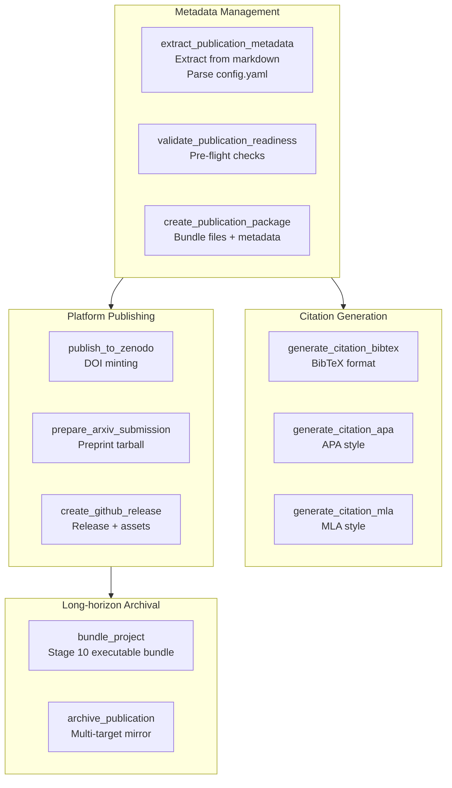

# Publishing Module - Quick Reference

Tools for academic publishing, citations, and platform integration.

## Quick Start

```python
from infrastructure.publishing import (
    extract_publication_metadata,
    generate_citation_bibtex,
    publish_to_zenodo
)

# Extract metadata
metadata = extract_publication_metadata([Path("manuscript.md")])

# Generate citations
bibtex = generate_citation_bibtex(metadata)
print(bibtex)

# Publish to Zenodo
result = publish_to_zenodo(
    metadata,
    [Path("output/{project_name}/pdf/{project_name}_combined.pdf")],
    os.getenv("ZENODO_TOKEN")
)
print(f"Published with DOI: {result.doi}")
```

## Modules


```mermaid
graph TD
    subgraph Metadata["Metadata Management"]
        EXTRACT[extract_publication_metadata<br/>Extract from markdown<br/>Parse config.yaml]
        READINESS[validate_publication_readiness<br/>Pre-flight checks]
        PACKAGE[create_publication_package<br/>Bundle files + metadata]
    end

    subgraph Citations["Citation Generation"]
        BIBTEX[generate_citation_bibtex<br/>BibTeX format]
        APA[generate_citation_apa<br/>APA style]
        MLA[generate_citation_mla<br/>MLA style]
    end

    subgraph Platforms["Platform Publishing"]
        ZENODO[publish_to_zenodo<br/>DOI minting]
        ARXIV[prepare_arxiv_submission<br/>Preprint tarball]
        GITHUB[create_github_release<br/>Release + assets]
    end

    subgraph Archival["Long-horizon Archival"]
        BUNDLE[bundle_project<br/>Stage 10 executable bundle]
        ARCHIVE[archive_publication<br/>Multi-target mirror]
    end

    Metadata --> Citations
    Metadata --> Platforms
    Platforms --> Archival
```

- **core** - Metadata, citations, packages, readiness
- **zenodo/** - [Zenodo REST API](https://developers.zenodo.org/) client and publish workflow
- **github/** - GitHub Releases API
- **arxiv/** - arXiv submission tarball preparation
- **platforms.py** / **api.py** - Backwards-compatible re-exports

## Key Classes

### PublicationMetadata
- `title` - Publication title
- `authors` - Author list
- `abstract` - Paper abstract
- `keywords` - Keyword list
- `doi` - Optional DOI
- `journal` - Optional journal name
- `license` - License type

### API clients

- `ZenodoClient` / `ZenodoConfig` — [`zenodo/`](zenodo/) (also via `infrastructure.publishing.api`)
- `DepositionResult` — create-deposition result (id + bucket URL)
- `PublishResult` — high-level Zenodo publish result (DOI + deposition id)

## Key Functions

### Metadata Management
- `extract_publication_metadata()` - Parse manuscript for metadata
- `validate_doi()` - Check DOI format and validity
- `create_publication_package()` - Prepare publication package
- `validate_publication_readiness()` - Check completeness

### Citation Generation
- `generate_citation_bibtex()` - BibTeX format
- `generate_citation_apa()` - APA format
- `generate_citation_mla()` - MLA format
- `generate_citations_markdown()` - All formats with markdown

### Publication Checklists
- `create_submission_checklist()` - Journal/conference submission
- `create_academic_profile_data()` - ORCID/ResearchGate data
- `generate_publication_summary()` - Repository README

### Publishing Platforms
- `publish_to_zenodo()` - Publish with DOI minting
- `prepare_arxiv_submission()` - Create arXiv package
- `create_github_release()` - Automate GitHub releases

### Utilities
- `extract_citations_from_markdown()` - Citation extraction
- `generate_publication_metrics()` - Complexity analysis
- `generate_doi_badge()` - DOI badge generation
- `create_publication_announcement()` - Social media ready

## CLI

```bash
# Extract metadata
uv run python -m infrastructure.publishing.cli extract-metadata manuscript/

# Generate citations (the CLI currently exposes BibTeX only)
uv run python -m infrastructure.publishing.cli generate-citation manuscript/ --format bibtex

# Publish to Zenodo (sandbox by default; pass --production for zenodo.org)
uv run python -m infrastructure.publishing.cli publish-zenodo output/ --token $ZENODO_TOKEN

# GitHub release wrapper (expects output/pdf/*.pdf in cwd)
uv run python -m infrastructure.publishing.publish_cli \
  --token $GITHUB_TOKEN --repo owner/repo --tag v1.0.0 --name "Release 1.0.0"

# Archival dry-run (Stage 11; default is safe — no real deposits)
uv run python -m infrastructure.publishing.archival_cli \
  --bundle output/template_code_project/executable_bundle \
  --providers zenodo software_heritage ipfs_pinata ipfs_web3storage
```

## Environment Variables

```bash
export ZENODO_TOKEN="your-token"
export GITHUB_TOKEN="your-token"
```

## Testing

```bash
uv run pytest tests/infra_tests/publishing/
```

For detailed documentation, see [AGENTS.md](AGENTS.md).
