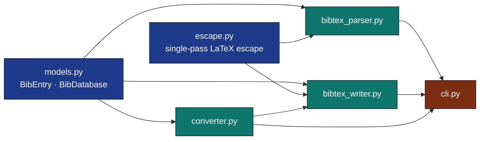

# `infrastructure/reference/citation/`

Agent guide for the citation submodule. The parent module's
[`AGENTS.md`](../AGENTS.md) contains higher-level rationale; this file
documents the internal seams.

## Module Graph



## Invariants

- **Field order is preserved** through parse → render. Any change here
  breaks byte-stable round-trips with the exemplar `references.bib`.
- **Citation keys are stable**: `<author><year><title-word>`,
  unicode-folded, stop-words filtered. Pass `citation_key=` to override.
- **`book` / `phdthesis` / `techreport` / `misc` never get `journal=`.**
  Verified in `tests/infra_tests/reference/test_converter.py`.
- **DOIs / URLs / years / volumes are emitted verbatim**, never escaped.
- **Single-pass LaTeX escape.** `escape_latex` does NOT chain
  `str.replace` calls — that would double-escape inserted commands.

## Editing checklist

- [ ] Touched `bibtex_writer.py` → verify
  `tests/infra_tests/reference/test_bibtex_writer.py::TestRenderEntry::test_matches_exemplar_byte_for_byte`
  still passes.
- [ ] Touched `bibtex_parser.py` → verify
  `TestExemplarBib::test_round_trip_re_renders_each_entry` still passes.
- [ ] Added a new field to `BibEntry` → update `_VERBATIM_FIELDS` /
  `_AUTHOR_FIELDS` / `_PAGE_FIELDS` if special handling is needed.
- [ ] New entry type → add to `_SOURCE_TO_ENTRY_TYPE` in `converter.py`
  and add a parametrised case in `test_converter.py`.

## Tests

```bash
uv run pytest tests/infra_tests/reference/ -v
```

105+ tests, no mocks. Real round-trip against the exemplar
`projects/template_code_project/manuscript/references.bib`.

## See also

- [`README.md`](README.md) — quick reference + diagram.
- [`SKILL.md`](SKILL.md) — agent-oriented API.
- [`../AGENTS.md`](../AGENTS.md) — module-level overview.
