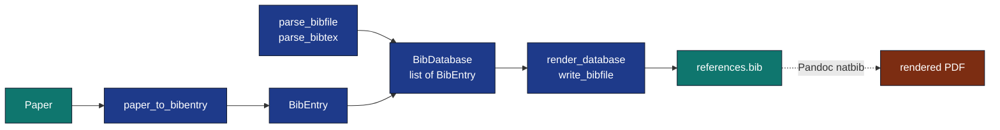

# `infrastructure/reference/citation/`

BibTeX read/write/convert that round-trips byte-stable through the same
format as
[`projects/template_code_project/manuscript/references.bib`](../../../projects/template_code_project/manuscript/references.bib).



## Files

| File | Role |
|---|---|
| `models.py` | `BibEntry`, `BibDatabase`, `CANONICAL_ENTRY_TYPES` |
| `escape.py` | LaTeX-special escape / unescape (single-pass) |
| `bibtex_writer.py` | Render entries with the project's house format |
| `bibtex_parser.py` | Forgiving state-machine parser; preserves field order |
| `converter.py` | `paper_to_bibentry`, `generate_citation_key` |
| `cli.py` | `validate` / `format` / `convert` subcommands |

## Quick reference

```python
from infrastructure.reference.citation import (
    parse_bibfile, render_database, write_bibfile,
    paper_to_bibentry, generate_citation_key,
)
```

For the API surface and worked examples see
[SKILL.md](SKILL.md); for architectural context, see the parent module's
[`AGENTS.md`](../AGENTS.md).
