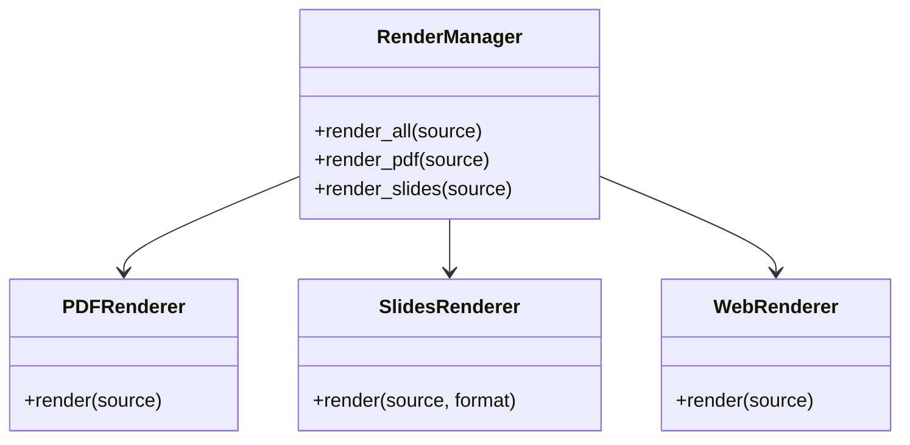

# Rendering Module

## Purpose

The Rendering module consolidates output generation logic, supporting multiple formats (PDF, Slides, Web, Posters) from a single source of truth (Manuscript).

## Architecture

This module follows the **thin orchestrator pattern**:
- **Manager**: `RenderManager` coordinates specialized renderers.
- **Renderers**: Dedicated classes for each format (`PDFRenderer`, `SlidesRenderer`, etc.).
- **Utils**: `latex_utils.py` handles the complexities of LaTeX compilation.

### Class Structure



## Usage

### Render Everything

```python
from infrastructure.rendering import RenderManager
from pathlib import Path

manager = RenderManager()
outputs = manager.render_all(Path("manuscript/main.tex"))
```

### Render Specific Format

```python
# Generate slides
manager.render_slides(Path("manuscript/presentation.md"), format="revealjs")
```

## Configuration

Configuration is managed via `RenderingConfig` or environment variables.

| Option | Description | Default |
|--------|-------------|---------|
| `latex_compiler` | Compiler command | `xelatex` |
| `pandoc_path` | Path to pandoc | `pandoc` |
| `output_dir` | Root output directory | `output` |

## Supported Formats

1. **PDF**: High-quality typesetting via LaTeX.
2. **Slides**:
   - `beamer`: PDF slides via LaTeX.
   - `revealjs`: HTML interactive slides.
3. **Web**: HTML5 with MathJax support.
4. **Posters**: Large format PDF posters.

## Title Page Generation

The combined PDF rendering automatically generates a professional title page from `manuscript/config.yaml`.

### Configuration

Edit `manuscript/config.yaml` to customize the title page:

```yaml
paper:
  title: "Your Paper Title"
  subtitle: "Optional Subtitle"  # Optional
  version: "1.0"
  date: ""  # Auto-generated if empty (uses \today)

authors:
  - name: "Dr. Jane Smith"
    orcid: "0000-0000-0000-1234"
    email: "jane@example.edu"
    affiliation: "University of Example"
    corresponding: true
  - name: "Dr. John Doe"
    orcid: "0000-0000-0000-5678"
    email: "john@example.edu"
    affiliation: "Another University"
    corresponding: false
```

### Title Page Layout

The generated title page includes:
- Paper title (with optional subtitle)
- Author names (multiple authors supported with "and" separator)
- Publication date (current date or custom)
- Optional author affiliations in metadata

### How It Works

The PDFRenderer splits title page generation into two phases:

1. **Preamble Phase** (`_generate_title_page_preamble()`):
   - Generates `\title{}`, `\author{}`, `\date{}` commands
   - Inserted BEFORE `\begin{document}`
   - Required by LaTeX for title page creation

2. **Body Phase** (`_generate_title_page_body()`):
   - Generates `\maketitle` command
   - Inserted AFTER `\begin{document}`
   - Renders the title page with previously defined metadata

**Example generated LaTeX**:
```latex
% Preamble (before \begin{document})
\title{Your Paper Title}
\author{Dr. Jane Smith \and Dr. John Doe}
\date{\today}

% Document body (after \begin{document})
\maketitle
\thispagestyle{empty}
```

## Bibliography and Citation Processing

The rendering system automatically processes citations in your manuscript using BibTeX.

### Citation Workflow

1. **Markdown Processing**: Pandoc processes LaTeX `\cite{}` commands using `--citeproc`
2. **Bibliography Processing**: BibTeX runs to match citations with `references.bib` entries
3. **Reference Resolution**: Additional LaTeX passes resolve all citation references

### Bibliography Setup

Create `manuscript/references.bib` with standard BibTeX format:

```bibtex
@article{smith2024,
  title={Article Title},
  author={Smith, Jane and Doe, John},
  journal={Journal Name},
  volume={10},
  pages={123--145},
  year={2024},
  doi={10.1234/example}
}

@book{jones2023,
  title={Book Title},
  author={Jones, Alice},
  publisher={Academic Press},
  year={2023}
}
```

### Citation Usage

Cite in manuscript using LaTeX syntax:

```latex
According to recent research \cite{smith2024}, the methods improve performance.

Multiple sources \cite{smith2024, jones2023} support this approach.
```

### Compilation Process

The `render_combined()` method executes this sequence:

1. **Pass 1**: Initial xelatex compilation (generates `.aux` file)
2. **BibTeX**: Processes bibliography and generates `.bbl` file
3. **Passes 2-4**: Additional xelatex passes resolve all citations and references

This ensures:
- All citations are resolved correctly
- Cross-references are complete
- Table of contents is accurate
- Bibliography is properly formatted

### Troubleshooting Citations

**Citations showing as "?"**:
- Verify bibliography file exists: `manuscript/references.bib`
- Check citation keys match exactly (case-sensitive)
- Ensure BibTeX entries are properly formatted
- Run full build: `python3 scripts/run_all.py`

**Missing bibliography entries**:
- Check LaTeX log for BibTeX warnings
- Verify entry keys in `.bib` file match `\cite{}` commands
- Use unique, descriptive keys: `author_year` format recommended

**Bibliography not appearing**:
- Ensure `\bibliography{references}` command is in document
- Check `99_references.md` contains `\bibliography{references}` and `\nocite{*}`
- Verify bibliography style: `\bibliographystyle{unsrt}` is set

## Figure Handling

Figures referenced in manuscript markdown are automatically integrated into the PDF.

### Figure Path Resolution

Figures should be:
- Stored in `project/output/figures/` (generated by analysis scripts)
- Referenced in markdown with relative paths

The renderer automatically:
- Converts markdown-style figure references to LaTeX
- Fixes paths for proper LaTeX compilation
- Verifies all referenced figures exist before compilation
- Logs warnings for missing figures

### Figure Reference Format

Use LaTeX figure blocks in markdown:

```latex
\begin{figure}[h]
\centering
\includegraphics[width=0.8\textwidth]{../output/figures/my_figure.png}
\caption{Description of the figure}
\label{fig:my_figure}
\end{figure}

See Figure \ref{fig:my_figure} for details.
```

### Supported Formats

- PNG (recommended for compatibility)
- PDF (vector graphics)
- JPG/JPEG

### Path Conversion

The rendering system automatically handles figure path resolution with several features:

**Path Normalization**:
- Converts various path formats to correct LaTeX relative paths
- Supports: `../output/figures/`, `output/figures/`, `../figures/`
- All converted to: `../figures/filename` (relative to compilation directory)

**Unicode Support**:
- Handles Unicode characters in filenames (e.g., `figure_ñ_test.png`)
- Normalizes Unicode using NFC composition form
- Safely handles accents, diacritics, and special characters

**Path Formats Recognized**:
```
../output/figures/figure.png  → ../figures/figure.png
output/figures/figure.png     → ../figures/figure.png
../figures/figure.png         → ../figures/figure.png (unchanged)
./figures/figure.png          → ../figures/figure.png
figure.png                    → ../figures/figure.png
```

(LaTeX compiles from `output/pdf/` directory, so all paths are relative to that location)

### Verification and Path Resolution

Before LaTeX compilation, the renderer:
- Extracts all `\includegraphics` references
- Normalizes paths to handle various formats
- Checks if files exist in `project/output/figures/`
- Logs the status of each figure
- Warns about missing figures but continues (graceful degradation)

**Example output**:
```
Verifying 14 figure reference(s)...
✓ Fixed 14 figure path(s)
  ../output/figures/convergence_plot.png → ../figures/convergence_plot.png
  ../output/figures/scalability_analysis.png → ../figures/scalability_analysis.png
  ../output/figures/future_figure.png → ../figures/future_figure.png (FILE NOT FOUND)
Found: 13/14 figures
```

**Enhanced Path Resolution Features**:
- Unicode normalization for special characters
- Multiple path format support
- Graceful handling of missing figures
- Detailed logging of path transformations

### Troubleshooting

#### Figures Not Appearing

1. **Check figure generation**:
   ```bash
   ls -la project/output/figures/
   ```

2. **Verify references in markdown**:
   ```bash
   grep -r "includegraphics" project/manuscript/
   ```

3. **Check LaTeX compilation log**:
   ```bash
   tail -100 project/output/pdf/_combined_manuscript.log | grep -i "graphics\|error"
   ```

4. **Verify figure exists with correct filename**:
   - Check spelling and case sensitivity
   - Ensure file is in PNG/PDF/JPG format
   - Verify file is readable
   - For Unicode filenames, ensure encoding is correct

5. **Check path format in markdown**:
   - Use: `\includegraphics{../output/figures/name.png}`
   - Avoid: `\includegraphics{name.png}` (ambiguous path)

#### Missing Figure Warnings

If you see warnings about missing figures:
- Generate the figures by running analysis scripts: `python3 scripts/02_run_analysis.py`
- Verify figure paths in markdown are correct
- Check filenames match exactly (case-sensitive)
- Figures are optional; PDF will render without them, but compilation continues

## Testing

Run tests with:
```bash
pytest tests/infrastructure/rendering/test_pdf_renderer_combined.py -v
```

### Test Coverage

- Title page generation (single/multiple authors, subtitle, custom date)
- Figure path resolution (basic, with options, missing files, multiple figures)
- Combined PDF generation (full integration tests)
- Figure verification and detection

