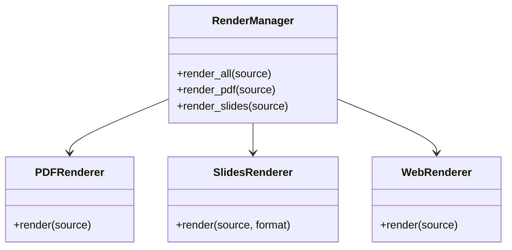

# Rendering Module

## Purpose

The Rendering module consolidates output generation logic, supporting multiple formats (PDF, Slides, Web, Posters) from a single source of truth (Manuscript).

## Architecture

This module follows the **thin orchestrator pattern**:
- **Manager**: `RenderManager` coordinates specialized renderers.
- **Renderers**: Dedicated classes for each format (`PDFRenderer`, `SlidesRenderer`, etc.).
- **Utils**: `latex_utils.py` handles the complexities of LaTeX compilation.

### Class Structure



## Usage

### Render Everything

```python
from infrastructure.rendering import RenderManager
from pathlib import Path

manager = RenderManager()
outputs = manager.render_all(Path("manuscript/main.tex"))
```

### Render Specific Format

```python
# Generate slides
manager.render_slides(Path("manuscript/presentation.md"), format="revealjs")
```

## Configuration

Configuration is managed via `RenderingConfig` or environment variables.

| Option | Description | Default |
|--------|-------------|---------|
| `latex_compiler` | Compiler command | `xelatex` |
| `pandoc_path` | Path to pandoc | `pandoc` |
| `output_dir` | Root output directory | `output` |

## Supported Formats

1. **PDF**: High-quality typesetting via LaTeX.
2. **Slides**:
   - `beamer`: PDF slides via LaTeX.
   - `revealjs`: HTML interactive slides.
3. **Web**: HTML5 with MathJax support.
4. **Posters**: Large format PDF posters.

## Testing

Run tests with:
```bash
pytest tests/infrastructure/test_rendering/
```

