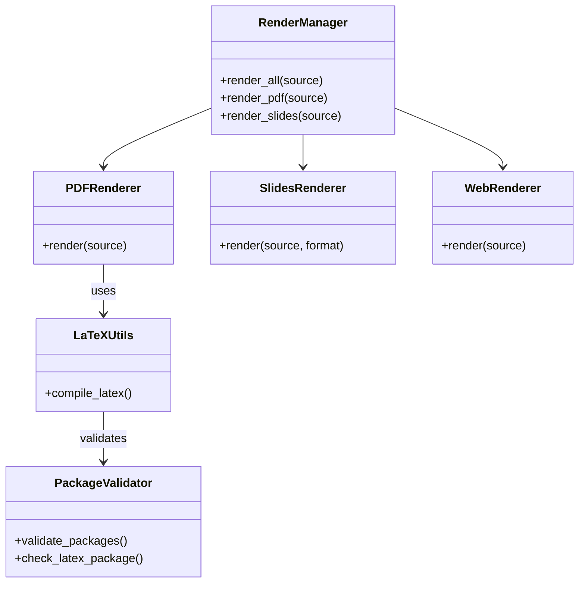

# Rendering Module

## Purpose

The Rendering module consolidates output generation logic, supporting multiple formats (PDF, Slides, Web, Posters) from a single source of truth (Manuscript).

## Architecture

This module follows the **thin orchestrator pattern**:
- **Manager**: `RenderManager` coordinates specialized renderers.
- **Renderers**: Dedicated classes for each format (`PDFRenderer`, `SlidesRenderer`, etc.).
- **Utils**: `latex_utils.py` handles the complexities of LaTeX compilation.

### Class Structure



## Usage

### Render Everything

```python
from infrastructure.rendering import RenderManager
from pathlib import Path

manager = RenderManager()
outputs = manager.render_all(Path("manuscript/main.tex"))
```

### Render Specific Format

```python
# Generate slides
manager.render_slides(Path("manuscript/presentation.md"), format="revealjs")
```

## Configuration

Configuration is managed via `RenderingConfig` or environment variables.

| Option | Description | Default |
|--------|-------------|---------|
| `latex_compiler` | Compiler command | `xelatex` |
| `pandoc_path` | Path to pandoc | `pandoc` |
| `output_dir` | Root output directory | `output` |

## Supported Formats

1. **PDF**: High-quality typesetting via LaTeX.
2. **Slides**:
   - `beamer`: PDF slides via LaTeX.
   - `revealjs`: HTML interactive slides.
3. **Web**: HTML5 with MathJax support.
4. **Posters**: Large format PDF posters.

## Title Page Generation

The combined PDF rendering automatically generates a professional title page from `project/manuscript/config.yaml`.

### Configuration

Edit `project/manuscript/config.yaml` to customize the title page:

```yaml
paper:
  title: "Your Paper Title"
  subtitle: "Optional Subtitle"  # Optional
  version: "1.0"
  date: ""  # Auto-generated if empty (uses \today)

authors:
  - name: "Dr. Jane Smith"
    orcid: "0000-0000-0000-1234"
    email: "jane@example.edu"
    affiliation: "University of Example"
    corresponding: true
  - name: "Dr. John Doe"
    orcid: "0000-0000-0000-5678"
    email: "john@example.edu"
    affiliation: "Another University"
    corresponding: false
```

### Title Page Layout

The generated title page includes:
- Paper title (with optional subtitle)
- Author names (multiple authors supported with "and" separator)
- Publication date (current date or custom)
- Optional author affiliations in metadata

### How It Works

The PDFRenderer splits title page generation into two phases:

1. **Preamble Phase** (`_generate_title_page_preamble()`):
   - Generates `\title{}`, `\author{}`, `\date{}` commands
   - Inserted BEFORE `\begin{document}`
   - Required by LaTeX for title page creation

2. **Body Phase** (`_generate_title_page_body()`):
   - Generates `\maketitle` command
   - Inserted AFTER `\begin{document}`
   - Renders the title page with previously defined metadata

**Example generated LaTeX**:
```latex
% Preamble (before \begin{document})
\title{Your Paper Title}
\author{Dr. Jane Smith \and Dr. John Doe}
\date{\today}

% Document body (after \begin{document})
\maketitle
\thispagestyle{empty}
```

## Function Signatures

### core.py

#### RenderManager (class)
```python
class RenderManager:
    """Manages multi-format rendering from a single source."""

    def __init__(self, config: Optional[RenderingConfig] = None,
                 manuscript_dir: Optional[Path] = None, figures_dir: Optional[Path] = None):
        """Initialize render manager.

        Args:
            config: Rendering configuration (optional)
            manuscript_dir: Manuscript directory path (optional)
            figures_dir: Figures directory path (optional)
        """

    def render_all(self, source_path: Path) -> Dict[str, Path]:
        """Render to all supported formats.

        Args:
            source_path: Path to source manuscript

        Returns:
            Dictionary mapping format names to output paths
        """

    def render_pdf(self, source_path: Path) -> Path:
        """Render to PDF format.

        Args:
            source_path: Path to source manuscript

        Returns:
            Path to generated PDF
        """

    def render_slides(self, source_path: Path, format: str = "beamer") -> Path:
        """Render presentation slides.

        Args:
            source_path: Path to source manuscript
            format: Slide format ("beamer" or "revealjs")

        Returns:
            Path to generated slides
        """

    def render_web(self, source_path: Path) -> Path:
        """Render to web HTML format.

        Args:
            source_path: Path to source manuscript

        Returns:
            Path to generated HTML
        """

    def render_poster(self, source_path: Path) -> Path:
        """Render to poster format.

        Args:
            source_path: Path to source manuscript

        Returns:
            Path to generated poster
        """

    def render_combined_pdf(self, source_files: List[Path], manuscript_dir: Path, project_name: str = "project") -> Path:
        """Render combined PDF from multiple markdown files.

        Args:
            source_files: List of markdown files in order to combine
            manuscript_dir: Directory containing manuscript files (for preamble/bib)
            project_name: Name of the project for filename generation

        Returns:
            Path to generated combined PDF file
        """

    def render_combined_web(self, source_files: List[Path], manuscript_dir: Path, project_name: str = "project") -> Path:
        """Render combined HTML from multiple markdown files.

        Args:
            source_files: List of markdown files in order to combine
            manuscript_dir: Directory containing manuscript files
            project_name: Name of the project for filename generation

        Returns:
            Path to generated combined HTML file (index.html)
        """
```

### pdf_renderer.py

#### _parse_missing_package_error (function)
```python
def _parse_missing_package_error(log_file: Path) -> Optional[str]:
    """Parse LaTeX log for missing package errors.

    Args:
        log_file: Path to LaTeX compilation log

    Returns:
        Missing package name if found, None otherwise
    """
```

#### PDFRenderer (class)
```python
class PDFRenderer:
    """Handles PDF rendering via LaTeX compilation."""

    def __init__(self, config: Optional[RenderingConfig] = None):
        """Initialize PDF renderer.

        Args:
            config: Rendering configuration
        """

    def render(self, source_path: Path) -> Path:
        """Render manuscript to PDF.

        Args:
            source_path: Path to source manuscript

        Returns:
            Path to generated PDF
        """

    def render_combined_pdf(self, manuscript_files: List[Path], manuscript_dir: Path) -> Path:
        """Render combined manuscript PDF.

        Args:
            manuscript_files: List of manuscript files to combine
            manuscript_dir: Directory containing manuscript files

        Returns:
            Path to generated combined PDF
        """
```

### manuscript_discovery.py

#### verify_figures_exist (function)
```python
def verify_figures_exist(project_root: Path, manuscript_dir: Path) -> Dict[str, Any]:
    """Verify that all figures referenced in manuscript exist.

    Args:
        project_root: Project root directory
        manuscript_dir: Manuscript directory

    Returns:
        Dictionary with verification results
    """
```

#### discover_manuscript_files (function)
```python
def discover_manuscript_files(manuscript_dir: Path) -> List[Path]:
    """Discover all manuscript files in directory.

    Args:
        manuscript_dir: Manuscript directory

    Returns:
        List of manuscript file paths
    """
```

### web_renderer.py

#### WebRenderer (class)
```python
class WebRenderer:
    """Handles web HTML rendering with MathJax."""

    def __init__(self, config: Optional[RenderingConfig] = None):
        """Initialize web renderer.

        Args:
            config: Rendering configuration
        """

    def render(self, source_path: Path) -> Path:
        """Render manuscript to web HTML.

        Args:
            source_path: Path to source manuscript

        Returns:
            Path to generated HTML
        """

    def render_combined(self, source_files: List[Path], manuscript_dir: Path, project_name: str = "project") -> Path:
        """Render multiple markdown files as a combined HTML document.

        Combines all source files, applies CSS styling, and generates a single index.html
        with table of contents and embedded CSS.

        Args:
            source_files: List of markdown files in order
            manuscript_dir: Directory containing manuscript files
            project_name: Name of the project for filename generation

        Returns:
            Path to generated combined HTML file (index.html)

        Raises:
            RenderingError: If combination or rendering fails
        """

    def _combine_markdown_files(self, source_files: List[Path]) -> str:
        """Combine multiple markdown files into one.

        Args:
            source_files: List of markdown files in order

        Returns:
            Combined markdown content

        Raises:
            RenderingError: If any file cannot be read or contains invalid content
        """

    def _embed_css(self, html_file: Path) -> None:
        """Embed CSS styling directly into HTML file.

        Reads ide_style.css and inserts it into the <head> section of the HTML.

        Args:
            html_file: Path to HTML file to modify
        """
```

### slides_renderer.py

#### SlidesRenderer (class)
```python
class SlidesRenderer:
    """Handles presentation slide rendering."""

    def __init__(self, config: Optional[RenderingConfig] = None):
        """Initialize slides renderer.

        Args:
            config: Rendering configuration
        """

    def render(self, source_path: Path, format: str = "beamer") -> Path:
        """Render manuscript to presentation slides.

        Args:
            source_path: Path to source manuscript
            format: Slide format ("beamer" or "revealjs")

        Returns:
            Path to generated slides
        """

    def _render_beamer_with_paths(self, source_file: Path, output_file: Path,
                                   manuscript_dir: Optional[Path], figures_dir: Optional[Path]) -> Path:
        """Render beamer slides with error reporting.

        error handling includes:
        - LaTeX log file path and last 20 lines for context
        - Specific error type detection (missing \end, undefined commands, missing files)
        - Actionable suggestions for common LaTeX compilation issues
        - Better context for debugging compilation failures

        Args:
            source_file: Markdown source file
            output_file: Desired PDF output path
            manuscript_dir: Manuscript directory for resource paths
            figures_dir: Figures directory for image paths

        Returns:
            Path to generated PDF

        Raises:
            RenderingError: With error context and suggestions
        """
```

### poster_renderer.py

#### PosterRenderer (class)
```python
class PosterRenderer:
    """Handles large-format poster rendering."""

    def __init__(self, config: Optional[RenderingConfig] = None):
        """Initialize poster renderer.

        Args:
            config: Rendering configuration
        """

    def render(self, source_path: Path) -> Path:
        """Render manuscript to poster format.

        Args:
            source_path: Path to source manuscript

        Returns:
            Path to generated poster
        """
```

### latex_utils.py

#### compile_latex (function)
```python
def compile_latex(
    tex_file: Path,
    output_dir: Path,
    compiler: str = "xelatex",
    max_passes: int = 4
) -> Tuple[bool, Optional[Path]]:
    """Compile LaTeX document with multiple passes.

    Args:
        tex_file: Path to LaTeX source file
        output_dir: Directory for output files
        compiler: LaTeX compiler to use
        max_passes: Maximum number of compilation passes

    Returns:
        Tuple of (success, pdf_path)
    """
```

### latex_package_validator.py

#### PackageStatus (class)
```python
class PackageStatus(NamedTuple):
    """Status of a LaTeX package check."""
    package: str
    available: bool
    version: Optional[str] = None
    error: Optional[str] = None
```

#### ValidationReport (class)
```python
class ValidationReport:
    """Report of LaTeX package validation."""
    checked_packages: List[str]
    available_packages: List[str]
    missing_packages: List[str]
    errors: List[str]

    def summary(self) -> str:
        """Generate validation summary."""

    def install_commands(self) -> str:
        """Generate installation commands for missing packages."""
```

#### find_kpsewhich (function)
```python
def find_kpsewhich() -> Optional[Path]:
    """Find kpsewhich executable.

    Returns:
        Path to kpsewhich if found, None otherwise
    """
```

#### check_latex_package (function)
```python
def check_latex_package(package_name: str, kpsewhich_path: Optional[Path] = None) -> PackageStatus:
    """Check if LaTeX package is available.

    Args:
        package_name: Name of LaTeX package to check
        kpsewhich_path: Path to kpsewhich executable

    Returns:
        PackageStatus with availability information
    """
```

#### validate_packages (function)
```python
def validate_packages(
    required_packages: Optional[List[str]] = None,
    kpsewhich_path: Optional[Path] = None
) -> ValidationReport:
    """Validate all required LaTeX packages.

    Args:
        required_packages: List of packages to check (uses defaults if None)
        kpsewhich_path: Path to kpsewhich executable

    Returns:
        ValidationReport with results
    """
```

#### get_missing_packages_command (function)
```python
def get_missing_packages_command(missing: List[str]) -> str:
    """Generate command to install missing packages.

    Args:
        missing: List of missing package names

    Returns:
        Installation command string
    """
```

#### validate_preamble_packages (function)
```python
def validate_preamble_packages(strict: bool = False) -> ValidationReport:
    """Validate packages required by manuscript preamble.

    Args:
        strict: Enable strict validation mode

    Returns:
        ValidationReport for preamble packages
    """
```

#### main (function)
```python
def main():
    """Main function for LaTeX package validation CLI."""
```

### config.py

#### RenderingConfig (class)
```python
class RenderingConfig:
    """Configuration for rendering operations."""

    def __init__(
        self,
        latex_compiler: str = "xelatex",
        pandoc_path: str = "pandoc",
        output_dir: Path = Path("output"),
        max_compilation_passes: int = 4,
        validate_packages: bool = True
    ):
        """Initialize rendering configuration.

        Args:
            latex_compiler: LaTeX compiler command
            pandoc_path: Path to pandoc executable
            output_dir: Root output directory
            max_compilation_passes: Maximum LaTeX compilation passes
            validate_packages: Whether to validate LaTeX packages
        """
```

### cli.py

#### render_pdf_command (function)
```python
def render_pdf_command(args):
    """CLI command for PDF rendering.

    Args:
        args: Parsed command line arguments
    """
```

#### render_all_command (function)
```python
def render_all_command(args):
    """CLI command for rendering all formats.

    Args:
        args: Parsed command line arguments
    """
```

#### render_slides_command (function)
```python
def render_slides_command(args):
    """CLI command for slide rendering.

    Args:
        args: Parsed command line arguments
    """
```

#### render_web_command (function)
```python
def render_web_command(args):
    """CLI command for web rendering.

    Args:
        args: Parsed command line arguments
    """
```

#### main (function)
```python
def main():
    """Main CLI entry point for rendering tools."""
```

### render_all_cli.py

#### main (function)
```python
def main():
    """Main function for render all CLI."""
```

## Bibliography and Citation Processing

The rendering system automatically processes citations in your manuscript using BibTeX.

### Citation Workflow

1. **Markdown Processing**: Pandoc processes LaTeX `\cite{}` commands using `--citeproc`
2. **Bibliography Processing**: BibTeX runs to match citations with `references.bib` entries
3. **Reference Resolution**: Additional LaTeX passes resolve all citation references

### Bibliography Setup

Create `manuscript/references.bib` with standard BibTeX format:

```bibtex
@article{smith2024,
  title={Article Title},
  author={Smith, Jane and Doe, John},
  journal={Journal Name},
  volume={10},
  pages={123--145},
  year={2024},
  doi={10.1234/example}
}

@book{jones2023,
  title={Book Title},
  author={Jones, Alice},
  publisher={Academic Press},
  year={2023}
}
```

### Citation Usage

Cite in manuscript using LaTeX syntax:

```latex
According to recent research \cite{smith2024}, the methods improve performance.

Multiple sources \cite{smith2024, jones2023} support this approach.
```

### Compilation Process

The `render_combined()` method executes this sequence:

1. **Pass 1**: Initial xelatex compilation (generates `.aux` file)
2. **BibTeX**: Processes bibliography and generates `.bbl` file
3. **Passes 2-4**: Additional xelatex passes resolve all citations and references

This ensures:
- All citations are resolved correctly
- Cross-references are - Table of contents is accurate
- Bibliography is properly formatted

### Troubleshooting Citations

**Citations showing as "?"**:
- Verify bibliography file exists: `manuscript/references.bib`
- Check citation keys match exactly (case-sensitive)
- Ensure BibTeX entries are properly formatted
- Run full build: `python3 scripts/execute_pipeline.py --core-only`

**Missing bibliography entries**:
- Check LaTeX log for BibTeX warnings
- Verify entry keys in `.bib` file match `\cite{}` commands
- Use unique, descriptive keys: `author_year` format recommended

**Bibliography not appearing**:
- Ensure `\bibliography{references}` command is in document
- Check `99_references.md` contains `\bibliography{references}` and `\nocite{*}`
- Verify bibliography style: `\bibliographystyle{unsrt}` is set

## Figure Handling

Figures referenced in manuscript markdown are automatically integrated into the PDF.

### Figure Path Resolution

Figures should be:
- Stored in `project/output/figures/` (generated by analysis scripts)
- Referenced in markdown with relative paths

The renderer automatically:
- Converts markdown-style figure references to LaTeX
- Fixes paths for proper LaTeX compilation
- Verifies all referenced figures exist before compilation
- Logs warnings for missing figures

### Figure Reference Format

Use LaTeX figure blocks in markdown:

```latex
\begin{figure}[h]
\centering
\includegraphics[width=0.8\textwidth]{../output/figures/my_figure.png}
\caption{Description of the figure}
\label{fig:my_figure}
\end{figure}

See Figure \ref{fig:my_figure} for details.
```

**CRITICAL**: Ensure `\usepackage{graphicx}` is included in your preamble (or in `manuscript/preamble.md`). The rendering system automatically ensures this package is loaded before compilation, but it's good to know this requirement.

### Supported Formats

- PNG (recommended for compatibility)
- PDF (vector graphics)
- JPG/JPEG

### Path Conversion

The rendering system automatically handles figure path resolution with several features:

**Path Normalization**:
- Converts various path formats to correct LaTeX relative paths
- Supports: `../output/figures/`, `output/figures/`, `../figures/`
- All converted to: `../figures/filename` (relative to compilation directory)

**Unicode Support**:
- Handles Unicode characters in filenames (e.g., `figure_ñ_test.png`)
- Normalizes Unicode using NFC composition form
- Safely handles accents, diacritics, and special characters

**Path Formats Recognized**:
```
../output/figures/figure.png  → ../figures/figure.png
output/figures/figure.png     → ../figures/figure.png
../figures/figure.png         → ../figures/figure.png (unchanged)
./figures/figure.png          → ../figures/figure.png
figure.png                    → ../figures/figure.png
```

(LaTeX compiles from `output/pdf/` directory, so all paths are relative to that location)

### Verification and Path Resolution

Before LaTeX compilation, the renderer:
- Extracts all `\includegraphics` references
- Normalizes paths to handle various formats
- Checks if files exist in `project/output/figures/`
- Logs the status of each figure
- Warns about missing figures but continues (graceful degradation)

**Example output**:
```
Verifying 14 figure reference(s)...
✓ Fixed 14 figure path(s)
  ../output/figures/convergence_plot.png → ../figures/convergence_plot.png
  ../output/figures/scalability_analysis.png → ../figures/scalability_analysis.png
  ../output/figures/future_figure.png → ../figures/future_figure.png (FILE NOT FOUND)
Found: 13/14 figures
```

**Path Resolution Features**:
- Unicode normalization for special characters
- Multiple path format support
- Graceful handling of missing figures
- Detailed logging of path transformations

### Troubleshooting

#### Figures Not Appearing

**Symptoms**: PDF renders but figures are missing (blank spaces or placeholders).

1. **Verify graphicx package is loaded**:
   ```bash
   grep "usepackage{graphicx}" project/output/pdf/_combined_manuscript.tex
   ```
   If not found, the rendering system will automatically add it. Check build output for confirmation.

2. **Check figure generation**:
   ```bash
   ls -la project/output/figures/ | grep -E "\.png|\.pdf|\.jpg"
   ```
   Generate missing figures: `python3 scripts/02_run_analysis.py`

3. **Verify references in markdown**:
   ```bash
   grep -r "includegraphics" project/manuscript/ | head -10
   ```

4. **Check LaTeX compilation log for graphics errors**:
   ```bash
   tail -150 project/output/pdf/_combined_manuscript.log | grep -A2 -B2 "graphics\|Error\|Warning"
   ```
   Look for:
   - "File not found" errors
   - "Undefined control sequence" (missing graphicx package)
   - "Cannot find graphics" warnings

5. **Verify figure path format**:
   - Correct: `\includegraphics{../output/figures/name.png}`
   - Also works: `\includegraphics[width=0.8\textwidth]{../output/figures/name.png}`
   - Avoid: `\includegraphics{name.png}` (ambiguous path)

6. **Check file details**:
   - Filename spelling (case-sensitive on Unix)
   - File format (PNG/PDF/JPG only)
   - File is readable: `file project/output/figures/your_figure.png`
   - For Unicode filenames, check encoding: `ls -l project/output/figures/`

7. **Manually test LaTeX compilation** (advanced):
   ```bash
   cd project/output/pdf/
   xelatex _combined_manuscript.tex
   ```
   Look for graphics-related errors in output

#### Missing Figure Warnings

If you see warnings about missing figures:
- Generate the figures by running analysis scripts: `python3 scripts/02_run_analysis.py`
- Verify figure paths in markdown are correct
- Check filenames match exactly (case-sensitive)
- Figures are optional; PDF will render without them, but compilation continues

## Testing

Run tests with:
```bash
pytest tests/infra_tests/rendering/test_pdf_renderer_combined.py -v
```

### Test Coverage

- Title page generation (single/multiple authors, subtitle, custom date)
- Figure path resolution (basic, with options, missing files, multiple figures)
- Combined PDF generation (full integration tests)
- Figure verification and detection

## See Also

- [README.md](README.md) - Quick reference guide
- [`core/`](../core/) - Foundation utilities
- [`validation/`](../validation/) - Validation & quality assurance

