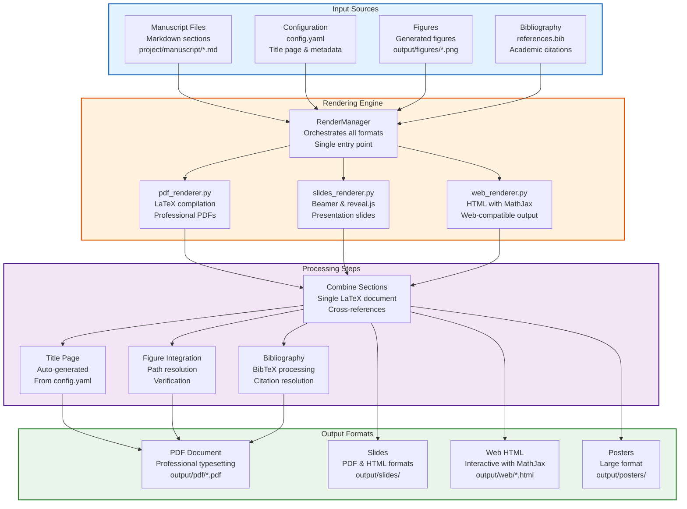
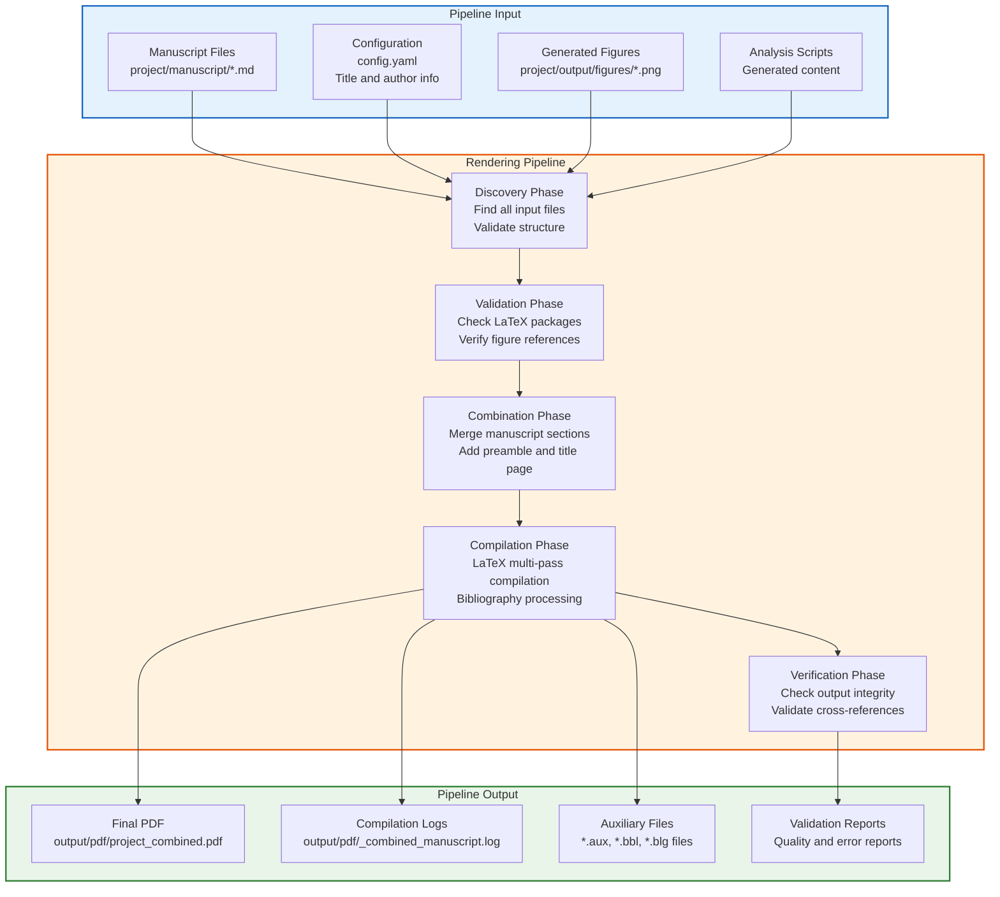

# Rendering Module - Quick Reference

Multi-format output generation for research manuscripts.

## Features



- **Consolidated Pipeline**: Single entry point for all formats.
- **Multiple Outputs**: PDF, Slides (Beamer/HTML), Web, Posters.
- **Title Page Generation**: Automatic title page from `config.yaml`.
- **Figure Integration**: Automatic figure path resolution and verification.
- **Quality Control**: Automated compilation checks and logging.
- **Package Validation**: Pre-flight checks for LaTeX packages.

## LaTeX Package Requirements

### BasicTeX (Minimal Installation)

This rendering system supports **BasicTeX**, a minimal TeX distribution (~100 MB instead of full MacTeX's ~4 GB).

**Required packages** (some require installation):

```bash
sudo tlmgr update --self
sudo tlmgr install multirow cleveref doi newunicodechar
```

**Already included in BasicTeX**:

- Core packages: `amsmath`, `graphicx`, `hyperref`, `natbib`
- Table enhancement: `bm` (part of `tools`), `subcaption` (part of `caption`)

**Pre-flight validation**:

```bash
# Validate packages before rendering
python3 -m infrastructure.rendering.latex_package_validator

# Or run as part of pipeline (automatic)
python3 scripts/03_render_pdf.py
```

**Common issues**:

- **"File *.sty not found"**: Install missing package via `tlmgr`
- **No kpsewhich found**: Install BasicTeX or MacTeX
- **Permission denied**: Use `sudo` for tlmgr commands

### Full MacTeX (Installation)

For a installation with all packages, install **MacTeX**:

```bash
brew install --cask mactex
```

MacTeX includes all packages and tools but requires ~4 GB disk space.

## Quick Start

### Render Combined PDF

```python
from infrastructure.rendering import RenderManager
from pathlib import Path

manager = RenderManager()
manager.render_combined_pdf(
    [Path("01_abstract.md"), Path("02_intro.md"), ...],
    manuscript_dir=Path("manuscript/")
)
```

### Configure Title Page

Edit `project/manuscript/config.yaml`:

```yaml
paper:
  title: "Your Research Title"
  subtitle: "Optional Subtitle"

authors:
  - name: "Dr. Your Name"
    email: "your@email.edu"
    affiliation: "Your Institution"
    corresponding: true

publication:
  doi: "10.5281/zenodo.XXXXXXX"  # DOI goes here, NOT in 'paper' section
  journal: "Zenodo Preprints"
  year: "2026"

# CAUTION: If you create a 'manuscript/preamble.md' with \date{}, \title{}, or \author{} commands,
# they will OVERRIDE these configuration values in the final PDF.
```

```

### Add Bibliography and Citations

Place bibliography in `manuscript/references.bib`:

```bibtex
@article{author2024,
  title={Article Title},
  author={Author, First},
  journal={Journal Name},
  year={2024}
}
```

Cite in markdown using LaTeX syntax:

```latex
According to recent work \cite{author2024}, we demonstrate...
```

**Note**: Bibliography is automatically processed during PDF rendering. The system runs `bibtex` after LaTeX generation to resolve all citations.

### Add Figures

Place figures in `project/output/figures/` and reference in markdown:

```latex
\begin{figure}[h]
\centering
\includegraphics[width=0.8\textwidth]{../output/figures/your_figure.png}
\caption{Figure caption}
\label{fig:your_figure}
\end{figure}

Reference in text: Figure \ref{fig:your_figure}
```

**Important**: The rendering system automatically ensures `\usepackage{graphicx}` is included in the LaTeX preamble. This package is required for `\includegraphics` commands. If not in your custom preamble (`manuscript/preamble.md`), it will be added automatically during compilation.

**Note**: Figure paths are automatically corrected during rendering. The system handles:

- Path normalization for various formats (`../output/figures/`, `output/figures/`, etc.)
- Unicode characters in filenames
- Missing figure warnings (compilation continues gracefully, but logs the issue)

## Common Tasks

### Render to All Formats

```bash
python3 -m infrastructure.rendering.cli all manuscript.tex
```

### Render PDF Only

```bash
python3 -m infrastructure.rendering.cli pdf manuscript.tex
```

### Generate Slides

```bash
python3 -m infrastructure.rendering.cli slides presentation.md --format beamer
python3 -m infrastructure.rendering.cli slides presentation.md --format revealjs
```

## Supported Formats

| Format | Command | Output |
|--------|---------|--------|
| PDF | `render_pdf()` | Professional PDF document |
| Beamer Slides | `render_slides(..., format="beamer")` | PDF presentation slides |
| Reveal.js | `render_slides(..., format="revealjs")` | HTML presentation slides |
| HTML | `render_web()` | Web-ready HTML with MathJax |
| Posters | `render_poster()` | Large-format PDF poster |

## Documentation

## Architecture Deep Dive

```mermaid
graph TD
    subgraph EntryPoints["Entry Points"]
        MANAGER_API[RenderManager API<br/>Python programmatic access<br/>render_all(), render_pdf(), etc.]
        CLI_INTERFACE[CLI Interface<br/>Command-line tools<br/>python3 -m infrastructure.rendering.cli]
        PIPELINE_INTEGRATION[Pipeline Integration<br/>scripts/03_render_pdf.py<br/>Automatic rendering in build]
    end

    subgraph CoreEngine["Core Rendering Engine"]
        RENDER_MANAGER[RenderManager<br/>Orchestrates all renderers<br/>Unified configuration]
        FORMAT_ROUTER[Format Router<br/>Routes to specialized renderers<br/>PDF, Slides, Web, Poster]
        CONFIG_SYSTEM[Configuration System<br/>RenderingConfig<br/>Environment + YAML support]
    end

    subgraph SpecializedRenderers["Specialized Renderers"]
        PDF_RENDERER[PDFRenderer<br/>LaTeX compilation<br/>Professional document generation]
        SLIDES_RENDERER[SlidesRenderer<br/>Beamer & reveal.js<br/>Presentation slide creation]
        WEB_RENDERER[WebRenderer<br/>HTML + MathJax<br/>Web-compatible output]
        POSTER_RENDERER[PosterRenderer<br/>Large format<br/>Scientific poster generation]
    end

    subgraph SupportSystems["Support Systems"]
        LATEX_UTILS[LaTeX Utils<br/>latex_utils.py<br/>Compilation orchestration]
        PACKAGE_VALIDATOR[Package Validator<br/>latex_package_validator.py<br/>Dependency checking]
        MANUSCRIPT_DISCOVERY[Manuscript Discovery<br/>manuscript_discovery.py<br/>File and figure detection]
    end

    subgraph OutputProcessing["Output Processing"]
        TITLE_PAGE_GEN[Title Page Generation<br/>Auto-generated from config.yaml<br/>Author and metadata formatting]
        FIGURE_INTEGRATION[Figure Integration<br/>Path resolution and verification<br/>Unicode filename support]
        BIBLIOGRAPHY_PROCESSING[Bibliography Processing<br/>BibTeX compilation<br/>Citation resolution]
        CROSS_REF_RESOLUTION[Cross-Reference Resolution<br/>Multi-pass LaTeX compilation<br/>Table/figure numbering]
    end

    MANAGER_API --> RENDER_MANAGER
    CLI_INTERFACE --> RENDER_MANAGER
    PIPELINE_INTEGRATION --> RENDER_MANAGER

    RENDER_MANAGER --> FORMAT_ROUTER
    FORMAT_ROUTER --> PDF_RENDERER
    FORMAT_ROUTER --> SLIDES_RENDERER
    FORMAT_ROUTER --> WEB_RENDERER
    FORMAT_ROUTER --> POSTER_RENDERER

    RENDER_MANAGER --> CONFIG_SYSTEM

    PDF_RENDERER --> LATEX_UTILS
    SLIDES_RENDERER --> LATEX_UTILS
    POSTER_RENDERER --> LATEX_UTILS

    LATEX_UTILS --> PACKAGE_VALIDATOR
    RENDER_MANAGER --> MANUSCRIPT_DISCOVERY

    PDF_RENDERER --> TITLE_PAGE_GEN
    PDF_RENDERER --> FIGURE_INTEGRATION
    PDF_RENDERER --> BIBLIOGRAPHY_PROCESSING
    PDF_RENDERER --> CROSS_REF_RESOLUTION

    classDef entry fill:#e3f2fd,stroke:#1565c0,stroke-width:2px
    classDef core fill:#fff3e0,stroke:#e65100,stroke-width:2px
    classDef renderers fill:#f3e5f5,stroke:#4a148c,stroke-width:2px
    classDef support fill:#e8f5e8,stroke:#2e7d32,stroke-width:2px
    classDef processing fill:#fce4ec,stroke:#c2185b,stroke-width:2px

    class EntryPoints entry
    class CoreEngine core
    class SpecializedRenderers renderers
    class SupportSystems support
    class OutputProcessing processing
```

## Module Organization

| Module | Purpose | Key Classes/Functions | Dependencies |
|--------|---------|----------------------|-------------|
| **core.py** | Main rendering orchestration | `RenderManager` - Unified API for all formats | All other modules |
| **pdf_renderer.py** | PDF document generation | `PDFRenderer.render_combined_pdf()` - LaTeX compilation | latex_utils, manuscript_discovery |
| **slides_renderer.py** | Presentation slides | `SlidesRenderer` - Beamer and reveal.js support | latex_utils |
| **web_renderer.py** | Web HTML output | `WebRenderer` - MathJax integration | pandoc |
| **poster_renderer.py** | Scientific posters | `PosterRenderer` - Large format PDF | latex_utils |
| **latex_utils.py** | LaTeX compilation utilities | `compile_latex()` - Multi-pass compilation | LaTeX distribution |
| **latex_package_validator.py** | Package dependency checking | `validate_packages()` - Pre-flight validation | kpsewhich |
| **manuscript_discovery.py** | Content discovery | `discover_manuscript_files()` - File enumeration | pathlib |
| **config.py** | Configuration management | `RenderingConfig` - Settings management | environment variables |
| **cli.py** | Command-line interface | CLI commands for all renderers | All renderer modules |

## Usage Guide

### Advanced PDF Rendering

```python
from infrastructure.rendering import RenderManager, RenderingConfig
from pathlib import Path

# Configure rendering with custom settings
config = RenderingConfig(
    latex_compiler="xelatex",
    max_compilation_passes=4,
    validate_packages=True
)

manager = RenderManager(config)

# Render with error handling
try:
    pdf_path = manager.render_pdf(Path("manuscript/main.tex"))
    print(f"PDF generated successfully: {pdf_path}")

    # Verify the output
    if pdf_path.exists():
        size_mb = pdf_path.stat().st_size / (1024 * 1024)
        print(".2f")
except Exception as e:
    print(f"Rendering failed: {e}")
    # Check logs for detailed error information
```

### Multi-Format Rendering Pipeline

```python
# Render to all formats in one call
outputs = manager.render_all(Path("manuscript/complete_manuscript.md"))

print("Generated outputs:")
for format_name, output_path in outputs.items():
    print(f"  {format_name}: {output_path}")
    print(f"    Size: {output_path.stat().st_size} bytes")
```

### Slides Generation with Different Formats

```python
# Generate PDF slides for conferences
pdf_slides = manager.render_slides(
    Path("manuscript/presentation.md"),
    format="beamer"
)

# Generate interactive HTML slides for web
html_slides = manager.render_slides(
    Path("manuscript/presentation.md"),
    format="revealjs"
)
```

### Custom LaTeX Compilation

```python
from infrastructure.rendering.latex_utils import compile_latex

# Manual LaTeX compilation with custom settings
success, pdf_path = compile_latex(
    tex_file=Path("output/latex/manuscript.tex"),
    output_dir=Path("output/pdf"),
    compiler="xelatex",
    max_passes=3
)

if success:
    print(f"Compilation successful: {pdf_path}")
else:
    print("Compilation failed - check logs")
```

## LaTeX Package Management

### Package Validation

```python
from infrastructure.rendering.latex_package_validator import validate_preamble_packages

# Validate all packages required by manuscript
report = validate_preamble_packages(strict=True)

print(f"Checked {len(report.checked_packages)} packages")
print(f"Available: {len(report.available_packages)}")
print(f"Missing: {len(report.missing_packages)}")

if report.missing_packages:
    print("Missing packages:")
    for pkg in report.missing_packages:
        print(f"  - {pkg}")
    print("Install with:")
    print(report.install_commands())
```

### Individual Package Checking

```python
from infrastructure.rendering.latex_package_validator import check_latex_package

# Check specific package availability
status = check_latex_package("multirow")
if status.available:
    print(f"Package {status.package} is available (version: {status.version})")
else:
    print(f"Package {status.package} is missing: {status.error}")
```

## Manuscript Discovery and Validation

### Automatic Content Discovery

```python
from infrastructure.rendering.manuscript_discovery import discover_manuscript_files, verify_figures_exist

# Find all manuscript files
manuscript_files = discover_manuscript_files(Path("manuscript"))
print(f"Found {len(manuscript_files)} manuscript files")

# Verify all referenced figures exist
figure_report = verify_figures_exist(Path("."), Path("manuscript"))

print(f"Figures verified: {figure_report['total_verified']}/{figure_report['total_referenced']}")
if figure_report['missing_figures']:
    print("Missing figures:")
    for missing in figure_report['missing_figures']:
        print(f"  - {missing}")
```

## Configuration Management

### Advanced Configuration

```python
from infrastructure.rendering.config import RenderingConfig
import os

# Environment-based configuration
config = RenderingConfig(
    latex_compiler=os.getenv("LATEX_COMPILER", "xelatex"),
    pandoc_path=os.getenv("PANDOC_PATH", "pandoc"),
    output_dir=Path(os.getenv("RENDER_OUTPUT_DIR", "output")),
    max_compilation_passes=int(os.getenv("MAX_LATEX_PASSES", "4")),
    validate_packages=os.getenv("VALIDATE_PACKAGES", "true").lower() == "true"
)

# Use configuration with manager
manager = RenderManager(config)
```

## CLI Operations

### Rendering Workflow

```bash
# Render to all formats
python3 -m infrastructure.rendering.cli all manuscript.tex

# Render specific formats
python3 -m infrastructure.rendering.cli pdf manuscript.tex
python3 -m infrastructure.rendering.cli slides presentation.md --format beamer
python3 -m infrastructure.rendering.cli web manuscript.md

# With custom output directory
OUTPUT_DIR=/custom/path python3 -m infrastructure.rendering.cli pdf manuscript.tex
```

### Package Validation CLI

```bash
# Validate LaTeX packages before rendering
python3 -m infrastructure.rendering.latex_package_validator

# This will show:
# - Which packages are available
# - Which packages are missing
# - Installation commands for missing packages
```

## Integration with Build Pipeline

### Automatic Rendering in Scripts

The rendering module is deeply integrated with the build pipeline:

```bash
# scripts/03_render_pdf.py automatically:
# 1. Discovers manuscript files
# 2. Validates LaTeX packages
# 3. Generates title page from config.yaml
# 4. Compiles PDF with bibliography processing
# 5. Handles figure path resolution
# 6. Performs cross-reference resolution

python3 scripts/03_render_pdf.py --project project
```

### Pipeline Data Flow



## Error Handling and Recovery

### Error Management

```python
from infrastructure.rendering import RenderManager
from infrastructure.core import TemplateError

manager = RenderManager()

try:
    pdf_path = manager.render_pdf(Path("manuscript.tex"))
except TemplateError as e:
    print(f"Rendering failed: {e}")
    if e.suggestions:
        print("Suggestions:")
        for suggestion in e.suggestions:
            print(f"  - {suggestion}")
    if e.recovery_commands:
        print("Recovery commands:")
        for cmd in e.recovery_commands:
            print(f"  $ {cmd}")
except Exception as e:
    print(f"Unexpected error: {e}")
    # Log for debugging
```

### Recovery Strategies

1. **Package Installation**: Automatic detection and installation commands for missing LaTeX packages
2. **Figure Path Correction**: Automatic normalization of figure paths across different formats
3. **Bibliography Processing**: Multiple compilation passes to resolve citations
4. **Encoding Handling**: Unicode support for international characters in filenames

## Performance Optimization

### Compilation Optimization

- **Incremental Compilation**: Only recompile changed sections when possible
- **Parallel Processing**: Render different formats simultaneously
- **Caching**: Cache LaTeX package validation results
- **Memory Management**: Stream processing for large manuscripts

### Resource Monitoring

```python
from infrastructure.core import monitor_performance

with monitor_performance("PDF rendering") as monitor:
    pdf_path = manager.render_pdf(source_path)

# Access performance metrics
print(f"Rendering time: {monitor.duration:.2f}s")
print(f"Peak memory: {monitor.resource_usage.peak_memory_mb:.1f} MB")
```

## Testing Strategy

```bash
# Run all rendering tests
pytest tests/infra_tests/rendering/ -v

# Test specific components
pytest tests/infra_tests/rendering/test_pdf_renderer_combined.py -v
pytest tests/infra_tests/rendering/test_latex_package_validator.py -v

# Test with different LaTeX configurations
pytest tests/infra_tests/rendering/test_pdf_renderer_fixes.py -v

# Integration tests
pytest tests/integration/test_rendering_pipeline.py -v

# Performance benchmarking
pytest tests/infra_tests/rendering/test_performance.py -v

# Coverage analysis
pytest tests/infra_tests/rendering/ --cov=infrastructure.rendering --cov-report=html
```

## Troubleshooting Guide

### LaTeX Compilation Issues

**Problem**: "File not found" errors for packages

**Solutions**:

```bash
# Check which packages are available
python3 -m infrastructure.rendering.latex_package_validator

# Install missing packages
sudo tlmgr install multirow cleveref doi newunicodechar

# Verify installation
kpsewhich multirow.sty
```

**Problem**: Compilation hangs or takes too long

**Solutions**:

- Reduce `max_compilation_passes` in configuration
- Check for infinite loops in cross-references
- Validate manuscript structure before compilation
- Use `timeout` command for long-running compilations

### Figure Integration Problems

**Problem**: Figures not appearing despite existing files

**Debug Steps**:

```bash
# Check figure discovery
python3 -c "
from infrastructure.rendering.manuscript_discovery import verify_figures_exist
report = verify_figures_exist(Path('.'), Path('manuscript'))
print('Figure verification:', report)
"

# Check path resolution in generated LaTeX
grep "includegraphics" output/pdf/_combined_manuscript.tex
```

**Problem**: Unicode filenames cause issues

**Solutions**:

- Ensure proper UTF-8 encoding in figure filenames
- Use NFC normalization for composed characters
- Test with ASCII-only names first

### Bibliography Problems

**Problem**: Citations appear as `[?]` in output

**Debug Steps**:

```bash
# Check bibliography file
ls -la manuscript/references.bib
head -10 manuscript/references.bib

# Check citation keys in manuscript
grep -r "cite{" manuscript/
grep -r "@" manuscript/references.bib

# Check BibTeX log
ls -la output/pdf/*.blg
tail -20 output/pdf/_combined_manuscript.blg
```

### Memory and Performance Issues

**Problem**: Large manuscripts cause memory issues

**Solutions**:

- Split large manuscripts into smaller sections
- Use streaming compilation for very large documents
- Increase system memory or use swap space
- Process sections individually then combine

**Problem**: Slow compilation times

**Solutions**:

- Use SSD storage for temporary files
- Pre-load frequently used LaTeX packages
- Use parallel compilation for multiple documents
- Cache validation results between runs

## Advanced Configuration

### Environment Variables

```bash
# LaTeX configuration
export LATEX_COMPILER="xelatex"
export MAX_LATEX_PASSES="4"

# Tool paths
export PANDOC_PATH="/usr/local/bin/pandoc"
export KPATHSEA_PATH="/usr/local/texlive/2024/bin/universal-darwin"

# Output control
export RENDER_OUTPUT_DIR="/custom/output/path"
export VALIDATE_PACKAGES="true"

# Performance tuning
export LATEX_TIMEOUT="300"  # 5 minute timeout
export MAX_MEMORY="4096"    # 4GB memory limit
```

### YAML Configuration Extension

```yaml
# config.yaml rendering section
rendering:
  latex:
    compiler: "xelatex"
    passes: 4
    timeout: 300
    validate_packages: true

  output:
    directory: "output"
    clean_temp_files: true
    compress_pdf: false

  features:
    enable_figure_verification: true
    enable_bibliography_processing: true
    enable_cross_reference_resolution: true
    enable_unicode_support: true
```

## Best Practices

### Document Structure

- **Consistent Section Naming**: Use predictable section headers for automation
- **Standard File Organization**: Keep manuscripts in `manuscript/` directory
- **Figure Path Conventions**: Use relative paths from manuscript directory
- **Bibliography Standards**: Follow BibTeX formatting conventions

### Performance Optimization

- **Pre-validate Packages**: Run package validation before full builds
- **Cache Results**: Reuse validation results across builds
- **Incremental Builds**: Only rebuild changed components
- **Resource Monitoring**: Track compilation resource usage

### Error Prevention

- **Validate Early**: Run validation before full compilation
- **Test Configurations**: Verify configurations work before production
- **Monitor Logs**: Check compilation logs for warnings
- **Backup Outputs**: Preserve successful outputs before re-rendering

### Maintenance

- **Update Dependencies**: Keep LaTeX distributions current
- **Monitor Package Changes**: Track LaTeX package updates
- **Test Rendering**: Regularly test full rendering pipeline
- **Document Configurations**: Maintain rendering configuration documentation

For function signatures and API documentation, see [`AGENTS.md`](AGENTS.md).

## Troubleshooting

### Citations showing as "?" in PDF

**Cause**: Bibliography not processed or citation keys don't match.

**Solutions**:

1. Verify `references.bib` file exists in `manuscript/` directory
2. Check citation keys in markdown match `@` entries in `.bib` file
3. Ensure bibliography is formatted correctly:

   ```bibtex
   @article{smith2024,
     title={Title},
     author={Smith, Jane},
     year={2024}
   }
   ```

4. Run full build: `python3 scripts/execute_pipeline.py --core-only`

### Figures not appearing in PDF

**Cause**: Missing `graphicx` package, incorrect file paths, or missing figure files.

**Solutions**:

1. **Verify graphicx package is loaded** (the system should add it automatically):

   ```bash
   grep "usepackage{graphicx}" project/output/pdf/_combined_manuscript.tex
   ```

   If missing, ensure `manuscript/preamble.md` contains `\usepackage{graphicx}` or check build logs.

2. **Generate missing figures**:

   ```bash
   python3 scripts/02_run_analysis.py
   ```

3. **Verify figures are in correct location**:

   ```bash
   ls -la project/output/figures/ | grep -E "\.png|\.pdf|\.jpg"
   ```

4. **Check figure paths in markdown** are correct:

   ```bash
   grep -r "includegraphics" project/manuscript/ | head -5
   ```

   Should be: `\includegraphics{../output/figures/name.png}`

5. **Check filename matches exactly** (case-sensitive):

   ```bash
   ls project/output/figures/ | grep "your_figure"
   ```

6. **Check LaTeX compilation log** for graphics-specific errors:

   ```bash
   tail -150 project/output/pdf/_combined_manuscript.log | grep -i "graphic\|Error"
   ```

   Look for:
   - "File not found" (figure file doesn't exist)
   - "Undefined control sequence" (graphicx package missing)
   - "Cannot find" (file path problem)

7. **For Unicode filenames**, ensure proper encoding:

   ```bash
   file project/output/figures/your_figure.png
   ```

### LaTeX Compilation Errors

**Cause**: Missing LaTeX packages or invalid markup.

**Solutions**:

1. Check preamble in `manuscript/preamble.md` for required packages
2. Verify all LaTeX commands are valid (use `\ref{}`, not `\ref {}`)
3. Ensure all `\label{}` commands exist for referenced items
4. Run validation: `python3 -m infrastructure.validation.cli markdown project/manuscript/`

## Testing

```bash
# Run all rendering tests
pytest tests/infra_tests/rendering/ -v

# Run combined PDF tests specifically
pytest tests/infra_tests/rendering/test_pdf_renderer_combined.py -v

# Run bibliography and figure fix tests
pytest tests/infra_tests/rendering/test_pdf_renderer_fixes.py -v

# Run with coverage
pytest tests/infra_tests/rendering/ --cov=infrastructure.rendering
```
