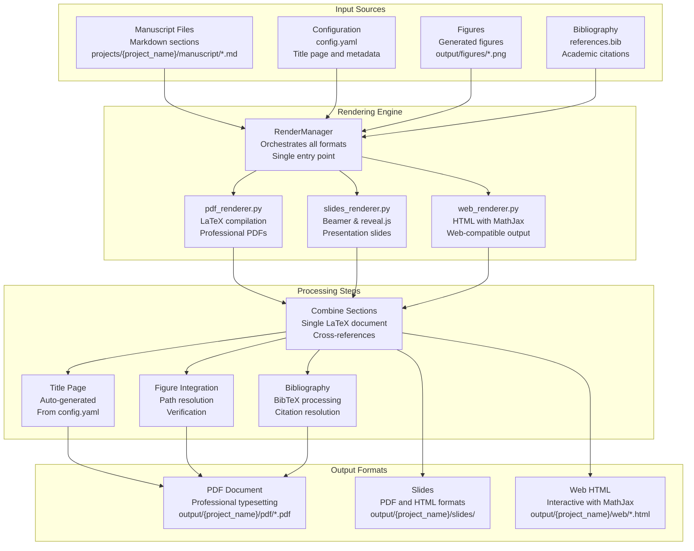
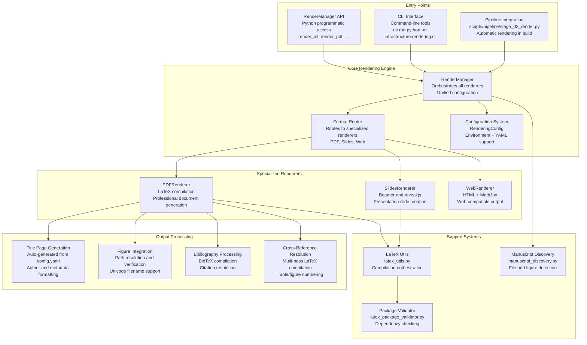
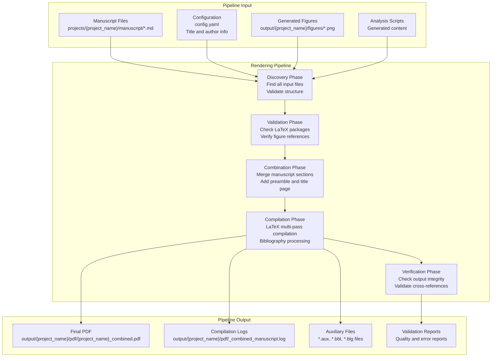

# Rendering Module - Quick Reference

Multi-format output generation for research manuscripts.

## Maintaining rendering internals

The public renderers retain their existing entry points. Slide composition is
partitioned into semantic blocks, figure handling, table structure, cell metrics,
column constraints, and whole-row excerpt composition. Beamer preparation lives
in `_slides_beamer.py`; the renderer owns subprocess execution and derivative
cleanup. Web assets, link validation, and atomic writes have separate owners.
See [the internal responsibility map](AGENTS.md#internal-rendering-responsibilities).

HTML rewrites retain the page's permissions and skip unchanged content. Shared
confined writes protect HTML and rewritten Beamer TeX from temporary-file
symlink redirection. Unsafe empty-path URI schemes are rejected like other
unsupported links.

## Features


```mermaid
graph TD
    subgraph Input["Input Sources"]
        MANUSCRIPT["Manuscript Files<br/>Markdown sections<br/>projects/{project_name}/manuscript/*.md"]
        CONFIG["Configuration<br/>config.yaml<br/>Title page and metadata"]
        FIGURES["Figures<br/>Generated figures<br/>output/figures/*.png"]
        BIBLIOGRAPHY[Bibliography<br/>references.bib<br/>Academic citations]
    end

    subgraph Rendering["Rendering Engine"]
        MANAGER[RenderManager<br/>Orchestrates all formats<br/>Single entry point]
        PDF[pdf_renderer.py<br/>LaTeX compilation<br/>Professional PDFs]
        SLIDES[slides_renderer.py<br/>Beamer & reveal.js<br/>Presentation slides]
        WEB[web_renderer.py<br/>HTML with MathJax<br/>Web-compatible output]
    end

    subgraph Processing["Processing Steps"]
        COMBINE[Combine Sections<br/>Single LaTeX document<br/>Cross-references]
        TITLE[Title Page<br/>Auto-generated<br/>From config.yaml]
        FIGURES_PROC[Figure Integration<br/>Path resolution<br/>Verification]
        BIB_PROC[Bibliography<br/>BibTeX processing<br/>Citation resolution]
    end

    subgraph Output["Output Formats"]
        PDF_OUT["PDF Document<br/>Professional typesetting<br/>output/{project_name}/pdf/*.pdf"]
        SLIDES_OUT["Slides<br/>PDF and HTML formats<br/>output/{project_name}/slides/"]
        WEB_OUT["Web HTML<br/>Interactive with MathJax<br/>output/{project_name}/web/*.html"]
    end

    MANUSCRIPT --> MANAGER
    CONFIG --> MANAGER
    FIGURES --> MANAGER
    BIBLIOGRAPHY --> MANAGER

    MANAGER --> PDF
    MANAGER --> SLIDES
    MANAGER --> WEB

    PDF --> COMBINE
    SLIDES --> COMBINE
    WEB --> COMBINE

    COMBINE --> TITLE
    COMBINE --> FIGURES_PROC
    COMBINE --> BIB_PROC

    TITLE --> PDF_OUT
    FIGURES_PROC --> PDF_OUT
    BIB_PROC --> PDF_OUT
    COMBINE --> SLIDES_OUT
    COMBINE --> WEB_OUT

    class Input input
    class Rendering rendering
    class Processing processing
    class Output output
```

- **Consolidated Pipeline**: Single entry point for all formats.
- **Multiple Outputs**: PDF, Slides (Beamer/HTML), Web.
- **Title Page Generation**: Automatic title page from `config.yaml`.
- **Figure Integration**: Automatic figure path resolution and verification.
- **Quality Control**: Automated compilation checks and logging.
- **Package Validation**: Pre-flight checks for LaTeX packages.

## LaTeX Package Requirements

### BasicTeX (Minimal Installation)

This rendering system supports **BasicTeX**, a minimal TeX distribution (~100 MB instead of full MacTeX's ~4 GB).

**Required packages** (some require installation):

```bash
sudo tlmgr update --self
sudo tlmgr install multirow cleveref doi newunicodechar
```

**Already included in BasicTeX**:

- Core packages: `amsmath`, `graphicx`, `hyperref`, `natbib`
- Table enhancement: `bm` (part of `tools`), `subcaption` (part of `caption`)

**Pre-flight validation**:

```bash
# Validate packages before rendering
uv run python -m infrastructure.rendering.latex_package_validator

# Or run as part of pipeline (automatic)
uv run python scripts/pipeline/stage_03_render.py
```

**Common issues**:

- **"File *.sty not found"**: Install missing package via `tlmgr`
- **No kpsewhich found**: Install BasicTeX or MacTeX
- **Permission denied**: Use `sudo` for tlmgr commands

### Full MacTeX (Installation)

For a installation with all packages, install **MacTeX**:

```bash
brew install --cask mactex
```

MacTeX includes all packages and tools but requires ~4 GB disk space.

## Quick Start

### Render Combined PDF

```python
from infrastructure.rendering import RenderManager
from pathlib import Path

manager = RenderManager()
manager.render_combined_pdf(
    [Path("01_abstract.md"), Path("02_intro.md"), ...],
    manuscript_dir=Path("projects/{project_name}/manuscript/")
)
```

### Configure Title Page

Edit `projects/{project_name}/manuscript/config.yaml`:

```yaml
paper:
  title: "Your Research Title"
  subtitle: "Optional Subtitle"
  cover:
    image: "figures/cover.png"
    alt: "Concise description of the cover's meaningful visual content."

authors:
  - name: "Dr. Your Name"
    email: "your@email.edu"
    affiliation: "Your Institution"
    corresponding: true

publication:
  doi: "10.5281/zenodo.XXXXXXX"  # DOI goes here, NOT in 'paper' section
  doi_status: "registered"
  journal: "Zenodo Preprints"
  year: "2026"

metadata:
  language: "en"
  tagged_pdf: false  # opt in only with a compatible LuaLaTeX tagging stack

# CAUTION: If you create a 'projects/{project_name}/manuscript/preamble.md' with \date{}, \title{}, or \author{} commands,
# they will OVERRIDE these configuration values in the final PDF.
```

`paper.cover.alt` describes a paper cover; book projects use the parallel
`book.cover.alt` field. When `metadata.tagged_pdf: true`, the combined-PDF
renderer selects LuaLaTeX, writes that text into the cover image's PDF
structure element, and fails before replacing an existing PDF if the selected
configured cover has missing, blank, or non-string alt text. The option
requests PDF 2.0 tagging and catalog language without emitting a PDF/UA
conformance identifier. Tagged structure does not certify PDF/UA conformance.
Combined EPUB rendering consumes the same selected cover and alt pair. A cover
with missing or blank alt fails before Pandoc runs; after rendering, the EPUB
post-processor names Pandoc's SVG cover graphic from the configured alt, hides
its nested bitmap from duplicate announcement, and validates every packaged
XHTML/SVG image reference and accessibility name before retaining the output.
Pandoc receives a stable placeholder instead of generating a random package
UUID. After cover processing, the renderer derives a UUIDv5 from the canonical
EPUB member names and uncompressed bytes, with only the OPF and NCX identifier
values normalized back to that placeholder. The same finalized value is written
to the OPF package identifier and NCX navigation UID. This effective-package
binding includes actual output changes produced by bibliography data, body
media, filters, Pandoc metadata, or tool-version behavior without having to
interpret their command-line inputs. Identifier overrides are rejected.

A valid caller `SOURCE_DATE_EPOCH` controls Pandoc's `dcterms:modified` value,
which is package content and therefore participates in the UUID; absent or
invalid values use the fixed ZIP-safe epoch `1980-01-01T00:00:00Z`. Ambient Git
state and the wall clock are not consulted. ZIP order and metadata are excluded
from identity, then an atomic final rewrite normalizes member timestamps while
preserving order, compression, comments, permissions, and the required first,
uncompressed `mimetype` member. Pandoc writes a fresh sibling temporary target
with an authoritative final output option, so a zero-exit nonwriting process or
caller output redirect cannot cause a stale destination to be accepted.

### DOI and ORCID status

Publication identifiers are rendered from configuration rather than embedded
in a title-page template. A project may leave an identifier unset while
keeping its state explicit:

```yaml
authors:
  - name: "Author Name"
    orcid: null
    orcid_status: "not-provided"
publication:
  doi: null
  doi_status: "pending"
```

Use a DOI only after the issuing registry supplies it, and use an ORCID only
after the author confirms it. The title-page helpers preserve the value-plus-
status distinction across paper and book covers; they do not fabricate a
placeholder or convert `null` into the string `None`. Projects that need
fail-closed metadata should validate the configuration before calling the
renderer and include its normalized digest in their own artifact receipt.
For a source-bound candidate whose date is not part of the metadata contract,
set `rendering.include_date: false`; this suppresses the renderer's otherwise
automatic `\today` value and keeps repeated renders deterministic.

### Cross-format formalism numbering

For equations and other labelled formalisms, pass `pandoc-crossref` as a
filter or configure the renderer's cross-reference path. The HTML, PDF, DOCX,
EPUB, and Beamer helpers share the same labelled source; the renderer should
fail closed when the filter is required but unavailable rather than silently
emitting an unnumbered export. Beamer rendering includes the filter when it is
available and retains a diagnostic warning when a caller intentionally uses a
fallback environment.

### Web link post-processing

The HTML renderer performs a final, source-aware anchor pass after Pandoc and
the accessibility/figure post-processors have run. Renderer-owned pages and
fragments remain local to `output/web`; links from manuscript sections to
another rendered section are mapped to that page when it is available. Other
local links are resolved against the authored manuscript directory and, when
they target public repository content, become canonical GitHub `main` links.
This keeps deployed HTML from retaining checkout-relative links such as
`../../../../docs/...` while preserving external `https:`, `mailto:`, and
`tel:` links. Executable or malformed URI schemes, missing targets, path
escapes, and links into private `projects/`, `fonds/`, `rules/`, or `tools/`
trees fail closed. Combined public-checkout renders also scan renderer-owned
pages for remaining local anchors that leave the deployed web directory.

Renders from isolated or private paths skip the public-repository rewrite, so
private source paths are never projected into the public repository URL. The
source-aware behavior is covered by
`tests/infra_tests/rendering/test_web_renderer.py` and exercised by the real
Pandoc render path.

### Add Bibliography and Citations

Place bibliography in `projects/{project_name}/manuscript/references.bib`:

```bibtex
@article{author2024,
  title={Article Title},
  author={Author, First},
  journal={Journal Name},
  year={2024}
}
```

Cite in Markdown using portable Pandoc syntax:

```markdown
According to recent work [@author2024], we demonstrate...
```

**Note**: Bibliographies are processed automatically. A project may split
sources across multiple top-level `manuscript/*.bib` files; combined PDF,
HTML, Beamer and Reveal.js slides, DOCX, EPUB, and ebook-stage exports all
consume the same filename-sorted union. Section-level slide decks resolve
inline citations but suppress a repeated full references block. Citation keys
must be unique case-insensitively within and across those files. Rendering
leaves the source bibliographies unchanged.

### Add Figures

Place figures in `output/{project_name}/figures/` and reference in markdown:

```latex
\begin{figure}[h]
\centering
\includegraphics[width=0.8\textwidth]{../output/figures/your_figure.png}
\caption{Figure caption}
\label{fig:your_figure}
\end{figure}

Reference in text: Figure \ref{fig:your_figure}
```

**Important**: The rendering system automatically ensures `\usepackage{graphicx}` is included in the LaTeX preamble. This package is required for `\includegraphics` commands. If not in your custom preamble (`projects/{project_name}/manuscript/preamble.md`), it will be added automatically during compilation.

For accessible publication figures, generate
`output/figures/figure_registry.json` with an exact `label`, `filename` (or
`path`), and a non-empty top-level `alt` or `metadata.alt_text`. HTML uses that
source-owned description only when the rendered label and path agree; it does
not manufacture image alternatives from visible captions. A present registry
record with blank alt text or a label/path mismatch blocks rendering. A
non-empty authored Markdown alt remains valid for a genuinely unregistered
figure. Tagged combined PDFs consume the same registry descriptions for body
images only when `metadata.tagged_pdf: true`; ordinary untagged PDFs are
unchanged, and successful tagged rendering is not PDF/UA certification.

**Note**: Figure paths are automatically corrected during rendering. The system handles:

- Path normalization for various formats (`../output/figures/`, `output/figures/`, etc.)
- Unicode characters in filenames
- Missing figure warnings (compilation continues gracefully, but logs the issue)

## Common Tasks

### Render to All Formats

```bash
uv run python -m infrastructure.rendering.cli all manuscript.tex
```

### Render PDF Only

```bash
uv run python -m infrastructure.rendering.cli pdf manuscript.tex
```

### Generate Slides

```bash
uv run python -m infrastructure.rendering.cli slides presentation.md --format beamer
uv run python -m infrastructure.rendering.cli slides presentation.md --format revealjs
```

### Opt in to accessible presentation composition

The default `archive` profile preserves the historical Beamer and Reveal.js
output. Projects that need a projection-scale, accessibility-enhanced slide
surface can opt in through their source-owned `manuscript/config.yaml`:

```yaml
render:
  formats:
    slides: true
  slides:
    profile: accessible
    max_prose_words: 80
    max_table_rows: 8
    min_figure_area_percent: 70
    title_font_pt: 28
    body_font_pt: 20
    figure_label_font_pt: 16
    reader_href: ../web/index.html
```

These values are safety bounds. A project may choose fewer prose words or table
rows, a larger figure allocation, or larger fonts; it cannot weaken the
80-word/eight-row/70-percent/28-20-16 contract. `SLIDES_PROFILE` and the
corresponding `SLIDES_*` environment variables override YAML for an isolated
render without changing project metadata.

Accessible mode first parses Markdown into Pandoc JSON, then creates frames at
semantic block boundaries. Paragraphs are grouped only while the frame remains
within the prose budget. Its Beamer derivative uses an explicit 16:9 projection
canvas so the native typography floors are evaluated against stable widescreen
geometry; the default archive profile retains Beamer's historical canvas.
When a long section spans several frames, continuation frames use a bounded
word-boundary title with the complete section title retained as their accessible
name; the first frame always preserves the full visible title.
Figures, equations, code blocks, evidence blocks, and
bounded table excerpts each receive their own frame. The composer never splits
inside an equation, list, code block, table, or figure. An indivisible block
that exceeds its declared budget fails with a `slides.density.*` diagnostic;
an indivisible list is reported specifically as
`slides.density.indivisible-list`. Table excerpts retain a contiguous prefix of
at most eight complete body rows after title, header, cell wrapping, and rules
are priced against the same geometry. Ordinary tokens must fit one physical
column at the 20-point floor; their minima conservatively weight wide glyphs,
and explicit hyphens are recognized as TeX break points. Long inline code is
priced as character-breakable only when its source characters serialize to the
same simple, brace-free `texttt` body that the downstream `breaktt` pass
rewrites; braced TeX literal encodings remain indivisible. Contiguous colspan
constraints are solved jointly, so overlapping spans can share width in their
common columns. If the resulting
per-column minima exceed the frame width, composition stops before LaTeX with
`slides.density.indivisible-table-width`, including required and available
width units plus the offending token and its exact column or span. Citeproc is
run for the geometry parse, so author-year expansions, citation prefixes, and
suffixes are priced from the project bibliography rather than a fixed
placeholder; cross-reference citations remain available to their normal
filters. Hard line breaks, physical code-block lines, nested list indentation
and item structure, definition-list entries, and quote paragraphs are preserved
in the vertical estimate. Unknown layout-affecting math commands, projected
footnotes, and unmodelled rich table-cell blocks fail closed with stable
diagnostics instead of being assigned optimistic dimensions. Persistent frame navigation links
the full table and caption in the canonical HTML companion. If even one complete
body row cannot fit at the 20-point floor, the paired render stops with
`slides.density.indivisible-table` and exact geometry; it never publishes an
implementation diagnostic as audience content, clips a row, or shrinks type.
An accidental title-only frame fails with `slides.structure.title-only`.
Explicit level-one headings and headings marked `section-divider` remain valid
section dividers. Accessible Beamer also rejects and removes a compiled
derivative when its LaTeX log reports an overfull frame, using the stable
`slides.density.beamer-overflow` diagnostic.

The same proportional token model prices complete prose blocks and titles,
including section dividers and continuation-title allocation; the 80-word
policy remains an absolute ceiling rather than an assertion that every set of
80 wide words fits. Citeproc-resolved mixed citations replace each unresolved
cross-reference placeholder once, so an author-year span and its `eq:`/`fig:`
peer are not duplicated in geometry. Supported `aligned` and `substack` math
also contributes calibrated row-height demand; malformed environments or rows
beyond the validated frame geometry fail before either derivative is created.
Optional physical spacing after a math row break is deliberately unsupported.
Raw TeX is admitted only through the declared theorem-like block subset and
simple reference inlines; arbitrary control sequences in headings, prose, and
tables fail before rendering. Loose-list paragraphs and every block inside one
definition entry are priced separately. When projection must excerpt a table,
its complete-table footer is removed before the row budget is recomputed; the
canonical reader retains the untouched table and footer.
For captioned source listings, the projection copy retains an empty caption to
preserve pandoc-crossref's counter and label while omitting the full prose
caption from the frame. The unmodified source still supplies the complete
caption to canonical HTML. Width diagnostics prefer an individually impossible
physical column over an unrelated active colspan; otherwise they retain the
exact span start, end, token, and minimum that made the joint constraints
infeasible.

When source code can be rewritten into the accessible `breaktt` form, the
renderer verifies that `seqsplit.sty` is available before relying on
character-level wrapping. A missing package is
`slides.capability.seqsplit-required`; the derivative pair is not emitted.
Archive mode keeps its historical identity fallback. Accessible Beamer assigns
the declared body typography to nested itemize/enumerate levels, descriptions,
quotes, captioned listings, and algorithm stand-ins so those paths cannot
silently reset below the 20-point floor.
The shared source/LaTeX predicate also recognizes Pandoc's brace-free `\ `
control-space serialization. Archive and accessible output therefore retain
the historical safe wrapping behavior for long space-bearing monospace spans,
while apostrophes, brackets, and other braced encodings remain fail-closed.

The canonical `RenderManager.render_all()` and Stage 03 path treat accessible
slides as an exact pair: every eligible source produces both
`*_slides.pdf` and `*_slides.html` from one composed Pandoc AST. If either
renderer fails, both public derivatives are removed. Stage 03 verification and
the Stage 04/05 enabled-output gates require the complete pair in accessible
mode. The default archive profile retains its historical required-Beamer and
optional-Reveal behavior.

The two outputs have deliberately different accessibility status:

| Surface | Reader contract | Boundary |
| --- | --- | --- |
| Reveal.js | Semantic headings and named slide regions, keyboard navigation, visible focus, high contrast, responsive tables, reduced-motion support, registry alt text, optional figure long descriptions, and links to the canonical manuscript | Accessibility-enhanced presentation surface; no WCAG conformance claim without a separate audit |
| Beamer PDF | The same semantic frame plan, typography floors, bounded table excerpts, figure allocation, and a visible link to the canonical HTML reader | Explicitly untagged presentation derivative; no PDF/UA or screen-reader-accessibility claim |
| Manuscript HTML | Complete captions, long descriptions, exact-value tables, and the full source reading order | Canonical accessibility-enhanced reader surface |

For programmatic use, pass the same policy through `RenderingConfig`:

```python
from infrastructure.rendering import RenderManager, RenderingConfig

config = RenderingConfig(
    slides_profile="accessible",
    slides_reader_href="../web/index.html",
)
manager = RenderManager(config)
pdf_path, reveal_path = manager.render_accessible_slide_pair(Path("manuscript/01_intro.md"))
```

When a figure registry record includes `long_description`, rendered HTML places
one labelled disclosure after the caption and associates it with the image via
`aria-details`. The concise `alt_text`, visible caption, and long
description remain separate source-owned fields; the renderer does not derive
one from another. Projectors display a short link where a complete caption or
table would exceed the slide contract, while the linked manuscript retains the
complete material.

Figure-registry schema 1.2 may also declare an `exact_value_fallback` per
figure and one top-level `exact_value_artifact` inventory. The renderer rejects
unsafe paths, malformed or mismatched identifiers, and then adds a contextual
link to the source-generated Markdown table. This makes the numerical fallback
discoverable without copying values into rendering code. In manuscript HTML,
wide tables are wrapped in labelled, keyboard-focusable scroll regions; code
and displayed mathematics retain their own scroll regions. The page body uses
no horizontal scroll at reflow zoom, and every full-size figure link is named
from its numbered caption or concise alternative.

## Supported Formats

| Format | Command | Output |
|--------|---------|--------|
| PDF | `render_pdf()` | Professional PDF document |
| Beamer Slides | `render_slides(..., format="beamer")` | PDF presentation slides |
| Reveal.js | `render_slides(..., format="revealjs")` | HTML presentation slides |
| HTML | `render_web()` | Web-ready HTML with MathJax |
| DOCX | `render_docx(combined_md, output_path)` | Microsoft Word document (via pandoc) |
| EPUB | `render_epub(combined_md, output_path)` | E-reader EPUB (via pandoc) |

## Documentation

## Architecture Deep Dive


```mermaid
graph TD
    subgraph EntryPoints["Entry Points"]
        MANAGER_API["RenderManager API<br/>Python programmatic access<br/>render_all, render_pdf, …"]
        CLI_INTERFACE[CLI Interface<br/>Command-line tools<br/>uv run python -m infrastructure.rendering.cli]
        PIPELINE_INTEGRATION[Pipeline Integration<br/>scripts/pipeline/stage_03_render.py<br/>Automatic rendering in build]
    end

    subgraph CoreEngine["Core Rendering Engine"]
        RENDER_MANAGER[RenderManager<br/>Orchestrates all renderers<br/>Unified configuration]
        FORMAT_ROUTER[Format Router<br/>Routes to specialized renderers<br/>PDF, Slides, Web]
        CONFIG_SYSTEM[Configuration System<br/>RenderingConfig<br/>Environment + YAML support]
    end

    subgraph SpecializedRenderers["Specialized Renderers"]
        PDF_RENDERER[PDFRenderer<br/>LaTeX compilation<br/>Professional document generation]
        SLIDES_RENDERER["SlidesRenderer<br/>Beamer and reveal.js<br/>Presentation slide creation"]
        WEB_RENDERER[WebRenderer<br/>HTML + MathJax<br/>Web-compatible output]
    end

    subgraph SupportSystems["Support Systems"]
        LATEX_UTILS[LaTeX Utils<br/>latex_utils.py<br/>Compilation orchestration]
        PACKAGE_VALIDATOR[Package Validator<br/>latex_package_validator.py<br/>Dependency checking]
        MANUSCRIPT_DISCOVERY[Manuscript Discovery<br/>manuscript_discovery.py<br/>File and figure detection]
    end

    subgraph OutputProcessing["Output Processing"]
        TITLE_PAGE_GEN[Title Page Generation<br/>Auto-generated from config.yaml<br/>Author and metadata formatting]
        FIGURE_INTEGRATION[Figure Integration<br/>Path resolution and verification<br/>Unicode filename support]
        BIBLIOGRAPHY_PROCESSING[Bibliography Processing<br/>BibTeX compilation<br/>Citation resolution]
        CROSS_REF_RESOLUTION[Cross-Reference Resolution<br/>Multi-pass LaTeX compilation<br/>Table/figure numbering]
    end

    MANAGER_API --> RENDER_MANAGER
    CLI_INTERFACE --> RENDER_MANAGER
    PIPELINE_INTEGRATION --> RENDER_MANAGER

    RENDER_MANAGER --> FORMAT_ROUTER
    FORMAT_ROUTER --> PDF_RENDERER
    FORMAT_ROUTER --> SLIDES_RENDERER
    FORMAT_ROUTER --> WEB_RENDERER

    RENDER_MANAGER --> CONFIG_SYSTEM

    PDF_RENDERER --> LATEX_UTILS
    SLIDES_RENDERER --> LATEX_UTILS

    LATEX_UTILS --> PACKAGE_VALIDATOR
    RENDER_MANAGER --> MANUSCRIPT_DISCOVERY

    PDF_RENDERER --> TITLE_PAGE_GEN
    PDF_RENDERER --> FIGURE_INTEGRATION
    PDF_RENDERER --> BIBLIOGRAPHY_PROCESSING
    PDF_RENDERER --> CROSS_REF_RESOLUTION

    class EntryPoints entry
    class CoreEngine core
    class SpecializedRenderers renderers
    class SupportSystems support
    class OutputProcessing processing
```

## Module Organization

| Module | Purpose | Key Classes/Functions | Dependencies |
|--------|---------|----------------------|-------------|
| **core.py** | Main rendering orchestration | `RenderManager` - Unified API for all formats | All other modules |
| **pdf_renderer.py** | PDF document generation | `PDFRenderer.render_combined_pdf()` - LaTeX compilation | latex_utils, manuscript_discovery |
| **slides_renderer.py** | Presentation slides | `SlidesRenderer` - Beamer and Reveal.js support; archive mode chooses an adaptive `--slide-level` in the 2–4 range and applies `_beamer_allowframebreaks.lua`, while accessible mode consumes the semantic Pandoc AST from `_slides_accessibility.py` | latex_utils, Pandoc, semantic slide composer |
| **_slides_accessibility.py** | Accessible presentation composition facade | Public policy, frame, and diagnostic exports plus semantic frame composition | `_slides_accessibility_*`, shared HTML accessibility postprocessor |
| **_slides_accessibility_text_geometry.py** | Shared projected-text geometry | Citeproc-resolved visible text, physical-token widths, hard-break/container lines, and conservative math geometry | Pandoc JSON AST, `_slides_accessibility_contracts.py` |
| **_slides_accessibility_tables.py** | Accessible table composition | Joint column/span minima, supported rich-cell geometry, bounded whole-row excerpts, and stable fail-closed diagnostics | `_slides_accessibility_text_geometry.py`, Pandoc JSON AST |
| **_slides_codelisting.py** | Captioned slide listings | Replaces pandoc-crossref's generated listing float after Pandoc preamble assembly so numbered code captions compile inside Beamer frames | slides_renderer |
| **_slides_framebreaks.py** | Dense slide splitting | Isolates unbreakable listing, figure, table, and list environments while splitting long top-level frame content safely; explicit `\begingroup`/`\endgroup` regions remain in one continuation frame | slides_renderer |
| **web_renderer.py** | Web HTML output | `WebRenderer` - MathJax integration; markdown preprocess in `_web_markdown_preprocess.py`, HTML postprocess in `_web_postprocess.py` | pandoc |
| **latex_utils.py** | LaTeX compilation utilities | `compile_latex()` - Multi-pass compilation | LaTeX distribution |
| **latex_package_validator.py** | Package dependency checking | `validate_packages()` - Pre-flight validation | kpsewhich |
| **manuscript_discovery.py** | Content discovery | `discover_manuscript_files()` - File enumeration | pathlib |
| **manuscript_injection.py** | Variable substitution | `substitute_manuscript_text()`, `write_resolved_manuscript_tree()` - `{{TOKEN}}` hydration shared by all projects | pathlib, re |
| **config.py** | Configuration management | `RenderingConfig` - Settings management | environment variables |
| **cli.py** | Command-line interface | CLI commands for all renderers | All renderer modules |

## Usage Guide

### Advanced PDF Rendering

```python
from infrastructure.rendering import RenderManager, RenderingConfig
from pathlib import Path

# Configure rendering with custom settings
config = RenderingConfig(
    latex_compiler="xelatex",
    max_compilation_passes=4,
    validate_packages=True
)

manager = RenderManager(config)

# Render with error handling
try:
    pdf_path = manager.render_pdf(Path("projects/{project_name}/manuscript/main.tex"))
    print(f"PDF generated successfully: {pdf_path}")

    # Verify the output
    if pdf_path.exists():
        size_mb = pdf_path.stat().st_size / (1024 * 1024)
        print(f"PDF size: {size_mb:.2f} MB")
except Exception as e:
    print(f"Rendering failed: {e}")
    # Check logs for detailed error information
```

### Multi-Format Rendering Pipeline

```python
# Render to all formats in one call
outputs = manager.render_all(Path("projects/{project_name}/manuscript/complete_manuscript.md"))

print("Generated outputs:")
for format_name, output_path in outputs.items():
    print(f"  {format_name}: {output_path}")
    print(f"    Size: {output_path.stat().st_size} bytes")
```

### Slides Generation with Different Formats

```python
# Generate PDF slides for conferences
pdf_slides = manager.render_slides(
    Path("projects/{project_name}/manuscript/presentation.md"),
    format="beamer"
)

# Generate interactive HTML slides for web
html_slides = manager.render_slides(
    Path("projects/{project_name}/manuscript/presentation.md"),
    format="revealjs"
)
```

### Custom LaTeX Compilation

```python
from infrastructure.rendering.latex_utils import compile_latex

# Manual LaTeX compilation with custom settings
success, pdf_path = compile_latex(
    tex_file=Path("output/latex/manuscript.tex"),
    output_dir=Path("output/pdf"),
    compiler="xelatex",
    max_passes=3
)

if success:
    print(f"Compilation successful: {pdf_path}")
else:
    print("Compilation failed - check logs")
```

## LaTeX Package Management

### Package Validation

```python
from infrastructure.rendering.latex_package_validator import validate_preamble_packages

# Validate all packages required by manuscript
report = validate_preamble_packages(strict=True)

print(f"Checked {len(report.checked_packages)} packages")
print(f"Available: {len(report.available_packages)}")
print(f"Missing: {len(report.missing_packages)}")

if report.missing_packages:
    print("Missing packages:")
    for pkg in report.missing_packages:
        print(f"  - {pkg}")
    print("Install with:")
    print(report.install_commands())
```

### Individual Package Checking

```python
from infrastructure.rendering.latex_package_validator import check_latex_package

# Check specific package availability
status = check_latex_package("multirow")
if status.available:
    print(f"Package {status.package} is available (version: {status.version})")
else:
    print(f"Package {status.package} is missing: {status.error}")
```

## Manuscript Discovery and Validation

### Automatic Content Discovery

```python
from infrastructure.rendering.manuscript_discovery import discover_manuscript_files, verify_figures_exist

# Find all manuscript files
manuscript_files = discover_manuscript_files(Path("manuscript"))
print(f"Found {len(manuscript_files)} manuscript files")

# Verify all referenced figures exist
figure_report = verify_figures_exist(Path("."), Path("manuscript"))

print(f"Figures verified: {figure_report['total_verified']}/{figure_report['total_referenced']}")
if figure_report['missing_figures']:
    print("Missing figures:")
    for missing in figure_report['missing_figures']:
        print(f"  - {missing}")
```

## Configuration Management

### Advanced Configuration

```python
from infrastructure.rendering.config import RenderingConfig
import os

# Environment-based configuration
config = RenderingConfig(
    latex_compiler=os.getenv("LATEX_COMPILER", "xelatex"),
    pandoc_path=os.getenv("PANDOC_PATH", "pandoc"),
    output_dir=Path(os.getenv("RENDER_OUTPUT_DIR", "output")),
    max_compilation_passes=int(os.getenv("MAX_LATEX_PASSES", "4")),
    validate_packages=os.getenv("VALIDATE_PACKAGES", "true").lower() == "true"
)

# Use configuration with manager
manager = RenderManager(config)
```

## CLI Operations

### Rendering Workflow

```bash
# Render to all formats
uv run python -m infrastructure.rendering.cli all manuscript.tex

# Render specific formats
uv run python -m infrastructure.rendering.cli pdf manuscript.tex
uv run python -m infrastructure.rendering.cli slides presentation.md --format beamer
uv run python -m infrastructure.rendering.cli web manuscript.md

# With custom output directory
OUTPUT_DIR=/custom/path uv run python -m infrastructure.rendering.cli pdf manuscript.tex
```

### Package Validation CLI

```bash
# Validate LaTeX packages before rendering
uv run python -m infrastructure.rendering.latex_package_validator

# This will show:
# - Which packages are available
# - Which packages are missing
# - Installation commands for missing packages
```

## Integration with Build Pipeline

### Automatic Rendering in Scripts

The rendering module is deeply integrated with the build pipeline:

```bash
# scripts/pipeline/stage_03_render.py automatically:
# 1. Discovers manuscript files
# 2. Validates LaTeX packages
# 3. Generates title page from config.yaml
# 4. Compiles PDF with bibliography processing
# 5. Handles figure path resolution
# 6. Performs cross-reference resolution

uv run python scripts/pipeline/stage_03_render.py --project {project_name}
```

### Pipeline Data Flow


```mermaid
flowchart TD
    subgraph Input["Pipeline Input"]
        MANUSCRIPT["Manuscript Files<br/>projects/{project_name}/manuscript/*.md"]
        CONFIG[Configuration<br/>config.yaml<br/>Title and author info]
        FIGURES["Generated Figures<br/>output/{project_name}/figures/*.png"]
        SCRIPTS[Analysis Scripts<br/>Generated content]
    end

    subgraph Processing["Rendering Pipeline"]
        DISCOVERY[Discovery Phase<br/>Find all input files<br/>Validate structure]
        VALIDATION[Validation Phase<br/>Check LaTeX packages<br/>Verify figure references]
        COMBINATION[Combination Phase<br/>Merge manuscript sections<br/>Add preamble and title page]
        COMPILATION[Compilation Phase<br/>LaTeX multi-pass compilation<br/>Bibliography processing]
        VERIFICATION[Verification Phase<br/>Check output integrity<br/>Validate cross-references]
    end

    subgraph Output["Pipeline Output"]
        PDF["Final PDF<br/>output/{project_name}/pdf/{project_name}_combined.pdf"]
        LOGS["Compilation Logs<br/>output/{project_name}/pdf/_combined_manuscript.log"]
        AUX_FILES["Auxiliary Files<br/>*.aux, *.bbl, *.blg files"]
        REPORTS[Validation Reports<br/>Quality and error reports]
    end

    MANUSCRIPT --> DISCOVERY
    CONFIG --> DISCOVERY
    FIGURES --> DISCOVERY
    SCRIPTS --> DISCOVERY

    DISCOVERY --> VALIDATION
    VALIDATION --> COMBINATION
    COMBINATION --> COMPILATION
    COMPILATION --> VERIFICATION

    COMPILATION --> PDF
    COMPILATION --> LOGS
    COMPILATION --> AUX_FILES
    VERIFICATION --> REPORTS

    class Input input
    class Processing processing
    class Output output
```

## Error Handling and Recovery

### Error Management

```python
from infrastructure.rendering import RenderManager
from infrastructure.core import TemplateError

manager = RenderManager()

try:
    pdf_path = manager.render_pdf(Path("manuscript.tex"))
except TemplateError as e:
    print(f"Rendering failed: {e}")
    if e.suggestions:
        print("Suggestions:")
        for suggestion in e.suggestions:
            print(f"  - {suggestion}")
    if e.recovery_commands:
        print("Recovery commands:")
        for cmd in e.recovery_commands:
            print(f"  $ {cmd}")
except Exception as e:
    print(f"Unexpected error: {e}")
    # Log for debugging
```

### Recovery Strategies

1. **Package Installation**: Automatic detection and installation commands for missing LaTeX packages
2. **Figure Path Correction**: Automatic normalization of figure paths across different formats
3. **Bibliography Processing**: Multiple compilation passes to resolve citations
4. **Encoding Handling**: Unicode support for international characters in filenames

## Performance Optimization

### Compilation Optimization

- **Incremental Compilation**: Only recompile changed sections when possible
- **Parallel Processing**: Render different formats simultaneously
- **Caching**: Cache LaTeX package validation results
- **Memory Management**: Stream processing for large manuscripts

### Resource Monitoring

```python
from infrastructure.core import monitor_performance

with monitor_performance("PDF rendering") as monitor:
    pdf_path = manager.render_pdf(source_path)

# Access performance metrics
print(f"Rendering time: {monitor.duration:.2f}s")
print(f"Peak memory: {monitor.resource_usage.peak_memory_mb:.1f} MB")
```

## Testing Strategy

```bash
# Run all rendering tests
uv run pytest tests/infra_tests/rendering/ -v

# Test specific components
uv run pytest tests/infra_tests/rendering/test_pdf_renderer_combined.py -v
uv run pytest tests/infra_tests/rendering/test_latex_package_validator.py -v

# Test with different LaTeX configurations
uv run pytest tests/infra_tests/rendering/test_pdf_renderer_fixes.py -v

# Integration tests
uv run pytest tests/integration/test_rendering_pipeline.py -v

# Performance benchmarking
uv run pytest tests/infra_tests/rendering/test_performance.py -v

# Coverage analysis
uv run pytest tests/infra_tests/rendering/ --cov=infrastructure.rendering --cov-report=html
```

## Troubleshooting Guide

### LaTeX Compilation Issues

**Problem**: "File not found" errors for packages

**Solutions**:

```bash
# Check which packages are available
uv run python -m infrastructure.rendering.latex_package_validator

# Install missing packages
sudo tlmgr install multirow cleveref doi newunicodechar

# Verify installation
kpsewhich multirow.sty
```

**Problem**: Compilation hangs or takes too long

**Solutions**:

- Reduce `max_compilation_passes` in configuration
- Check for infinite loops in cross-references
- Validate manuscript structure before compilation
- Use `timeout` command for long-running compilations

### Figure Integration Problems

**Problem**: Figures not appearing despite existing files

**Debug Steps**:

```bash
# Check figure discovery
uv run python -c "
from infrastructure.rendering.manuscript_discovery import verify_figures_exist
report = verify_figures_exist(Path('.'), Path('projects/{project_name}/manuscript'))
print('Figure verification:', report)
"

# Check path resolution in generated LaTeX
grep "includegraphics" output/{project_name}/pdf/_combined_manuscript.tex
```

**Problem**: Unicode filenames cause issues

**Solutions**:

- Ensure proper UTF-8 encoding in figure filenames
- Use NFC normalization for composed characters
- Test with ASCII-only names first

### Bibliography Problems

**Problem**: Citations appear as `[?]` in output

**Debug Steps**:

```bash
# Check bibliography file
ls -la projects/{project_name}/manuscript/references.bib
head -10 projects/{project_name}/manuscript/references.bib

# Check citation keys in manuscript
grep -r "cite{" projects/{project_name}/manuscript/
grep -r "@" projects/{project_name}/manuscript/references.bib

# Check BibTeX log
ls -la output/{project_name}/pdf/*.blg
tail -20 output/{project_name}/pdf/_combined_manuscript.blg
```

### Memory and Performance Issues

**Problem**: Large manuscripts cause memory issues

**Solutions**:

- Split large manuscripts into smaller sections
- Use streaming compilation for very large documents
- Increase system memory or use swap space
- Process sections individually then combine

**Problem**: Slow compilation times

**Solutions**:

- Use SSD storage for temporary files
- Pre-load frequently used LaTeX packages
- Use parallel compilation for multiple documents
- Cache validation results between runs

## Advanced Configuration

### Environment Variables

```bash
# LaTeX configuration
export LATEX_COMPILER="xelatex"
export MAX_LATEX_PASSES="4"

# Tool paths
export PANDOC_PATH="/usr/local/bin/pandoc"
export KPATHSEA_PATH="/usr/local/texlive/2024/bin/universal-darwin"

# Output control
export RENDER_OUTPUT_DIR="/custom/output/path"
export VALIDATE_PACKAGES="true"

# Performance tuning
export LATEX_TIMEOUT="300"  # 5 minute timeout
export MAX_MEMORY="4096"    # 4GB memory limit
```

### YAML Configuration Extension

```yaml
# config.yaml rendering section
rendering:
  latex:
    compiler: "xelatex"
    passes: 4
    timeout: 300
    validate_packages: true

  output:
    directory: "output"
    clean_temp_files: true
    compress_pdf: false

  features:
    enable_figure_verification: true
    enable_bibliography_processing: true
    enable_cross_reference_resolution: true
    enable_unicode_support: true
```

## Best Practices

### Document Structure

- **Consistent Section Naming**: Use predictable section headers for automation
- **Standard File Organization**: Keep manuscripts in `projects/{project_name}/manuscript/`
- **Figure Path Conventions**: Use relative paths from manuscript directory
- **Bibliography Standards**: Follow BibTeX formatting conventions

### Performance Optimization

- **Pre-validate Packages**: Run package validation before full builds
- **Cache Results**: Reuse validation results across builds
- **Incremental Builds**: Only rebuild changed components
- **Resource Monitoring**: Track compilation resource usage

### Error Prevention

- **Validate Early**: Run validation before full compilation
- **Test Configurations**: Verify configurations work before production
- **Monitor Logs**: Check compilation logs for warnings
- **Backup Outputs**: Preserve successful outputs before re-rendering

### Maintenance

- **Update Dependencies**: Keep LaTeX distributions current
- **Monitor Package Changes**: Track LaTeX package updates
- **Test Rendering**: Regularly test full rendering pipeline
- **Document Configurations**: Maintain rendering configuration documentation

For function signatures and API documentation, see [`AGENTS.md`](AGENTS.md).

## Troubleshooting

### Citations showing as "?" in PDF

**Cause**: Bibliography not processed or citation keys don't match.

**Solutions**:

1. Verify `references.bib` file exists in `projects/{project_name}/manuscript/`
2. Check citation keys in markdown match `@` entries in `.bib` file
3. Ensure bibliography is formatted correctly:

   ```bibtex
   @article{smith2024,
     title={Title},
     author={Smith, Jane},
     year={2024}
   }
   ```

4. Run full build: `uv run python scripts/runner/execute_pipeline.py --core-only`

### Figures not appearing in PDF

**Cause**: Missing `graphicx` package, incorrect file paths, or missing figure files.

**Solutions**:

1. **Verify graphicx package is loaded** (the system should add it automatically):

   ```bash
   grep "usepackage{graphicx}" output/{project_name}/pdf/_combined_manuscript.tex
   ```

   If missing, ensure `projects/{project_name}/manuscript/preamble.md` contains `\usepackage{graphicx}` or check build logs.

2. **Generate missing figures**:

   ```bash
   uv run python scripts/pipeline/stage_02_analysis.py
   ```

3. **Verify figures are in correct location**:

   ```bash
   ls -la output/{project_name}/figures/ | grep -E "\.png|\.pdf|\.jpg"
   ```

4. **Check figure paths in markdown** are correct:

   ```bash
   grep -r "includegraphics" projects/{project_name}/manuscript/ | head -5
   ```

   Should be: `\includegraphics{../output/figures/name.png}`

5. **Check filename matches exactly** (case-sensitive):

   ```bash
   ls output/{project_name}/figures/ | grep "your_figure"
   ```

6. **Check LaTeX compilation log** for graphics-specific errors:

   ```bash
   tail -150 output/{project_name}/pdf/_combined_manuscript.log | grep -i "graphic\|Error"
   ```

   Look for:
   - "File not found" (figure file doesn't exist)
   - "Undefined control sequence" (graphicx package missing)
   - "Cannot find" (file path problem)

7. **For Unicode filenames**, ensure proper encoding:

   ```bash
   file output/{project_name}/figures/your_figure.png
   ```

### Figures not appearing in DOCX / EPUB

Pandoc-based formats (DOCX, EPUB) resolve images **differently from the PDF/LaTeX path**, and this is the single biggest cross-format gotcha:

- **PDF (LaTeX):** figure paths are rewritten to `\includegraphics{../output/figures/name.png}` and resolved by LaTeX against the `.tex` working directory. A missing figure produces a loud `File not found` in the LaTeX log.
- **DOCX / EPUB (pandoc):** the combined markdown keeps relative refs of the form ``. Pandoc resolves these against its `--resource-path` list **and silently drops any image it cannot find** — exit code stays `0`, no warning, just a small file with no media.

Because the failure is silent, **verify by inspecting embedded media, not by checking the exit code**:

```bash
# A real manuscript DOCX/EPUB with N figures should contain N media entries.
unzip -l output/{project_name}/docx/{project_name}_combined.docx | grep -c word/media
unzip -l output/{project_name}/epub/{project_name}_combined.epub | grep -ci '\.png'
# Compare against the number of figure refs in the manuscript:
grep -rc '!\[' projects/{project_name}/manuscript/*.md | awk -F: '{s+=$2} END{print s}'
```

**The resource-path rule:** refs are written `figures/<name>`, so a resource path must be the **parent** of the figures directory (e.g. `output/`), *not* the figures directory itself. `--resource-path=output/figures` makes pandoc look for `output/figures/figures/<name>` and find nothing. `infrastructure/rendering/_combined_exports.py` passes `figures_dir`, its parent, and the manuscript dir for both DOCX and EPUB; the parent is the one that actually resolves. Regression tests: `test_render_docx_embeds_figures_via_resource_path`, `test_render_epub_embeds_figures_via_resource_path`.

A size sanity check also catches it fast: a figure-bearing manuscript DOCX is on the order of MB (matching the PDF), not tens of KB. A ~50 KB DOCX for an illustrated manuscript means the images were dropped.

### LaTeX Compilation Errors

**Cause**: Missing LaTeX packages or invalid markup.

**Solutions**:

1. Check preamble in `projects/{project_name}/manuscript/preamble.md` for required packages
2. Verify all LaTeX commands are valid (use `\ref{}`, not `\ref {}`)
3. Ensure all `\label{}` commands exist for referenced items
4. Run validation: `uv run python -m infrastructure.validation.cli markdown projects/{project_name}/manuscript/`

## Testing

```bash
# Run all rendering tests
uv run pytest tests/infra_tests/rendering/ -v

# Run combined PDF tests specifically
uv run pytest tests/infra_tests/rendering/test_pdf_renderer_combined.py -v

# Run bibliography and figure fix tests
uv run pytest tests/infra_tests/rendering/test_pdf_renderer_fixes.py -v

# Run with coverage
uv run pytest tests/infra_tests/rendering/ --cov=infrastructure.rendering
```
