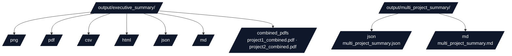
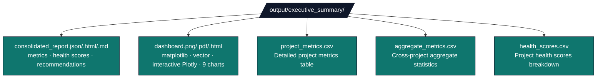

# Reporting Module - Documentation

## Overview

The reporting module provides reporting capabilities for pipeline execution, test results, validation outcomes, performance metrics, and error aggregation. It generates structured reports in multiple formats (JSON, HTML, Markdown) for both human review and machine processing.

## Architecture

### Module Structure

```mermaid
flowchart TB
    REP[/infrastructure/reporting//]
    REP --> META[__init__.py · SKILL.md · README.md · AGENTS.md]
    REP --> ERR[error_aggregator.py]
    REP --> EXEC[executive_reporter.py]
    REP --> GEN[report_generator.py · report_builder.py]
    REP --> PIPE[pipeline_report_model.py · pipeline_io.py ·<br/>pipeline_markdown.py · pipeline_html.py]
    REP --> ORG[output_organizer.py]
    REP --> MULTI[multi_project_reporter.py]
    REP --> MAN[manuscript_overview.py]
    REP --> COV[coverage_reporter.py · coverage_parser.py ·<br/>coverage_analysis.py · coverage_history.py ·<br/>coverage_json_parser.py]
    REP --> HTML[html_templates.py · markdown_formatter.py]
    REP --> SUITE[suite_runner.py · result_loaders.py ·<br/>pipeline_test_runner.py · pytest_output_parser.py]
    REP --> LOG[log_analysis.py]
    REP --> STAT[output_statistics.py · page_grid.py · page_rendering.py]
    REP --> DASH[interactive_dashboard.py]
    REP --> PRIV[_dashboard_*.py · _executive_*.py · _csv_*.py]

    classDef d fill:#0f172a,stroke:#0f172a,color:#fff
    classDef code fill:#1e3a8a,stroke:#0f172a,color:#fff
    classDef priv fill:#7c2d12,stroke:#0f172a,color:#fff
    classDef doc fill:#0f766e,stroke:#0f172a,color:#fff
    class REP d
    class ERR,EXEC,GEN,PIPE,ORG,MULTI,MAN,COV,HTML,SUITE,LOG,STAT,DASH code
    class PRIV priv
    class META doc
```



### Design Principles

1. **Multi-Format Output**: All reports generated in JSON, HTML, and Markdown
2. **Structured Data**: Machine-readable formats for programmatic access
3. **Actionable Insights**: Reports include recommendations and fixes
4. **Integration**: Seamlessly integrated into pipeline stages
5. **Error Categorization**: Intelligent error grouping and prioritization
6. **Unified Organization**: Consistent file organization across all reporting modules

## Output Organization System

### Output Organizer (`output_organizer.py`)

The Output Organizer provides unified file organization for executive summary and multi-project outputs. It ensures consistent directory structure and file placement across all reporting modules.

#### FileType Enum

```python
class FileType(Enum):
    """Supported file types for output organization."""
    PNG = ("png", "png")
    PDF = ("pdf", "pdf")
    CSV = ("csv", "csv")
    HTML = ("html", "html")
    JSON = ("json", "json")
    MARKDOWN = ("md", "md")
```

#### OutputOrganizer Class

**Key Methods:**

**`detect_file_type(file_path: Path) -> Optional[FileType]`**

- Detects file type from extension
- Returns None for unsupported extensions

**`get_output_path(file_path: Path, output_dir: Path, file_type: FileType) -> Path`**

- Resolves organized output path: `output_dir/{type_subdirectory}/filename`
- Used by all reporting modules for consistent file placement

**`ensure_directory_structure(output_dir: Path) -> None`**

- Creates all required subdirectories: `png/`, `pdf/`, `csv/`, `html/`, `json/`, `md/`, `combined_pdfs/`
- Idempotent operation

**`organize_existing_files(directory: Path) -> OrganizationResult`**

- Moves existing files to appropriate subdirectories based on type
- Handles files already in correct locations
- Returns statistics on operations performed

**`copy_combined_pdfs(repo_root: Path, target_dir: Path) -> int`**

- Discovers `{project}_combined.pdf` files from all project output directories
- Copies them to `target_dir/combined_pdfs/`
- Returns number of PDFs copied

#### Usage Example

```python
from infrastructure.reporting.output_organizer import OutputOrganizer, FileType

organizer = OutputOrganizer()

# Get organized path for a PNG file
png_path = organizer.get_output_path("chart.png", output_dir, FileType.PNG)
# Result: output_dir/png/chart.png

# Organize existing files
result = organizer.organize_existing_files(output_dir)
print(f"Moved {result.moved_files} files")

# Copy combined PDFs from all projects
copied = organizer.copy_combined_pdfs(repo_root, executive_dir)
print(f"Copied {copied} combined PDFs")
```

#### Target Directory Structure



#### Integration

All reporting modules use OutputOrganizer for consistent file organization:

- **Dashboard Generator**: All chart outputs use organized paths
- **Executive Reporter**: Summary reports saved in type-specific subdirectories
- **Multi-Project Generator**: Reports organized by type
- **Executive Report Script**: Automatically copies combined PDFs

#### Reorganization Script

The `scripts/organize_executive_outputs.py` script reorganizes existing outputs:

```bash
# Dry run to see what would be done
uv run python scripts/organize_executive_outputs.py --dry-run

# Organize all outputs
uv run python scripts/organize_executive_outputs.py

# Organize only executive summary
uv run python scripts/organize_executive_outputs.py --executive-only
```

## Core Components

### Pipeline Reporter (`pipeline_report_model.py`)

Generates consolidated reports from pipeline execution data.

#### Key Functions

**`generate_pipeline_report()`**

```python
def generate_pipeline_report(
    stage_results: List[Dict[str, Any]],
    total_duration: float,
    repo_root: Path,
    test_results: Optional[Dict[str, Any]] = None,
    validation_results: Optional[Dict[str, Any]] = None,
    performance_metrics: Optional[Dict[str, Any]] = None,
    error_summary: Optional[Dict[str, Any]] = None,
    output_statistics: Optional[Dict[str, Any]] = None,
    project_name: Optional[str] = None,
) -> PipelineReport:
    """Generate consolidated pipeline report.
    
    Args:
        stage_results: List of stage result dictionaries
        total_duration: Total pipeline execution time
        repo_root: Repository root path
        test_results: Test execution results (optional)
        validation_results: Validation results (optional)
        performance_metrics: Performance metrics (optional)
        error_summary: Error summary (optional)
        output_statistics: Output file statistics (optional)
        project_name: Project name for log file lookup (optional)
        
    Returns:
        PipelineReport instance
    """
```

- Creates a `PipelineReport` dataclass from stage results
- Includes test results, validation results, performance metrics
- Supports error summaries and output statistics

**`save_pipeline_report()`**

```python
def save_pipeline_report(
    report: PipelineReport,
    output_dir: Path
) -> Dict[str, Path]:
    """Save pipeline report in multiple formats.
    
    Args:
        report: PipelineReport instance
        output_dir: Directory to save reports
        
    Returns:
        Dictionary mapping format ('json', 'html', 'markdown') to file path
    """
```

- Saves reports in multiple formats (JSON, HTML, Markdown)
- Returns dictionary mapping format to file path
- Creates output directory if needed

**`generate_markdown_report()`**

```python
def generate_markdown_report(report: PipelineReport) -> str:
    """Generate human-readable Markdown report.
    
    Args:
        report: PipelineReport instance
        
    Returns:
        Markdown-formatted report string
    """
```

- Generates human-readable Markdown report
- Includes summary statistics, stage details, recommendations

**`generate_html_report()`**

```python
def generate_html_report(report: PipelineReport) -> str:
    """Generate styled HTML report.
    
    Args:
        report: PipelineReport instance
        
    Returns:
        HTML-formatted report string
    """
```

- Generates styled HTML report
- Includes visual indicators (status badges, summary cards)
- Responsive design for browser viewing

#### Usage Example

```python
from infrastructure.reporting import generate_pipeline_report, save_pipeline_report
from pathlib import Path

# Collect stage results
stage_results = [
    {'name': 'setup', 'exit_code': 0, 'duration': 2.5},
    {'name': 'tests', 'exit_code': 0, 'duration': 45.2},
    {'name': 'analysis', 'exit_code': 0, 'duration': 12.8},
]

# Generate report
report = generate_pipeline_report(
    stage_results=stage_results,
    total_duration=60.5,
    repo_root=Path("."),
    test_results={'summary': {'total_tests': 878, 'total_passed': 878}},
    validation_results={'checks': {'pdf_validation': True}},
    performance_metrics={'total_duration': 60.5},
)

# Save reports
saved_files = save_pipeline_report(report, Path("output/reports"))
# Returns: {'json': Path(...), 'html': Path(...), 'markdown': Path(...)}
```

### Error Aggregator (`error_aggregator.py`)

Collects, categorizes, and provides actionable fixes for errors and warnings.

#### Key Classes

**`ErrorAggregator`**

```python
class ErrorAggregator:
    """Aggregate and categorize errors from pipeline execution."""
    
    def __init__(self) -> None:
        """Initialize error aggregator."""
    
    def add_error(
        self,
        error_type: str,
        message: str,
        stage: Optional[str] = None,
        file: Optional[str] = None,
        line: Optional[int] = None,
        severity: str = 'error',
        suggestions: Optional[List[str]] = None,
        context: Optional[Dict[str, Any]] = None,
    ) -> None:
        """Add an error or warning.
        
        Args:
            error_type: Type of error (e.g., 'test_failure', 'validation_error')
            message: Error message
            stage: Stage where error occurred
            file: File where error occurred
            line: Line number (if applicable)
            severity: Error severity ('error', 'warning', 'info')
            suggestions: List of actionable suggestions
            context: Additional context dictionary
        """
    
    def get_summary(self) -> Dict[str, Any]:
        """Get error summary.
        
        Returns:
            Dictionary with error summary including counts and categorized errors
        """
    
    def get_actionable_fixes(self) -> List[Dict[str, Any]]:
        """Get actionable fixes for errors.
        
        Returns:
            List of fix dictionaries with priority and actions
        """
    
    def save_report(self, output_dir: Path) -> Dict[str, Path]:
        """Save error report in multiple formats.
        
        Args:
            output_dir: Directory to save reports
            
        Returns:
            Dictionary mapping format to file path
        """
```

- Main class for error collection
- Categorizes errors by type
- Generates actionable fixes with priority levels
- Saves reports in JSON and Markdown formats

**`ErrorEntry`**

```python
@dataclass
class ErrorEntry:
    """Single error or warning entry."""
    type: str  # 'test_failure', 'validation_error', 'stage_failure', etc.
    message: str
    stage: Optional[str] = None
    file: Optional[str] = None
    line: Optional[int] = None
    severity: str = 'error'  # 'error', 'warning', 'info'
    suggestions: List[str] = field(default_factory=list)
    context: Dict[str, Any] = field(default_factory=dict)
    
    def to_dict(self) -> Dict[str, Any]:
        """Convert to dictionary."""
```

- Dataclass representing a single error or warning
- Includes type, message, stage, file, line, severity
- Supports suggestions and context

#### Usage Example

```python
from infrastructure.reporting import get_error_aggregator
from pathlib import Path

aggregator = get_error_aggregator()

# Add errors during pipeline execution
aggregator.add_error(
    error_type='test_failure',
    message='Test test_example failed with assertion error',
    stage='tests',
    file='tests/test_example.py',
    line=42,
    severity='error',
    suggestions=[
        'Review test output for details',
        'Check test data and fixtures',
        'Verify recent code changes',
    ],
)

aggregator.add_error(
    error_type='validation_error',
    message='PDF validation failed: missing figures',
    stage='validation',
    severity='error',
    suggestions=[
        'Check figure generation scripts',
        'Verify figure paths in manuscript',
    ],
)

# Generate summary
summary = aggregator.get_summary()
# Returns: {
#     'total_errors': 2,
#     'errors_by_type': {'test_failure': 1, 'validation_error': 1},
#     'actionable_fixes': [...],
#     ...
# }

# Save reports
aggregator.save_report(Path("output/reports"))
# Creates: error_summary.json and error_summary.md
```

#### Error Types

Common error types:

- `test_failure` - Test execution failures
- `validation_error` - Validation check failures
- `stage_failure` - Pipeline stage failures
- `build_error` - Build process errors
- `configuration_error` - Configuration issues

### Executive Reporter (`executive_reporter.py`)

Generates cross-project metrics and executive summaries.

#### Key Functions

**`collect_manuscript_metrics(manuscript_dir: Path) -> ManuscriptMetrics`**

- Parses markdown files for word counts, sections, equations
- Detects figures, citations, and references
- Returns structured manuscript metrics

**`collect_codebase_metrics(src_dir: Path, scripts_dir: Optional[Path]) -> CodebaseMetrics`**

- Analyzes Python files for lines of code, methods, classes
- Separates source code from scripts
- Uses AST parsing for accurate code metrics

**`collect_test_metrics(reports_dir: Path) -> TestMetrics`**

- Loads test results from JSON reports
- Extracts pass/fail counts, coverage percentages
- Calculates execution times and test files

**`collect_output_metrics(output_dir: Path) -> OutputMetrics`**

- Counts PDFs, figures, data files, slides
- Calculates file sizes and totals
- Enumerates web outputs and other artifacts

**`collect_pipeline_metrics(reports_dir: Path) -> PipelineMetrics`**

- Analyzes pipeline execution reports
- Identifies bottleneck stages and durations
- Counts passed/failed stages

**`collect_project_metrics()`**

```python
def collect_project_metrics(repo_root: Path, project_name: str) -> ProjectMetrics:
    """Collect all metrics for a single project.
    
    Args:
        repo_root: Repository root path
        project_name: Name of the project
        
    Returns:
        ProjectMetrics instance with all collected metrics
    """
```

- Collects manuscript, codebase, test, output, and pipeline metrics
- Returns structured ProjectMetrics dataclass

**`generate_executive_summary()`**

```python
def generate_executive_summary(
    repo_root: Path,
    project_names: List[str]
) -> ExecutiveSummary:
    """Generate executive summary for all projects.
    
    Args:
        repo_root: Repository root path
        project_names: List of project names to include
        
    Returns:
        ExecutiveSummary instance with aggregated metrics and recommendations
    """
```

- Orchestrates metrics collection across all projects
- Generates aggregate statistics and comparisons
- Creates recommendations based on metrics
- Returns ExecutiveSummary dataclass

**`save_executive_summary()`**

```python
def save_executive_summary(
    summary: ExecutiveSummary,
    output_dir: Path
) -> Dict[str, Path]:
    """Save executive summary in multiple formats.
    
    Args:
        summary: ExecutiveSummary instance
        output_dir: Output directory path
        
    Returns:
        Dictionary mapping format ('json', 'html', 'markdown') to file path
    """
```

- Saves reports in JSON, HTML, and Markdown formats
- Returns dictionary mapping format to file path
- Creates output directory if needed

#### Usage Example

```python
from infrastructure.reporting import generate_executive_summary, save_executive_summary
from pathlib import Path

repo_root = Path(".")
project_names = ["template_code_project"]

# Generate summary
summary = generate_executive_summary(repo_root, project_names)

print(f"Total projects: {summary.total_projects}")
print(f"Total manuscript words: {summary.aggregate_metrics['manuscript']['total_words']:,}")
print(f"Average test coverage: {summary.aggregate_metrics['tests']['average_coverage']:.1f}%")

# Save reports
saved_files = save_executive_summary(summary, Path("output/executive_summary"))
# Returns: {'json': Path(...), 'html': Path(...), 'markdown': Path(...)}
```

### Dashboard System (`_dashboard_matplotlib.py` + extracted modules)

Creates visual dashboards and charts for executive reporting.

#### Key Functions

**`generate_all_dashboards()`**

```python
def generate_all_dashboards(
    summary: ExecutiveSummary,
    output_dir: Path
) -> Dict[str, Path]:
    """Generate all dashboard formats including CSV data exports.
    
    Args:
        summary: ExecutiveSummary instance
        output_dir: Output directory path
        
    Returns:
        Dictionary of all saved file paths (png, pdf, html, csv, etc.)
    """
```

- Generates matplotlib dashboards (PNG/PDF)
- Generates interactive Plotly dashboards (HTML)
- Generates CSV data tables
- Returns dictionary of all generated file paths

**`generate_csv_data_tables()`**

```python
def generate_csv_data_tables(
    summary: ExecutiveSummary,
    output_dir: Path
) -> Dict[str, Path]:
    """Generate CSV data tables for dashboard data export.
    
    Args:
        summary: ExecutiveSummary instance
        output_dir: Output directory path
        
    Returns:
        Dictionary of saved CSV file paths
    """
```

- Exports project metrics as CSV
- Exports aggregate metrics as CSV
- Exports health scores as CSV

**`generate_matplotlib_dashboard()`**

```python
def generate_matplotlib_dashboard(
    summary: ExecutiveSummary,
    output_dir: Path
) -> Dict[str, Path]:
    """Generate static dashboard charts (PNG/PDF).
    
    Args:
        summary: ExecutiveSummary instance
        output_dir: Output directory path
        
    Returns:
        Dictionary mapping format ('png', 'pdf') to file path
    """
```

- Creates bar charts, pie charts, and summary tables
- Saves in both PNG and PDF formats
- Includes 9 charts

**`generate_plotly_dashboard()`**

```python
def generate_plotly_dashboard(
    summary: ExecutiveSummary,
    output_dir: Path
) -> Path:
    """Generate interactive HTML dashboard.
    
    Args:
        summary: ExecutiveSummary instance
        output_dir: Output directory path
        
    Returns:
        Path to generated HTML file
    """
```

- Multi-tab interactive dashboard
- Hover tooltips with detailed metrics
- Zoom and pan functionality
- Responsive design

#### Usage Example

```python
from infrastructure.reporting import generate_all_dashboards, generate_executive_summary
from pathlib import Path

# Generate executive summary
summary = generate_executive_summary(Path("."), ["project1", "project2"])

# Create all dashboard formats
dashboard_files = generate_all_dashboards(summary, Path("output/executive_summary"))
# Returns: {'png': Path(...), 'pdf': Path(...), 'html': Path(...)}

print(f"Generated {len(dashboard_files)} dashboard files")
for fmt, path in dashboard_files.items():
    print(f"  {fmt.upper()}: {path.name}")
```

### Interactive Simulation Dashboard (`interactive_dashboard.py`)

Project-agnostic builder for self-contained interactive simulation
dashboards. Used by every active research project under `projects/` to
expose configurable simulations on the website with multiple linked views,
live controls, and plaintext-validatable invariants.

**Design principles:**

- **Zero new Python deps.** Plotly is loaded at runtime from the CDN; the
  builder itself is stdlib + numpy.
- **Configurable.** Every simulation knob (grid range, seed, hyperparameter,
  threshold) is surfaced as a CLI flag on the project's `build_dashboard.py`,
  not baked into source.
- **Plaintext companion artefacts.** Every dashboard ships an
  `invariants.txt` (PASS/FAIL with concrete witnesses), a `summary.txt`
  (provenance + hyperparameters + notes), and a `payload.json` (full
  numerical payload) so CI / agents validate without a browser.
- **Reproducibility.** Each emitted artefact carries the git revision,
  dirty-state flag, and ISO-8601 UTC timestamp.

#### Public API

```python
from infrastructure.reporting import (
    InteractiveDashboard,
    Panel,
    Control,
    Invariant,
)

d = InteractiveDashboard(
    title="My simulation",
    subtitle="K=2 Ising toy",
    project_name="my_project",
    repo_root=Path("/abs/path/to/repo"),
)
d.set_payload({"x": np.linspace(0, 1, 100), "y": ...})  # numpy → JSON
d.set_hyperparameters({"alpha": 0.1, "seed": 42})
d.add_slider("a", "α", min=0, max=1, step=0.01, default=0.5)
d.add_panel(Panel(panel_id="p", title="P", traces=[...], layout={...}))
d.add_invariant(Invariant("nn", actual=[...], kind="nonneg", tol=0.0))
d.write(html_path=..., json_path=..., invariants_path=..., txt_path=...)
```

#### Invariant kinds

| Kind | Comparator | Witness |
| --- | --- | --- |
| `equal` | `\|actual − expected\| ≤ tol` | `\|a − e\| = δ (tol=ε)` |
| `le` / `ge` | `actual ≤/≥ expected ± tol` | `a ≤/≥ e ± ε` |
| `in_range` | `expected[0]−tol ≤ actual ≤ expected[1]+tol` | bracket + value |
| `monotone_increasing` / `monotone_decreasing` | weakly monotone within tol | `worst out-of-order step` |
| `finite` | every value `math.isfinite` | non-finite indices or count |
| `nonneg` | `min(actual) ≥ −tol` | `min = …` |
| `array_close` | `max\|actual_i − expected_i\| ≤ tol` (elementwise) | `max \|Δ\| at index i` |

#### Control kinds

| Kind | UI | Default semantics |
| --- | --- | --- |
| `slider` | range input | numeric, requires `min`, `max`, `step`, `default` |
| `number` | numeric input | as `slider`, no slider track |
| `dropdown` | `<select>` | requires `options` list (and optional `option_labels`) |
| `toggle` | checkbox | boolean default |

#### Panel update_fn semantics

`Panel.update_fn` is a JS body executed when any of `Panel.driven_by`
controls change. Free variables in scope: `payload` (the JSON-serialised
payload tree), `controls` (a `{control_id: value}` map), `Plotly` (the
CDN-loaded library), `panelId` (the DOM id of this panel). Use
`Plotly.restyle(panelId, …)` for trace data updates and
`Plotly.relayout(panelId, …)` for axis / shape / annotation changes.
Syntactic JS errors in `update_fn` are silent failures in the browser —
the project test suite typically wraps every `update_fn` with
`Function(…)` and runs `node --check` to catch them at CI time.

#### Outputs

`InteractiveDashboard.write()` returns a `dict[str, Path]` mapping
`{"html", "json", "invariants", "summary"}` to absolute paths (only the
keys whose paths were provided are returned). The HTML file is fully
self-contained except for the Plotly CDN script tag.

#### Reference projects

- [`projects/actinf_policy_entanglement_lean/scripts/build_dashboard.py`](../../projects/actinf_policy_entanglement_lean/scripts/build_dashboard.py)
  — closed-form Ising mirror with 6 panels, 3 live controls, 18 invariants.
- [`projects/template_code_project/scripts/build_dashboard.py`](../../projects/template_code_project/scripts/build_dashboard.py)
  — gradient-descent diagnostics with 5 panels, 2 live controls, 22 invariants;
  defaults read from `manuscript/config.yaml`.

### Manuscript Overview Generator (`manuscript_overview.py`)

Generates visual overviews of manuscript PDFs by extracting and arranging all pages as thumbnails in a grid layout.

#### Key Functions

**`extract_pdf_pages_as_images(pdf_path: Path, dpi: int = 150) -> List[PIL.Image]`**

- Extracts each PDF page as a PIL Image object
- Uses pypdf for PDF reading and PIL for image rendering
- Supports fallback rendering if advanced libraries unavailable
- Returns list of PIL Images, one per page

**`create_page_grid(images: List[PIL.Image], cols: int = 4, padding: int = 10, max_thumb_size: Tuple[int, int] = (600, 800)) -> PIL.Image`**

- Arranges page images in a 4-column grid layout
- Automatically calculates rows based on number of pages
- Maintains aspect ratio and scales images appropriately
- Adds page numbers as labels on each thumbnail
- Returns single PIL Image containing the grid

**`generate_manuscript_overview()`**

```python
def generate_manuscript_overview(
    pdf_path: Path,
    output_dir: Path,
    project_name: str,
    dpi: int = 300
) -> Dict[str, Path]:
    """Generate manuscript overview images (PNG and PDF) for a project.
    
    Args:
        pdf_path: Path to the manuscript PDF
        output_dir: Directory to save output files
        project_name: Name of the project (for filename)
        dpi: Resolution for rendering (default: 300)
        
    Returns:
        Dictionary mapping format to output file path
        
    Raises:
        FileNotFoundError: If PDF doesn't exist
        ValueError: If PDF processing fails
    """
```

- Main orchestration function for manuscript overview generation
- Extracts pages, creates grid, saves both PNG and PDF outputs
- Returns dictionary mapping filename to output file path
- Handles errors gracefully and provides informative logging

**`generate_all_manuscript_overviews()`**

```python
def generate_all_manuscript_overviews(
    summary: ExecutiveSummary,
    output_dir: Path,
    repo_root: Path
) -> Dict[str, Path]:
    """Generate manuscript overviews for all projects in the executive summary.
    
    Args:
        summary: ExecutiveSummary containing project information
        output_dir: Directory to save overview files
        repo_root: Root directory of the repository
        
    Returns:
        Dictionary mapping filenames to output file paths
    """
```

- Generates manuscript overviews for all projects in executive summary
- Searches multiple possible locations for manuscript PDFs
- Returns dictionary of all generated files (PNG and PDF for each project)
- Automatically integrated into `generate_all_dashboards()`

#### Implementation Details

**PDF Processing Strategy:**

1. **Primary**: Uses pypdf to read PDF pages, then renders text content using PIL drawing
2. **Advanced Fallback**: Attempts reportlab-based rendering for higher quality (if available)
3. **Simple Fallback**: Basic text extraction and PIL rendering if advanced rendering fails

**Grid Layout Algorithm:**

- Fixed 4-column layout with automatic row calculation
- Thumbnail sizing: Maintains aspect ratio, fits within max_thumb_size bounds (600x800 default)
- Page numbering: Sequential labels ("Page 1", "Page 2", etc.) on each thumbnail
- Spacing: Configurable padding between thumbnails

**Error Handling:**

- Missing PDF files: Logged as warning, project skipped
- Corrupted PDFs: Logged as error, project skipped
- Rendering failures: Graceful fallback to simpler rendering methods
- Missing dependencies: Clear error messages with installation guidance

#### Usage Example

```python
from infrastructure.reporting.manuscript_overview import generate_manuscript_overview
from pathlib import Path

# Generate overview for single project
pdf_path = Path("output/project/pdf/project_combined.pdf")
output_dir = Path("output/executive_summary")
result = generate_manuscript_overview(pdf_path, output_dir, "my_project")

# Result contains: {'manuscript_overview_my_project.png': Path(...), 'manuscript_overview_my_project.pdf': Path(...)}

# Generate for all projects (integrated into dashboard generation)
from infrastructure.reporting import generate_all_dashboards
dashboard_files = generate_all_dashboards(summary, output_dir)
# Automatically includes manuscript overviews
```

#### Output Formats

- **PNG**: High-resolution raster image (300 DPI default, print quality)
- **PDF**: Vector format preserving quality (using reportlab, if available)
- **Grid Layout**: 4-column arrangement with automatic rows
- **Page Labels**: Sequential numbering on each thumbnail
- **File Naming**: `manuscript_overview_{project_name}.png/pdf`

#### Dependencies

**Required:**

- `pypdf>=5.0`: PDF reading and page extraction
- `pillow>=10.0.0`: Image processing and rendering

**Optional:**

- `reportlab>=4.0.0`: PDF rendering and output (recommended)

#### Output Formats

- **PNG**: High-resolution static images (300 DPI)
- **PDF**: Vector graphics for printing and archival
- **HTML**: Interactive dashboards with Plotly (requires plotly package)

### HTML Templates (`html_templates.py`)

Reusable HTML templates for report generation.

#### Key Functions

**`get_base_html_template()`**

- Base HTML template with styling
- Responsive design
- Professional appearance

**`render_summary_cards()`**

- Renders summary statistics as cards
- Grid layout for multiple metrics

**`render_table()`**

- Renders data tables
- Supports headers and rows

## Integration Points

### Pipeline Integration

The reporting module is integrated into multiple pipeline entry points:

#### Single Project Reporting

1. **`scripts/execute_pipeline.py`**
   - Generates consolidated pipeline report at end
   - Includes all stage results, test results, validation results
   - Saves to `project/output/reports/pipeline_report.{json,html,md}`

2. **`scripts/01_run_tests.py`**
   - Generates structured test reports
   - Includes test counts, coverage metrics, execution times
   - Saves to `project/output/reports/test_results.{json,md}`

3. **`scripts/04_validate_output.py`**
   - Generates validation reports
   - Includes actionable recommendations
   - Saves to `project/output/reports/validation_report.{json,md}`

#### Multi-Project Executive Reporting

1. **`run.sh` Multi-Project Options (a, b, c, d)**
   - Automatically triggers executive reporting for 2+ projects
   - Generates cross-project analysis
   - Saves to `output/executive_summary/` directory
   - Includes consolidated reports, dashboards, and CSV data exports

2. **`scripts/07_generate_executive_report.py`**
   - Standalone executive reporting script
   - Can be run manually for any set of completed projects
   - Orchestrates full executive reporting workflow

### Error Aggregation Integration

Error aggregator can be used throughout the pipeline:

```python
from infrastructure.reporting import get_error_aggregator

aggregator = get_error_aggregator()

try:
    run_stage()
except Exception as e:
    aggregator.add_error(
        error_type='stage_failure',
        message=str(e),
        stage='analysis',
        suggestions=['Check stage logs', 'Verify inputs'],
    )
```

## Multi-Project Executive Reporting

The reporting module now includes multi-project executive reporting capabilities:

### Features

- **Cross-Project Metrics Aggregation**: Collects and compares metrics across multiple projects
- **Health Score Calculation**: Automated project health assessment based on test coverage, manuscript quality, and output completeness
- **Visual Dashboards**: Multiple chart types showing comparative analysis, trends, and performance metrics
- **CSV Data Export**: Machine-readable data tables for further analysis
- **Actionable Recommendations**: Intelligent suggestions based on project metrics and cross-project comparisons

### Automatic Integration

Multi-project executive reporting is automatically triggered when:

1. Using `run.sh` multi-project options (a, b, c, d) with 2+ projects
2. All projects successfully
3. Executive reporting runs as a final stage (non-blocking)

### Manual Execution

Executive reporting can also be run manually:

```bash
# From any directory
uv run python3 scripts/07_generate_executive_report.py

# Or programmatically
from infrastructure.reporting import generate_multi_project_report
from pathlib import Path

files = generate_multi_project_report(
    Path("."), ["project1", "project2"], Path("output/executive_summary")
)
```

**`generate_multi_project_report()` Function Signature:**

```python
def generate_multi_project_report(
    repo_root: Path,
    project_names: List[str],
    output_dir: Path
) -> Dict[str, Path]:
    """Orchestrate multi-project reporting workflow.
    
    This is a convenience function that runs the full executive reporting pipeline:
    1. Generate executive summary with metrics collection
    2. Save summary reports (JSON, HTML, Markdown)
    3. Generate visual dashboards (PNG, PDF, HTML)
    4. Export CSV data tables
    
    Args:
        repo_root: Repository root path
        project_names: List of project names to include in report
        output_dir: Directory to save all reports and dashboards
        
    Returns:
        Dictionary mapping file types to saved file paths
    """
```

### Output Structure



### Health Score Calculation

Projects are automatically scored on four key dimensions:

- **Test Coverage** (40% weight): Coverage percentage with quality thresholds
- **Test Integrity** (30% weight): Test failure rates and reliability
- **Manuscript Quality** (20% weight): Content completeness and academic standards
- **Output Richness** (10% weight): Generated artifacts and deliverables

Each dimension receives a letter grade (A-F) and contributes to an overall health percentage.

### Dashboards

The executive dashboard includes 9 charts:

1. **Test Results**: Total, passed, and failed test counts by project
2. **Coverage Analysis**: Test coverage percentages with quality thresholds
3. **Pipeline Performance**: Execution times and bottleneck analysis
4. **Manuscript Complexity**: Word count vs equations scatter plot
5. **Output Distribution**: Pie chart of generated file types
6. **Efficiency Metrics**: PDFs generated per second of pipeline time
7. **Health Scores**: Overall project health percentages
8. **Test Efficiency**: Coverage vs execution time matrix
9. **Executive Summary**: metrics table with aggregates

## Report Structure

### Pipeline Report

```python
@dataclass
class PipelineReport:
    timestamp: str
    total_duration: float
    stages: List[StageResult]
    test_results: Optional[Dict[str, Any]]
    validation_results: Optional[Dict[str, Any]]
    performance_metrics: Optional[Dict[str, Any]]
    error_summary: Optional[Dict[str, Any]]
    output_statistics: Optional[Dict[str, Any]]
```

### Error Summary

```python
{
    'timestamp': '2025-12-04T14:01:30',
    'total_errors': 2,
    'total_warnings': 1,
    'errors_by_type': {'test_failure': 1, 'validation_error': 1},
    'warnings_by_type': {'performance': 1},
    'errors': [...],  # List of ErrorEntry dictionaries
    'warnings': [...],  # List of ErrorEntry dictionaries
    'actionable_fixes': [
        {
            'priority': 'high',
            'issue': '1 test failure(s)',
            'actions': [...],
            'documentation': 'docs/testing-guide.md',
        },
    ],
}
```

## Best Practices

### Error Reporting

1. **Categorize Errors**: Use consistent error types for better aggregation
2. **Provide Context**: Include file, line, stage information when available
3. **Actionable Suggestions**: Provide specific steps to fix issues
4. **Priority Levels**: Use appropriate severity levels (error, warning, info)

### Report Generation

1. **Multiple Formats**: Always generate JSON, HTML, and Markdown
2. **Structured Data**: Use consistent data structures for machine processing
3. **Human-Readable**: Ensure Markdown reports are clear and actionable
4. **Visual Indicators**: Use status badges and color coding in HTML reports

### Integration

1. **Non-Blocking**: Report generation should not fail the pipeline
2. **Graceful Degradation**: Handle missing data gracefully
3. **Performance**: Report generation should be fast (< 1s)
4. **Location**: Save all reports to `project/output/reports/`

## Coverage Trend Dashboard (`coverage_history.py`)

Long-running coverage telemetry: parses Cobertura `coverage-*.xml` artefacts
(the same files Codecov ingests) and renders a deterministic, diff-friendly
Markdown report at `docs/_generated/coverage_history.md`.

### Public API

```python
from infrastructure.reporting.coverage_history import (  # noqa: docs-lint
    CoveragePoint,            # frozen dataclass: date, suite, percentage, lines_covered, lines_total
    parse_coverage_xml,       # Path → CoveragePoint (defusedxml-based)
    collect_history_from_dir, # Path → list[CoveragePoint], recursive
    collect_history_via_gh,   # gh run list + gh run download, raises RuntimeError if gh absent
    build_history_markdown,   # Sequence[CoveragePoint] → Markdown string (pure, idempotent)
)
```

### Driver

`scripts/generate_coverage_history.py` is the thin orchestrator. Two modes:

```bash
# Offline (CI uses this after artefact download)
uv run python scripts/generate_coverage_history.py --from-dir=./_artefacts --days=30

# Online (requires `gh auth login`)
uv run python scripts/generate_coverage_history.py --from-gh --days=30
```

### Notes

- XML parsing uses `defusedxml.ElementTree` (bandit B314 fires on stdlib `xml.etree`).
- `collect_history_via_gh` shells out with `subprocess.run(..., shell=False)` and
  resolves `gh` via `shutil.which`; argv is always list-form.
- `build_history_markdown` is **pure** — same input → byte-identical output.
- The CI step lives in the `performance` job (informational, `|| true`); the
  artefact name is `coverage-history`.

## Testing

The reporting module has test coverage:

```bash
# Run reporting module tests
uv run pytest tests/infra_tests/reporting/ -v

# Coverage history specifically
uv run pytest tests/infra_tests/reporting/test_coverage_history.py -q --timeout=60

# With coverage
uv run pytest tests/infra_tests/reporting/ --cov=infrastructure.reporting
```

## See Also

- [`README.md`](README.md) - Quick reference guide
- [`../README.md`](../README.md) - Infrastructure layer overview
- [`../AGENTS.md`](../AGENTS.md) - infrastructure documentation
- [`../../docs/modules/modules-guide.md`](../../docs/modules/modules-guide.md) - Modules guide
