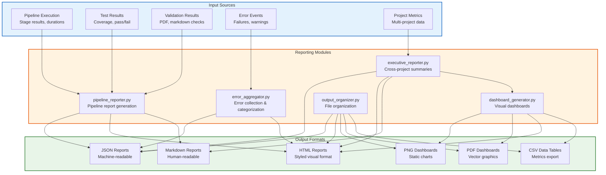

# Reporting Module - Quick Reference

Pipeline reporting and error aggregation utilities.

## Overview

The reporting module provides reporting capabilities for pipeline execution, including:
- Consolidated pipeline reports (JSON, HTML, Markdown)
- Test results reporting
- Validation reports with actionable recommendations
- Performance metrics and analysis
- Error aggregation and categorization
- **Executive cross-project summaries and visual dashboards**
- **Unified output organization system**

## Architecture



## Output Organization

The reporting module includes a unified output organization system that ensures consistent file placement across all reporting operations.

### File Organization

```python
from infrastructure.reporting.output_organizer import OutputOrganizer, FileType

organizer = OutputOrganizer()

# Get organized path for any file type
png_path = organizer.get_output_path("chart.png", output_dir, FileType.PNG)
# Result: output_dir/png/chart.png

csv_path = organizer.get_output_path("data.csv", output_dir, FileType.CSV)
# Result: output_dir/csv/data.csv
```

### Directory Structure

All executive reports are organized by file type:

```
output/executive_summary/
├── png/              # Visualizations
├── pdf/              # Charts and reports
├── csv/              # Data exports
├── html/             # Interactive dashboards
├── json/             # Machine-readable reports
├── md/               # Human-readable reports
└── combined_pdfs/    # All project manuscripts
```

### Reorganization

Reorganize existing outputs with the provided script:

```bash
# Preview changes
python3 scripts/organize_executive_outputs.py --dry-run

# Apply organization
python3 scripts/organize_executive_outputs.py
```

## Quick Start

### Generate Pipeline Report

```python
from infrastructure.reporting import generate_pipeline_report, save_pipeline_report
from pathlib import Path

# Collect stage results
stage_results = [
    {'name': 'setup', 'exit_code': 0, 'duration': 2.5},
    {'name': 'tests', 'exit_code': 0, 'duration': 45.2},
]

# Generate report
report = generate_pipeline_report(
    stage_results=stage_results,
    total_duration=47.7,
    repo_root=Path("."),
    test_results={'summary': {'total_tests': 878, 'total_passed': 878}},
)

# Save in multiple formats
saved_files = save_pipeline_report(report, Path("output/reports"))
# Returns: {'json': Path(...), 'html': Path(...), 'markdown': Path(...)}
```

### Aggregate Errors

```python
from infrastructure.reporting import get_error_aggregator

aggregator = get_error_aggregator()

# Add errors during pipeline execution
aggregator.add_error(
    error_type='test_failure',
    message='Test test_example failed',
    stage='tests',
    suggestions=['Review test output', 'Check test data'],
)

# Generate error summary
summary = aggregator.get_summary()
aggregator.save_report(Path("output/reports"))
```

### Generate Executive Report

```python
from infrastructure.reporting import generate_executive_summary, save_executive_summary
from pathlib import Path

repo_root = Path(".")
project_names = ["project", "code_project", "prose_project"]

# Generate cross-project summary
summary = generate_executive_summary(repo_root, project_names)

print(f"Total projects: {summary.total_projects}")
print(f"Total manuscript words: {summary.aggregate_metrics['manuscript']['total_words']:,}")
print(f"Average test coverage: {summary.aggregate_metrics['tests']['average_coverage']:.1f}%")

# Save reports
saved_files = save_executive_summary(summary, Path("output/executive_summary"))
# Returns: {'json': Path(...), 'html': Path(...), 'markdown': Path(...)}
```

### Generate Visual Dashboard

```python
from infrastructure.reporting import generate_all_dashboards

# Create visual dashboards (PNG, PDF, HTML) + CSV data exports
dashboard_files = generate_all_dashboards(summary, Path("output/executive_summary"))
# Returns: {'png': Path(...), 'pdf': Path(...), 'html': Path(...), 'metrics': Path(...), ...}

print(f"Generated {len(dashboard_files)} dashboard and data files")
```

### Multi-Project Reporting (NEW)

```python
from infrastructure.reporting import generate_multi_project_report

# One-line executive reporting workflow
files = generate_multi_project_report(
    Path("."), ["project1", "project2"], Path("output/executive_summary")
)
# Automatically generates:
# - Executive summary (JSON, HTML, Markdown)
# - Visual dashboards (PNG, PDF, HTML)
# - CSV data tables (metrics, aggregates, health scores)

print(f"Generated {len(files)} report files")
for fmt, path in files.items():
    print(f"  {fmt}: {path.name}")
```

### Generate Validation Report

```python
from infrastructure.reporting import generate_validation_report

validation_results = {
    'checks': {
        'pdf_validation': True,
        'markdown_validation': True,
        'output_structure': False,
    },
    'recommendations': [
        {'priority': 'high', 'issue': 'Missing output directories', 'action': '...'},
    ],
}

saved_files = generate_validation_report(validation_results, Path("output/reports"))
```

## Module Functions

### Pipeline Reporting

- `generate_pipeline_report()` - Create consolidated pipeline report
- `save_pipeline_report()` - Save report in multiple formats (JSON, HTML, Markdown)
- `generate_test_report()` - Generate test results report
- `generate_validation_report()` - Generate validation report
- `generate_performance_report()` - Generate performance metrics report
- `generate_error_summary()` - Generate error summary report

### Executive Reporting

- `generate_executive_summary()` - Generate cross-project metrics and summary
- `save_executive_summary()` - Save executive summary in multiple formats
- `collect_project_metrics()` - Collect all metrics for a single project
- `calculate_project_health_score()` - Calculate project health score (NEW)
- `ProjectMetrics` - project metrics dataclass
- `ExecutiveSummary` - Executive summary dataclass with health scores (ENHANCED)

### Multi-Project Orchestration

- `generate_multi_project_report()` - executive reporting workflow (NEW)
- `generate_csv_data_tables()` - Export metrics as CSV tables (NEW)

### Dashboard Generation

- `generate_all_dashboards()` - Generate dashboards in all formats (PNG, PDF, HTML)
- `generate_matplotlib_dashboard()` - Generate static charts (PNG/PDF)
- `generate_plotly_dashboard()` - Generate interactive HTML dashboard

### Error Aggregation

- `ErrorAggregator` - Main error aggregation class
- `get_error_aggregator()` - Get global error aggregator instance
- `ErrorEntry` - Single error/warning entry dataclass

## Report Formats

All reports are generated in multiple formats:

- **JSON**: Machine-readable format for programmatic access
- **HTML**: Visual format with styling for browser viewing
- **Markdown**: Human-readable format for documentation

## Integration

The reporting module is automatically integrated into:
- `scripts/execute_pipeline.py` - Generates pipeline report at end
- `scripts/01_run_tests.py` - Generates test reports
- `scripts/04_validate_output.py` - Generates validation reports

Reports are saved to `project/output/reports/` by default.

## Features (v2.1)

### Executive Reporting

- **Project Health Scoring**: Automated assessment based on test coverage, manuscript quality, test reliability, and output completeness
- **Statistical Aggregates**: Min/max/median calculations for cross-project comparisons
- **Actionable Recommendations**: Intelligent suggestions based on metrics analysis and best practices
- **Dashboards**: 9 charts including complexity analysis, performance metrics, and health scores

### Multi-Project Integration

- **Automatic Executive Reporting**: Triggered automatically in `run.sh` multi-project options (a, b, c, d)
- **CSV Data Export**: Machine-readable data tables for further analysis
- **Workflow Orchestration**: `generate_multi_project_report()` handles the entire reporting pipeline

### Manuscript Overview Generation (NEW)

**Visual manuscript previews** for executive reporting. Automatically extracts all pages from each project's manuscript PDF and arranges them as thumbnails in a 4-column grid layout.

```python
from infrastructure.reporting import generate_all_manuscript_overviews

# Generate manuscript overviews for all projects
overview_files = generate_all_manuscript_overviews(summary, output_dir, repo_root)
# Creates: manuscript_overview_{project_name}.png/pdf for each project
```

**Features:**
- **Page Thumbnails**: High-quality page previews with page numbers
- **Grid Layout**: 4-column arrangement with automatic row calculation
- **Dual Output**: Both PNG (raster) and PDF (vector) formats
- **Error Resilience**: Gracefully handles missing PDFs or rendering failures

### Output Structure

Executive reports are saved to `output/executive_summary/`:

```
output/executive_summary/
├── consolidated_report.json      # metrics & health scores
├── consolidated_report.html       # Styled HTML with recommendations
├── consolidated_report.md         # Human-readable summary
├── dashboard.png                  # 9-chart dashboard
├── dashboard.pdf                  # Vector graphics for printing
├── dashboard.html                 # Interactive charts (Plotly)
├── manuscript_overview_project.png           # Manuscript page grid (PNG)
├── manuscript_overview_project.pdf           # Manuscript page grid (PDF)
├── manuscript_overview_prose_project.png  # Additional projects...
├── manuscript_overview_code_project.png
├── project_metrics.csv           # Detailed project data
├── aggregate_metrics.csv         # Cross-project statistics
└── health_scores.csv             # Health score breakdowns
```

## See Also

- [`AGENTS.md`](AGENTS.md) - reporting module documentation
- [`../README.md`](../README.md) - Infrastructure layer overview
- [`../AGENTS.md`](../AGENTS.md) - infrastructure documentation


