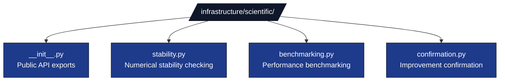

# Scientific Module

## Purpose

The Scientific module provides utilities and best practices for developing scientific computing software. It includes numerical stability checking, performance benchmarking, and independent improvement confirmation for scientific implementations.

> **Tier: exemplar-support.** This is a Layer-1 module by location, but it is imported only by its scientific exemplar(s) — it is intentionally **not** generic-reach across `infrastructure/`. Treat it as exemplar support, not as a candidate for dead-code removal nor as a general-purpose infra dependency.

## Architecture

### Modular Structure

The scientific module is organized into focused submodules:



**stability.py** (~100 lines)
- `check_numerical_stability()` - Test algorithmic stability across input ranges
- `StabilityTest` dataclass - Stability test results with recommendations

**benchmarking.py** (~200 lines)
- `benchmark_function()` - Performance measurement with memory tracking
- `format_benchmark_report()` - performance analysis
- `BenchmarkResult` dataclass - Benchmark results with timing and memory

**confirmation.py**
- `confirm_improvement()` - Confirm a candidate beats a baseline metric beyond the noise band
- `Confirmation` dataclass - Result with `candidate_mean`, `baseline_metric`, `delta`, `noise_band`, `confirmed`

## Key Features

### Numerical Stability
```python
# Import from main module (recommended)
from infrastructure.scientific import check_numerical_stability, StabilityTest

# Or import from specific module
from infrastructure.scientific.stability import check_numerical_stability

stability = check_numerical_stability(
    your_algorithm,
    test_inputs,
    tolerance=1e-12
)
```

### Performance Benchmarking
```python
# Import from main module (recommended)
from infrastructure.scientific import benchmark_function, format_benchmark_report

# Or import from specific module
from infrastructure.scientific.benchmarking import benchmark_function

benchmark = benchmark_function(
    your_function,
    test_inputs,
    iterations=100
)
```

### Improvement Confirmation
```python
# Import from main module (recommended)
from infrastructure.scientific import confirm_improvement, Confirmation

# Or import from specific module
from infrastructure.scientific.confirmation import confirm_improvement

result = confirm_improvement(
    evaluate=your_evaluator,   # (params, seed) -> metric
    candidate=(0.1, 0.2),
    baseline_metric=1.0,
    seeds=[0, 1, 2, 3],
    noise_scale=0.05,
    sigma=2.0,
)
print(result.delta, result.noise_band, result.confirmed)
```

## Testing

Run scientific tests with:
```bash
uv run pytest tests/infra_tests/scientific/
```

## Configuration

No specific configuration required. All scientific utilities operate with sensible defaults.

## Integration

Exemplar-support tier (see Purpose): imported only by its scientific exemplar(s), used for:
- Numerical stability checking during algorithm development
- Performance benchmarking / optimization workflows
- Independent improvement confirmation against a baseline

## Troubleshooting

### Stability Tests Fail

**Issue**: `check_numerical_stability()` reports instability.

**Solutions**:
- Review tolerance settings (may be too strict)
- Check input ranges are appropriate for algorithm
- Verify algorithm implementation is correct
- Review numerical precision requirements
- Consider algorithm modifications for better stability

### Benchmarking Errors

**Issue**: `benchmark_function()` fails or returns unexpected results.

**Solutions**:
- Verify function is callable and accepts test inputs
- Check test inputs are valid for function
- Ensure sufficient system resources (memory, CPU)
- Review iteration count (may be too high)
- Check for side effects affecting measurements

## Best Practices

### Numerical Stability

- **Test Early**: Check stability during algorithm development
- **Use Appropriate Tolerances**: Set tolerances based on problem requirements
- **Test Edge Cases**: Include boundary conditions in stability tests
- **Document Assumptions**: Document numerical assumptions clearly

### Performance Benchmarking

- **Warm Up**: Allow warm-up iterations before measurement
- **Multiple Runs**: Run benchmarks multiple times for reliability
- **Control Environment**: Minimize system load during benchmarking
- **Track Trends**: Monitor performance over time

## See Also

- [README.md](README.md) - Quick reference guide
- [`core/`](../core/) - Foundation utilities
- [`core/source_improve.py`](../core/source_improve.py) - AST-based source improvement (orchestrated by [`scripts/maintenance/batch_cogsec_improve.py`](../../scripts/maintenance/batch_cogsec_improve.py))

