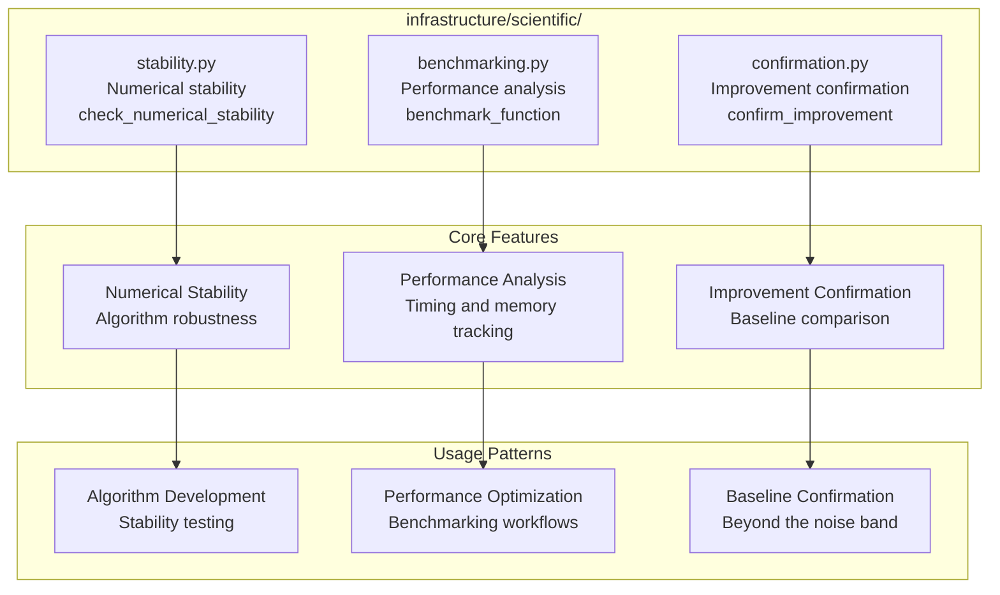

# Scientific Module - Quick Reference

Utilities for scientific computing and research software development.

> **Tier: exemplar-support.** Layer-1 by location, but imported only by its
> scientific exemplar(s) — intentionally not generic-reach across
> `infrastructure/`. See [AGENTS.md](AGENTS.md).

## Quick Start

```python
from infrastructure.scientific import (
    check_numerical_stability,
    benchmark_function,
    confirm_improvement,
)

# Check numerical stability
stability = check_numerical_stability(
    your_algorithm,
    [test_input_1, test_input_2]
)

# Benchmark performance
benchmark = benchmark_function(
    your_algorithm,
    [test_input_1, test_input_2],
    iterations=100
)
```

## Module Architecture



## Modules

- **stability.py** - Numerical stability checking and algorithm robustness analysis
- **benchmarking.py** - Performance measurement and optimization analysis
- **confirmation.py** - Confirm a candidate beats a baseline metric beyond the noise band

## Key Functions

### Numerical Stability
- `check_numerical_stability()` - Test algorithm stability

### Performance Analysis
- `benchmark_function()` - Function performance measurement

### Improvement Confirmation
- `confirm_improvement()` - Confirm a candidate beats a baseline beyond the noise band (returns a `Confirmation`)

## Usage Notes

The scientific module is a library module. Import functions from `infrastructure.scientific` or from the specific submodules (e.g. `infrastructure.scientific.benchmarking`) when you need narrower dependencies.

## Testing

```bash
uv run pytest tests/infra_tests/scientific/
```

For detailed documentation, see [AGENTS.md](AGENTS.md).
