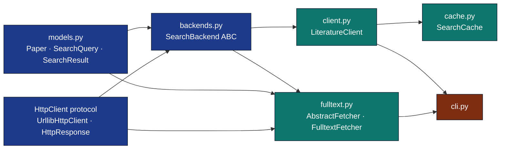

# `infrastructure/search/literature/`

Agent guide for the literature submodule. The parent module's
[`AGENTS.md`](../AGENTS.md) covers higher-level rationale; this file
documents the internal seams.

## Module Graph



## Modules

| Module | Role |
| --- | --- |
| `base.py` | `SearchBackend` ABC and `BackendError`; defines the backend contract (honour `max_results`, apply year filters, stamp `Paper.source`, return `[]` when empty, raise `BackendError` on transport/parse failure). |
| `arxiv_backend.py` | `ArxivBackend` — arXiv Atom export API backend; parses Atom XML into `Paper`s, resolves old- and new-style arXiv ids, and retries 429/503 throttling in `fetch_by_id`. |
| `crossref_backend.py` | `CrossrefBackend` plus module-level `crossref_item_to_paper` and `clean_jats`; queries the Crossref REST `/works` API and maps records to `Paper` (the mapper is shared with reference verification). |
| `local_backend.py` | `LocalBackend` — searches a JSON corpus on disk, term-matching title/abstract/keywords/authors and scoring by the fraction of query terms matched. |
| `paperclip_backend.py` | `PaperclipBackend` — Paperclip (paperclip.gxl.ai) MCP JSON-RPC backend (requires `api_key`); issues a `search` tool call and extracts papers from structured or text content. |
| `paperclip_text_parser.py` | `parse_cli_blocks` / `papers_from_text_content` — parse Paperclip CLI-style text blocks into `Paper` records (title, authors, ids, DOI, venue). |

## Invariants

- **`Paper.id` is unique within a result set.** The aggregator's
  `_canonical_paper_key` falls back to DOI → arXiv id → normalised
  (title, year) — change at your peril.
- **Per-backend errors NEVER raise.** Aggregator records them into
  `SearchResult.errors`. A network outage in one backend must not break
  the whole search.
- **Year filters are re-applied defensively** by `LiteratureClient`
  even if a backend honoured them. Don't remove the second pass.
- **`SearchCache` keys on canonical query identity** —
  `(text.strip().lower(), max_results, year_min, year_max,
  sorted(sources))`. Whitespace and case differences collapse to one
  cache entry.
- **HTTP layer is injectable.** Every HTTP backend takes
  `http_client=` and `base_url=`; tests use `pytest-httpserver`. No
  `unittest.mock`.

## Editing checklist

- [ ] Added a new backend → subclass `SearchBackend`, set `name`,
  return `Paper` with `source=self.name`, raise `BackendError` on
  transport failure.
- [ ] Added a field to `Paper` → update `to_dict` / `from_dict`,
  consider whether `merge_papers` should fold it.
- [ ] Touched the aggregator → verify
  `tests/infra_tests/search/test_client_and_cache.py::TestLiteratureClient`
  still passes.
- [ ] Changed `_canonical_paper_key` → re-run
  `test_models.py::TestMergePapers` and add a regression test.

## Tests

```bash
uv run pytest tests/infra_tests/search/ -v
```

86+ tests, no mocks. HTTP backends exercised via `pytest-httpserver`,
`LocalBackend` against real temp files, CLI via real subprocess.

## See also

- [`README.md`](README.md) — quick reference + diagram.
- [`SKILL.md`](SKILL.md) — agent-oriented API.
- [`../AGENTS.md`](../AGENTS.md) — module-level overview.
