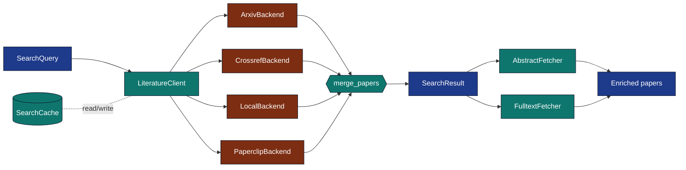

# `infrastructure/search/literature/`

Multi-source literature search with failure-isolated aggregation,
DOI/arXiv-aware deduplication, deterministic JSON caching, and abstract
/ fulltext enrichment.



## Files

| File | Role |
|---|---|
| `models.py` | `Paper`, `SearchQuery`, `SearchResult`, `merge_papers` |
| `backends.py` | `SearchBackend` ABC + 4 concrete backends + HTTP layer |
| `client.py` | `LiteratureClient` aggregator |
| `cache.py` | `SearchCache` JSON-file cache |
| `fulltext.py` | `AbstractFetcher`, `FulltextFetcher`, `enrich_papers`, `write_corpus` |
| `cli.py` | `search` / `to-bibtex` subcommands |

## Quick reference

```python
from infrastructure.search.literature import (
    LiteratureClient, SearchQuery, ArxivBackend, CrossrefBackend,
    LocalBackend, PaperclipBackend,
    AbstractFetcher, FulltextFetcher, SearchCache,
)
```

For agent-oriented API examples see [SKILL.md](SKILL.md); for invariants
and editing rules see the parent module's
[`AGENTS.md`](../AGENTS.md).
