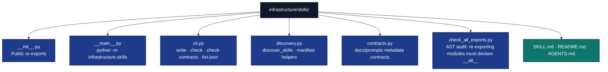

# infrastructure/skills

## Purpose

Enumerate `SKILL.md` agent descriptors under configurable repository roots, parse YAML frontmatter, and sync a JSON manifest for Cursor and other tools.

## Module layout

## Public API (`discovery.py`)

- `DEFAULT_SKILL_SEARCH_ROOTS` — `("infrastructure", "projects", "docs/prompts", ".cursor/skills")` relative to repo root
- `SkillDescriptor` — `absolute_path`, `relative_path`, `name`, `description`, `frontmatter`; properties `path_posix`, `cursor_at`
- `split_yaml_frontmatter(source: str) -> tuple[dict | None, str]`
- `load_skill_descriptor(skill_path: Path, repo_root: Path) -> SkillDescriptor`
- `iter_skill_paths(repo_root: Path, roots: Sequence[str]) -> Iterator[Path]`
- `discover_skills(repo_root, *, search_roots=None) -> list[SkillDescriptor]` — sorted by path; raises `ValueError` on duplicate `name`
- `build_manifest_payload(skills) -> dict`
- `write_skill_manifest(repo_root, output_path=None, *, search_roots=None) -> Path` — default `.cursor/skill_manifest.json`
- `load_manifest(manifest_path) -> dict`
- `manifest_matches_discovery(repo_root, manifest_path, *, search_roots=None) -> tuple[bool, str]`
- `manifest_skill_dicts_for_prompt(skills) -> list[dict]`
- `skill_descriptors_as_json_serializable(skills) -> list[dict]`

## Public API (`contracts.py`)

- `iter_contract_skill_paths(repo_root) -> Iterable[Path]` — yields `docs/prompts/**/SKILL.md`
- `validate_skill_contract_file(skill_path) -> list[str]` — validates one workflow skill metadata contract
- `check_skill_contracts(repo_root) -> list[str]` — validates all workflow skill contracts

## CLI (`cli.py`)

- `main(argv=None) -> int`
- Subcommands: `list-json`, `write` (`--output`), `write-index` (`--output`), `check` (`--manifest`), `check-contracts`, `check-all-exports`
- Shared flags on each subcommand (after the verb): `--repo-root`, `--roots DIR [DIR ...]`
- Example: `uv run python -m infrastructure.skills write --roots infrastructure docs/prompts .cursor/skills`

## Tests

`tests/infra_tests/skills/test_skill_discovery.py`
