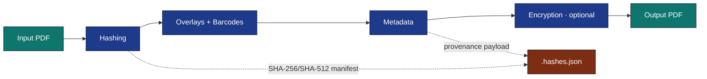

# Steganography Module

Optional infrastructure module for secure PDF post-processing. Produces a
second `*_steganography.pdf` alongside every normal PDF output, augmented
with layered security and steganographic techniques.

## Module Structure

| File | Purpose |
|------|---------|
| `__init__.py` | Public API: `SteganographyProcessor`, `SteganographyConfig`, `embed_steganography`, `process_pdf`, `resolve_build_timestamp` |
| `config.py` | `SteganographyConfig` dataclass with per-technique toggles |
| `core.py` | `SteganographyProcessor` orchestrator class |
| `overlays.py` | Diagonal watermark + footer + invisible text overlays (reportlab) |
| `barcodes.py` | QR code, Code128, barcode strip generation |
| `barcode_generators.py` | Low-level barcode image generators |
| `barcode_payload.py` | Barcode payload encoding and structure |
| `metadata.py` | PDF Info dictionary + XMP metadata injection (pypdf) |
| `hashing.py` | SHA-256/512 (any `hashlib.new` algorithm) computation, JSON manifest sidecar |
| `encryption.py` | AES-256-GCM payload encryption, PDF password protection |

## Dependencies

All dependencies are lazily imported — the module loads without error even
when they are absent:

- `pypdf` — PDF reading/writing/merging
- `reportlab` — overlay canvas generation
- `qrcode[pil]` — QR code generation
- `python-barcode` — Code128 barcode generation
- `cryptography` — AES-GCM payload helpers and encrypted metadata payloads

The root `uv sync` includes the `steganography` group by default for the maintained test gate. Minimal environments can still install it explicitly with `uv sync --group steganography`.

## Configuration

Add a `steganography:` section to your project's `manuscript/config.yaml`:

```yaml
steganography:
  enabled: true
  overlays: true
  barcodes: true
  metadata: true
  hashing: true
  encryption: false
  pdf_encryption_algorithm: "AES-256"
  overlay_text: "CONFIDENTIAL"
  overlay_opacity: 0.08
```

## Usage

### CLI (recommended)

```bash
# Full pipeline + steganography (requires --project)
./secure_run.sh --project template_code_project

# Interactive path → secure subcommand (same orchestrator as ./run.sh)
./run.sh --secure-run

# Post-process existing PDFs only — all discovered projects if --project omitted
./secure_run.sh --steganography-only --project template_code_project
./secure_run.sh --steganography-only
```

### Python API

```python
from infrastructure.steganography import process_pdf, SteganographyConfig
from pathlib import Path

# Quick — all techniques enabled
process_pdf(Path("paper.pdf"))

# Configurable
config = SteganographyConfig(
    enabled=True,
    overlays_enabled=True,
    barcodes_enabled=True,
    metadata_enabled=True,
    hashing_enabled=True,
    encryption_enabled=False,
)
process_pdf(Path("paper.pdf"), config=config, title="My Paper")
```

## Techniques

### Watermark Overlays

- Diagonal semi-transparent text across every page
- Configurable text, opacity, and colour
- Page footer with document ID, page number, and short hash

### Invisible Text

- Render-mode-3 text (invisible ink) on first page
- Embeds document ID, title, and hash — survives text extraction

### Barcodes

- **QR code** on bottom-left of every page (document hash + title + timestamp)
- **Code128** linear barcode text with page-level document ID
- All barcodes rendered via reportlab canvas

### Metadata Injection

- PDF Info dictionary population (Title, Author, custom `/Hash_SHA256` keys)
- XMP Dublin Core metadata packet with custom steganography namespace
- Creator/Producer fields identify the steganography module

### Hashing

- SHA-256 and SHA-512 of the rendered source PDF content
- Hash values embedded in barcodes, metadata, and footer overlays
- JSON sidecar manifest (`*.hashes.json`) for external verification

### Encryption (optional)

- AES-GCM encrypted metadata payloads
- HMAC-SHA256 digital fingerprinting
- PDF-level AES-256 password protection via pypdf

## Deterministic mode

Setting `STEGANOGRAPHY_DETERMINISTIC=1` (or passing `--deterministic` to
`secure_run.sh`) pins every embedded timestamp to the latest commit's
strict-ISO8601 committer date and derives the `Doc-ID` from a SHA-256 of
that timestamp. Two consecutive runs against the same `HEAD` produce
**byte-identical** `*_steganography.pdf` files — useful for provenance
audits and content-addressable storage. Trade-off: the embedded
timestamp no longer reflects rendering time. Falls back to wall-clock
time (with a logger warning) if `git` is unavailable. See
[`docs/security/steganography.md`](../../docs/security/steganography.md#deterministic-mode).

## Architecture



The module follows the thin orchestrator pattern: `SteganographyProcessor.process()`
chains each technique in sequence, each operating on the working PDF copy.
The original input PDF is never modified.
