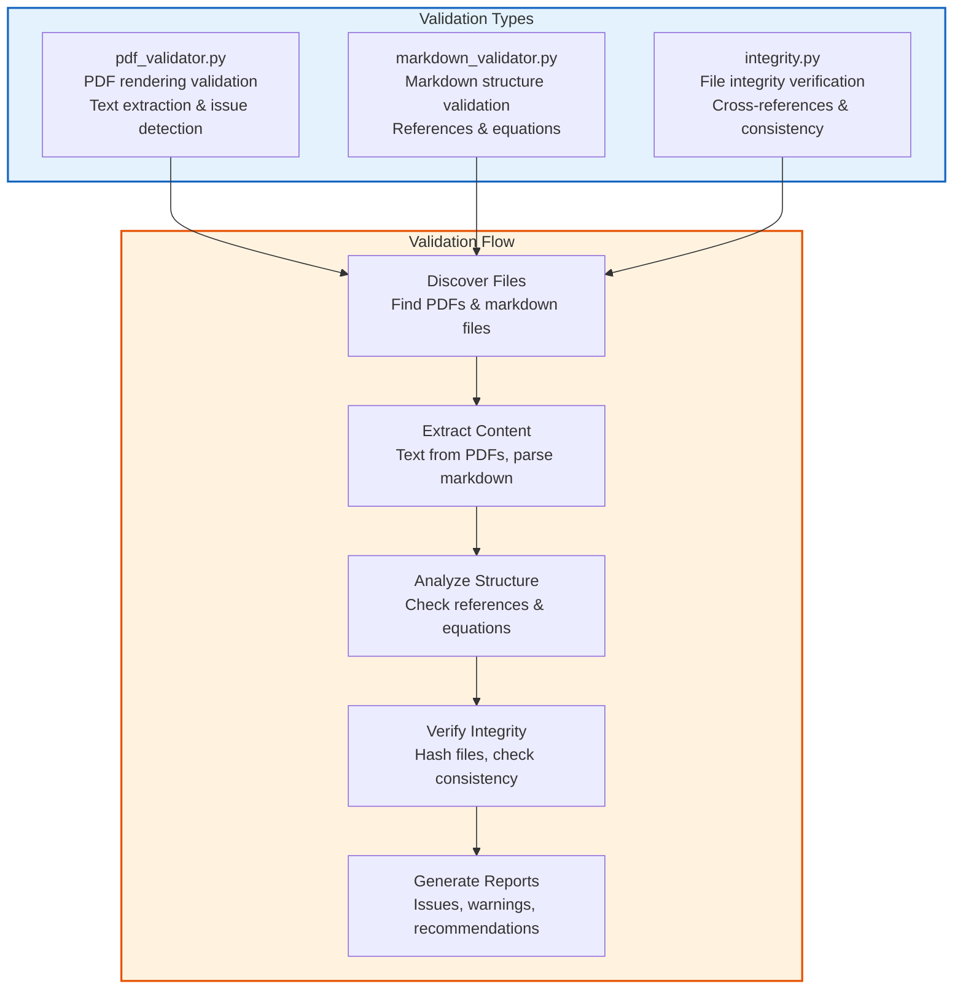

# Validation Module - Quick Reference

Validation tools for PDFs, markdown files, and research output integrity.

## Quick Start

```python
from infrastructure.validation import (
    validate_pdf_rendering,
    validate_markdown,
    verify_output_integrity
)

# Validate a PDF
report = validate_pdf_rendering(Path("output/pdf/manuscript.pdf"))
if report['summary']['has_issues']:
    print(f"Found {report['issues']['total_issues']} issues")

# Validate markdown files
problems, exit_code = validate_markdown("manuscript/", ".")
for problem in problems:
    print(problem)

# Verify output integrity
integrity_report = verify_output_integrity(Path("output/"))
```

## Modules



- **pdf_validator** - PDF text extraction and rendering validation
- **markdown_validator** - Markdown structure and reference validation
- **integrity** - File integrity, cross-references, data consistency

## Key Functions

### PDF Validation
- `validate_pdf_rendering(pdf_path)` - Comprehensive PDF validation
- `extract_text_from_pdf(pdf_path)` - Extract text from PDF
- `scan_for_issues(text)` - Detect rendering problems

### Markdown Validation
- `validate_markdown(markdown_dir, repo_root)` - Full markdown validation
- `validate_images(md_paths, repo_root)` - Check image references
- `validate_refs(md_paths, labels, anchors, repo_root)` - Verify cross-references
- `validate_math(md_paths, repo_root)` - Validate equations

### Integrity Verification
- `verify_output_integrity(output_dir)` - Comprehensive integrity check
- `verify_file_integrity(file_paths, expected_hashes)` - File hash verification
- `verify_cross_references(markdown_files)` - Reference validation
- `verify_academic_standards(markdown_files)` - Standards compliance

## CLI

```bash
# Validate PDF files
python3 -m infrastructure.validation.cli pdf output/pdf/manuscript.pdf

# Validate markdown
python3 -m infrastructure.validation.cli markdown project/manuscript/

# Full integrity check
python3 -m infrastructure.validation.cli integrity output/
```

## Testing

```bash
pytest tests/infrastructure/test_validation/
```

For detailed documentation, see [AGENTS.md](AGENTS.md).

