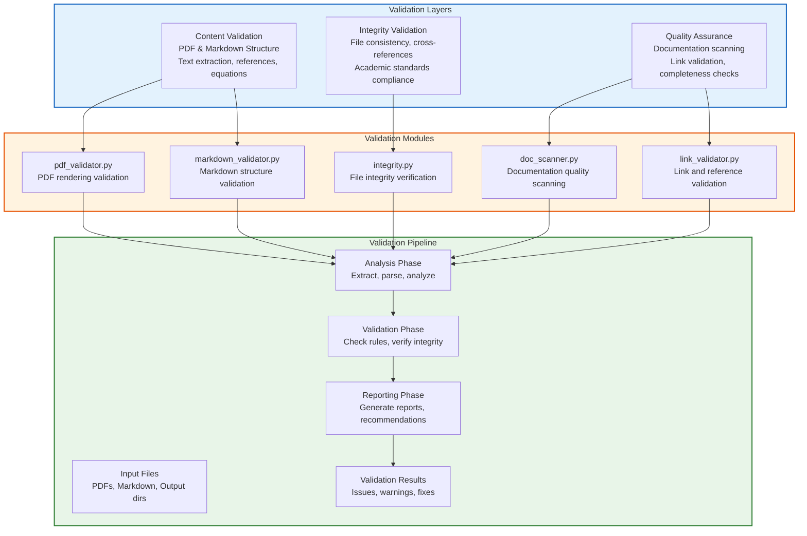
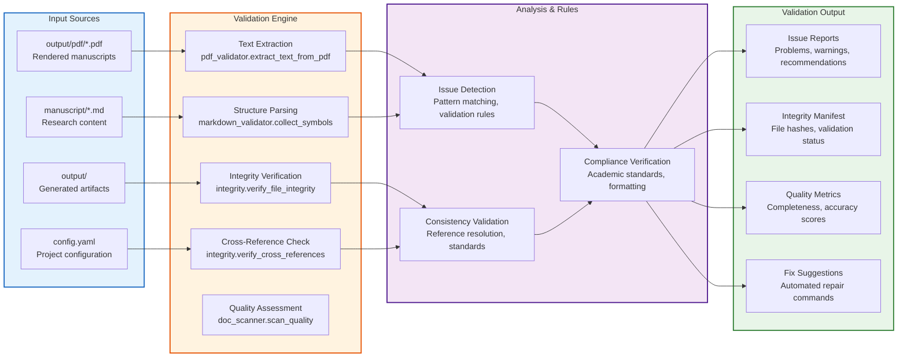
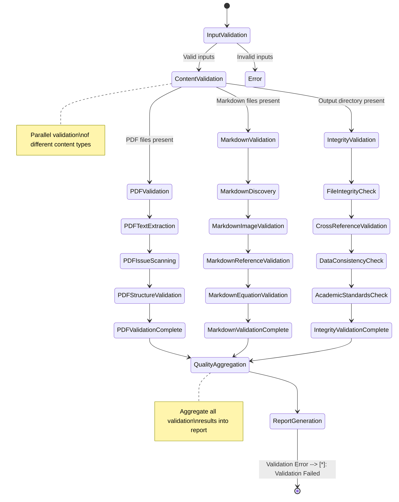

# Validation Module - Quality Assurance

Advanced validation tools for research documents, ensuring PDF integrity, markdown structure validity, and output quality assurance.

## Architecture Overview



## Data Flow Architecture



## Usage Patterns

```mermaid
flowchart TD
    subgraph BuildIntegration["Build Pipeline Integration"]
        A[Build Pipeline<br/>scripts/03_render_pdf.py]
        B[Generate PDF<br/>Render manuscript]
        C[Validate PDF<br/>validate_pdf_rendering()]
        D[Check Issues<br/>Review validation report]
        E{PDF Valid?}
        F[Continue Pipeline<br/>scripts/04_validate_output.py]
        G[Fail Build<br/>Stop with error]
    end

    subgraph QualityGates["Quality Gates"]
        H[Quality Gates<br/>scripts/04_validate_output.py]
        I[Integrity Check<br/>verify_output_integrity()]
        J[Completeness Check<br/>validate_output_structure()]
        K[Cross-Ref Validation<br/>verify_cross_references()]
        L{All Valid?}
        M[Copy Outputs<br/>scripts/05_copy_outputs.py]
        N[Report Issues<br/>Generate validation report]
    end

    subgraph ManualValidation["Manual Validation"]
        O[Manual Validation<br/>CLI or direct API]
        P[Select Validation Type<br/>PDF, Markdown, Integrity]
        Q[Run Validation<br/>Execute appropriate validator]
        R[Review Results<br/>Check reports and fix issues]
        S[Re-validate<br/>Iterate until clean]
    end

    A --> B --> C --> D --> E
    E -->|Yes| F
    E -->|No| G

    H --> I --> J --> K --> L
    L -->|Yes| M
    L -->|No| N

    O --> P --> Q --> R --> S

    classDef build fill:#e3f2fd,stroke:#1565c0,stroke-width:2px
    classDef quality fill:#fff3e0,stroke:#e65100,stroke-width:2px
    classDef manual fill:#e8f5e8,stroke:#2e7d32,stroke-width:2px

    class BuildIntegration build
    class QualityGates quality
    class ManualValidation manual
```

## Quick Start

```python
from infrastructure.validation import (
    validate_pdf_rendering,
    validate_markdown,
    verify_output_integrity,
    find_manuscript_directory
)

# Find manuscript directory at standard location
manuscript_dir = find_manuscript_directory(Path("."))
print(f"Found manuscript at: {manuscript_dir}")

# Validate PDF after rendering
pdf_report = validate_pdf_rendering(Path("output/pdf/project_combined.pdf"))
if pdf_report['summary']['has_issues']:
    print(f"PDF has {pdf_report['issues']['total_issues']} issues")
    for issue_type, count in pdf_report['issues'].items():
        if count > 0 and issue_type != 'total_issues':
            print(f"  {issue_type}: {count}")

# Validate markdown before rendering
problems, exit_code = validate_markdown(str(manuscript_dir), ".")
if problems:
    print("Markdown validation issues:")
    for problem in problems[:5]:  # Show first 5
        print(f"  {problem}")
    if len(problems) > 5:
        print(f"  ... and {len(problems) - 5} more issues")

# output integrity check
integrity_report = verify_output_integrity(Path("output/"))
if integrity_report.errors:
    print("Integrity issues found:")
    for error in integrity_report.errors[:3]:
        print(f"  ERROR: {error}")
if integrity_report.warnings:
    print("Integrity warnings:")
    for warning in integrity_report.warnings[:3]:
        print(f"  WARNING: {warning}")

# Generate human-readable report
from infrastructure.validation.integrity import generate_integrity_report
print(generate_integrity_report(integrity_report))
```

## Module Organization

| Module | Purpose | Key Functions |
|--------|---------|----------------|
| **pdf_validator.py** | PDF rendering validation and text extraction | `validate_pdf_rendering()`, `extract_text_from_pdf()`, `scan_for_issues()` |
| **markdown_validator.py** | Markdown structure and reference validation | `validate_markdown()`, `validate_images()`, `validate_refs()`, `validate_math()` |
| **integrity.py** | File integrity and consistency verification | `verify_output_integrity()`, `verify_file_integrity()`, `verify_cross_references()` |
| **doc_scanner.py** | Documentation quality and completeness scanning | `DocumentationScanner`, accuracy and completeness checks |
| **link_validator.py** | Link and reference validation | `LinkValidator`, file and heading reference checking |
| **output_validator.py** | Output structure and completeness validation | `validate_output_structure()`, `validate_copied_outputs()` |
| **figure_validator.py** | Figure registry validation | `validate_figure_registry()` |
| **repo_scanner.py** | Repository-wide validation scanning | `RepositoryScanner`, repo analysis |
| **doc_*.py** | Specialized documentation validation | Quality assessment, accuracy checking, completeness analysis |

## Validation Workflow



## Validation Types & Capabilities

### PDF Validation (`pdf_validator.py`)
**Purpose**: Validate PDF rendering quality and detect common LaTeX/Pandoc issues

**Capabilities**:
- Text extraction from PDF files (handles OCR and scanned documents)
- Issue detection: unresolved references (`??`), broken citations, LaTeX errors
- Structure validation: document completeness, formatting consistency
- Preview generation: first N words for content verification
- Hex string decoding: handle PDF-encoded special characters

**Common Issues Detected**:
- Unresolved LaTeX references (`\ref{undefined}`)
- Missing citations (`[?]`)
- LaTeX compilation errors
- Font rendering problems
- Document structure issues

### Markdown Validation (`markdown_validator.py`)
**Purpose**: Ensure markdown files are properly structured and all references resolve

**Capabilities**:
- Recursive markdown file discovery
- Image reference validation (existence and path resolution)
- Cross-reference verification (labels and anchors)
- Mathematical equation syntax validation
- Link integrity checking
- Section anchor validation

**Validation Checks**:
- Image files exist at specified paths
- Cross-references point to valid labels/anchors
- LaTeX math syntax is well-formed
- URLs are accessible (optional)
- Internal links resolve correctly

### Integrity Validation (`integrity.py`)
**Purpose**: file and data integrity verification

**Capabilities**:
- SHA-256 file integrity hashing and verification
- Cross-reference consistency across documents
- Data file format and content validation
- Academic writing standards compliance
- Build artifact verification and completeness
- Permission and access validation

**Integrity Checks**:
- File integrity via cryptographic hashing
- Cross-reference resolution between documents
- Data consistency (CSV, NPZ, JSON formats)
- Academic standards (citation formats, terminology)
- File permission validation
- Output completeness verification

## Advanced Validation Features

### Documentation Quality Scanning
```python
# documentation analysis
from infrastructure.validation.doc_scanner import DocumentationScanner

scanner = DocumentationScanner(Path("."))
results = scanner.scan_repository()

print(f"Found {len(results.accuracy_issues)} accuracy issues")
print(f"Found {len(results.completeness_gaps)} completeness gaps")
```

### Link Validation
```python
# Validate all links in documentation
from infrastructure.validation.link_validator import LinkValidator

validator = LinkValidator(Path("."))
issues = validator.validate_all_links()

for issue in issues:
    print(f"Link issue in {issue.source_file}: {issue.description}")
```

### Repository Scanning
```python
# Full repository validation
from infrastructure.validation.repo_scanner import RepositoryScanner

scanner = RepositoryScanner(Path("."))
results = scanner.scan_repository()

print(f"Scanned {results.scanned_files} files")
print(f"Accuracy issues: {len(results.accuracy_issues)}")
print(f"Completeness gaps: {len(results.completeness_gaps)}")
```

## CLI Usage

### PDF Validation
```bash
# Validate single PDF with verbose output
python3 -m infrastructure.validation.cli pdf output/pdf/manuscript.pdf --verbose

# Validate with custom word preview length
python3 -m infrastructure.validation.cli pdf output/pdf/manuscript.pdf --words 300

# Validate PDF from different path
python3 -m infrastructure.validation.cli pdf /path/to/document.pdf
```

### Markdown Validation
```bash
# Validate markdown in manuscript directory
python3 -m infrastructure.validation.cli markdown project/manuscript/

# Strict validation (fail on any issue)
python3 -m infrastructure.validation.cli markdown project/manuscript/ --strict

# Validate specific markdown file
python3 -m infrastructure.validation.cli markdown project/manuscript/01_abstract.md
```

### Integrity Validation
```bash
# Full integrity check of output directory
python3 -m infrastructure.validation.cli integrity output/

# Check specific subdirectories
python3 -m infrastructure.validation.cli integrity output/pdf/
python3 -m infrastructure.validation.cli integrity output/data/

# Generate integrity manifest for future comparison
python3 -m infrastructure.validation.cli integrity output/ --manifest
```

### Link Validation
```bash
# Validate all links in repository
python3 -m infrastructure.validation.cli links

# Validate links in specific directory
python3 -m infrastructure.validation.cli links docs/
```

## Integration with Build Pipeline

### Automatic Validation in Scripts

The validation module is automatically integrated into the build pipeline:

```bash
# scripts/03_render_pdf.py - Post-rendering validation
python3 scripts/03_render_pdf.py --project project
# Automatically validates generated PDFs

# scripts/04_validate_output.py - Quality assurance
python3 scripts/04_validate_output.py --project project
# Runs integrity and quality checks

# scripts/05_copy_outputs.py - Final validation
python3 scripts/05_copy_outputs.py --project project
# Validates copied outputs match originals
```

### Quality Gates

Validation serves as quality gates in the pipeline:

1. **PDF Validation Gate**: Ensures rendered PDFs are error-free
2. **Integrity Gate**: Verifies all output files are consistent and 3. **Cross-reference Gate**: Confirms all references resolve correctly
4. **Completeness Gate**: Ensures all expected deliverables exist

### Error Handling

```python
# Graceful error handling in validation
try:
    report = validate_pdf_rendering(pdf_path)
    if report['summary']['has_issues']:
        # Log issues but don't fail build
        logger.warning(f"PDF validation found {report['issues']['total_issues']} issues")
        # Continue with warnings
except PDFValidationError as e:
    # Critical failure
    logger.error(f"PDF validation failed: {e}")
    raise  # Stop pipeline
```

## Validation Report Formats

### PDF Validation Report
```python
{
    'summary': {
        'has_issues': bool,
        'total_issues': int,
        'validation_time': float
    },
    'issues': {
        'unresolved_refs': int,
        'missing_citations': int,
        'latex_errors': int,
        'total_issues': int
    },
    'text': {
        'preview': str,  # First N words
        'total_words': int,
        'encoding': str
    },
    'metadata': {
        'file_size': int,
        'page_count': int,
        'creation_date': str
    }
}
```

### Integrity Report
```python
@dataclass
class IntegrityReport:
    total_files: int
    file_integrity: Dict[str, bool]
    cross_references: Dict[str, bool]
    data_consistency: Dict[str, bool]
    academic_standards: Dict[str, bool]
    build_artifacts: Dict[str, Any]
    completeness: Dict[str, Any]
    permissions: Dict[str, Any]
    errors: List[str]
    warnings: List[str]
    recommendations: List[str]
```

## Configuration

Validation behavior can be customized through configuration:

```yaml
# config.yaml
validation:
  pdf:
    max_preview_words: 300
    strict_mode: false
  markdown:
    strict_references: true
    validate_external_links: false
  integrity:
    enable_hash_verification: true
    check_file_permissions: true
    validate_academic_standards: true
```

## Performance Considerations

### Validation Speed Optimization

- **Incremental Validation**: Only validate changed files
- **Parallel Processing**: Validate multiple files concurrently
- **Caching**: Cache validation results for unchanged files
- **Selective Validation**: Run only relevant validators per context

### Memory Management

- **Streaming Processing**: Process large files without loading entirely
- **Temporary Files**: Use temporary files for intermediate results
- **Resource Cleanup**: Proper cleanup of validation artifacts

## Testing

```bash
# Run all validation tests
pytest tests/infrastructure/test_validation/ -v

# Test specific validator
pytest tests/infrastructure/test_validation/test_pdf_validator.py -v
pytest tests/infrastructure/test_validation/test_markdown_validator.py -v
pytest tests/infrastructure/test_validation/test_integrity.py -v

# Test with coverage
pytest tests/infrastructure/test_validation/ --cov=infrastructure.validation --cov-report=html

# Integration tests
pytest tests/integration/test_validation_pipeline.py -v
```

## Troubleshooting

### Common Issues

**PDF Text Extraction Fails**:
- Ensure PDF contains selectable text (not just images)
- Check PDF is not password-protected
- Verify PDF is not corrupted

**Markdown References Not Found**:
- Check reference syntax (`[text](target)`)
- Verify target files exist
- Ensure proper relative paths

**Integrity Check False Positives**:
- Check file modification times
- Verify file permissions
- Compare against known good baselines

### Debug Mode

```bash
# Enable debug logging
export LOG_LEVEL=0

# Run validation with verbose output
python3 -m infrastructure.validation.cli pdf output/pdf/manuscript.pdf --verbose

# Check validation logs
tail -f logs/validation_*.log
```

For detailed function signatures and API documentation, see [AGENTS.md](AGENTS.md).

