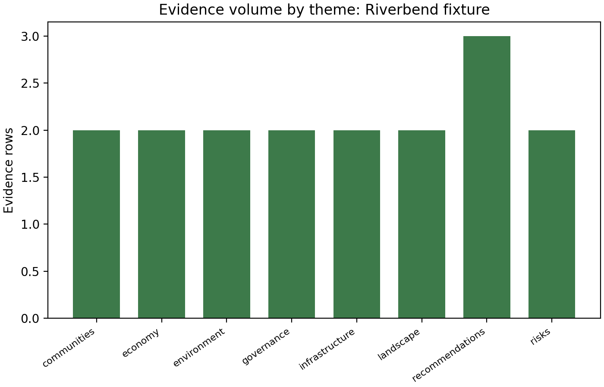
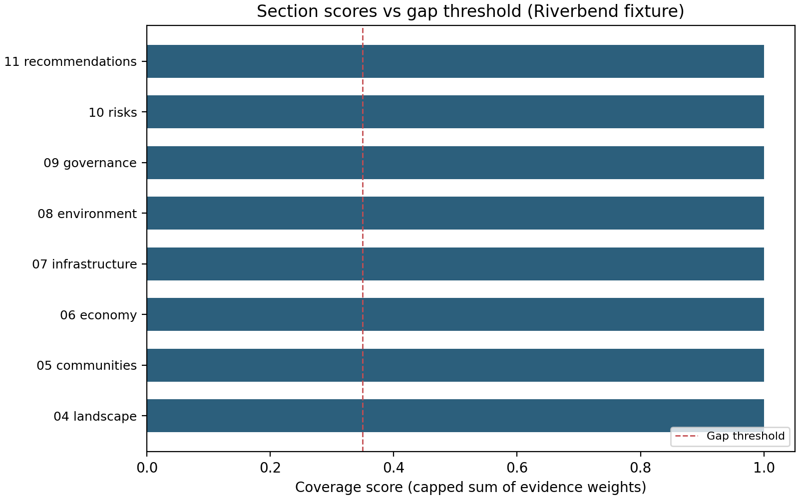

# Abstract

Holistic area reports aggregate geography, communities, economy, infrastructure, environment, and governance into a single maintained narrative. This project treats the **handbook** as a versioned artifact: evidence items with themes and weights roll up into chapter-level coverage scores (with a configurable gap threshold), unused themes and duplicate corpus ids are detected at load time, and analysis scripts regenerate figures plus JSON and Markdown rollups from a committed fixture corpus [@bowker2005; @template2026].

The Riverbend Metropolitan Area fixture demonstrates the full path offline: seventeen evidence rows span eight handbook themes, each row carrying `source_label` and `reviewed_at` so reviewers can see how fresh a claim is without opening side spreadsheets. Synthesis caps section scores at unity, lists gaps when scores sit strictly below policy threshold, and emits `handbook_report.json` for dashboards or funder reporting. Figures show per-section coverage, evidence counts by theme, and gap-aware coloring so visual review stays aligned with machine-readable metrics.

The workflow is offline-first, reproducible, and aligned with the template thin-orchestrator pattern so that prose, code, and outputs stay traceable across update cycles [@edwards2010]. Boundary-style collaboration—planners, funders, and residents interpreting the same outline files differently but converging on shared versions—mirrors how provenance-aware systems stabilize meaning across communities of practice [@gray2005; @star1989]. LLM assists are disabled in this exemplar’s `config.yaml` so CI and local builds remain deterministic.


```{=latex}
\newpage
```


# Introduction

Regions, counties, and cross-border metros rarely lack data; they lack **shared, maintained synthesis**. Dashboards age, PDFs fork, and narrative documents drift from underlying sources. A **living handbook** addresses this by binding three commitments:

1. **Structured evidence** — Each claim carries a theme, source label, review date, and explicit weight.
2. **Deterministic rollups** — Section coverage and gap lists derive from the same rules on every build.
3. **Pipeline coupling** — Figures and tables are regenerated by tested scripts before PDF rendering.

Stakeholders include planners, funders, and community liaisons who need a single entry point that still respects provenance [@gray2005]. Update cadence can follow fiscal quarters, grant milestones, or incident-driven reviews; the corpus `version` string records which snapshot the rendered handbook reflects, while `reviewed_at` on each evidence row signals row-level freshness inside that snapshot.

The Riverbend Metropolitan Area fixture in `data/fixtures/riverbend_area.yaml` illustrates the pattern without network calls: it is fictional, exhaustive across declared themes, and safe for continuous integration. Evidence `ev-001` and `ev-002` anchor the landscape chapter to watershed extent and post-slide zoning; `ev-005` through `ev-008` tie economy and infrastructure to payroll mix, commute trends, bridge backlog, and broadband reach. Authoring conventions for this manuscript live in [handbook_syntax.md](handbook_syntax.md).

**Why YAML first.** The corpus is intentionally flatter than a full knowledge graph: reviewers can diff pull requests, auditors can grep for `source_label`, and the loader can fail fast on schema violations [@bowker2005]. Bibliographic richness stays in `references.bib` for the narrative; the corpus records *which institutional artifact* backed a row, not a complete citation object.

**Roles and boundary objects.** Outline JSON, coverage plots, and `handbook_report.json` function as shared artifacts that technical staff, policy staff, and external partners interpret differently while pinning releases to the same file hashes [@star1989]. When a chapter’s bar sits left of the gap threshold, the gap list names a `section_id` that is stable in PDF, HTML, and JSON—reducing translation error between “the economy chapter feels thin” and “`06_economy` is below threshold 0.35.”

**Scope.** This exemplar does not ingest live APIs, scrape the web, or resolve DOIs for evidence rows. It shows how a frozen corpus plus tested Python modules produce reproducible handbook bodies, slides, and web mirrors under the template pipeline [@template2026].


```{=latex}
\newpage
```


# Methods: Corpus model

The **area corpus** is a YAML (or JSON) document with:

- **Identity** — `area_id`, `area_label`, and semantic `version`.
- **Themes** — Stable identifiers used to route evidence into handbook chapters; each theme includes human-readable `label` and `description` for glossaries and reviewer orientation.
- **Evidence** — Atomic statements with `theme`, `weight` in $[0,1]$, `source_label`, and `reviewed_at`.

Validation rejects unknown themes, out-of-range or non-finite weights, blank text fields, **duplicate** `themes[].id` or `evidence[].id` values, and missing keys so corrupt files fail fast at load time. The loader lives in `src/corpus_io.py` and is covered by dedicated tests (including JSON and YAML entry points).

**Weights as bounded signals.** Each evidence `weight` is a single scalar in $[0,1]$. It is not a probability distribution across rows; it is a reviewer-assigned strength or credibility hint. During synthesis, `section_coverage_score()` sums weights for all evidence whose `theme` matches a section’s `theme_ids`, then caps the sum at $1.0$. That cap prevents stacking many low-confidence rows into an artificially “certain” chapter score.

**Provenance is intentionally lightweight.** The field `source_label` names the document, export, or system row that justified the statement—e.g., “Regional GIS Compendium 2024” or “DOT condition database export”—without embedding a full citation graph in the corpus. Bibliographic detail remains in `references.bib` for the manuscript narrative layer. `reviewed_at` uses ISO-8601 dates so freshness checks sort lexicographically and render cleanly in Markdown tables.

**Riverbend shape.** The fixture declares eight themes (landscape through recommendations) and seventeen evidence rows. Every theme receives at least one row, which yields an empty `themes_without_evidence` list in metrics—a deliberate “happy path” for teaching the pipeline. Sparse corpora in tests demonstrate the opposite: empty `themes_without_evidence` is not guaranteed when teams add themes before evidence arrives.


```{=latex}
\newpage
```


# Methods: Outline and chapter routing

Handbook chapters follow a **fixed template** (`HANDBOOK_TEMPLATE` in `src/outline.py`). Each chapter lists one or more `theme_ids`; evidence items whose `theme` matches are attached during synthesis.

Ordering is lexicographic by `section_id` after discovery in the manuscript directory; numeric prefixes (`04_`, `05_`, …) keep print and PDF alignment with the conceptual flow: landscape through recommendations. The template lists eight sections (`04_landscape` … `11_recommendations`); manuscript files `12_`–`14_` extend the bound volume with maintenance guidance, stakeholder notes, and schema appendix without altering the core scoring template unless `HANDBOOK_TEMPLATE` is edited in code.

**One-to-many routing.** A single theme id may feed multiple sections if the template repeats it, but in this exemplar each operational theme maps to its namesake chapter. Recommendations-themed evidence rolls into `11_recommendations`; risks-themed evidence into `10_risks`. That keeps reviewer mental models simple: the YAML `theme` field is the bucket name reviewers already use in workshops.

**Stability for tests and diffs.** The template can later be parameterized per area (e.g., coastal zones inserting hazard chapters) while keeping the same synthesis interface. For this exemplar, the outline is static so tests assert stable section counts, deterministic score keys, and reproducible `area_outline.json`. Any pull request that changes `HANDBOOK_TEMPLATE` should update tests, fixture expectations, and manuscript headings together.

**Manuscript discovery.** Rendering combines numbered section files, optional `S01_`–style supplemental markdown, then glossary and references buckets per `infrastructure.rendering.manuscript_discovery`. Authors should keep `section_id` strings in code, JSON, and filenames aligned so cross-links and gap reports do not drift.


```{=latex}
\newpage
```


# Methods: Synthesis, gaps, and coverage scores

**Synthesis** (`src/synthesis.py`) maps each handbook section to the tuple of evidence items whose themes intersect the section's `theme_ids`. The **coverage score** is computed by `section_coverage_score()`: the sum of weights for that section, capped at $1.0$, so many weak items cannot masquerade as certainty.

Sections whose score is **strictly below** the configured gap threshold (default `DEFAULT_GAP_THRESHOLD = 0.35`) are listed in `gaps`. Callers may pass `synthesize(corpus, gap_threshold=…)` when a stricter or looser policy applies; the chosen value is stored on `SynthesisResult.gap_threshold` and echoed in JSON metrics via `build_metrics_report()` (`gap_threshold`, `gap_section_ids`, `gap_count`).

Figure \ref{fig:coverage} shows section-level scores for the Riverbend fixture. Figure \ref{fig:bytheme} shows how many evidence rows attach to each theme id in the same fixture. Figure \ref{fig:gapstatus} repeats the section ordering used in metrics export (sorted ids) and colors bars by membership in `gap_section_ids`, so readers can see which chapters would be flagged without rereading JSON.

{#fig:coverage width=85%}

Under the default threshold, the Riverbend exemplar places every outline section at or above the line (`gap_count` is zero in `handbook_report.json`), which is why the executive summary can describe a “fully covered” template run. The chart still documents the contract: any future corpus revision that drags a section left of the dashed line will surface automatically in the gap table from `build_gap_report_md()` and in pipeline metrics.

{#fig:bytheme width=80%}

The histogram is intentionally simple: it answers whether evidence volume is balanced across themes or concentrated in a few buckets. For Riverbend, economy, infrastructure, and recommendations each carry multiple rows, while every declared theme has at least one row (`themes_without_evidence` is empty). Editors use this view to spot missing thematic coverage before rewriting chapter prose.

{#fig:gapstatus width=85%}

When `gap_section_ids` is non-empty, coral bars identify exactly which sections require new evidence or threshold tuning before publication. The sort order matches `scores_by_section` keys in JSON, which keeps figure inspection aligned with diff review of `handbook_report.json`.

Markdown bodies for preview or annex publication are assembled in `src/handbook_md.py`: executive bullets, gap table, evidence-by-theme table, per-section evidence lists, and optional `build_toc_md()` for outline-only exports.


```{=latex}
\newpage
```


# Methods: Quality gates on the corpus file

Before synthesis runs, `src/corpus_io.py` rejects files that would silently corrupt metrics:

- **Unique ids** — Duplicate `themes[].id` or `evidence[].id` values raise `CorpusValidationError`.
- **Non-empty text fields** — Theme `label` and `description`, evidence `statement`, `source_label`, and `reviewed_at` must be non-blank after stripping.
- **Numeric weights** — Each `weight` must parse as a finite float in $[0, 1]$ (NaN and infinity are rejected).

These checks keep CI deterministic: the same YAML on disk always loads or always fails with an actionable message. Downstream `src/corpus_stats.py` then reports themes that have **zero** evidence rows, which is valid (reserved buckets) but visible in the executive summary Markdown.

**Operational implications.** Teams can run the project test suite locally before pushing corpus edits; failures point to line-level validation rather than cryptic PDF breaks later. The gates also protect multi-author editing: two contributors cannot both add `ev-001` without merge resolution—the second duplicate id triggers an exception at load.

**Cross-field consistency.** Every `evidence.theme` must reference an existing `themes[].id`. Typos therefore surface immediately (“economy” vs “economy_sector”) instead of producing silent empty matches during synthesis. Combined with the cap on section scores, these rules keep the handbook honest about what was reviewed and what was never supplied.

**Downstream consumers.** `handbook_report.json` carries `evidence_count`, `theme_count`, `gap_count`, and `themes_without_evidence`. Oversight bodies can treat non-zero `themes_without_evidence` or rising `gap_count` under a fixed threshold as signals to schedule evidence workshops—not as build failures, but as explicit visibility [@template2026].


```{=latex}
\newpage
```


# Landscape and setting

Riverbend spans two watersheds feeding a shared estuary; hillside zoning tightened after repeated slide seasons. These facts anchor transportation, hazard planning, and conservation priorities.

The corpus ties **landscape**-themed evidence to this chapter; synthesis surfaces both strengths (GIS-backed extent data) and places where only policy narrative exists without quantitative backup.

**Evidence in the fixture.** Row `ev-001` (weight 0.9, Regional GIS Compendium 2024) states the core county spans 420 square miles with two major watersheds feeding the Riverbend estuary—establishing geographic scale for every downstream chapter that references “the region.” Row `ev-002` (weight 0.7, County zoning bulletin Q3/2025) records hillside development restrictions after the 2019 slide season, linking land-use law to hazard history. Together they give handbook authors concrete source labels to echo in prose while keeping numbers traceable to reviewed rows.

**Synthesis view.** Landscape evidence is among the strongest-weighted rows in Riverbend; under the default gap threshold the landscape section clears the bar with room to spare. If a future corpus revision removed `ev-001` or slashed weights, the coverage chart and `gap_section_ids` would show the regression before narrative edits masked it.

**Editorial practice.** When new lidar or watershed models arrive, add evidence rows rather than overwriting chapter paragraphs alone. Bump `version` when those rows materially change scores, and cite the new `source_label` in the handbook text so PDF readers can align sentences with corpus metadata [@edwards2010].


```{=latex}
\newpage
```


# Communities and civic life

Unincorporated neighborhoods without chartered councils and overstretched youth programs illustrate how **communities** evidence maps to service gaps. Handbook readers should see both demographic pressure points and civic infrastructure that still functions.

Updates to this chapter should add dated evidence rows rather than rewriting paragraphs ad hoc, preserving auditability.

**Fixture rows.** `ev-003` (weight 0.8) reports twelve unincorporated neighborhoods lack a permanent community council charter, sourced to an internal civic inventory spreadsheet reviewed 2025-10-18. `ev-004` (weight 0.65) notes youth program waitlists exceed capacity in three east-bank school districts, with the school district annual report 2025 as provenance. The weight spread reflects slightly higher confidence in the charter gap count than in the waitlist claim, a judgment reviewers encode explicitly rather than hiding in prose.

**Why both rows matter.** Council charters and youth programs are different failure modes—governance form versus service throughput—but both sit in the communities theme so synthesis can roll them into one chapter score. If either row were removed, the section score would fall, potentially triggering a gap flag under stricter thresholds.

**Handbook voice.** Narrative paragraphs can humanize the spreadsheet facts, but the corpus remains the authority for “how many neighborhoods” and “which school districts.” That split mirrors database provenance practice: store the atomic claim once, reference it many times [@gray2005].

**Maintenance.** When a district publishes a new annual report, add a superseding row or bump `reviewed_at` on a revised statement; avoid silent edits that leave old dates on new numbers.


```{=latex}
\newpage
```


# Economy and livelihoods

Sector concentration (healthcare and logistics) and lengthening commutes describe a labor market that is employed yet stressed for time. **Economy** evidence items capture payroll composition and travel-cost signals.

Economic narratives in the handbook should cite the same source labels as the corpus so PDF and data exports do not diverge.

**Evidence detail.** `ev-005` (weight 0.85, State labor market review) states healthcare and logistics account for 34% of payroll employment region-wide—a single scalar summarizing sector concentration. `ev-006` (weight 0.55, ACS five-year comparison) records median commute time rose six minutes between 2018 and 2024 despite flat population, signaling time poverty even when headcounts hold steady. The lower weight on `ev-006` invites future corroboration from employer surveys or mode-share data without discarding the commute signal today.

**Reading the charts.** In Figure \ref{fig:bytheme}, economy shares the bar chart with other themes; Riverbend carries two economy rows, matching the two statements above. Coverage charts show how those rows combine with the template’s `theme_ids` for `06_economy` to produce a bounded section score.

**Policy links.** Concentration and commute duration interact with infrastructure and environment chapters: bridge delays and heat exposure can compound commute stress. Cross-chapter reading is intentional; the risks chapter (`10_risks`) names systemic couplings explicitly.

**Data hygiene.** When labor market reviews update NAICS rollups or ACS releases new vintages, add rows or deprecate old ones in the corpus rather than patching PDFs only [@bowker2005].


```{=latex}
\newpage
```


# Infrastructure and connectivity

Bridge maintenance backlogs and uneven broadband coverage are classic **infrastructure** themes. The fixture encodes both physical asset risk and digital divide geography.

Handbook maintenance teams can prioritize bond packages or grant applications using gap flags when coverage scores fall below policy thresholds.

**Evidence rows.** `ev-007` (weight 0.9, DOT condition database export) states deferred bridge maintenance spans 47 structures flagged as priority repair—high confidence because asset registries are auditable. `ev-008` (weight 0.75, Broadband map consortium) reports fiber-to-premises coverage reaches 78% of households with rural gaps along the northern ridge. Together they pair heavy civil liability with last-mile equity, a common pairing in regional handbooks.

**Synthesis and finance.** Strong weights on both rows help the infrastructure section score stay robust under default thresholds. If bond scoring workflows consume `handbook_report.json`, teams can watch `scores_by_section` for `07_infrastructure` alongside raw evidence counts to see whether narrative urgency matches quantitative backing.

**Digital divide nuance.** The broadband row is explicitly geographic (“northern ridge”), which handbook prose should preserve rather than generalizing to “rural areas” without naming the ridge feature, unless new evidence broadens the claim.

**Operations.** When DOT exports a new quarterly extract, version the corpus and add or update rows so `reviewed_at` reflects the extract date [@template2026].


```{=latex}
\newpage
```


# Environment and stewardship

Wildland-urban interface expansion and improved sewer overflow performance sit in tension: growth pressure versus capital investment wins. **Environment** evidence should be reviewed after major projects or regulatory cycles.

Linking environmental claims to dated review metadata avoids stale hazard language after remediation.

**Rows in Riverbend.** `ev-009` (weight 0.7, Remote sensing memo 2025) documents wildland-urban interface acres grew 11% since the last land-cover assessment—framing exposure growth independent of any single fire event. `ev-010` (weight 0.6, Water authority annual compliance letter) notes combined sewer overflows dropped after the north interceptor project went online, tying infrastructure capital to ambient water-quality outcomes.

**Tension as a feature.** The handbook presents both statements in one chapter so readers cannot pretend growth and compliance are unrelated. Synthesis still produces a single score; authors interpret trade-offs in prose while the corpus preserves the underlying claims with weights reflecting reviewer confidence.

**Review cadence.** Land-cover assessments arrive on multi-year cycles; compliance letters annually or on permit schedules. `reviewed_at` should jump when those documents refresh; otherwise dashboards overstate freshness [@edwards2010].

**Cross-links.** Heat and hydrology threads continue in `10_risks` and `07_infrastructure`; environment evidence here grounds those discussions in stewardship and regulatory performance.


```{=latex}
\newpage
```


# Governance and services

Overlapping special districts and aging emergency-plan synchronization are **governance** concerns that span jurisdictions. The handbook makes fragmentation visible without pretending a single author owns all fixes.

Cross-reference the risks chapter when governance gaps amplify single points of failure (e.g., shared river crossings).

**Fixture evidence.** `ev-011` (weight 0.8, Interlocal services audit) reports nine special districts overlap tax boundaries in the central corridor, complicating service accounting. `ev-012` (weight 0.45, State readiness checklist) states emergency operations plans were last synchronized across counties in 2021—a lower-weight row flagging stale coordination that may need tabletop exercises to refresh.

**Interpreting weights.** The emergency-plan row carries the lowest weight among Riverbend governance items, signaling uncertainty about whether 2021 remains accurate or whether partial updates occurred without a full sync. Handbook authors should describe that nuance; reviewers can raise the weight after a new statewide drill report enters the corpus.

**Service accounting.** Overlapping districts often confuse residents during tax mailings; the handbook can cite `ev-011` when explaining why service maps disagree across PDFs from different agencies [@star1989].

**Risks coupling.** Freight dependence on a single river crossing (`ev-014` in the risks chapter) becomes more alarming when governance synchronization lags (`ev-012`). Narrative cross-references help readers connect institutional drift to physical vulnerability.


```{=latex}
\newpage
```


# Cross-cutting risks

Heat trends and freight dependence on one river crossing compound one another. **Risks** evidence is intentionally cross-domain so readers see systemic coupling, not siloed hazards.

Scenario planning exercises can attach new evidence rows after each tabletop drill, bumping the corpus version when the handbook is regenerated.

**Evidence.** `ev-013` (weight 0.85, NOAA station history) states heat-wave days above 95°F have doubled in the last two decades at the airport station—climate exposure anchored to a specific observing site. `ev-014` (weight 0.7, Freight model technical appendix) notes a single river crossing carries 62% of east-west freight truck trips, concentrating economic and emergency risk on one structure.

**Compounding.** Either hazard alone warrants attention; together they stress cooling centers, detour capacity, and redundant corridors. The handbook’s risks chapter is where such interactions belong, even when thematic evidence also appears under environment or infrastructure.

**Figures.** Section coverage plots (Figure \ref{fig:coverage}) include `10_risks`; gap status coloring (Figure \ref{fig:gapstatus}) applies the same threshold logic. Under Riverbend defaults all sections pass, but a sparse risks portfolio would show coral bars here first.

**After-action reviews.** Each drill or incident should yield dated rows: new `reviewed_at`, possibly new `source_label` strings pointing to after-action PDFs. That habit keeps the living handbook aligned with operational learning [@template2026].


```{=latex}
\newpage
```


# Recommendations

Prioritized actions in the fixture include data-sharing agreements, bridge maintenance bonds, and resilience hub pilots. **Recommendations** carry the highest weights where consensus already exists in source documents.

The handbook is not a substitute for democratic deliberation; it is a structured rollup of what evidence-backed proposals are on the table at version print time.

**Rows.** `ev-015` (weight 0.9, Regional planning task force draft) calls for a recurring interagency data sharing agreement for transit and land use permits. `ev-016` (weight 0.88, DOT capital program white paper) proposes funding a five-year bridge maintenance bond aligned to the priority repair list—directly echoing infrastructure evidence about deferred repairs. `ev-017` (weight 0.72, Heat equity working group) pilots neighborhood resilience hubs in districts with longest cooling-center travel times, linking recommendations to risks and communities chapters without duplicating their evidence ids.

**Weight ordering.** The data-sharing row tops the weight list among recommendations, signaling strongest reviewer confidence or institutional buy-in in this fictional exercise. Weights are not votes; they guide synthesis caps and gap detection, not automatic budget allocation.

**Narrative boundaries.** Recommendations prose should clarify that inclusion in the corpus does not imply adoption by any elected body [@bowker2005]. The corpus records that a proposal was documented and reviewed on a date, not that it passed a council vote.

**Versioning.** Task-force drafts evolve quickly; when PDFs supersede one another, update `source_label` strings or add successor rows so readers know which draft the handbook referenced.


```{=latex}
\newpage
```


# Handbook maintenance

A living handbook requires **three operational habits**:

1. **Version the corpus** when evidence changes materially.
2. **Run analysis scripts** before rendering so figures and JSON match the corpus.
3. **Archive PDFs** with the corpus version in metadata or filename.

The template pipeline encodes steps 2–3; teams adopt step 1 through governance. Optional LLM assists are disabled in `config.yaml` for this exemplar to keep builds deterministic.

**Pull-request discipline.** Treat `riverbend_area.yaml` (or production corpora) like code: require review, run `uv run pytest projects/area_handbook/tests/`, and attach `handbook_report.json` diffs when scores move. Figure regeneration via `scripts/02_generate_handbook_figure.py` updates PNGs and `figure_registry.json`, keeping validation green in `04_validate_output.py`.

**Release artifacts.** Ship three bundles together: the corpus file at a tagged version, `handbook_report.json`, and the combined PDF (or HTML). Consumers can then verify that narrative, metrics, and data describe the same snapshot [@gray2005].

**Threshold policy.** Changing `DEFAULT_GAP_THRESHOLD` in code alters which sections gap without any prose edit. Document threshold policy in steering minutes and prefer explicit `synthesize(..., gap_threshold=...)` in custom scripts if regional policy diverges from repository defaults.

**Supplemental sections.** Files such as `S01_*.md` and `S02_*.md` follow manuscript discovery ordering; add them when limitations or worked examples grow too long for the main chapter flow.

**Slides and web.** The same markdown feeds Beamer slides and static web mirrors; maintenance includes checking relative figure paths after directory moves and confirming browser loads for `output/web/index.html` after each major template upgrade [@template2026].


```{=latex}
\newpage
```


# Stakeholders and use cases

**Regional planners** use the handbook as a single narrative spine across departments; the corpus gives them a checklist of which chapters still lack reviewed evidence. Shared artifacts such as the outline JSON and coverage figures act as **boundary objects** in the sense of @star1989: different groups attach different meanings while aligning on the same file versions.

**Funders and oversight bodies** can require a corpus version string and the `handbook_report.json` metrics block as deliverables, without mandating a particular writing style in the prose chapters. `coverage_ratio`, `gap_count`, and `total_evidence_weight` summarize whether the outline is backed at the threshold encoded in the build—useful for pass/fail gates on grants.

**Community liaisons** benefit when gap sections name `section_id` codes that map back to outline rows—those ids are stable across PDF, HTML, and JSON exports. When a chapter is thin, liaisons can translate `06_economy` into plain language without losing traceability to the same machine-readable key funders see.

**Tooling maintainers** extend `HANDBOOK_TEMPLATE` in `src/outline.py` when new policy domains appear (e.g., housing, broadband equity), then add matching themes to the YAML schema and manuscript files in the same pull request. Skipping any leg of that triangle yields empty scores or orphan markdown files.

**Emergency managers and public works directors** may never edit YAML; they consume PDFs and slides. For them, figures such as Figure \ref{fig:bytheme} communicate whether thematic buckets are balanced, while Figure \ref{fig:gapstatus} shows whether any section failed the gap policy on the last build.

**Researchers studying provenance** can treat the corpus as a bounded case of lightweight metadata practice: enough structure for automation, not so much that community partners cannot contribute rows [@gray2005].

The Riverbend fixture is intentionally **fictional** so public repos can ship a full worked example without redacting real resident data.


```{=latex}
\newpage
```


# Appendix: YAML corpus schema (normative summary)

| Field | Location | Constraint |
|-------|-----------|--------------|
| `area_id` | root | Non-empty string |
| `area_label` | root | Non-empty string |
| `version` | root | Non-empty string (semantic or calendar versioning recommended) |
| `themes` | root | Non-empty list of objects with `id`, `label`, `description` |
| `evidence` | root | List (may be empty) of objects with `id`, `statement`, `theme`, `weight`, `source_label`, `reviewed_at` |

Each `evidence.theme` must equal some `themes[].id`. Weights are unitless credibility or strength signals capped per row at $1.0$; section scores cap the sum per chapter at $1.0$ in `src/synthesis.py`.

**Example evidence object (Riverbend).**

```yaml
- id: ev-007
  statement: Deferred bridge maintenance now spans 47 structures flagged as priority repair.
  theme: infrastructure
  weight: 0.9
  source_label: DOT condition database export
  reviewed_at: "2025-11-28"
```

**Example theme object.**

```yaml
- id: infrastructure
  label: Infrastructure
  description: Transport, utilities, broadband, and maintenance backlogs.
```

Machine-readable outline and metrics after a build:

- `projects/area_handbook/output/data/area_outline.json`
- `projects/area_handbook/output/data/handbook_report.json`
- `projects/area_handbook/output/data/handbook_toc.md`

The combined human-readable rollup lives in `handbook_body.md` in the same directory.

**Figures and registry.** Running `scripts/02_generate_handbook_figure.py` writes PNGs under `projects/area_handbook/../figures/` and updates `figure_registry.json` for validation. Manuscript labels `fig:coverage`, `fig:bytheme`, and `fig:gapstatus` must stay aligned with that script.

**Empty evidence list.** An empty `evidence` array still instantiates all template sections with score zero; metrics report `gap_count` equal to section count. This edge case is tested to prevent divide-by-zero surprises in coverage ratios.

**JSON interchange.** `load_corpus_from_dict` accepts Python dicts shaped like parsed JSON for tests and API adapters; the same constraints as YAML apply [@template2026].


```{=latex}
\newpage
```


# Supplement: Limitations and assumptions

This exemplar prioritizes **reproducibility and teachability** over geographic realism. Riverbend is fictional; weights and source labels illustrate schema use, not empirical findings about any jurisdiction.

**No live data.** The pipeline does not call HTTP APIs, scrape documents, or perform NLP on attachments. Every number in the handbook narrative traces to a hand-authored YAML row or to derived metrics computed from those rows.

**Weights are subjective.** Reviewers assign `weight` in $[0,1]$ without a universal rubric. Cross-team calibration is a governance task outside this repository; the code assumes weights are already consensus values.

**Single corpus per build.** The scripts load one fixture path (`data/fixtures/riverbend_area.yaml` in production use of this demo). Merging multiple corpora or federating regions would require new modules and tests, not configuration toggles alone.

**Outline static in code.** `HANDBOOK_TEMPLATE` is Python source, not a per-area YAML file. Customizing chapters without editing code is possible only within the existing section files and themes; adding a ninth scored section demands code and test updates.

**Citation depth.** `source_label` is a short string, not a BibTeX key. Formal citations belong in manuscript markdown using `references.bib`; the corpus stays lean [@bowker2005].

**Threshold semantics.** “Gap” means strictly below threshold, not “close.” Sections barely above the line still pass; policy teams may want stricter thresholds or secondary rules implemented in future metrics fields.


```{=latex}
\newpage
```


# Supplement: Worked example — reading Riverbend end to end

This note walks a reviewer from fixture file to rendered artifacts without running commands, highlighting how ids line up across layers.

**1. Load and validate.** `src/corpus_io.load_corpus` reads `riverbend_area.yaml`, checks ids, weights, and theme membership, and builds an `AreaCorpus` object. Failure modes include duplicate `ev-001` or a `weight` of `nan`.

**2. Outline.** `build_handbook_outline` returns `HANDBOOK_TEMPLATE`: eight sections from `04_landscape` through `11_recommendations`, each with `theme_ids` that pick up matching evidence.

**3. Synthesis.** `synthesize` attaches evidence to sections, sums weights with a cap of $1.0$, compares each score to `DEFAULT_GAP_THRESHOLD` (0.35), and fills `gaps` with ids strictly below threshold. Riverbend under defaults yields an empty gap tuple because every section clears the bar.

**4. Metrics JSON.** `build_metrics_report` flattens scores, gap lists, theme histograms, and descriptive stats. A CI job can assert `evidence_count == 17` and `themes_without_evidence == []` for this fixture.

**5. Markdown bodies.** `build_full_handbook_body` emits section headings, evidence lists, and tables suitable for annex publication; `handbook_toc.md` mirrors outline depth.

**6. Figures.** `02_generate_handbook_figure.py` plots scores, theme counts, and gap-colored bars, then registers `fig:coverage`, `fig:bytheme`, and `fig:gapstatus` in `figure_registry.json` so `validate_figure_registry` passes during output validation.

**7. Manuscript.** Numbered markdown sections plus this supplemental file combine through manuscript discovery; Pandoc assigns figure numbers from attributes `{#fig:...}` while preserving `\ref{...}` in PDF.

**Traceability spot check.** If prose cites “47 priority bridges,” the reviewer should find `ev-007` with that statement and DOT export provenance. If not, the narrative drifted from the corpus [@gray2005].


```{=latex}
\newpage
```


# Manuscript syntax (area handbook)

## Citations

Use Pandoc bracket cites with keys from `references.bib`:

```markdown
See [@bowker2005; @template2026] for context.
```

## Figures

Analysis writes PNGs under `../figures/`. Reference from markdown:

```markdown
{#fig:coverage width=85%}

{#fig:bytheme width=80%}

{#fig:gapstatus width=85%}
```

Run `scripts/02_generate_handbook_figure.py` via the pipeline before rendering (also refreshes `../figures/figure_registry.json`).

## Section files

Numbered prefixes `01_`–`14_` and `03a`–`03d` sort in the main manuscript group. This file lives in the **other** discovery bucket (name does not start with a digit or `S01_` pattern) and is ordered lexicographically among other non-main files—keep the filename stable so build logs stay predictable.
