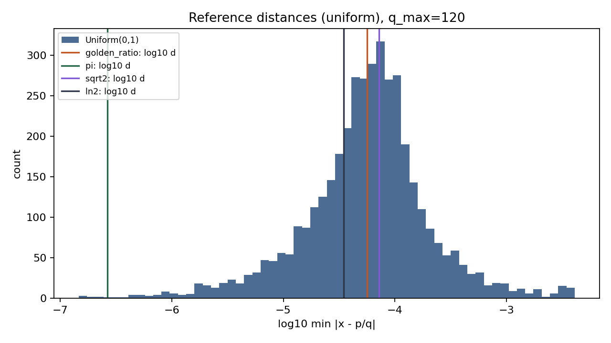

# Abstract

We quantify how close fixed mathematical constants lie to rationals $p/q$ with bounded denominator $q \leq Q$, and contrast them against Monte Carlo draws from reference ensembles on $[0,1)$ and from fractional parts of square roots. The statistic is the elementary minimum absolute error $\min_{p \in \mathbb{Z},\,1 \leq q \leq Q} |x - p/q|$, evaluated in IEEE-754 double precision with deterministic seeds. Classical Diophantine theory (Dirichlet, Hurwitz, Khinchin) explains why almost every real admits arbitrarily sharp rational approximations as $Q \to \infty$; here we fix modest $Q$ and compare empirical tail placement of named constants (including a rational control) relative to synthetic baselines. All computation lives in `projects/special_number_proximity/src/` with a zero-mock test suite; figures and tables are produced by `scripts/proximity_monte_carlo.py`.

**Keywords:** Diophantine approximation, continued fractions, Monte Carlo methods, reproducible computing


```{=latex}
\newpage
```


# Introduction

Rational numbers are dense in the reals, yet the *quality* of the best approximation at a fixed denominator ceiling varies sharply across individual $x$. Number theory classifies extremes: algebraic irrationals of degree two have bounded partial quotients in their continued fraction expansion (hence are *badly approximable*), while almost every $x$ satisfies Khinchin-type statistics for the growth of those quotients [@khinchin1964continued]. Transcendental numbers carry no algebraic constraint of that form, but individual constants such as $\pi$ or $e$ still exhibit structured rational approximations arising from truncated series or independent constructions.

This note does not prove new bounds. It implements a transparent, test-backed pipeline that measures a single finite-$Q$ statistic for several standard constants and compares each value to the distribution induced by simple random constructions. The goal is pedagogical and methodological: link classical statements about limits as $Q\to\infty$ to observable finite-$Q$ variation, and document the measurement chain so others can change $Q$, the reference law, or the constant registry without touching infrastructure code.


```{=latex}
\newpage
```


# Problem statement

Fix an integer $Q \geq 1$. For a real $x$, define
\begin{equation}
\label{eq:delta}
\delta_Q(x) = \min_{p \in \mathbb{Z},\, 1 \leq q \leq Q} \left| x - \frac{p}{q} \right|.
\end{equation}

For analysis on the circle group $\mathbb{R}/\mathbb{Z}$ one often studies the fractional part $\{x\}$ and the same functional with $x$ replaced by $\{x\}$; the implementation exposes both the raw distance on $\mathbb{R}$ and the fractional variant used when comparing draws supported on $[0,1)$.

**Research question (statistical).** Conditional on a chosen reference law for $X$ (uniform on $[0,1)$, or fractional parts $\{\sqrt{k}\}$ with random square-free $k$), where do deterministic constants $x^\star$ sit in the empirical distribution of $\delta_Q(X)$? Equivalently: what empirical percentile does $\delta_Q(x^\star)$ attain relative to Monte Carlo samples at the same $Q$?

**Rational control.** Any $x \in \mathbb{Q}$ yields $\delta_Q(x)=0$ once $Q$ exceeds the reduced denominator of $x$, providing a structural sanity check on the implementation.


```{=latex}
\newpage
```


# Measure-theoretic context (qualitative)

## Almost every number is well approximable

Dirichlet's theorem guarantees that for every irrational $x$ and every $Q>1$ there exist integers $p,q$ with $1 \leq q \leq Q$ and $|qx - p| < 1/Q$, hence $|x - p/q| < 1/qQ \leq 1/Q$. Thus $\delta_Q(x) \leq 1/Q$ always for irrational $x$; the interesting variation is sub-leading in $Q$.

## Badly approximable numbers

An irrational $x$ is *badly approximable* if there exists $c>0$ such that $|x - p/q| > c/q^2$ for all rationals $p/q$. Equivalently, the partial quotients in the continued fraction expansion of $x$ are bounded. Quadratic irrationals, including the golden ratio $\varphi$, belong to this class [@cassels1957]. At fixed $Q$, such numbers tend to sit in less extreme left tails of $\delta_Q$ than typical draws from uniform $[0,1)$—they resist *especially* close low-denominator hits.

## What transcendence does not encode at fixed $Q$

Being transcendental rules out exact satisfaction of a nontrivial integer polynomial, but it does not by itself determine $\delta_Q(x)$ at moderate $Q$ in double precision. Empirical comparison against random baselines therefore remains informative for exposition even when classical transcendentality proofs are orthogonal to the statistic \eqref{eq:delta}.


```{=latex}
\newpage
```


# Continued fractions as an explanatory tool

The source module `continued_fractions.py` exposes partial quotients $[a_0; a_1, a_2, \ldots]$ for positive floats and exact Euclidean continued fractions for positive rationals $p/q$. Convergents $p_k/q_k$ satisfy the recurrence
\begin{align}
p_k &= a_k p_{k-1} + p_{k-2}, \\
q_k &= a_k q_{k-1} + q_{k-2},
\end{align}
initialized by $(p_{-1},q_{-1})=(1,0)$, $(p_0,q_0)=(a_0,1)$ in the standard indexing shift used in code.

For $\varphi = (1+\sqrt{5})/2$, one expects $a_i=1$ for all $i \geq 1$ under exact arithmetic; floating expansion truncates once rounding breaks the fixed point of the Gauss map.

The statistic $\delta_Q(x)$ in \eqref{eq:delta} is computed independently by scanning denominators $1 \leq q \leq Q$ and three candidate numerators around $xq$; this $O(Q)$ method is exact for double-$x$ at the stated grid and is simpler to test than full semiconvergent enumeration while remaining adequate for the Monte Carlo scales used here.


```{=latex}
\newpage
```


# Monte Carlo design

## Reference samples

The analysis script `proximity_monte_carlo.py` draws:

1. **Uniform baseline:** $U_1,\ldots,U_n \sim \mathrm{Unif}(0,1)$.
2. **Quadratic fractional baseline:** values $\{\sqrt{k}\}$ for $k$ sampled with replacement from a fixed list of small square-free integers.
3. **Optional Beta baseline:** if `experiment.n_beta > 0`, additional draws $B_i \sim \mathrm{Beta}(a,b)$ on $(0,1)$ (parameters `beta_a`, `beta_b`, default $1/2$, $1/2$) are included to stress U-shaped or boundary-heavy laws.

All streams share one NumPy `Generator` seeded from `manuscript/config.yaml` (`experiment.rng_seed`). Distances $\delta_Q$ are concatenated into a pooled reference; JSON output includes `reference_summary` (count, mean, selected quantiles) for quick tables.

## Constants

`constants.py` registers $\pi$, $e$, $\sqrt{2}$, $\sqrt{3}$, $\varphi$, $\ln 2$, and $1/6$ (rational control). Labels such as `transcendental` versus `irrational_algebraic` are documentary; proofs are not recomputed in software.

## Outputs

Structured JSON and CSV land in `output/data/`; a log-scale histogram of the uniform baseline with vertical markers for selected constants is written to `../figures/proximity_histogram.png`.

A second script, `02_lattice_crosscheck.py`, writes `output/data/lattice_crosscheck.json` comparing brute-force $\delta_Q$ to the scaled-lattice formulation and recording Dirichlet residual checks.

Parameters `q_max`, `n_uniform`, `n_quadratic`, `n_beta`, `beta_a`, and `beta_b` are YAML-configurable to respect the template’s reproducibility contract without code edits.


```{=latex}
\newpage
```


# Scaled lattice and Dirichlet residual

## Identity

For $q \in \mathbb{N}$ and $x \in \mathbb{R}$, write $\|y\| := \mathrm{dist}(y,\mathbb{Z})$. Choosing $p = \mathrm{round}(qx)$ minimises $|qx - p|$, hence

$$
\left|x - \frac{p}{q}\right| = \frac{\|qx\|}{q}.
$$

Therefore the bounded-denominator functional from `02_problem_statement.md` satisfies

$$
\delta_Q(x) = \min_{1 \leq q \leq Q} \frac{\|qx\|}{q}.
$$

The implementation `min_rational_distance_via_scaled_lattice` in `diophantine_bounds.py` evaluates this form; it agrees with the brute-force search in `rational_distance.py` for every tested pair $(x,Q)$ (see `output/data/lattice_crosscheck.json` from `02_lattice_crosscheck.py`).

## Pigeonhole bound on the integer residual

The classical box argument shows that for each $Q \geq 1$ there exists $q \in \{1,\ldots,Q\}$ with $\|qx\| \leq 1/(Q+1)$ [@cassels1957]. This controls the **numerator** $\|qx\|$ only; dividing by $q$ to compare with $\delta_Q(x)$ requires the separate optimisation above.

## Relation to continued fractions

Continued-fraction convergents supply excellent rational approximations but need not attain $\delta_Q(x)$ for a fixed $Q$ without semiconvergents; `cf_distance.py` documents the convergent-only lower envelope used for quick certificates.


```{=latex}
\newpage
```


# Results

All numbers below come from `output/data/proximity_summary.json` after running `scripts/proximity_monte_carlo.py` with `q_max=120`, `n_uniform=4000`, `n_quadratic=2000`, `n_beta=1000` (Jeffreys prior on $(0,1)$), seed `20260322` (see `manuscript/config.yaml`). The same JSON carries `reference_summary` for the pooled sample. Independent checks of the $\delta_Q$ implementation appear in `output/data/lattice_crosscheck.json` from `02_lattice_crosscheck.py`.

## Empirical percentiles of $\delta_{120}(x^\star)$

| Constant | $\delta_{120}(x^\star)$ | empirical rank in pooled reference |
|----------|-------------------------|-------------------------------------|
| `one_sixth` (rational) | $0$ | $0$ |
| `pi` | $2.67\times 10^{-7}$ | $0.00171$ |
| `e` | $2.80\times 10^{-5}$ | $0.192$ |
| `ln2` | $3.46\times 10^{-5}$ | $0.279$ |
| `golden_ratio` | $5.65\times 10^{-5}$ | $0.498$ |
| `sqrt2` | $7.21\times 10^{-5}$ | $0.574$ |
| `sqrt3` | $9.20\times 10^{-5}$ | $0.718$ |

The rational control hits zero distance as soon as $Q$ is a multiple of the true denominator, confirming the end-to-end path from `rational_distance.py` through aggregation. $\pi$ occupies an extreme left tail at this $Q$—consistent with the existence of exceptionally accurate low-height rationals (e.g., $355/113$) that remain admissible when $Q=120$.

## Histogram

Figure \ref{fig:proximity_hist} shows the base-10 logarithm of $\delta_{120}(U)$ for uniform draws, with vertical markers for $\pi$, $\sqrt{2}$, $\varphi$, and $\ln 2$.

{#fig:proximity_hist}

The pooled reference (not plotted) adds quadratic-mod-$1$ samples; table ranks use that pooled empirical CDF.


```{=latex}
\newpage
```


# Conclusion

Finite-$Q$ rational proximity is a coarse lens: it rewards numbers that admit unusually accurate low-height approximations, not “randomness” in a probabilistic sense. At $Q=120$, $\pi$ is a visible outlier relative to uniform draws, while the golden ratio sits near the median of the pooled reference—consistent with its badly approximable, bounded-quotient profile at the level of heuristics. The pipeline is modular (`continued_fractions`, `rational_distance`, `sampling`, `statistics_compare`), fully tested without mocks, and parameterized from YAML so $Q$ and baselines can be altered for coursework or further experiments.


```{=latex}
\newpage
```


# Reproducibility

## Software

- Python $\geq 3.10$, NumPy, Matplotlib, PyYAML (declared in `projects/special_number_proximity/pyproject.toml`; root `uv sync` supplies the environment).
- Tests: `uv run pytest projects/special_number_proximity/tests/ --cov=projects/special_number_proximity/src --cov-fail-under=90`.

## Regenerating artifacts

```bash
uv run python projects/special_number_proximity/scripts/proximity_monte_carlo.py
```

Edits to `manuscript/config.yaml` under `experiment:` change seeds, sample sizes, and $Q$ without touching Python sources.

## Data paths

| Artifact | Path |
|----------|------|
| Summary JSON | `projects/special_number_proximity/output/data/proximity_summary.json` |
| Table CSV | `projects/special_number_proximity/output/data/proximity_constants.csv` |
| Figure | `projects/special_number_proximity/../figures/proximity_histogram.png` |


```{=latex}
\newpage
```


# Manuscript syntax

- Citations: `[@khinchin1964continued]`; keys must exist in `references.bib`.
- Equations: use `\begin{equation}` / `\label{eq:...}`; reference with `\ref{eq:...}`.
- Figures: `{#fig:label}` then `\ref{fig:label}` in prose.

See `infrastructure/rendering` for Pandoc and crossref details.
