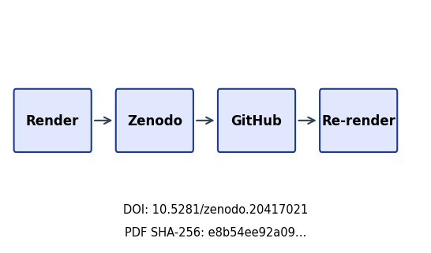
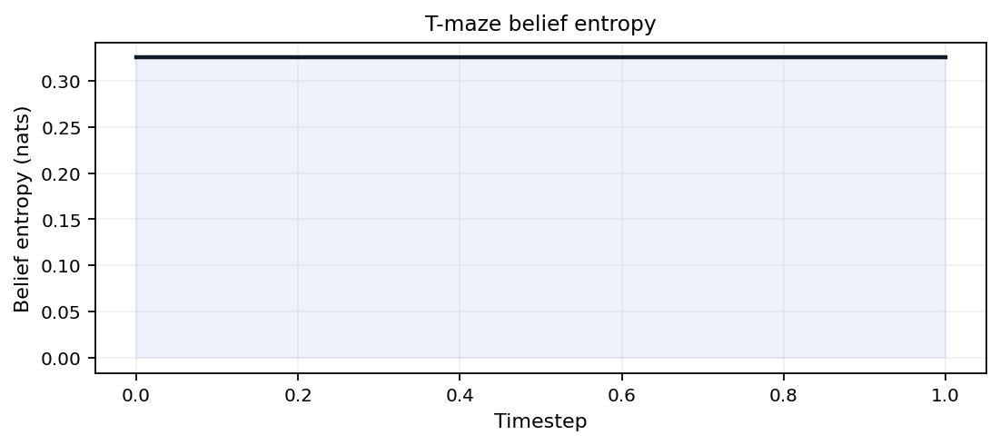

```{=latex}
\thispagestyle{empty}
\setlength{\parskip}{0pt}
\setlength{\itemsep}{0pt}
\begin{samepage}
\scriptsize
```

```{=latex}
\section*{BEGINNING OF TRANSMISSION}\label{beginning-of-transmission}
```

**State:** unpublished / pending pairing

```{=latex}
\subsubsection*{Release metadata}
```

- **Title:** Active Inference Multi-Track Exemplar
- **Version:** 0.2.0
- **DOI:** 10.5281/zenodo.20417021
- **GitHub:** docxology/template_active_inference
- **Zenodo:** https://zenodo.org/records/20417021
- **SHA-256:** `e8b54ee92a09e8f23ebecae00b0057a2b6d37318f050d5326a40b8af0c999574`
- **SHA-512:** `887a6f4f526c90c85d51db57d8205e8c9358e1a6352a58620db1c16842628ca7c028c3a16b4b05eb831b6eec1de47f98b5dcf8a21573552f270c28764fda9f26`

**Pairing:** pending — unresolved:
- ✗ GitHub release URL: `pending`

{width=98%}

```{=latex}
\subsubsection*{Transmission manifest}
```

```
title=Active Inference Multi-Track Exemplar
version=0.2.0 doi=10.5281/zenodo.20417021
sha256=e8b54ee92a09e8f2… manifest={"t":"Active Inference Multi-T","v":"0.2.0","d":"10.5281/zenodo.20417021","s":"e8b54ee92a09e8f2"}
```

Structured manifest: `../data/transmission_manifest.json`

{width=35%}

**Stego:** off | overlays text | barcodes on | XMP on | manifest on → `./secure_run.sh`

```{=latex}
\end{samepage}
\newpage
```


<!-- BEGINNING OF TRANSMISSION -->


```{=latex}
\newpage
```


# Sheaf Track Coverage

This page summarizes which **sheaf fragment tracks** are bound for each IMRAD row in `manuscript/sheaf/manifest.yaml`. The matrix is regenerated at compose time.

**Totals:** 42 present / 42 bound / 0 missing (gray).

| Color | Meaning |
| --- | --- |
| Black | Track **present** (bound and fragment exists) |
| White | **Absent** (not bound for this row) |
| Gray | **Missing** (bound but fragment file absent) |

## Introduction

- **Introduction** *(group)*
-   **Motivation and Active Inference scope**
-   **Exemplar contributions**
## Methods

- **Methods** *(group)*
-   **Analytical Bernoulli–Ising toy**
-   **pymdp sophisticated inference harness**
-   **Lean boundary witnesses**
-   **Sheaf composition pipeline**
## Results

- **Results** *(group)*
-   **Mutual information sweep**
-   **Free energy decomposition**
-   **T-maze sophisticated inference rollout**
-   **Invariant gate summary**
## Discussion

- **Discussion** *(group)*
-   **Limitations and extensions**
## Appendix

-   **Full sheaf track coverage (proof)**


*Coverage overview. Sheaf track coverage matrix: 16 IMRAD rows × 10 fragment columns. Black = present (P), white = absent (—), gray = missing (M). Counts: 42 present / 42 bound / 0 missing.*

Appendix row `16_appendix_full_sheaf.md` binds 9 fragment track types as a composability proof (registry defines 10 types; optional `layers` is methods-only).


```{=latex}
\newpage
```


# Abstract

This public exemplar binds **7 pipeline tracks** — Lean, analytical Python, pymdp sophisticated inference, GNN, ontology concordance, visualizations, and the sheaf manuscript composer — declared in [`tracks.yaml`](../tracks.yaml). Flat manuscript sections follow an **IMRAD outline** (Introduction, Methods, Results, Discussion, plus appendix) assembled from **10 sheaf fragment types** registered in [`manuscript/sheaf/tracks.yaml`](sheaf/tracks.yaml).

The first page ([`00_00_sheaf_coverage.md`](00_00_sheaf_coverage.md)) shows a **16-row coverage matrix** (4 IMRAD group headers and 12 composed subsections, including a full-track appendix proof) regenerated from the live manifest at compose time.

The T-maze demo aligns with [pymdp sophisticated_inference examples](https://github.com/infer-actively/pymdp/tree/main/examples/experimental/sophisticated_inference).

Measured invariant checks: 12 / 12 passed. SI planning horizon: 2 steps.


```{=latex}
\newpage
```


# Motivation and Active Inference scope

<!-- sheaf-track:prose -->

This public exemplar demonstrates a **sheaf-composed** Active Inference manuscript: flat sections bind optional fragment tracks (prose, formalism, simulation, pymdp, visualization, Lean, GNN, ontology) under an IMRAD outline. The first page heatmap summarizes which tracks are bound per section.

The pymdp track follows the [pymdp sophisticated_inference examples](https://github.com/infer-actively/pymdp/tree/main/examples/experimental/sophisticated_inference) with a minimal T-maze and planning horizon `policy_len = 2`.


```{=latex}
\newpage
```


# Exemplar contributions

<!-- sheaf-track:prose -->

This exemplar contributes:

1. **7 pipeline tracks** (`tracks.yaml`) — analytical Python, pymdp, GNN, ontology, Lean, visualizations, and sheaf composition — each with artifact gates.
2. **10 sheaf fragment types** registered in `manuscript/sheaf/tracks.yaml` (including optional `layers` and `animation`).
3. A **16-row IMRAD coverage matrix** on the first page, regenerated from the live manifest at compose time.
4. Registry-backed **invariant checks** (12 / 12 passed) and measured SI rollout metrics.

<!-- sheaf-track:ontology -->

### Ontology bindings

- `expected_free_energy` → **ExpectedFreeEnergy**
- `location` → **HiddenState**
- `observation` → **ObservationLikelihood**
- `policy` → **PolicyPosterior**


```{=latex}
\newpage
```


# Analytical Bernoulli–Ising toy

<!-- sheaf-track:prose -->

We study a minimal **K=2 Bernoulli / Ising** coupling as the analytical companion to multi-track verification. Closed-form mutual information $I(\lambda)$ provides an oracle for empirical checks and GNN round-trips.

Measured sweep grid points: 21. Invariants passed: 12 / 12.

<!-- sheaf-track:formalism -->

The entangled joint over binary policies satisfies

$$q_\lambda(\pi) \propto E(\pi)\,\exp(\lambda J(\pi)),$$

with symmetric Ising coupling $J$ and deformation parameter $\lambda$. Mutual information is $I(\lambda)=\log 2 - H_b(\sigma(\lambda))$.

<!-- sheaf-track:simulation -->

The analytical track writes `output/data/parameter_sweep.csv` comparing closed-form and empirical mutual information across $\lambda \in [0, 4]$.

<!-- sheaf-track:visualization -->


*Figure 1 (methods). Closed-form and Monte Carlo mutual information I(λ) for the symmetric Bernoulli-Ising toy across 21 grid points up to λ_max = 4; grid maximum 0.6031 nats on the measured sweep.*

<!-- sheaf-track:gnn -->

The Bernoulli toy is also declared in `gnn/bernoulli_toy.gnn.md` (GNN v1.1). Ontology annotations bind framework symbols to Active Inference Ontology terms.

<!-- sheaf-track:ontology -->

### Ontology bindings

- `J` → **CrossStreamCouplingPotential**
- `gamma` → **SophisticationWeight**
- `lam` → **EntanglementDeformationParameter**
- `pi1` → **Stream1PolicyVector**
- `pi2` → **Stream2PolicyVector**
- `q_joint` → **EntangledJointPosterior**


```{=latex}
\newpage
```


# pymdp sophisticated inference harness

<!-- sheaf-track:prose -->

**Sophisticated inference (planning horizon).** This section documents a **real pymdp state-inference harness** on a minimal T-maze with planning horizon `policy_len = 2`. Default mode is `state_inference` (T-maze rollout via `simulate_si_tmaze.py`). The Agent constructs a multi-step policy set (`num_policies` logged in artifacts); per-step **belief entropy** is recorded in `output/logs/pymdp_runs.jsonl` and aggregated as `mean_belief_entropy`.

Graph-world `infer_policies` is an opt-in extension stub — see `tracks.yaml` `extension_tracks.graph_world` and `scripts/simulate_si_graph_world.py`. Reference notebooks: [pymdp sophisticated_inference](https://github.com/infer-actively/pymdp/tree/main/examples/experimental/sophisticated_inference).

Mean belief entropy across steps: 0.3251.

<!-- sheaf-track:formalism -->

Given generative matrices $A,B,C,D$, pymdp computes state beliefs $q(s)$ via variational inference (`infer_states`). The Agent is configured with planning horizon $H =$ 2, which defines the **policy depth** used when constructing candidate policies (logged as `num_policies` in `output/data/si_tmaze_summary.json`).

This exemplar records belief entropy per step; extending to full expected-free-energy policy selection (`infer_policies`) is documented as a follow-on track.

<!-- sheaf-track:pymdp -->

Artifact paths:

- `output/logs/pymdp_runs.jsonl` — append-only JSONL run log
- `output/data/si_tmaze_summary.json` — step count, actions, mean belief entropy
- `output/data/si_tmaze_trace.json` — rollout trace

Steps recorded: 2.

<!-- sheaf-track:gnn -->

See `gnn/si_tmaze.gnn.md` for a GNN view of the T-maze hidden state, observation, and policy variables with ontology bindings.

<!-- sheaf-track:ontology -->

### Ontology bindings

- `belief_entropy` → **BeliefEntropy**
- `loc` → **HiddenState**
- `obs` → **ObservationLikelihood**
- `pi` → **PolicyPosterior**


```{=latex}
\newpage
```


# Lean boundary witnesses

<!-- sheaf-track:prose -->

The Lean track provides minimal boundary witnesses checked by `lake build` under `lean/TemplateActiveInference/`. Fragments cite theorem names without duplicating proof scripts in prose.

See the Lean fragment for module references aligned with the analytical toy.

<!-- sheaf-track:lean -->

Lean module `TemplateActiveInference.SophisticatedInference` declares the planning horizon parameter and a witness that horizon $> 1$ distinguishes sophisticated from myopic inference.

Build via `lake build` under `lean/`.


```{=latex}
\newpage
```


# Sheaf composition pipeline

<!-- sheaf-track:prose -->

Sheaf composition glues registered fragment tracks into flat manuscript sections using `manuscript/sheaf/manifest.yaml` and `manuscript/sheaf/tracks.yaml`.

The layers overview figure (registry caption in `figures.yaml` `section_figures.methods_sheaf`) summarizes the 10 fragment layer types and their IMRAD bindings in one panel (registry stack plus binding heatmap). The tables below list every track definition and section×track binding from the live manifest at compose time.

```bash
uv run python scripts/compose_manuscript.py
uv run python scripts/compose_manuscript.py --validate-only --strict
```

Each compose run emits `output/data/sheaf_coverage_matrix.json` and regenerates coverage artifacts. Partial compose (`--section`) is draft-only; the matrix always reflects the full manifest.

Coverage semantics: **black / P** = present (bound and file exists); **white / —** = absent (not bound); **gray / M** = missing (bound but file absent). Discussion limitations reference the same matrix counts (`42` / `42` / `0`).

<!-- sheaf-track:formalism -->

Each fragment track $t \in \mathcal{T}$ maps to renderer $R(t)$ and compose-order index $\pi(t)$ from `manuscript/sheaf/tracks.yaml`. For manifest row $s$, cell $B(s,t) \in \{\mathrm{P}, \mathrm{—}, \mathrm{M}\}$ follows the coverage matrix regenerated at compose time (42 present / 42 bound / 0 missing).

Registry size: $|\mathcal{T}| = 10$ types across 16 IMRAD manifest rows. Formal track definitions and section×track bindings appear in the generated tables below.

<!-- sheaf-track:visualization -->


*Figure 6 (methods). Sheaf layers overview: registry stack (compose order, renderer ids) and IMRAD binding heatmap for 10 fragment types across 16 manifest rows (42 present / 42 bound / 0 missing).*

<!-- sheaf-track:layers -->

<!-- sheaf-layers:registry -->
## Sheaf fragment track registry

Compose order and renderer bindings from `manuscript/sheaf/tracks.yaml`.

| Order | Track id | Label | Renderer | Optional |
| ---: | --- | --- | --- | --- |
| 10 | `prose` | Narrative prose | `markdown` | No |
| 20 | `formalism` | Mathematical formalism | `markdown` | No |
| 30 | `simulation` | Analytical simulation notes | `markdown` | No |
| 35 | `layers` | Sheaf layers tables | `layers_report` | Yes |
| 40 | `pymdp` | pymdp harness artifacts | `markdown` | No |
| 50 | `visualization` | Figure references | `section_figures` | No |
| 60 | `lean` | Lean boundary fragment | `markdown` | No |
| 70 | `gnn` | GNN notation fragment | `markdown` | No |
| 80 | `ontology` | Active Inference Ontology bindings | `ontology_yaml` | No |
| 90 | `animation` | Animation fragment | `markdown` | Yes |

**Track count:** 10 registered fragment types.

<!-- sheaf-layers:binding-matrix -->
## IMRAD binding matrix

Section rows versus fragment track columns. **P** = present (bound and file exists); **—** = absent (not bound); **M** = missing (bound, file absent).

| Section | prose | formalism | simulation | layers | pymdp | visualization | lean | gnn | ontology | animation |
| --- | --- | --- | --- | --- | --- | --- | --- | --- | --- | --- |
| Introduction (group) | — | — | — | — | — | — | — | — | — | — |
|   Motivation and Active Inference scope | P | — | — | — | — | — | — | — | — | — |
|   Exemplar contributions | P | — | — | — | — | — | — | — | P | — |
| Methods (group) | — | — | — | — | — | — | — | — | — | — |
|   Analytical Bernoulli–Ising toy | P | P | P | — | — | P | — | P | P | — |
|   pymdp sophisticated inference harness | P | P | — | — | P | — | — | P | P | — |
|   Lean boundary witnesses | P | — | — | — | — | — | P | — | — | — |
|   Sheaf composition pipeline | P | P | — | P | — | P | — | — | — | — |
| Results (group) | — | — | — | — | — | — | — | — | — | — |
|   Mutual information sweep | P | P | P | — | — | P | — | — | — | — |
|   Free energy decomposition | P | — | — | — | — | P | — | — | — | — |
|   T-maze sophisticated inference rollout | P | — | — | — | P | P | — | — | — | — |
|   Invariant gate summary | P | — | — | — | — | — | — | — | — | — |
| Discussion (group) | — | — | — | — | — | — | — | — | — | — |
|   Limitations and extensions | P | — | P | — | — | — | — | — | P | — |
|   Full sheaf track coverage (proof) | P | P | P | — | P | P | P | P | P | P |

**Totals:** 42 present / 42 bound / 0 missing.

<!-- sheaf-layers:legend -->
| Symbol | Coverage color | Meaning |
| --- | --- | --- |
| P | Black | Track **present** (bound and fragment exists) |
| — | White | **Absent** (not bound for this section) |
| M | Gray | **Missing** (bound but fragment file absent) |


```{=latex}
\newpage
```


# Mutual information sweep

<!-- sheaf-track:prose -->

We sweep coupling strength $\lambda$ on a grid of 21 points up to $\lambda_{\max} = 4$. Closed-form mutual information $I(\lambda)$ is compared to Monte Carlo estimates from the analytical module.

Measured invariant checks: 12 / 12 passed on the clean tree.

<!-- sheaf-track:formalism -->

The entangled joint over binary policies satisfies

$$q_\lambda(\pi) \propto E(\pi)\,\exp(\lambda J(\pi)),$$

with symmetric Ising coupling $J$ and deformation parameter $\lambda$. Mutual information is $I(\lambda)=\log 2 - H_b(\sigma(\lambda))$.

<!-- sheaf-track:simulation -->

Empirical MI estimates use fixed seed 0 and share the same $\lambda$ grid as the closed-form sweep in `output/data/parameter_sweep.csv`.

<!-- sheaf-track:visualization -->


*Figure 2 (results). Closed-form and Monte Carlo mutual information I(λ) for the symmetric Bernoulli-Ising toy across 21 grid points up to λ_max = 4; grid maximum 0.6031 nats on the measured sweep.*


```{=latex}
\newpage
```


# Free energy decomposition

<!-- sheaf-track:prose -->

Free energy against the entangled prior is evaluated along the same $\lambda$ grid used for the MI sweep. The curve highlights how deformation strength trades off prior alignment and coupling energy in the analytical toy.

Saturation MI (grid maximum on the measured λ sweep): 0.6031 nats.

<!-- sheaf-track:visualization -->


*Figure 3 (results). Free energy of the entangled posterior relative to the mean-field prior across the hyperparameter sweep (grid points 21).*


```{=latex}
\newpage
```


# T-maze sophisticated inference rollout

<!-- sheaf-track:prose -->

The pymdp harness rolls out a T-maze sophisticated-inference agent with planning horizon 2. Summary metrics land in `output/data/si_tmaze_summary.json`.

Steps recorded: 2. Mean belief entropy: 0.3251.

<!-- sheaf-track:pymdp -->

Rollout trace: `output/data/si_tmaze_trace.json`. JSONL run log: `output/logs/pymdp_runs.jsonl`.

<!-- sheaf-track:visualization -->



*Figure 3a (results). Belief entropy over time for the T-maze rollout (mean 0.3251 nats).*


*Figure 3b (results). Observation and action traces for the T-maze rollout (action diversity 2).*


*Figure 3c (results). Discrete action index over time for the pymdp T-maze rollout (policy length 2).*


```{=latex}
\newpage
```


# Invariant gate summary

<!-- sheaf-track:prose -->

The analytical invariant registry (`src/invariants.py`) runs before PDF rendering. On a clean checkout **12 / 12** analytical checks pass in the merged report at `output/reports/invariants.json`, which also records simulation invariants when the pymdp harness ran.

Per-domain SI checks live in `output/reports/si_invariants.json` before merge. Failures block publication artifacts.


```{=latex}
\newpage
```


# Limitations and extensions

<!-- sheaf-track:prose -->

**Limitations.** The Bernoulli–Ising toy and T-maze harness are pedagogical — they validate pipeline wiring, not empirical claims about biological agents. Default pymdp mode is `state_inference` with planning horizon 2; full policy inference remains an opt-in extension.

**Sheaf audit.** The coverage heatmap and appendix 9-track proof make binding state auditable: 42 present / 42 bound / 0 missing cells across 16 manifest rows. Strict compose validation fails on gray cells so downstream PDF rendering inherits an honest matrix.

**Extensions.** Opt-in pipeline extensions in `tracks.yaml` `extension_tracks` (belief GIF via `render_animation.py`, graph-world SI stub) add artifacts outside the default analysis DAG. The default IMRAD manifest already binds an `animation` **sheaf fragment** on the appendix row; extension scripts are for richer media, not extra manifest rows. Promote a private project by copying the sheaf manifest pattern under `manuscript/sections/imrad/`.

<!-- sheaf-track:simulation -->

Measured pymdp rollout (`state_inference`, config hash `ea4b126a9c22f22f`): mean belief entropy 0.3251 nats over 2 steps; goal reached flag 1; action diversity 2.

Analytical sweep residual RMSE 0 nats (max residual 0). Coverage audit: 42 present / 42 bound / 0 missing cells on the IMRAD matrix.

<!-- sheaf-track:ontology -->

### Ontology bindings

- `coverage_semantics` → **Coverage matrix semantics**
- `pedagogical_scope` → **Pedagogical scope**
- `state_inference_mode` → **State inference harness**


```{=latex}
\newpage
```


# Full sheaf track coverage (proof)

<!-- sheaf-track:prose -->

This section is the **composability proof**: all 9 appendix-bound fragment tracks are rendered in one flat manuscript section. The registry defines 10 composable types; optional `layers` is methods-only and excluded from this row. The `animation` fragment is bound here (optional type in the registry) alongside prose, formalism, simulation, pymdp, visualization, lean, gnn, and ontology tracks.

<!-- sheaf-track:formalism -->

For each track $t \in \mathcal{T}_{\mathrm{Full}}$, the manifest binds a fragment path $f(t)$ and the composer emits `<!-- sheaf-track:t -->` before the rendered body.

$$
|\mathcal{T}_{\mathrm{Full}}| = 9
$$

The fragment registry defines 10 composable track types; optional `layers` is bound on the methods sheaf section only. Optional `animation` is bound in this appendix proof; the opt-in GIF extension in `tracks.yaml` `extension_tracks` is separate from this fragment slot.

<!-- sheaf-track:simulation -->

Analytical artifacts: `output/data/parameter_sweep.csv` and `output/reports/invariants.json` from the Bernoulli/Ising sweep track.

<!-- sheaf-track:pymdp -->

pymdp harness summary: `output/data/si_tmaze_summary.json` (mean belief entropy, action trace). Full log: `output/logs/pymdp_runs.jsonl`.

<!-- sheaf-track:visualization -->


*Figure A1 (appendix). Closed-form and Monte Carlo mutual information I(λ) for the symmetric Bernoulli-Ising toy across 21 grid points up to λ_max = 4; grid maximum 0.6031 nats on the measured sweep.*


*Figure A2 (appendix). Discrete action index over time for the pymdp T-maze rollout (policy length 2).*


*Figure 4. Sheaf track coverage matrix: 16 IMRAD rows × 10 fragment columns. Black = present (P), white = absent (—), gray = missing (M). Counts: 42 present / 42 bound / 0 missing.*

<!-- sheaf-track:lean -->

Lean modules under `lean/TemplateActiveInference/` declare horizon and coupling witnesses. Build with `lake build` in `lean/`; some lemmas remain `sorry` by design in this exemplar.

<!-- sheaf-track:gnn -->

GNN declarations: `gnn/bernoulli_toy.gnn.md` and `gnn/si_tmaze.gnn.md`. Ontology concordance is validated against Active Inference Ontology bindings.

<!-- sheaf-track:ontology -->

### Ontology bindings

- `belief_entropy` → **BeliefEntropy**
- `expected_free_energy` → **ExpectedFreeEnergy**
- `location` → **HiddenState**
- `observation` → **ObservationLikelihood**
- `policy` → **PolicyPosterior**
- `sheaf_track` → **SheafFragment**


<!-- sheaf-track:animation -->

Animation **sheaf fragment** (bound in this appendix row): documents the optional registry track and points at static SI figure output.

Static frame artifact: `../figures/si_tmaze_actions.png` (from the default SI figure pipeline).

Opt-in **extension** GIF: run `scripts/render_animation.py` to write `../figures/si_belief_trajectory.gif` (placeholder loop from the belief-entropy curve until a true frame sequence lands under `../figures/animation/`).


```{=latex}
\newpage
```


# Conclusion

This exemplar shows how pipeline tracks, sheaf fragment registries, and IMRAD manuscript sections fit together: analytical oracles and pymdp rollouts produce measured artifacts; composition binds 12 flat sections from 10 fragment tracks; coverage JSON and the first-page heatmap report 42 present / 42 bound / 0 missing cells.

Strict validation (`compose_manuscript.py --validate-only --strict`) fails on gray matrix cells, keeping the appendix full-track proof and Results sections trustworthy for downstream PDF rendering. The T-maze harness runs in `state_inference` mode with config hash `ea4b126a9c22f22f`; sweep RMSE 0 nats bounds analytical–empirical agreement on the toy.


```{=latex}
\newpage
```


# References

See `manuscript/references.bib` for bibliography entries cited in the composed sections.


```{=latex}
\newpage
```


```{=latex}
% transmission-end-bookend
\clearpage
\thispagestyle{empty}
\setlength{\parskip}{0pt}
\setlength{\itemsep}{0pt}
\begin{samepage}
\scriptsize
```

```{=latex}
\section*{END OF TRANSMISSION}\label{end-of-transmission}
```

**Release:** v0.2.0 · DOI `10.5281/zenodo.20417021` · SHA-256 `e8b54ee92a09…` · pairing pending

{width=88%}

**Prior:** _No prior releases._

```{=latex}
\end{samepage}
```


<!-- END OF TRANSMISSION -->
