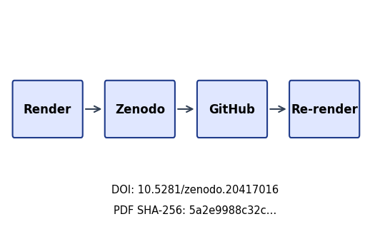

```{=latex}
\thispagestyle{empty}
\setlength{\parskip}{0pt}
\setlength{\itemsep}{0pt}
\begin{samepage}
\scriptsize
```

```{=latex}
\section*{BEGINNING OF TRANSMISSION}\label{beginning-of-transmission}
```

**State:** unpublished / pending pairing

```{=latex}
\subsubsection*{Release metadata}
```

- **Title:** Bounded AutoResearch for a Tiny Reproducible Machine-Learning Task
- **Version:** 0.2
- **DOI:** 10.5281/zenodo.20417016
- **GitHub:** docxology/template_autoresearch_project
- **Zenodo:** https://zenodo.org/records/20417016
- **SHA-256:** `5a2e9988c32cf22445e16039baba422044ee529c5c19eba38dcef9d89f2cd5f8`
- **SHA-512:** `5751b777a0b795ed7b98443e9b2e41cdbee0fe68260c40a9131ea0fae71d95325061e8a56534326739f9e35937695df683d8a80bafd5fe9fb13a8f1d2c149a89`

**Pairing:** pending — unresolved:
- ✗ GitHub release URL: `pending`

{width=98%}

```{=latex}
\subsubsection*{Transmission manifest}
```

```
title=Bounded AutoResearch for a Tiny Reproducible Mac
version=0.2 doi=10.5281/zenodo.20417016
sha256=5a2e9988c32cf224… manifest={"t":"Bounded AutoResearch for","v":"0.2","d":"10.5281/zenodo.20417016","s":"5a2e9988c32cf224"}
```

Structured manifest: `../data/transmission_manifest.json`

{width=35%}

**Stego:** off | overlays text | barcodes on | XMP on | manifest on → `./secure_run.sh`

```{=latex}
\end{samepage}
\newpage
```


<!-- BEGINNING OF TRANSMISSION -->