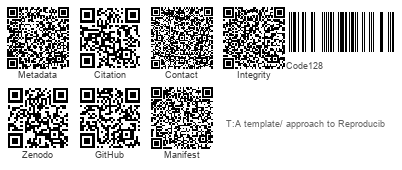
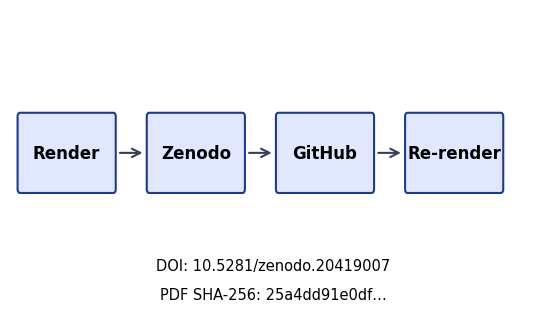

```{=latex}
\thispagestyle{empty}
\setlength{\parskip}{0pt}
\setlength{\itemsep}{0pt}
\begin{samepage}
\scriptsize
```

```{=latex}
\section*{BEGINNING OF TRANSMISSION}\label{beginning-of-transmission}
```

**State:** unpublished / pending pairing

```{=latex}
\subsubsection*{Release metadata}
```

- **Title:** A template/ approach to Reproducible Generative Research
- **Version:** 1.0
- **DOI:** 10.5281/zenodo.20419007
- **GitHub:** docxology/template_template
- **Zenodo:** https://zenodo.org/records/20419007
- **SHA-256:** `25a4dd91e0df57b53e98016b1e58b8cd668090492784ef093795bd8d33f88561`
- **SHA-512:** `3f8cee2bdb007a9f778552929cb8162143a207d77b1e258eecb8050216844ede2c5bd006c37a480f05a7004f91042a5783610f5c502e27c93ec27ffed9e35f99`

**Pairing:** pending — unresolved:
- ✗ GitHub release URL: `pending`

{width=98%}

```{=latex}
\subsubsection*{Transmission manifest}
```

```
title=A template/ approach to Reproducible Generative 
version=1.0 doi=10.5281/zenodo.20419007
sha256=25a4dd91e0df57b5… manifest={"t":"A template/ approach to ","v":"1.0","d":"10.5281/zenodo.20419007","s":"25a4dd91e0df57b5"}
```

Structured manifest: `../data/transmission_manifest.json`

{width=35%}

**Stego:** off | overlays text | barcodes on | XMP on | manifest on → `./secure_run.sh`

```{=latex}
\end{samepage}
\newpage
```


<!-- BEGINNING OF TRANSMISSION -->