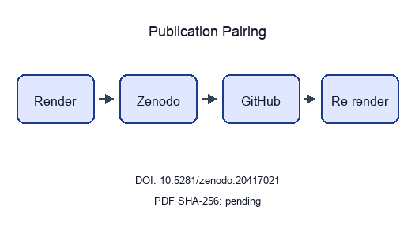
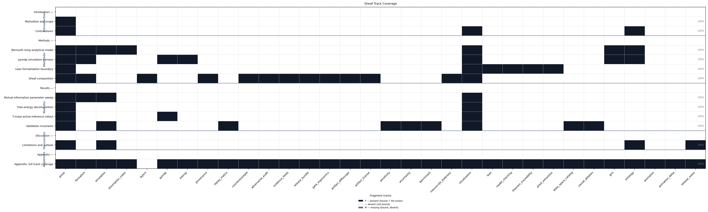
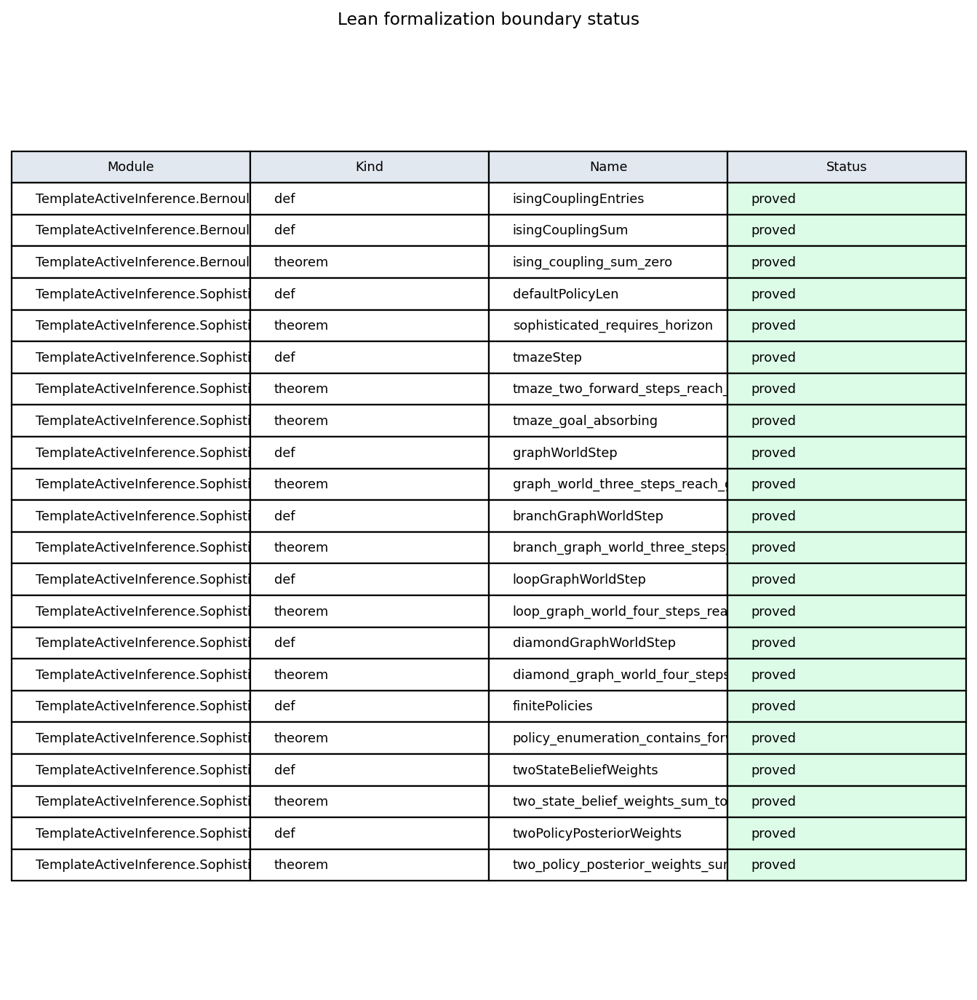
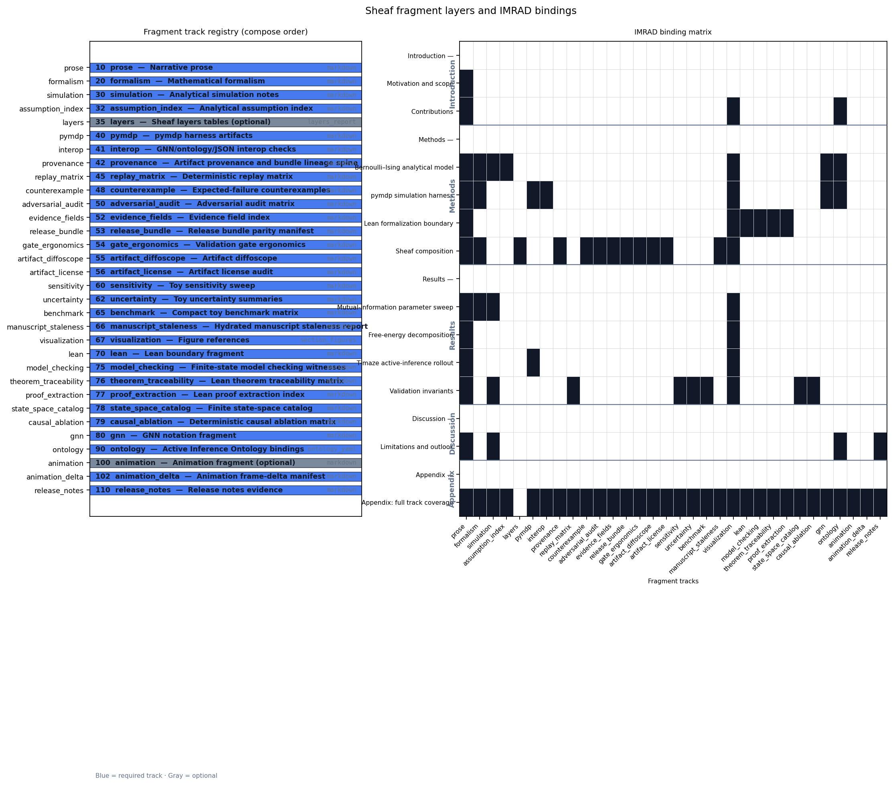
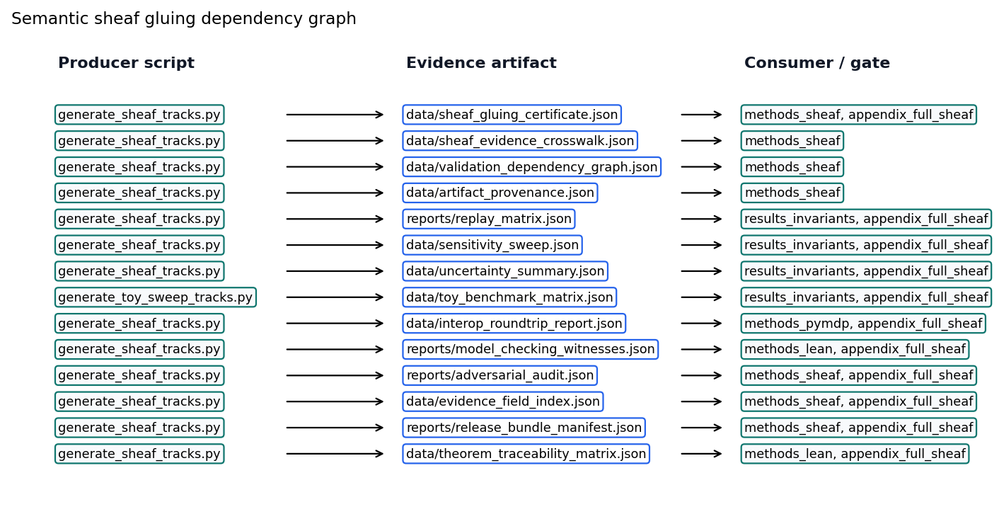
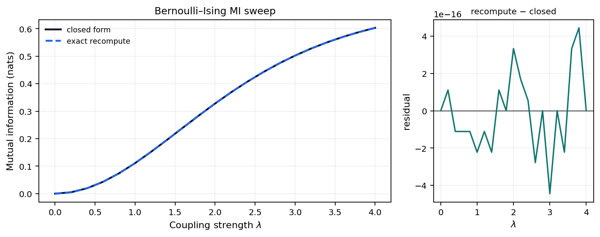
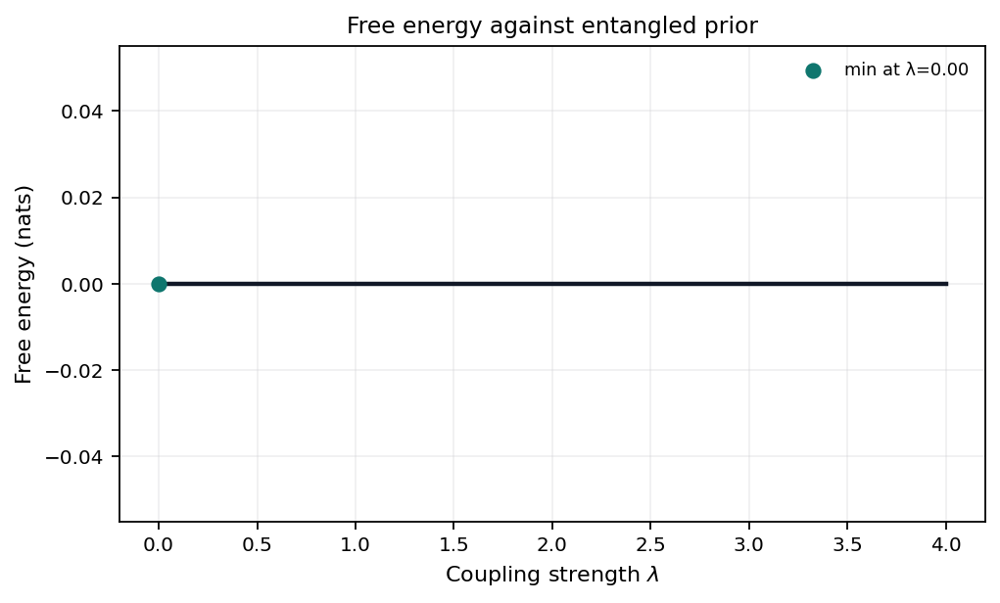
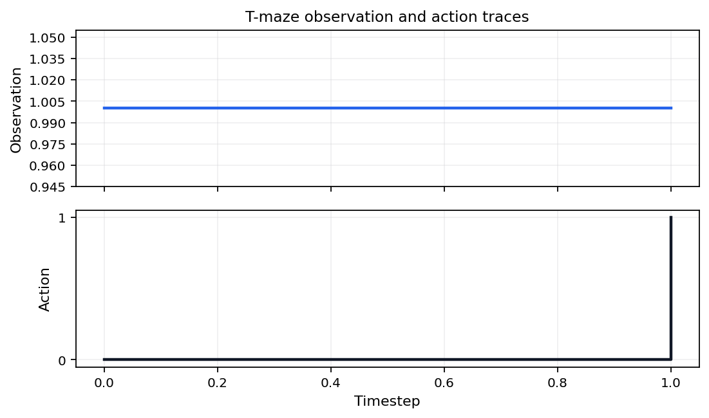
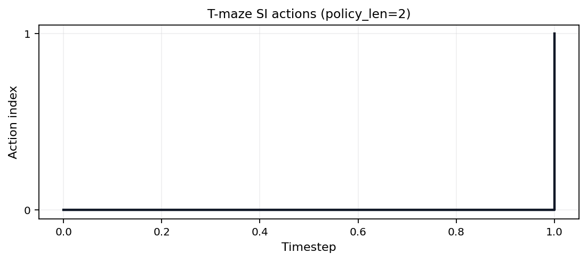
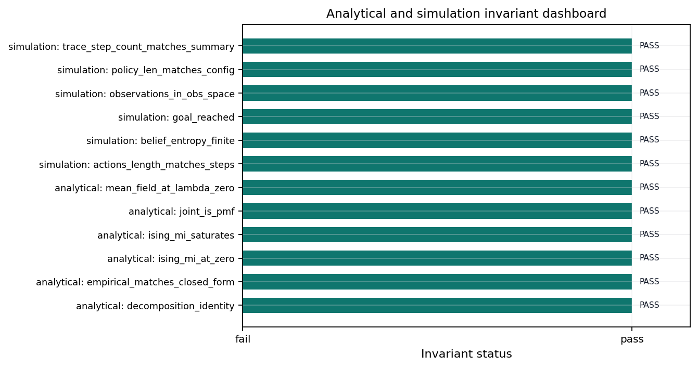

```{=latex}
\thispagestyle{empty}
\setlength{\parskip}{0pt}
\setlength{\itemsep}{0pt}
\begin{samepage}
\scriptsize
```

```{=latex}
\section*{BEGINNING OF TRANSMISSION}\label{beginning-of-transmission}
```

**State:** unpublished / pending pairing

**Pairing:** pending — unresolved:
- ✗ GitHub release URL: `pending`
- ✗ PDF SHA-256: `pending`

```{=latex}
\subsubsection*{Release metadata}
```

| Field | Value |
| --- | --- |
| Title | Active Inference Multi-Track Exemplar |
| Version | 0.3.0 |
| Concept DOI | 10.5281/zenodo.20417021 |
| Version DOI | 10.5281/zenodo.20420352 |
| GitHub | docxology/template_active_inference |
| Zenodo | [https://zenodo.org/records/20417021](https://zenodo.org/records/20417021) |
| SHA-256 | pending |
| SHA-512 | pending |

```{=latex}
\subsubsection*{How to verify}
```

- Scan **Integrity** QR and compare the embedded SHA-256 prefix to the table above.
- Scan **Zenodo** / **GitHub** QR codes and confirm they resolve to this release pairing.
- Full hashes and structured fields: `../data/transmission_manifest.json`.

{width=98%}

Structured manifest: `../data/transmission_manifest.json`

{width=35%}

**Stego:** off | overlays text | barcodes on | XMP on | manifest on → `./secure_run.sh`

```{=latex}
\end{samepage}
\newpage
```


<!-- BEGINNING OF TRANSMISSION -->


---


# Sheaf Track Coverage {#sec:sheaf_coverage}

This page summarizes which **sheaf fragment tracks** are bound for each IMRAD row in `manuscript/sheaf/manifest.yaml`. The matrix is regenerated at compose time.

**Totals:** 90 present / 90 bound / 0 missing (gray).

| Color | Meaning |
| --- | --- |
| Black | Track **present** (bound and fragment exists) |
| White | **Absent** (not bound for this row) |
| Gray | **Missing** (bound but fragment file absent) |

## Introduction

- **Introduction** *(group)*
-   **Motivation and scope**
-   **Contributions**
## Methods

- **Methods** *(group)*
-   **Bernoulli–Ising analytical model**
-   **pymdp simulation harness**
-   **Lean formalization boundary**
-   **Sheaf composition**
## Results

- **Results** *(group)*
-   **Mutual-information parameter sweep**
-   **Free-energy decomposition**
-   **T-maze active-inference rollout**
-   **Validation invariants**
## Discussion

- **Discussion** *(group)*
-   **Limitations and outlook**
## Appendix

- **Appendix** *(group)*
-   **Appendix: full track coverage**

{#fig:sheaf_coverage_heatmap width=95% fig-alt="Heatmap matrix of IMRAD manuscript rows versus 32 sheaf fragment track columns. Black cells mean the track is bound and the fragment file exists; white cells mean the track is not bound; gray cells mean bound but missing. Rows are grouped by IMRAD block with indented subsection labels; column headers list track ids."}

Appendix row `16_appendix_full_sheaf.md` binds 31 fragment track types as a composability proof (registry defines 32 types; optional `layers` is methods-only).


---


# Abstract {#sec:abstract}

We study a minimal Active Inference stack on toy models: a Bernoulli–Ising analytical oracle, a pymdp T-maze rollout, and a sheaf-indexed compose contract that binds 32 fragment tracks into 12 flat IMRAD sections. The methodological contribution is a discipline rather than a domain finding: every reported number is hydrated from a generated artifact and every cross-track claim is machine-checked before rendering, so no figure or statistic can drift from the artifact that produced it — 6 sheaf axioms are verified before composition and 22 negative controls keep each failure path live. Claims are limited to those models and their generated artifacts.

[@sec:sheaf_coverage] reports a 17-row coverage matrix (5 IMRAD group headers) regenerated from the live manifest at compose time. [@sec:methods_pymdp] documents the T-maze harness aligned with [pymdp sophisticated_inference examples](https://github.com/infer-actively/pymdp/tree/main/examples/experimental/sophisticated_inference).

[@sec:results_invariants] records 12 / 12 invariant checks passed. SI planning horizon: 2 steps. Sweep RMSE 0 nats bounds analytical–empirical agreement on the coupling grid.


---


```{=latex}
\phantomsection
\addcontentsline{toc}{section}{Introduction}
\section*{Introduction}
```

# Motivation and scope {#sec:intro_motivation}

<!-- sheaf-track:prose -->

## Scientific scope

This manuscript couples three tracks on toy Active Inference models: a Bernoulli–Ising analytical oracle, a pymdp T-maze rollout, and a sheaf-indexed assembly contract that binds 32 optional fragment tracks under an IMRAD outline. The scientific claims stay within those models and their generated artifacts; they are not empirical statements about biological agents.

## Manuscript structure

Three **scientific tracks** (analytical, pymdp, sheaf composition) map onto 32 **composable fragment types** and 29 pipeline gates ([@fig:multi_track_architecture]). [@sec:sheaf_coverage] summarizes which fragment tracks bind to each manifest row. [@sec:methods_sheaf] documents the compose pipeline, coverage semantics ([@eq:coverage_cell]), and strict validation gates.

The pymdp track follows the [pymdp sophisticated_inference examples](https://github.com/infer-actively/pymdp/tree/main/examples/experimental/sophisticated_inference) with a minimal T-maze and planning horizon `policy_len = 2`. Other sections cite [@sec:methods_pymdp] instead of repeating that reference.


---


# Contributions {#sec:intro_contributions}

<!-- sheaf-track:prose -->

## Scientific contributions

1. **Analytical oracle** ([@sec:methods_analytical]): closed-form mutual information and free-energy decomposition on a symmetric Bernoulli–Ising toy with an independent exact-recomputation cross-check ([@sec:results_mi_sweep], [@sec:results_free_energy]).
2. **Active-inference harness** ([@sec:methods_pymdp]): deterministic pymdp T-maze rollout — default `state_inference` belief filtering, with sophisticated expected-free-energy policy inference selectable via `mode: policy_inference` — with logged beliefs, actions, and merged invariant gates ([@sec:results_si_tmaze], [@sec:results_invariants]).
3. **Sheaf-indexed composition** ([@sec:methods_sheaf]): 32 optional fragment types bind to 17 manifest rows under [@eq:coverage_cell], with a 31-track appendix composability proof ([@sec:appendix_full_sheaf]).

[@fig:multi_track_architecture] maps the three scientific tracks to 29 pipeline gates and 32 composable fragment renderers. Measured invariant checks: 12 / 12 passed.

Ontology-facing symbols in the analytical track—`location`, `observation`, `policy`, and `expected_free_energy`—map to **HiddenState**, **ObservationLikelihood**, **PolicyPosterior**, and **ExpectedFreeEnergy** in the GNN concordance figure ([@fig:gnn_ontology_concordance], [@sec:methods_analytical]).

<!-- sheaf-track:visualization -->

{#fig:multi_track_architecture width=95% fig-alt="Process diagram linking three scientific tracks to 29 pipeline gates and 32 sheaf fragment types across 17 manifest rows."}

<!-- sheaf-track:ontology -->

### Ontology bindings

- `expected_free_energy` → **ExpectedFreeEnergy**
- `location` → **HiddenState**
- `observation` → **ObservationLikelihood**
- `policy` → **PolicyPosterior**


---


```{=latex}
\phantomsection
\addcontentsline{toc}{section}{Methods}
\section*{Methods}
```

# Bernoulli–Ising analytical model {#sec:methods_analytical}

<!-- sheaf-track:prose -->

We study a minimal **K=2 Bernoulli / Ising** coupling as the analytical companion to multi-track verification. The entangled joint [@eq:entangled_joint] yields closed-form mutual information $I(\lambda)$, which serves as an oracle for an independent exact recomputation (via total correlation) and GNN round-trips in [@sec:results_mi_sweep] ([@fig:gnn_ontology_concordance]).

Measured sweep grid points: 21. Invariants passed: 12 / 12.

<!-- sheaf-track:formalism -->

The entangled joint over binary policies satisfies

$$
q_\lambda(\pi) \propto E(\pi)\,\exp(\lambda J(\pi)),
$$ {#eq:entangled_joint}

with symmetric Ising coupling $J$ and deformation parameter $\lambda$. Let $\sigma(\lambda)=q_\lambda(\pi_1=\pi_2)$ be the probability that the two streams agree (the diagonal mass of the $2\times2$ joint); by symmetry both marginals are uniform. With binary entropy $H_b(p)=-p\log p-(1-p)\log(1-p)$ in nats, the joint entropy is $H(q_\lambda)=\log 2 + H_b(\sigma(\lambda))$ while each marginal contributes $\log 2$, so the mutual information is

$$
I(\lambda)=\sum_k H(q_k)-H(q_\lambda)=\log 2 - H_b(\sigma(\lambda)),
$$

vanishing at $\lambda=0$ ($\sigma=\tfrac12$, independent streams) and saturating at $\log 2$ as $\lambda\to\infty$ ($\sigma\to1$, perfectly entangled). These symbols are the rows of `analytical_assumption_index.json`, so the derivation is auditable rather than asserted.

<!-- sheaf-track:simulation -->

The analytical track writes a parameter sweep comparing closed-form mutual information with an independent exact recomputation of it (via total correlation) across $\lambda \in [0, 4]$ on 21 grid points ([@sec:results_mi_sweep], [@fig:ising_mi_curve]).

<!-- sheaf-track:assumption_index -->

The `assumption_index` fragment makes the analytical equations inspectable as a generated artifact instead of relying on prose labels. `output/data/analytical_assumption_index.json` indexes 6 finite-model equation identifiers and 6 rows; the hydrated pass flag is `true`.

The index is deliberately narrow. It covers the Bernoulli-Ising toy equations, their finite binary state assumptions, and the generated artifacts that test the same symbols. Any missing equation identifier or empty assumption list fails the toy-sweep validation gate.

<!-- sheaf-track:visualization -->

{#fig:ising_mi_curve width=90% fig-alt="Two-panel plot of mutual information versus coupling strength lambda for the symmetric Bernoulli-Ising toy. Left panel shows the closed-form curve (solid dark line) and an independent exact recomputation via total correlation (dashed blue line) with lambda on the x-axis and mutual information in nats on the y-axis. Right panel shows the recompute-minus-closed-form residual versus lambda with a zero reference line; the two deterministic estimators agree to machine precision."}

{#fig:gnn_ontology_concordance width=90% fig-alt="Layered concordance diagram linking analytical symbols, GNN variables from bernoulli_toy.gnn.md (GNN v1.1), and Active Inference Ontology terms."}

<!-- sheaf-track:gnn -->

The Bernoulli toy is declared in `gnn/bernoulli_toy.gnn.md` (GNN v1.1). [@fig:gnn_ontology_concordance] links GNN variables to Active Inference Ontology terms bound in the analytical ontology fragment; round-trip parity is checked before render.

Measured MI and sweep artifacts in [@sec:results_mi_sweep] ground the same symbol map used in the concordance diagram.

<!-- sheaf-track:ontology -->

### Ontology bindings

- `E1` → **Stream1HabitPrior**
- `E2` → **Stream2HabitPrior**
- `J` → **CrossStreamCouplingPotential**
- `gamma` → **SophisticationWeight**
- `lam` → **EntanglementDeformationParameter**
- `pi1` → **Stream1PolicyVector**
- `pi2` → **Stream2PolicyVector**
- `q_joint` → **EntangledJointPosterior**


---


# pymdp simulation harness {#sec:methods_pymdp}

<!-- sheaf-track:prose -->

**Sophisticated inference (planning horizon).** This section documents a **pymdp state-inference harness** on a minimal T-maze ([@fig:tmaze_schematic]) with planning horizon `policy_len = 2`. Default mode is `state_inference` (T-maze rollout via `simulate_si_tmaze.py`). The Agent constructs a multi-step policy set (`num_policies` logged in SI artifacts); per-step **belief entropy** is aggregated as `mean_belief_entropy`. Selecting `mode: policy_inference` enables expected-free-energy policy selection; on the default minimal T-maze (2 states / 2 observations / 2 actions, horizon 2) this yields a constant-action policy that does not reach the goal — the toy is deliberately too small to exercise sophisticated inference's advantage, so richer state spaces and longer horizons are needed for it to differ from belief filtering.

Graph-world artifacts are deterministic extension outputs declared in `tracks.yaml` `extension_tracks.graph_world`. For the reference workflow, see [@sec:intro_motivation]; measured rollouts appear in [@sec:results_si_tmaze].

Mean belief entropy across steps: 0.3251.

The comparison artifact `output/data/si_policy_comparison.json` runs both `state_inference` and `policy_inference` over the declared toy horizons and seeds without replacing the default rollout. It records 4 deterministic comparison rows, complete-grid flag 1, and 3 goal-reaching rows under the toy transition model.

Agent construction is audited in `output/reports/pymdp_runtime_diagnostics.json`: 4 constructions, 4 known third-party JAX static-array warnings, and 0 unexpected warnings. Policy posterior evidence is written separately to `output/data/pymdp_policy_posterior_grid.json` with 10 rows and normalized-posterior flag 1.

The graph-world extension is deterministic: `simulate_si_graph_world.py` writes `si_graph_world_summary.json` and `si_graph_world_trace.json` for a four-node graph-world path. The regenerated summary reports 4 nodes, 4 steps, and goal-reached flag 1. The topology-trace extension records 4 topology traces with agreement flag 1.

<!-- sheaf-track:formalism -->

Given generative matrices $A,B,C,D$, pymdp computes state beliefs $q(s)$ via variational inference (`infer_states`). The Agent is configured with planning horizon $H =$ 2, which defines the **policy depth** used when constructing candidate policies (logged as `num_policies` in the SI summary artifact; see [@sec:results_si_tmaze]).

The default harness records belief entropy per step; extending to full expected-free-energy policy selection (`infer_policies`) is documented as a follow-on track in [@sec:discussion_outlook].

<!-- sheaf-track:pymdp -->

SI artifacts (summary, trace, optional JSONL log) record step count, actions, observations, and belief entropy for [@sec:results_si_tmaze]. Steps recorded: 2.

<!-- sheaf-track:interop -->

The `interop` fragment treats the GNN files, JSON views, and ontology bindings as a round-trip contract rather than parallel documentation. `output/data/interop_roundtrip_report.json` records 5 deterministic checks; the manuscript only claims losslessness when `true` is true.

The stricter lint artifacts are adjacent evidence, not new model claims: `output/data/gnn_roundtrip_report.json`, `output/reports/gnn_lint_report.json`, `output/data/ontology_alias_index.json`, and `output/data/ontology_profile_matrix.json` must agree before the interop row passes. A missing GNN variable, duplicate ontology alias, dropped JSON field, shape diff, or dtype diff is therefore a validation failure before rendering.

<!-- sheaf-track:visualization -->

{#fig:tmaze_schematic width=85% fig-alt="Schematic of the minimal T-maze POMDP with start and goal states, discrete actions and observations, and planning horizon policy_len = 2."}

<!-- sheaf-track:gnn -->

See `gnn/si_tmaze.gnn.md` for a GNN view of the T-maze hidden state, observation, and policy variables with ontology bindings.

<!-- sheaf-track:ontology -->

### Ontology bindings

- `belief_entropy` → **BeliefEntropy**
- `loc` → **HiddenState**
- `obs` → **ObservationLikelihood**
- `pi` → **PolicyPosterior**


---


# Lean formalization boundary {#sec:methods_lean}

<!-- sheaf-track:prose -->

The Lean track provides minimal boundary witnesses checked by `lake build` under `lean/TemplateActiveInference/`. [@fig:lean_boundary_status] summarizes proved versus deferred statements; fragments cite theorem names without duplicating proof scripts in prose.

Horizon witnesses link back to the analytical toy ([@sec:methods_analytical]) and the pymdp planning depth ([@sec:methods_pymdp]).

<!-- sheaf-track:visualization -->

{#fig:lean_boundary_status width=90% fig-alt="Table figure listing Lean modules, declaration kinds, names, and proved versus sorry status under lean/TemplateActiveInference/."}

<!-- sheaf-track:lean -->

Lean module `TemplateActiveInference.SophisticatedInference` declares the planning-horizon parameter `defaultPolicyLen` and finite T-maze boundary witnesses: `sophisticated_requires_horizon : defaultPolicyLen > 1`, `tmaze_two_forward_steps_reach_goal`, and `tmaze_goal_absorbing`. It also contains constructive finite witnesses for graph-world reachability, finite policy enumeration, two-state belief weights, and two-policy posterior weights. These theorems formalize small finite boundaries shared with generated artifacts; they do *not* prove that the toy policy posterior is a general model of sophisticated inference. Axioms are audited with `#print axioms` (the gate whitelists only `propext`, `Classical.choice`, `Quot.sound`); see the Lean track gate.

Build via `lake build` under `lean/`.

<!-- sheaf-track:model_checking -->

The `model_checking` fragment complements Lean with finite exhaustive witnesses. `output/reports/model_checking_witnesses.json` records 12 toy-state witnesses and reports `true` only when no counterexample is found in the enumerated state/action space.

This is deliberately narrower than a semantic proof of all Active Inference programs. It checks the finite T-maze and graph-world boundary objects used by this manuscript and exposes the witness inventory to the same artifact and claim gates as the Lean theorem inventory. The Lean graph-world inventory witnesses 4 generated toy topology ids, with all-topologies-witnessed flag `true`; theorem traceability contributes 11 linked rows.

<!-- sheaf-track:theorem_traceability -->

The `theorem_traceability` fragment binds Lean theorem inventory rows to finite model-checking witnesses, manuscript claims, and evidence fields. `output/data/theorem_traceability_matrix.json` records 11 traceability rows and passes only when every theorem row is linked (`true`).

<!-- sheaf-track:proof_extraction -->

### Proof extraction track

The `proof_extraction` track extracts Lean theorem statements and proof-source
metadata into `output/data/proof_extraction_index.json`. The index currently
contains 10 extracted theorem rows, with
constructive-token status `true`.


---


# Sheaf composition {#sec:methods_sheaf}

<!-- sheaf-track:prose -->

## Compose contract

Each manifest row in `manuscript/sheaf/manifest.yaml` binds fragment tracks from `manuscript/sheaf/tracks.yaml`. A track supplies a renderer, compose order, label, and optional flag; the composer flattens the binding set into one Markdown section for PDF and web output.

The operational claim is auditable binding: analytical, simulation, pymdp, visualization, Lean, GNN, ontology, and optional media fragments attach to each IMRAD row under [@eq:coverage_cell] (**P** present, **—** unbound, **M** missing).

## Coverage and figures

[@fig:sheaf_layers_overview] summarizes 32 fragment types and their IMRAD bindings. Generated tables below list every track definition and section×track binding at compose time.

## Compose commands

```bash
uv run python scripts/compose_manuscript.py
uv run python scripts/compose_manuscript.py --validate-only --strict
```

Each run emits `output/data/sheaf_coverage_matrix.json` and regenerates coverage artifacts. Partial compose (`--section`) is draft-only; the matrix always reflects the full manifest. Coverage totals appear on [@sec:sheaf_coverage]; discussion scope is in [@sec:discussion_outlook].

## Law verification

`--validate-only --strict` runs the structural gate before any fragment is glued. Beyond per-cell coverage, it invokes the sheaf-law oracle (`verify_sheaf_laws`, `src/manuscript/sheaf/laws.py`), which checks 6 axioms — poset, presheaf functoriality, separation, gluing, typing, and compositionality — and reports 6/6 satisfied for the current manifest. A violation is raised as an error-level issue and aborts the build, so a malformed manifest (a section colliding on an output file, an off-chain block, a mistyped fragment, a fragment shared between sections) can never compose. The formal statements are in the formalism block below; the negative-control suite (`tests/test_sheaf_laws.py`) proves each check is falsifiable.

The semantic layer is separate from those structural laws. `output/data/sheaf_gluing_certificate.json` records cross-track symbols, typed claim evidence, artifact sources, and manuscript-variable restrictions; validation fails when the analytical, pymdp, GNN, ontology, Lean, visualization, or manuscript tracks disagree about a shared symbol or measured claim. [@fig:semantic_gluing_graph] renders this gluing graph: the configured producers, the generated evidence artifacts, and the validation consumers that read each shared symbol.

<!-- sheaf-track:formalism -->

### Base poset and presheaf

The manuscript is modelled as a coverage sheaf over a finite base poset. Let the
**base** $P$ be the IMRAD blocks ordered as a chain,

$$
\mathsf{Introduction} \prec \mathsf{Methods} \prec \mathsf{Results} \prec \mathsf{Discussion} \prec \mathsf{Appendix},
$$ {#eq:imrad_chain}

with, in each block, a *group* node above its *section* nodes (written $G \sqsupseteq s$). $P$ is therefore a finite poset (equivalently a finite Alexandrov space). Let $\mathcal{T}$ be the registered fragment-track set from `manuscript/sheaf/tracks.yaml`; each track $t \in \mathcal{T}$ carries a renderer $R(t)$, label $L(t)$, optional flag $O(t)$, and a strict compose-order index $\pi(t)$.

The **presheaf** $\mathcal{F}$ is a contravariant functor on $P$ — $\mathcal{F}\colon P \to \mathbf{Set}$ with restriction maps along $\sqsupseteq$ — assigning to each composing section $s$ its bound fragment set $\mathcal{F}(s) = \{\,(t, F_s(t)) : t \text{ bound in } s\,\}$, where $F_s : \mathcal{T} \rightharpoonup \mathbf{Path}$ is the section's partial binding map. Restriction along $G \sqsupseteq s$ is projection onto a section's own bindings; group nodes carry the empty assignment and do not compose.

The coverage cell is

$$
B(s,t) \in \{\mathrm{P}, \mathrm{—}, \mathrm{M}\}
$$ {#eq:coverage_cell}

derived from $F_s(t)$ and filesystem existence at compose time: **P** when a bound fragment exists, **—** when the track is unbound for that row, and **M** when a bound path is missing. The current regenerated matrix reports 90 present / 90 bound / 0 missing cells. Registry size: $|\mathcal{T}| = 32$ types across 17 IMRAD manifest rows (5 group rows, 12 composing sections).

### Verified sheaf laws

What makes this presheaf a *sheaf* — rather than a bare incidence table — is that the composer's structural axioms are machine-checked. The oracle `verify_sheaf_laws` (`src/manuscript/sheaf/laws.py`) verifies 6 laws, and the regenerated build reports 6/6 satisfied:

1. **Poset.** The IMRAD blocks form the chain of [@eq:imrad_chain]; compose order is monotone in block rank and every composing section's block carries a group row.
2. **Presheaf (functoriality).** Every bound track lies in $\mathcal{T}$; $\pi$ is a strict total order; and each section's resolved track order is the monotone restriction of $\pi$ (an explicit `track_order` override must be a permutation of the section's bound tracks).
3. **Separation (locality).** The map $s \mapsto \mathrm{output\_name}(s)$ is injective over composing sections: distinct locals glue to distinct global positions, so the global section is unique.
4. **Gluing.** Compose order is a linear extension of $P$ — each block's rows are contiguous and strictly increasing in order — so the local fragments glue to a unique global manuscript in which every composing section appears exactly once.
5. **Typing.** Each binding $(t, F_s(t))$ is well-typed: $R(t)$ is a registered renderer and the fragment suffix lies in $R(t)$'s accepted suffix set. Generated renderers (`section_figures`, `layers_report`) synthesize their body and are explicitly type-exempt.
6. **Compositionality.** Every fragment file is private to one section (no path is bound twice), so global composition is the coproduct of the per-section bodies and is independent of inclusion order.

Each law is paired with a negative control in `tests/test_sheaf_laws.py` — a single mutation that breaks the law and is proven to be caught — so the gate binds the laws' *content*, not merely their shape. Under `--strict`, any violation is surfaced as an error-level manifest issue and aborts composition.

### Scope (what is and is not claimed)

These laws verify the sheaf *axioms* on a finite base poset. They do **not** compute sheaf *cohomology* ($H^0$/$H^1$, Čech complexes, derived functors); "sheaf" here names the verified separation-and-gluing structure of a multi-track coverage assignment, not a cohomological invariant. Formal track definitions and section×track bindings appear in the generated tables below.

<!-- sheaf-track:visualization -->

{#fig:sheaf_layers_overview width=98% fig-alt="Two-panel overview of sheaf fragment layers. Left panel shows 32 composable track types in registry compose order with labels and renderer ids. Right panel shows the IMRAD section binding heatmap with black present, white absent, and gray missing cells across 17 manifest rows and 32 tracks."}

{#fig:semantic_gluing_graph width=95% fig-alt="Dependency diagram linking configured analysis scripts to generated evidence artifacts, manuscript consumers, and validation gates for the semantic sheaf gluing certificate."}

<!-- sheaf-track:provenance -->

The `provenance` fragment makes artifact lineage a live canonical sheaf track. The configured producer `generate_sheaf_tracks.py` writes `output/data/artifact_provenance.json`, which hashes 70 required toy artifacts and records producer scripts, source commit, deterministic seed fields, config digests, and 5 artifact bundles. Publication claims that depend on generated files must be traceable to this lineage table or to a narrower artifact-specific certificate.

The provenance claim is intentionally limited: every listed artifact exists, has a SHA-256 digest or an explicit cycle exclusion, is produced by a configured analysis script, and carries seed/config provenance (`70` seeded rows; all seeded flag `true`; bundle-complete flag `true`). A changed file, missing producer, or stale saved digest is a validation failure, not a prose warning.

<!-- sheaf-track:counterexample -->

The `counterexample` fragment records expected-failure fixtures as first-class evidence. `output/reports/counterexample_matrix.json` lists 22 negative controls that intentionally mutate ontology mappings, semantic certificates, graph-world trace agreement, typed claim evidence, replay rows, release parity, and provenance hashes.

The matrix is not an empirical result. It is a falsifiability ledger: each row names the gate that must fail and the test that proves the failure path remains live.

<!-- sheaf-track:adversarial_audit -->

The `adversarial_audit` fragment makes expected failures part of the sheaf rather than an informal test note. `output/reports/adversarial_audit.json` records 22 known-bad rows and 0 known-bad rows passing; publication proceeds only when every row is documented as an expected failure and mapped to a gate.

The audit rows target the same failure modes as the semantic certificate: incomplete sweep cells, unnormalized uncertainty rows, interop field loss, stale certificate state, and empirical-scope leakage. The scope boundary remains toy-only: `toy_only_pass`.

<!-- sheaf-track:evidence_fields -->

The `evidence_fields` fragment indexes the exact artifact fields that support typed claims and hydrated manuscript tokens. `output/data/evidence_field_index.json` records 81 field rows, and the track passes only when every referenced JSONPath or dotted field is present (`true`).

<!-- sheaf-track:release_bundle -->

The `release_bundle` fragment records whether the canonical deliverables exist before copying and whether copied root outputs match or are explicitly deferred until the copy stage. `output/reports/release_bundle_manifest.json` tracks 23 required deliverables with source-present flag `true`.

<!-- sheaf-track:gate_ergonomics -->

The `gate_ergonomics` fragment turns validation commands into evidence rows. `output/data/validation_gate_index.json` records 22 gate rows, each naming required inputs and the negative-control surface that should fail closed.

<!-- sheaf-track:artifact_diffoscope -->

### Artifact diffoscope track

The `artifact_diffoscope` track compares saved provenance hashes against live
artifact hashes at the artifact root JSONPath. Its proof artifact is
`output/reports/artifact_diffoscope.json`: it currently records
37 comparison rows, with equality status
`true`.

<!-- sheaf-track:artifact_license -->

### Artifact license track

The `artifact_license` track classifies generated and project-source artifacts
under the public project license boundary. Its audit artifact is
`output/reports/artifact_license_audit.json`: it currently records
70 rows, with license-safe status
`true`.

<!-- sheaf-track:manuscript_staleness -->

The `manuscript_staleness` fragment closes the hydration loop. `output/reports/manuscript_staleness_report.json` checks 212 manuscript token bindings against the current generated variables after resolved markdown is written; the pass flag is `true`.

This is a publication-systems claim, not a domain result. A stale hydrated value, unresolved token, or missing resolved section becomes a validation failure before PDF or web outputs are accepted.

<!-- sheaf-track:layers -->

<!-- sheaf-layers:registry -->
## Sheaf fragment track registry

Compose order and renderer bindings from `manuscript/sheaf/tracks.yaml`.

| Order | Track id | Label | Renderer | Optional |
| ---: | --- | --- | --- | --- |
| 10 | `prose` | Narrative prose | `markdown` | No |
| 20 | `formalism` | Mathematical formalism | `markdown` | No |
| 30 | `simulation` | Analytical simulation notes | `markdown` | No |
| 32 | `assumption_index` | Analytical assumption index | `markdown` | No |
| 35 | `layers` | Sheaf layers tables | `layers_report` | Yes |
| 40 | `pymdp` | pymdp harness artifacts | `markdown` | No |
| 41 | `interop` | GNN/ontology/JSON interop checks | `markdown` | No |
| 42 | `provenance` | Artifact provenance and bundle lineage spine | `markdown` | No |
| 45 | `replay_matrix` | Deterministic replay matrix | `markdown` | No |
| 48 | `counterexample` | Expected-failure counterexamples | `markdown` | No |
| 50 | `adversarial_audit` | Adversarial audit matrix | `markdown` | No |
| 52 | `evidence_fields` | Evidence field index | `markdown` | No |
| 53 | `release_bundle` | Release bundle parity manifest | `markdown` | No |
| 54 | `gate_ergonomics` | Validation gate ergonomics | `markdown` | No |
| 55 | `artifact_diffoscope` | Artifact diffoscope | `markdown` | No |
| 56 | `artifact_license` | Artifact license audit | `markdown` | No |
| 60 | `sensitivity` | Toy sensitivity sweep | `markdown` | No |
| 62 | `uncertainty` | Toy uncertainty summaries | `markdown` | No |
| 65 | `benchmark` | Compact toy benchmark matrix | `markdown` | No |
| 66 | `manuscript_staleness` | Hydrated manuscript staleness report | `markdown` | No |
| 67 | `visualization` | Figure references | `section_figures` | No |
| 70 | `lean` | Lean boundary fragment | `markdown` | No |
| 75 | `model_checking` | Finite-state model checking witnesses | `markdown` | No |
| 76 | `theorem_traceability` | Lean theorem traceability matrix | `markdown` | No |
| 77 | `proof_extraction` | Lean proof extraction index | `markdown` | No |
| 78 | `state_space_catalog` | Finite state-space catalog | `markdown` | No |
| 79 | `causal_ablation` | Deterministic causal ablation matrix | `markdown` | No |
| 80 | `gnn` | GNN notation fragment | `markdown` | No |
| 90 | `ontology` | Active Inference Ontology bindings | `ontology_yaml` | No |
| 100 | `animation` | Animation fragment | `markdown` | Yes |
| 102 | `animation_delta` | Animation frame-delta manifest | `markdown` | No |
| 110 | `release_notes` | Release notes evidence | `markdown` | No |

**Track count:** 32 registered fragment types.

<!-- sheaf-layers:binding-matrix -->
## IMRAD binding matrix

Section rows versus fragment track columns. **P** = present (bound and file exists); **—** = absent (not bound); **M** = missing (bound, file absent).

| Section | prose | formalism | simulation | assumption_index | layers | pymdp | interop | provenance | replay_matrix | counterexample | adversarial_audit | evidence_fields | release_bundle | gate_ergonomics | artifact_diffoscope | artifact_license | sensitivity | uncertainty | benchmark | manuscript_staleness | visualization | lean | model_checking | theorem_traceability | proof_extraction | state_space_catalog | causal_ablation | gnn | ontology | animation | animation_delta | release_notes |
| --- | --- | --- | --- | --- | --- | --- | --- | --- | --- | --- | --- | --- | --- | --- | --- | --- | --- | --- | --- | --- | --- | --- | --- | --- | --- | --- | --- | --- | --- | --- | --- | --- |
| Introduction (group) | — | — | — | — | — | — | — | — | — | — | — | — | — | — | — | — | — | — | — | — | — | — | — | — | — | — | — | — | — | — | — | — |
|   Motivation and scope | P | — | — | — | — | — | — | — | — | — | — | — | — | — | — | — | — | — | — | — | — | — | — | — | — | — | — | — | — | — | — | — |
|   Contributions | P | — | — | — | — | — | — | — | — | — | — | — | — | — | — | — | — | — | — | — | P | — | — | — | — | — | — | — | P | — | — | — |
| Methods (group) | — | — | — | — | — | — | — | — | — | — | — | — | — | — | — | — | — | — | — | — | — | — | — | — | — | — | — | — | — | — | — | — |
|   Bernoulli–Ising analytical model | P | P | P | P | — | — | — | — | — | — | — | — | — | — | — | — | — | — | — | — | P | — | — | — | — | — | — | P | P | — | — | — |
|   pymdp simulation harness | P | P | — | — | — | P | P | — | — | — | — | — | — | — | — | — | — | — | — | — | P | — | — | — | — | — | — | P | P | — | — | — |
|   Lean formalization boundary | P | — | — | — | — | — | — | — | — | — | — | — | — | — | — | — | — | — | — | — | P | P | P | P | P | — | — | — | — | — | — | — |
|   Sheaf composition | P | P | — | — | P | — | — | P | — | P | P | P | P | P | P | P | — | — | — | P | P | — | — | — | — | — | — | — | — | — | — | — |
| Results (group) | — | — | — | — | — | — | — | — | — | — | — | — | — | — | — | — | — | — | — | — | — | — | — | — | — | — | — | — | — | — | — | — |
|   Mutual-information parameter sweep | P | P | P | — | — | — | — | — | — | — | — | — | — | — | — | — | — | — | — | — | P | — | — | — | — | — | — | — | — | — | — | — |
|   Free-energy decomposition | P | — | — | — | — | — | — | — | — | — | — | — | — | — | — | — | — | — | — | — | P | — | — | — | — | — | — | — | — | — | — | — |
|   T-maze active-inference rollout | P | — | — | — | — | P | — | — | — | — | — | — | — | — | — | — | — | — | — | — | P | — | — | — | — | — | — | — | — | — | — | — |
|   Validation invariants | P | — | P | — | — | — | — | — | P | — | — | — | — | — | — | — | P | P | P | — | P | — | — | — | — | P | P | — | — | — | — | — |
| Discussion (group) | — | — | — | — | — | — | — | — | — | — | — | — | — | — | — | — | — | — | — | — | — | — | — | — | — | — | — | — | — | — | — | — |
|   Limitations and outlook | P | — | P | — | — | — | — | — | — | — | — | — | — | — | — | — | — | — | — | — | — | — | — | — | — | — | — | — | P | — | — | P |
| Appendix (group) | — | — | — | — | — | — | — | — | — | — | — | — | — | — | — | — | — | — | — | — | — | — | — | — | — | — | — | — | — | — | — | — |
|   Appendix: full track coverage | P | P | P | P | — | P | P | P | P | P | P | P | P | P | P | P | P | P | P | P | P | P | P | P | P | P | P | P | P | P | P | P |

**Totals:** 90 present / 90 bound / 0 missing.

<!-- sheaf-layers:legend -->
| Symbol | Coverage color | Meaning |
| --- | --- | --- |
| P | Black | Track **present** (bound and fragment exists) |
| — | White | **Absent** (not bound for this section) |
| M | Gray | **Missing** (bound but fragment file absent) |

<!-- sheaf-layers:section-status -->
## Section-track status

Generated status for the current manuscript sheaf, summarized per composable section.

| Section | IMRAD | Bound | Present | Missing | Status |
| --- | --- | ---: | ---: | ---: | --- |
| Motivation and scope | introduction | 1 | 1 | 0 | `fully_sheafed` |
| Contributions | introduction | 3 | 3 | 0 | `fully_sheafed` |
| Bernoulli–Ising analytical model | methods | 7 | 7 | 0 | `fully_sheafed` |
| pymdp simulation harness | methods | 7 | 7 | 0 | `fully_sheafed` |
| Lean formalization boundary | methods | 6 | 6 | 0 | `fully_sheafed` |
| Sheaf composition | methods | 13 | 13 | 0 | `fully_sheafed` |
| Mutual-information parameter sweep | results | 4 | 4 | 0 | `fully_sheafed` |
| Free-energy decomposition | results | 2 | 2 | 0 | `fully_sheafed` |
| T-maze active-inference rollout | results | 3 | 3 | 0 | `fully_sheafed` |
| Validation invariants | results | 9 | 9 | 0 | `fully_sheafed` |
| Limitations and outlook | discussion | 4 | 4 | 0 | `fully_sheafed` |
| Appendix: full track coverage | appendix | 31 | 31 | 0 | `fully_sheafed` |

**Section status:** 12 / 12 composable sections fully sheafed; 0 required bound fragments missing.

<!-- sheaf-layers:track-status -->
## Track status

| Track | Renderer | Bound sections | Present | Missing | Claims | Status |
| --- | --- | ---: | ---: | ---: | ---: | --- |
| `prose` | `markdown` | 12 | 12 | 0 | 0 | `complete` |
| `formalism` | `markdown` | 5 | 5 | 0 | 0 | `complete` |
| `simulation` | `markdown` | 5 | 5 | 0 | 9 | `complete` |
| `assumption_index` | `markdown` | 2 | 2 | 0 | 1 | `complete` |
| `layers` | `layers_report` | 1 | 1 | 0 | 1 | `complete` |
| `pymdp` | `markdown` | 3 | 3 | 0 | 15 | `complete` |
| `interop` | `markdown` | 2 | 2 | 0 | 3 | `complete` |
| `provenance` | `markdown` | 2 | 2 | 0 | 12 | `complete` |
| `replay_matrix` | `markdown` | 2 | 2 | 0 | 3 | `complete` |
| `counterexample` | `markdown` | 2 | 2 | 0 | 2 | `complete` |
| `adversarial_audit` | `markdown` | 2 | 2 | 0 | 9 | `complete` |
| `evidence_fields` | `markdown` | 2 | 2 | 0 | 1 | `complete` |
| `release_bundle` | `markdown` | 2 | 2 | 0 | 4 | `complete` |
| `gate_ergonomics` | `markdown` | 2 | 2 | 0 | 4 | `complete` |
| `artifact_diffoscope` | `markdown` | 2 | 2 | 0 | 1 | `complete` |
| `artifact_license` | `markdown` | 2 | 2 | 0 | 1 | `complete` |
| `sensitivity` | `markdown` | 2 | 2 | 0 | 7 | `complete` |
| `uncertainty` | `markdown` | 2 | 2 | 0 | 3 | `complete` |
| `benchmark` | `markdown` | 2 | 2 | 0 | 3 | `complete` |
| `manuscript_staleness` | `markdown` | 2 | 2 | 0 | 1 | `complete` |
| `visualization` | `section_figures` | 10 | 10 | 0 | 10 | `complete` |
| `lean` | `markdown` | 2 | 2 | 0 | 7 | `complete` |
| `model_checking` | `markdown` | 2 | 2 | 0 | 6 | `complete` |
| `theorem_traceability` | `markdown` | 2 | 2 | 0 | 2 | `complete` |
| `proof_extraction` | `markdown` | 2 | 2 | 0 | 1 | `complete` |
| `state_space_catalog` | `markdown` | 2 | 2 | 0 | 1 | `complete` |
| `causal_ablation` | `markdown` | 2 | 2 | 0 | 1 | `complete` |
| `gnn` | `markdown` | 3 | 3 | 0 | 4 | `complete` |
| `ontology` | `ontology_yaml` | 5 | 5 | 0 | 5 | `complete` |
| `animation` | `markdown` | 1 | 1 | 0 | 2 | `complete` |
| `animation_delta` | `markdown` | 1 | 1 | 0 | 1 | `complete` |
| `release_notes` | `markdown` | 2 | 2 | 0 | 1 | `complete` |

**Status cells:** 544 section-track cells.

<!-- sheaf-layers:render-log -->
## Render and logging summary

| Event | Component | Output | Status | Detail |
| --- | --- | --- | --- | --- |
| `registry_loaded` | `sheaf.registry` | `registered_tracks` | `ok` | 32 tracks |
| `manifest_loaded` | `sheaf.manifest` | `manifest_sections` | `ok` | 17 sections |
| `coverage_matrix_built` | `sheaf.coverage` | `output/data/sheaf_coverage_matrix.json` | `ok` | 90 present cells |
| `section_status_matrix_built` | `sheaf.status` | `output/data/sheaf_section_status_matrix.json` | `ok` | 544 section-track cells |
| `layers_renderer_bound` | `sheaf.layers_report` | `manuscript/08_methods_sheaf.md` | `ok` | methods sheaf layer tables |
| `semantic_artifacts_indexed` | `sheaf.semantic` | `output/data/validation_dependency_graph.json` | `ok` | 70 artifact producer rows |
| `validation_gates_indexed` | `gates` | `output/data/validation_gate_index.json` | `ok` | 3 gate groups |
| `manuscript_sections_composed` | `sheaf.compose` | `manuscript/*.md` | `ok` | 16 composed markdown files |

**Render events:** 8.

<!-- sheaf-layers:evidence-crosswalk -->
## Evidence crosswalk

| Claim | Artifact | Producer | Gates |
| --- | --- | --- | --- |
| `sheaf_registry` | `manuscript/sheaf/tracks.yaml` | `manual` | validate_outputs |
| `sheaf_manifest` | `manuscript/sheaf/manifest.yaml` | `manual` | validate_outputs |
| `sheaf_coverage_config` | `manuscript/sheaf/coverage.yaml` | `manual` | validate_outputs |
| `sheaf_coverage_matrix` | `output/data/sheaf_coverage_matrix.json` | `generate_figures.py` | validate_outputs, validate_manuscript |
| `sheaf_gluing_certificate` | `output/data/sheaf_gluing_certificate.json` | `generate_sheaf_tracks.py` | validate_manuscript, validate_outputs |
| `sheaf_evidence_crosswalk` | `output/data/sheaf_evidence_crosswalk.json` | `generate_sheaf_tracks.py` | validate_manuscript, validate_outputs |
| `evidence_fields_mapped` | `output/data/evidence_field_index.json` | `generate_sheaf_tracks.py` | validate_outputs, validate_manuscript |
| `validation_dependency_graph` | `output/data/validation_dependency_graph.json` | `generate_sheaf_tracks.py` | validate_manuscript, validate_outputs |

**Claim rows:** 81 typed evidence claims.

<!-- sheaf-layers:artifact-producers -->
## Artifact producer graph

| Artifact | Producer | Configured | Consumers |
| --- | --- | --- | --- |
| `output/data/analysis_statistics.json` | `compute_statistics.py` | Yes | results_si_tmaze, results_invariants |
| `output/data/analytical_assumption_index.json` | `generate_toy_sweep_tracks.py` | Yes | methods_analytical, appendix_full_sheaf |
| `output/data/analytical_observable_sweep.json` | `generate_toy_sweep_tracks.py` | Yes | results_invariants, appendix_full_sheaf |
| `output/data/animation_frame_deltas.json` | `render_animation.py` | Yes | appendix_full_sheaf |
| `output/data/artifact_provenance.json` | `generate_sheaf_tracks.py` | Yes | methods_sheaf |
| `output/data/causal_ablation_matrix.json` | `generate_toy_sweep_tracks.py` | Yes | results_invariants, appendix_full_sheaf |
| `output/data/cross_track_symbol_table.json` | `generate_integration_audit.py` | Yes | methods_sheaf, appendix_full_sheaf |
| `output/data/evidence_field_index.json` | `generate_sheaf_tracks.py` | Yes | methods_sheaf, appendix_full_sheaf |
| `output/data/figure_source_map.json` | `generate_integration_audit.py` | Yes | methods_sheaf, appendix_full_sheaf |
| `output/data/gnn_roundtrip_report.json` | `generate_formal_interop_tracks.py` | Yes | methods_pymdp, appendix_full_sheaf |
| `output/data/interop_roundtrip_report.json` | `generate_sheaf_tracks.py` | Yes | methods_pymdp, appendix_full_sheaf |
| `output/data/manuscript_evidence_tables.json` | `generate_integration_audit.py` | Yes | methods_sheaf, appendix_full_sheaf |
| `output/data/manuscript_token_provenance.json` | `generate_integration_audit.py` | Yes | methods_sheaf, appendix_full_sheaf |
| `output/data/manuscript_variables.json` | `z_generate_manuscript_variables.py` | Yes | methods_sheaf, appendix_full_sheaf |
| `output/data/ontology_alias_index.json` | `generate_formal_interop_tracks.py` | Yes | methods_pymdp, appendix_full_sheaf |
| `output/data/ontology_profile_matrix.json` | `generate_formal_interop_tracks.py` | Yes | methods_pymdp, appendix_full_sheaf |
| `output/data/parameter_sweep.csv` | `run_analytical_sweep.py` | Yes | methods_analytical, results_mi_sweep |
| `output/data/proof_extraction_index.json` | `generate_formal_interop_tracks.py` | Yes | methods_lean, appendix_full_sheaf |
| `output/data/pymdp_policy_posterior_grid.json` | `simulate_si_tmaze.py` | Yes | methods_pymdp, appendix_full_sheaf |
| `output/data/sensitivity_sweep.json` | `generate_sheaf_tracks.py` | Yes | results_invariants, appendix_full_sheaf |
| `output/data/sheaf_coverage_matrix.json` | `generate_figures.py` | Yes | methods_sheaf, appendix_full_sheaf |
| `output/data/sheaf_evidence_crosswalk.json` | `generate_sheaf_tracks.py` | Yes | methods_sheaf |
| `output/data/sheaf_gluing_certificate.json` | `generate_sheaf_tracks.py` | Yes | methods_sheaf, appendix_full_sheaf |
| `output/data/sheaf_section_status_matrix.json` | `generate_sheaf_tracks.py` | Yes | methods_sheaf, appendix_full_sheaf |
| `output/data/si_efe_terms.json` | `generate_toy_sweep_tracks.py` | Yes | results_invariants, appendix_full_sheaf |
| `output/data/si_graph_world_summary.json` | `simulate_si_graph_world.py` | Yes | methods_pymdp, results_si_tmaze |
| `output/data/si_graph_world_topology_sweep.json` | `generate_toy_sweep_tracks.py` | Yes | results_invariants, appendix_full_sheaf |
| `output/data/si_graph_world_topology_traces.json` | `generate_toy_sweep_tracks.py` | Yes | results_invariants, appendix_full_sheaf |
| `output/data/si_graph_world_trace.json` | `simulate_si_graph_world.py` | Yes | methods_pymdp, results_si_tmaze, appendix_full_sheaf |
| `output/data/si_policy_comparison.json` | `simulate_si_tmaze.py` | Yes | methods_pymdp, results_si_tmaze |
| `output/data/si_policy_grid.json` | `generate_toy_sweep_tracks.py` | Yes | results_invariants, appendix_full_sheaf |
| `output/data/si_tmaze_summary.json` | `simulate_si_tmaze.py` | Yes | methods_pymdp, results_si_tmaze |
| `output/data/si_tmaze_trace.json` | `simulate_si_tmaze.py` | Yes | methods_pymdp, results_si_tmaze |
| `output/data/state_space_catalog.json` | `generate_toy_sweep_tracks.py` | Yes | results_invariants, appendix_full_sheaf |
| `output/data/theorem_traceability_matrix.json` | `generate_sheaf_tracks.py` | Yes | methods_lean, appendix_full_sheaf |
| `output/data/toy_benchmark_matrix.json` | `generate_toy_sweep_tracks.py` | Yes | results_invariants, appendix_full_sheaf |
| `output/data/track_improvement_scope.json` | `generate_sheaf_tracks.py` | Yes | methods_sheaf, appendix_full_sheaf |
| `output/data/uncertainty_summary.json` | `generate_sheaf_tracks.py` | Yes | results_invariants, appendix_full_sheaf |
| `output/data/validation_dependency_graph.json` | `generate_sheaf_tracks.py` | Yes | methods_sheaf |
| `output/data/validation_gate_index.json` | `generate_integration_audit.py` | Yes | methods_sheaf, appendix_full_sheaf |
| `../figures/si_belief_trajectory.gif` | `render_animation.py` | Yes | appendix_full_sheaf |
| `output/reports/adversarial_audit.json` | `generate_sheaf_tracks.py` | Yes | methods_sheaf, appendix_full_sheaf |
| `output/reports/artifact_diffoscope.json` | `generate_integration_audit.py` | Yes | methods_sheaf, appendix_full_sheaf |
| `output/reports/artifact_license_audit.json` | `generate_integration_audit.py` | Yes | methods_sheaf, appendix_full_sheaf |
| `output/reports/blocked_scope_manifest.json` | `generate_sheaf_tracks.py` | Yes | methods_sheaf, discussion_outlook, appendix_full_sheaf |
| `output/reports/claim_evidence_audit.json` | `generate_integration_audit.py` | Yes | methods_sheaf, appendix_full_sheaf |
| `output/reports/counterexample_matrix.json` | `generate_sheaf_tracks.py` | Yes | methods_sheaf |
| `output/reports/figure_hash_manifest.json` | `generate_integration_audit.py` | Yes | methods_sheaf, appendix_full_sheaf |
| `output/reports/gnn_lint_report.json` | `generate_formal_interop_tracks.py` | Yes | methods_pymdp, appendix_full_sheaf |
| `output/reports/graph_world_invariants.json` | `generate_toy_sweep_tracks.py` | Yes | results_invariants, appendix_full_sheaf |
| `output/reports/invariants.json` | `run_analytical_sweep.py` | Yes | results_invariants |
| `output/reports/lean_graph_world_inventory.json` | `generate_formal_interop_tracks.py` | Yes | methods_lean, appendix_full_sheaf |
| `output/reports/lean_theorem_inventory.json` | `generate_formal_interop_tracks.py` | Yes | methods_lean, appendix_full_sheaf |
| `output/reports/manuscript_staleness_report.json` | `z_generate_manuscript_variables.py` | Yes | methods_sheaf, appendix_full_sheaf |
| `output/reports/model_checking_witnesses.json` | `generate_sheaf_tracks.py` | Yes | methods_lean, appendix_full_sheaf |
| `output/reports/producer_completeness.json` | `generate_integration_audit.py` | Yes | methods_sheaf, appendix_full_sheaf |
| `output/reports/pymdp_runtime_diagnostics.json` | `simulate_si_tmaze.py` | Yes | methods_pymdp, appendix_full_sheaf |
| `output/reports/release_bundle_manifest.json` | `generate_sheaf_tracks.py` | Yes | methods_sheaf, appendix_full_sheaf |
| `output/reports/release_notes_evidence.json` | `generate_integration_audit.py` | Yes | discussion_outlook, appendix_full_sheaf |
| `output/reports/replay_matrix.json` | `generate_sheaf_tracks.py` | Yes | results_invariants, appendix_full_sheaf |
| `output/reports/reproducibility_replay.json` | `generate_validation_spine.py` | Yes | results_invariants |
| `output/reports/scope_boundary_audit.json` | `generate_integration_audit.py` | Yes | methods_sheaf, appendix_full_sheaf |
| `output/reports/sheaf_render_log.json` | `generate_sheaf_tracks.py` | Yes | methods_sheaf, appendix_full_sheaf |
| `output/reports/si_invariants.json` | `simulate_si_tmaze.py` | Yes | results_si_tmaze |
| `output/reports/si_tmaze_run_report.json` | `simulate_si_tmaze.py` | Yes | results_si_tmaze |
| `output/reports/stale_artifact_report.json` | `generate_integration_audit.py` | Yes | methods_sheaf, appendix_full_sheaf |

**Producer issues:** 0.

<!-- sheaf-layers:semantic-restrictions -->
## Semantic gluing restrictions

| Restriction | Value |
| --- | --- |
| Coverage missing | `0` |
| Policy comparison rows | `4` |
| Policy grid complete | `True` |
| Policy posterior rows | `10` |
| Policy posterior normalized | `True` |
| Runtime unexpected warnings | `0` |
| Graph-world trace agrees | `True` |
| Animation frames | `4` |
| Lean all proved | `True` |
| GNN ontology ok | `True` |
| Configured producers ok | `True` |
| Semantic certificate ok | `None` |
| Dependency edges ok | `True` |
| Track scope complete | `True` |
| Empirical adapter blocked | `True` |
| Provenance bundles complete | `True` |
| Replay rows matched | `True` |
| Sensitivity complete | `True` |
| Uncertainty normalized | `True` |
| Evidence fields mapped | `True` |
| Release bundle sources present | `True` |
| Theorem traceability linked | `True` |
| Gate ergonomics indexed | `True` |
| Interop lossless | `True` |
| Scope toy-only | `True` |

<!-- sheaf-layers:track-improvement-scope -->
## Track improvement scope

| Track | Status | Current proof | Next artifact | Gate | Negative control |
| --- | --- | --- | --- | --- | --- |
| `adversarial_audit` | live | `output/reports/adversarial_audit.json` | `output/reports/adversarial_audit.json` | `validate_outputs, validate_manuscript` | adversarial_known_bad_passes |
| `animation` | optional | `../figures/si_belief_trajectory.gif` | `../figures/si_belief_trajectory.gif` | `validate_outputs` | missing_fragment_coverage |
| `animation_delta` | live | `output/data/animation_frame_deltas.json` | `output/data/animation_frame_deltas.json` | `validate_outputs, validate_manuscript` | missing_fragment_coverage |
| `artifact_diffoscope` | live | `output/reports/artifact_diffoscope.json` | `output/reports/artifact_diffoscope.json` | `validate_outputs, validate_manuscript` | artifact_diffoscope_missed_hash_drift |
| `artifact_license` | live | `output/reports/artifact_license_audit.json` | `output/reports/artifact_license_audit.json` | `validate_outputs, validate_manuscript` | artifact_license_unsafe_artifact |
| `assumption_index` | live | `output/data/analytical_assumption_index.json` | `output/data/analytical_assumption_index.json` | `validate_outputs, validate_manuscript` | missing_fragment_coverage |
| `benchmark` | live | `output/data/toy_benchmark_matrix.json` | `output/data/toy_benchmark_matrix.json` | `validate_outputs` | missing_fragment_coverage |
| `causal_ablation` | live | `output/data/causal_ablation_matrix.json` | `output/data/causal_ablation_matrix.json` | `validate_outputs, validate_manuscript` | causal_ablation_missing_cell |
| `counterexample` | live | `output/reports/counterexample_matrix.json` | `output/reports/counterexample_matrix.json` | `validate_outputs, validate_manuscript` | known_bad_counterexample_passed |
| `evidence_fields` | live | `output/data/evidence_field_index.json` | `output/data/evidence_field_index.json` | `validate_outputs, validate_manuscript` | missing_typed_claim |
| `formalism` | live | `manuscript/sheaf/manifest.yaml` | `manuscript/sheaf/manifest.yaml` | `validate_manuscript` | missing_fragment_coverage |
| `gate_ergonomics` | live | `output/data/validation_gate_index.json` | `output/data/validation_gate_index.json` | `validate_outputs, validate_manuscript` | gate_ergonomics_unindexed |

**Improvement rows:** 37.


---


```{=latex}
\phantomsection
\addcontentsline{toc}{section}{Results}
\section*{Results}
```

# Mutual-information parameter sweep {#sec:results_mi_sweep}

<!-- sheaf-track:prose -->

We sweep coupling strength $\lambda$ on a grid of 21 points up to $\lambda_{\max} = 4$. Closed-form mutual information from [@eq:entangled_joint] is cross-checked against an independent exact recomputation via total correlation from the analytical module ([@sec:methods_analytical]); both are deterministic (no sampling) and agree to 0 nats.

Measured invariant checks: 12 / 12 passed on the clean tree.

<!-- sheaf-track:formalism -->

The sweep reuses the entangled joint defined in [@eq:entangled_joint] ([@sec:methods_analytical]). Mutual information $I(\lambda)=\log 2 - H_b(\sigma(\lambda))$ is evaluated on the same $\lambda$ grid as the analytical oracle and its independent exact recomputation.

<!-- sheaf-track:simulation -->

Both estimators are deterministic (no sampling, no RNG) and are evaluated on the same $\lambda$ grid as the closed-form sweep ([@sec:methods_analytical], [@fig:ising_mi_curve]).

<!-- sheaf-track:visualization -->

{width=90%}

*Reproduced from [@fig:ising_mi_curve]. Closed-form $I(\lambda)$ and an independent exact recomputation via total correlation for the symmetric Bernoulli-Ising toy across 21 grid points up to $\lambda_{\max}$ = 4; grid maximum 0.6031 nats. Both estimators are deterministic (no sampling), so the right panel is a cross-implementation agreement check (max residual 0 nats), not a sampling residual.*


---


# Free-energy decomposition {#sec:results_free_energy}

<!-- sheaf-track:prose -->

Free energy against the entangled prior is evaluated along the same $\lambda$ grid used for the MI sweep ([@fig:free_energy_curve]). Against the *entangled* prior the entangled posterior is the exact variational minimizer, so its free energy is identically zero; the Theorem-5.1 decomposition then splits that zero into per-stream marginal free energies, a coupling-cost term, a coupling-prior term, and a total-correlation gain. For the symmetric toy with uniform marginals the coupling-prior term equals $-I(\lambda)$ and exactly cancels the total-correlation gain $+I(\lambda)$ — an exact cancellation the merged invariant suite checks (12/12 pass). The curve in [@fig:free_energy_curve] instead reports free energy against the *mean-field* prior: its minimum at $\lambda=0$ is where the entangled posterior coincides with the factorized mean-field product, and any $\lambda>0$ raises the free energy as coupling pulls the posterior away from that independent prior.

Saturation MI (grid maximum on the measured $\lambda$ sweep): 0.6031 nats.

<!-- sheaf-track:visualization -->

{#fig:free_energy_curve width=90% fig-alt="Line plot of free energy in nats versus coupling strength lambda for the entangled posterior relative to a mean-field prior. A single dark curve traces free energy across the sweep; the minimum is marked with a teal scatter point and labeled with the argmin lambda value."}


---


# T-maze active-inference rollout {#sec:results_si_tmaze}

<!-- sheaf-track:prose -->

The pymdp harness rolls out a T-maze active-inference agent in `state_inference` mode with planning horizon 2. The default `state_inference` mode is belief filtering with a goal-seeking action rule; sophisticated policy inference (an expected-free-energy policy posterior) is selectable via `mode: policy_inference` ([@sec:methods_pymdp]). Summary metrics land in `output/data/si_tmaze_summary.json`.

Steps recorded: 2. Mean belief entropy: 0.3251. Belief entropy over the rollout is traced in [@fig:si_belief_entropy_curve]; the paired observation and action indices are in [@fig:si_obs_action_trace]. The default `state_inference` mode runs pymdp `infer_states` and **reports** the resulting posterior (belief entropy and the state-1 marginal), but the action is chosen by an open-loop scripted rule on the observation index — not by the posterior — so the inferred belief here is observed, not acted on. Under the toy transition model, expected-free-energy policy inference reaches the goal in 1 of its rows versus 2 for the scripted state-inference rule: no behavioral advantage on this two-state, horizon-2 maze, which is the measured content of the deliberately-too-small claim.

Policy-comparison rows: 4 across state-inference and policy-inference modes; goal-reaching rows: 3. Graph-world extension rows: 4 over 4 nodes, with goal-reached flag 1.

<!-- sheaf-track:pymdp -->

Rollout trace: `output/data/si_tmaze_trace.json`. JSONL run log: `output/logs/pymdp_runs.jsonl`.

<!-- sheaf-track:visualization -->

{#fig:si_belief_entropy_curve width=90% fig-alt="Line plot of belief entropy in nats versus timestep for the pymdp T-maze rollout. Entropy ranges from 0.3251 to 0.3251 nats across 2 steps in state_inference mode."}

{#fig:si_obs_action_trace width=90% fig-alt="Dual-panel plot of observation index and action index versus timestep for the pymdp T-maze rollout. The upper panel shows discrete observations; the lower panel shows actions. Goal reached flag is 1."}

{#fig:si_tmaze_actions width=90% fig-alt="Step plot of discrete action index versus timestep for the pymdp T-maze rollout in state_inference mode. Actions change at each timestep with light fill under the step trace; policy depth is 2 steps."}


---


# Validation invariants {#sec:results_invariants}

<!-- sheaf-track:prose -->

The analytical invariant registry runs before PDF rendering ([@sec:methods_analytical]). On a clean checkout **12 / 12** checks pass in the merged validation report, which records simulation invariants when the pymdp harness ran ([@sec:results_si_tmaze]).

[@fig:invariant_dashboard] lists each analytical and simulation gate; failures block publication artifacts. See [@sec:methods_sheaf] for how invariant counts hydrate manuscript tokens.

<!-- sheaf-track:simulation -->

Simulation invariants merge into the analytical report after the pymdp harness runs ([@sec:results_si_tmaze]). [@fig:invariant_dashboard] summarizes pass/fail status for both domains on the clean tree.

<!-- sheaf-track:replay_matrix -->

The replay matrix exposes deterministic rerun comparison as table data rather than prose. It contains 13 producer rows, uses explicit replay-or-fingerprint methods, and every row must match its saved artifact hash (`true`).

<!-- sheaf-track:sensitivity -->

The `sensitivity` fragment binds the deterministic toy sweep to the canonical sheaf track. `output/data/sensitivity_sweep.json` contains 96 cells across toy parameters, policy modes, seeds, horizons, and graph topologies; the hydrated flag `true` is the only manuscript claim about coverage.

The companion `output/data/si_policy_grid.json` records measured policy-mode rows derived from `si_policy_comparison.json`, not a synthetic grid. Missing cells fail the artifact schema before they can become prose; the topology trace artifact contributes 4 deterministic topology traces.

<!-- sheaf-track:uncertainty -->

The `uncertainty` fragment reports only normalized toy summaries. `output/data/uncertainty_summary.json` contains 12 belief and policy-posterior rows plus 3 finite entropy bins, and `true` is false if any posterior row fails to sum to one within the deterministic tolerance.

Policy uncertainty is recorded in generated policy artifacts rather than hand-entered into the manuscript. The posterior grid contributes 5 available posterior rows; the EFE artifact reports availability-or-fallback flag 1. The fragment is therefore a validation surface, not an empirical uncertainty claim.

<!-- sheaf-track:benchmark -->

The `benchmark` fragment adds a compact toy matrix over the Bernoulli, T-maze, and graph-world artifacts. `output/data/toy_benchmark_matrix.json` reports 3 model rows and `true` only when each row names an artifact, metric, and passing gate.

The matrix is scoped to deterministic exemplar models. It is useful as a cross-track smoke test, not as a performance benchmark for biological or deployed systems.

<!-- sheaf-track:visualization -->

{#fig:invariant_dashboard width=90% fig-alt="Horizontal bar checklist of analytical and simulation invariant names with pass or fail status. 12 of 12 checks pass on the merged report."}

<!-- sheaf-track:state_space_catalog -->

### State-space catalog track

The `state_space_catalog` track enumerates finite state spaces, action spaces,
and policy counts for the deterministic toy models. The catalog artifact is
`output/data/state_space_catalog.json`: it currently records
6 rows, with finite-space status
`true`.

<!-- sheaf-track:causal_ablation -->

### Causal ablation track

The `causal_ablation` track records deterministic toy ablations over finite
preferences, likelihood-noise settings, and graph-topology perturbations. The
matrix artifact is `output/data/causal_ablation_matrix.json`: it currently
records 36 cells, with complete-grid status
`true`.


---


```{=latex}
\phantomsection
\addcontentsline{toc}{section}{Discussion}
\section*{Discussion}
```

# Limitations and outlook {#sec:discussion_outlook}

<!-- sheaf-track:prose -->

## What this demonstrates

The result of this manuscript is a *discipline*, not a domain claim: across three toy models every reported number is hydrated from a generated artifact, 6 sheaf axioms are machine-checked before composition, and 22 negative controls keep each failure path live. No statistic, figure, or cross-track claim here can drift from its artifact without failing a gate before the PDF is built.

## Limitations

The Bernoulli–Ising toy, T-maze harness, and sheaf composition model are pedagogical. They validate analytical consistency, artifact wiring, renderer dispatch, and manuscript hydration—not empirical claims about biological agents. Default pymdp mode is `state_inference` with planning horizon 2; full policy inference remains an opt-in extension ([@sec:methods_pymdp]).

## Sheaf audit and outlook

[@sec:sheaf_coverage] and [@sec:appendix_full_sheaf] make binding state auditable under strict compose validation ([@sec:methods_sheaf]). Opt-in pipeline extensions in `tracks.yaml` `extension_tracks` (belief GIF via `render_animation.py`, graph-world SI stub) add artifacts outside the default analysis DAG; the appendix row already binds an `animation` sheaf fragment without new manifest rows.

Sweep RMSE 0 nats and SI goal reached 1 summarize measured agreement on the declared grids and rollout. Future work includes full expected-free-energy policy selection, richer graph-world rollouts, and expanded Lean proofs beyond the boundary witnesses in [@sec:methods_lean].

The discussion ontology binds `coverage_semantics` to the audit matrix in [@sec:sheaf_coverage], `pedagogical_scope` to the non-empirical scope of the toy models, and `state_inference_mode` to the pymdp harness contract in [@sec:methods_pymdp].

<!-- sheaf-track:simulation -->

Measured pymdp rollout (`state_inference`, config hash `81eb061f43b7bfd7`): mean belief entropy 0.3251 nats over 2 steps; goal reached flag 1; action diversity 2.

Analytical sweep residual RMSE 0 nats (max residual 0). Coverage audit: 90 present / 90 bound / 0 missing cells on the IMRAD matrix.

<!-- sheaf-track:ontology -->

### Ontology bindings

- `coverage_semantics` → **Coverage matrix semantics**
- `pedagogical_scope` → **Pedagogical scope**
- `state_inference_mode` → **State inference harness**


<!-- sheaf-track:release_notes -->

### Release notes evidence track

The `release_notes` track keeps release-language claims source-backed by
validation, semantic, and bundle artifacts. Its evidence artifact is
`output/reports/release_notes_evidence.json`: it currently records
3 rows, with source-backed status
`true`.


---


```{=latex}
\phantomsection
\addcontentsline{toc}{section}{Appendix}
\section*{Appendix}
```

# Appendix: full track coverage {#sec:appendix_full_sheaf}

<!-- sheaf-track:prose -->

This section is the **composability proof** for the manifest-indexed sheaf model: all 31 appendix-bound fragment tracks render into one flat manuscript section without section-specific compose branches. The registry defines 32 composable types; optional `layers` is methods-only and excluded from this row. The `animation` fragment is bound here as an optional registry type alongside the live proof, simulation, formal, notation, validation-spine, integration, audit, finite-catalog, ablation, license, release-evidence, assumption-index, delta, and staleness tracks.

The proof is a publication-systems check ([@eq:appendix_track_count]). It demonstrates that heterogeneous fragments share one registry, manifest, renderer dispatch path, coverage matrix, and hydration boundary; it does not assert that every track carries equal scientific weight.

<!-- sheaf-track:formalism -->

For each track $t \in \mathcal{T}_{\mathrm{Full}}$, the appendix row binds a fragment path $f(t)$ and the composer emits `<!-- sheaf-track:t -->` before the rendered body. Generated renderers such as `section_figures` and markdown renderers pass through the same `resolve_track_body()` dispatch, so the appendix exercises the common compose interface rather than a bespoke appendix path.

$$
|\mathcal{T}_{\mathrm{Full}}| = 31
$$ {#eq:appendix_track_count}

The fragment registry defines 32 composable track types; optional `layers` is bound on the methods sheaf section only. Optional `animation` is bound in this appendix proof; the opt-in GIF extension in `tracks.yaml` `extension_tracks` is separate from this fragment slot.

Because this appendix binds every non-optional appendix track plus optional `animation`, it is the maximal publication stalk of the coverage presheaf and exercises every publication renderer through the common `resolve_track_body()` dispatch. The same compose path is gated by the 6 sheaf laws verified in [@sec:methods_sheaf] (6/6 satisfied): the appendix section glues to a unique output (separation), occupies the terminal position of the linear extension under its own `appendix` group row (poset and gluing), binds only well-typed fragments (typing), and owns every fragment path it references (compositionality). No count in this appendix is hand-written; all are injected from the registry-backed oracle.

<!-- sheaf-track:simulation -->

Analytical sweep artifacts feed [@sec:results_mi_sweep] and [@sec:results_invariants]; simulation invariants merge after [@sec:results_si_tmaze]. No additional path listing is required beyond those Results sections.

<!-- sheaf-track:assumption_index -->

The appendix `assumption_index` row points to `output/data/analytical_assumption_index.json`. It binds the finite Bernoulli-Ising assumptions to equation identifiers and generated artifacts so analytical signposting can be checked mechanically.

<!-- sheaf-track:pymdp -->

pymdp harness summary: `output/data/si_tmaze_summary.json` (mean belief entropy, action trace). Runtime diagnostics: `output/reports/pymdp_runtime_diagnostics.json` (known warnings 4, unexpected warnings 0). Policy posterior grid: `output/data/pymdp_policy_posterior_grid.json` (10 rows). Full log: `output/logs/pymdp_runs.jsonl`.

<!-- sheaf-track:interop -->

`sheaf-track:interop` binds `output/data/interop_roundtrip_report.json`, `output/data/gnn_roundtrip_report.json`, `output/reports/gnn_lint_report.json`, and ontology profile artifacts into the appendix proof row. The appendix claim is exactly 5 checks with lossless status `true`.

<!-- sheaf-track:provenance -->

The appendix provenance fragment points to `output/data/artifact_provenance.json`, the canonical artifact that records required toy artifact hashes, producer scripts, source commit, deterministic seeds, config digests, and 5 bundle rows.

<!-- sheaf-track:replay_matrix -->

`replay_matrix.json` provides the appendix proof for deterministic replay: 13 producer replay/fingerprint rows with matched status `true`.

<!-- sheaf-track:counterexample -->

The appendix counterexample fragment points to `output/reports/counterexample_matrix.json`, the expected-failure matrix that keeps promoted validation gates falsifiable.

<!-- sheaf-track:adversarial_audit -->

`sheaf-track:adversarial_audit` binds `output/reports/adversarial_audit.json`, `output/reports/scope_boundary_audit.json`, and claim-audit outputs. The appendix claim is exactly 22 expected-failure rows with documented status `true` and known-bad-passing count 0.

<!-- sheaf-track:evidence_fields -->

`evidence_field_index.json` provides the appendix proof for field-level claim evidence: 81 mapped fields with status `true`.

<!-- sheaf-track:release_bundle -->

`release_bundle_manifest.json` provides the appendix proof for required deliverables: 23 artifacts with source-present status `true`.

<!-- sheaf-track:gate_ergonomics -->

`validation_gate_index.json` provides the appendix proof for gate ergonomics: 22 indexed gates.

<!-- sheaf-track:artifact_diffoscope -->

### Appendix track: artifact diffoscope

`artifact_diffoscope` binds `output/reports/artifact_diffoscope.json` into the
full sheaf appendix. Rows: 37. All equal:
`true`.

<!-- sheaf-track:artifact_license -->

### Appendix track: artifact license

`artifact_license` binds `output/reports/artifact_license_audit.json` into the
full sheaf appendix. Rows: 70. All safe:
`true`.

<!-- sheaf-track:sensitivity -->

`sheaf-track:sensitivity` binds `output/data/sensitivity_sweep.json`, measured `output/data/si_policy_grid.json`, `output/data/si_efe_terms.json`, `output/data/analytical_observable_sweep.json`, and graph-world topology artifacts including `output/data/si_graph_world_topology_traces.json`. The appendix claim is exactly 96 complete canonical grid cells.

<!-- sheaf-track:uncertainty -->

`sheaf-track:uncertainty` binds `output/data/uncertainty_summary.json`. The appendix claim is exactly 12 normalized rows across 3 entropy bins with status `true`.

<!-- sheaf-track:benchmark -->

`sheaf-track:benchmark` binds `output/data/toy_benchmark_matrix.json`. The appendix claim is exactly 3 complete toy-model rows with status `true`.

<!-- sheaf-track:manuscript_staleness -->

The appendix `manuscript_staleness` row points to `output/reports/manuscript_staleness_report.json`. It checks that generated variables and resolved manuscript markdown agree after hydration, including late audit variables.

<!-- sheaf-track:visualization -->

{width=90%}

*Reproduced from [@fig:ising_mi_curve]. Closed-form $I(\lambda)$ and an independent exact recomputation via total correlation for the symmetric Bernoulli-Ising toy across 21 grid points up to $\lambda_{\max}$ = 4; grid maximum 0.6031 nats. Both estimators are deterministic (no sampling), so the right panel is a cross-implementation agreement check (max residual 0 nats), not a sampling residual.*

{width=90%}

*Reproduced from [@fig:si_tmaze_actions]. Discrete action index over time for the pymdp T-maze rollout (policy length 2).*

{width=95%}

*Reproduced from [@fig:sheaf_coverage_heatmap]. Sheaf track coverage matrix: 17 IMRAD rows × 32 fragment columns. Black = present (P), white = absent (—), gray = missing (M). Counts: 90 present / 90 bound / 0 missing.*

<!-- sheaf-track:lean -->

Lean modules under `lean/TemplateActiveInference/` declare horizon and coupling witnesses. Build with `lake build` in `lean/`; [@fig:lean_boundary_status] summarizes proved versus deferred statements for this boundary fragment.

<!-- sheaf-track:model_checking -->

`sheaf-track:model_checking` binds `output/reports/model_checking_witnesses.json` and the Lean theorem inventories. The appendix claim is exactly 12 finite exhaustive witnesses with pass status `true`; Lean graph-world topology coverage is 4 generated topology ids with all-witnessed flag `true`.

<!-- sheaf-track:theorem_traceability -->

`theorem_traceability_matrix.json` provides the appendix proof for theorem traceability: 11 linked rows with status `true`.

<!-- sheaf-track:proof_extraction -->

### Appendix track: proof extraction

`proof_extraction` binds `output/data/proof_extraction_index.json` into the full
sheaf appendix. Extracted theorems: 10.
Constructive status: `true`.

<!-- sheaf-track:state_space_catalog -->

### Appendix track: state-space catalog

`state_space_catalog` binds `output/data/state_space_catalog.json` into the full
sheaf appendix. Rows: 6. All finite:
`true`.

<!-- sheaf-track:causal_ablation -->

### Appendix track: causal ablation

`causal_ablation` binds `output/data/causal_ablation_matrix.json` into the full
sheaf appendix. Cells: 36. Complete grid:
`true`.

<!-- sheaf-track:gnn -->

GNN declarations: `gnn/bernoulli_toy.gnn.md` and `gnn/si_tmaze.gnn.md`. [@fig:gnn_ontology_concordance] and [@sec:methods_analytical] document ontology concordance for the Bernoulli toy; SI notation extends the same pattern under [@sec:methods_pymdp].

<!-- sheaf-track:ontology -->

### Ontology bindings

- `belief_entropy` → **BeliefEntropy**
- `expected_free_energy` → **ExpectedFreeEnergy**
- `location` → **HiddenState**
- `observation` → **ObservationLikelihood**
- `policy` → **PolicyPosterior**
- `sheaf_track` → **SheafFragment**


<!-- sheaf-track:animation -->

Animation is an **extension** sheaf track (optional GIF via `scripts/render_animation.py`). This appendix row documents the track binding only; default publication uses static SI figures ([@sec:results_si_tmaze], [@fig:si_tmaze_actions]) rather than embedding motion assets unless explicitly promoted.

<!-- sheaf-track:animation_delta -->

The appendix `animation_delta` row points to `output/data/animation_frame_deltas.json`. The manifest records 3 adjacent-frame deltas, with `true` as the hydrated evidence that the GIF is trace-derived rather than a duplicated static frame.

<!-- sheaf-track:release_notes -->

### Appendix track: release notes evidence

`release_notes` binds `output/reports/release_notes_evidence.json` into the full
sheaf appendix. Rows: 3. Source-backed:
`true`.


---


# Conclusion {#sec:conclusion}

Analytical oracles ([@sec:methods_analytical]), pymdp rollouts ([@sec:results_si_tmaze]), and sheaf composition ([@sec:methods_sheaf]) share one auditable manuscript contract: measured artifacts hydrate 12 composed sections, [@sec:sheaf_coverage] reports binding state, and strict compose validation blocks gray matrix cells before PDF rendering.

The T-maze harness runs in `state_inference` mode with config hash `81eb061f43b7bfd7`; sweep RMSE 0 nats summarizes analytical–empirical agreement on the toy coupling grid. [@sec:results_invariants] merges analytical and simulation gates; [@sec:discussion_outlook] states scope and extensions. Scientific claims remain confined to declared models—not empirical statements about biological agents.


---


# References

See `manuscript/references.bib` for bibliography entries cited in the composed sections.


---


```{=latex}
% transmission-end-bookend
\clearpage
\thispagestyle{empty}
\setlength{\parskip}{0pt}
\setlength{\itemsep}{0pt}
\begin{samepage}
\scriptsize
```

```{=latex}
\section*{END OF TRANSMISSION}\label{end-of-transmission}
```

**Release:** v0.3.0 · DOI `10.5281/zenodo.20417021` · SHA-256 `pending…` · pairing pending

{width=88%}

**Prior:** _No prior releases._

```{=latex}
\end{samepage}
```


<!-- END OF TRANSMISSION -->
