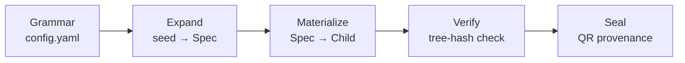
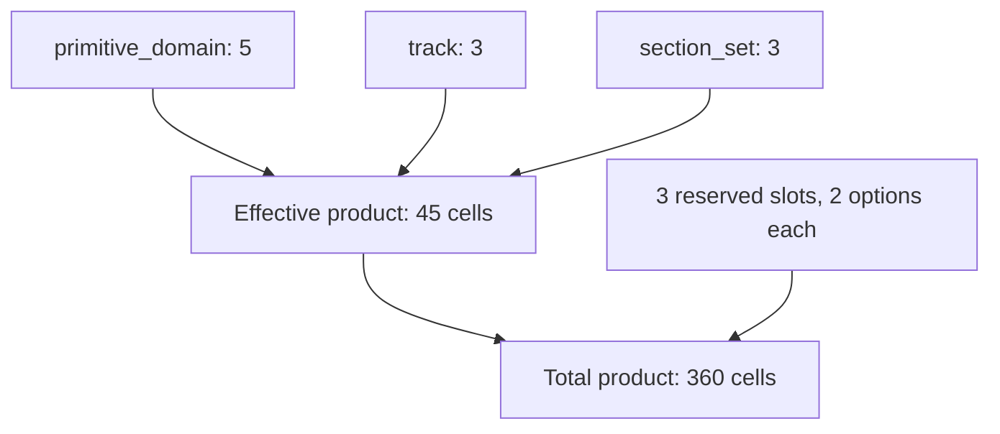

## Abstract

`template_autopoiesis` is a combinatoric grammar that **deterministically generates
whole runnable projects**.  Given a single integer seed and a grammar of orthogonal
slots, the system produces a fully-materialized child project — complete with kernel
source, tests, analysis entry-point, and a manuscript stub — whose every byte is
traceable to that seed.

### Generation pipeline

### Grammar product space

- **Domain count**: 5
- **Effective product size**: 45
- **Total product size**: 360
- **Reserved slots**: 3 (`figure_profile, qr_profile, integrity_profile`)
- **Grammar hash**: `f84a8f9dbcb18e37`
- **Tests**: 493 · **Coverage**: 96.28%
