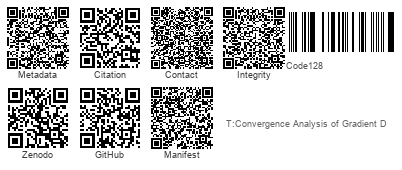
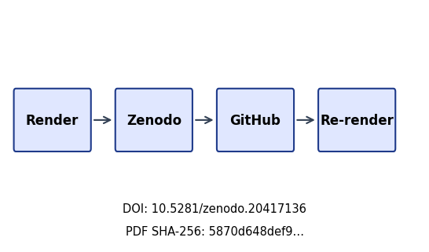

```{=latex}
\thispagestyle{empty}
\setlength{\parskip}{0pt}
\setlength{\itemsep}{0pt}
\begin{samepage}
\scriptsize
```

```{=latex}
\section*{BEGINNING OF TRANSMISSION}\label{beginning-of-transmission}
```

**State:** unpublished / pending pairing

```{=latex}
\subsubsection*{Release metadata}
```

- **Title:** Convergence Analysis of Gradient Descent Optimization
- **Version:** 2.3
- **DOI:** 10.5281/zenodo.20417136
- **GitHub:** docxology/template_code_project
- **Zenodo:** https://zenodo.org/records/20417136
- **SHA-256:** `5870d648def95d923ce5bc37a9061d56e2980c704fb6e3f5dfc46221a8bb6325`
- **SHA-512:** `97205f75992d100491631d9c5f16de22eaad6a98cf195276fa641ee7b2bae80ddd0d93b3590b6ab5ac6319f128961da5e317bb17b5d05af807115ae577862355`

**Pairing:** pending — unresolved:
- ✗ GitHub release URL: `pending`

{width=98%}

```{=latex}
\subsubsection*{Transmission manifest}
```

```
title=Convergence Analysis of Gradient Descent Optimiz
version=2.3 doi=10.5281/zenodo.20417136
sha256=5870d648def95d92… manifest={"t":"Convergence Analysis of ","v":"2.3","d":"10.5281/zenodo.20417136","s":"5870d648def95d92"}
```

Structured manifest: `../data/transmission_manifest.json`

{width=35%}

**Stego:** on | overlays text | barcodes on | XMP on | manifest on → `./secure_run.sh`

```{=latex}
\end{samepage}
\newpage
```


<!-- BEGINNING OF TRANSMISSION -->