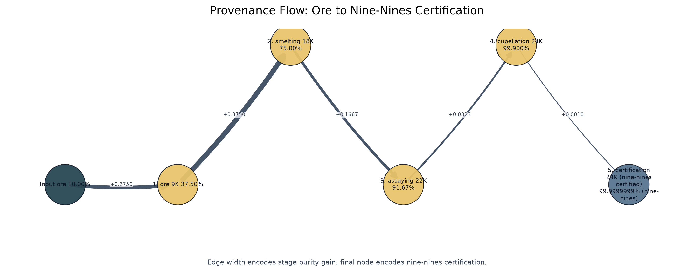
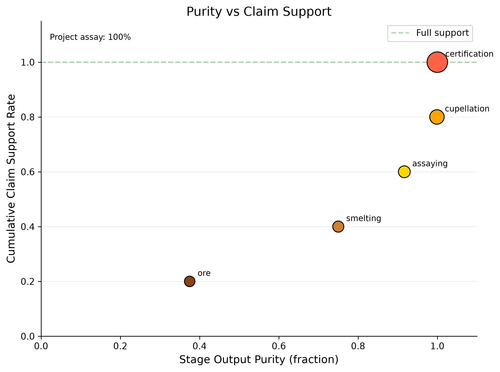
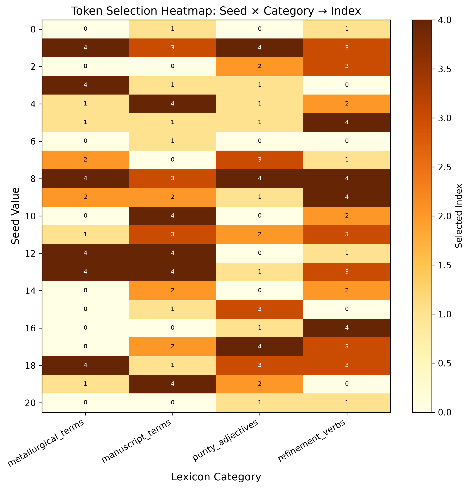
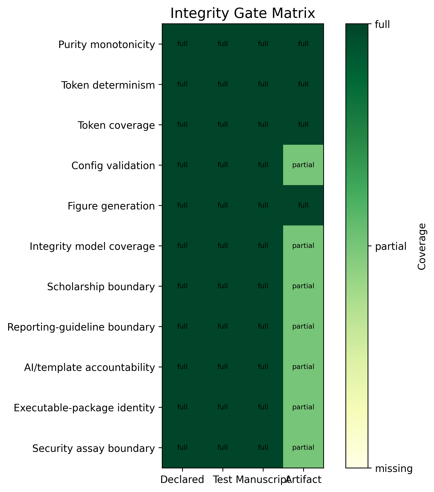
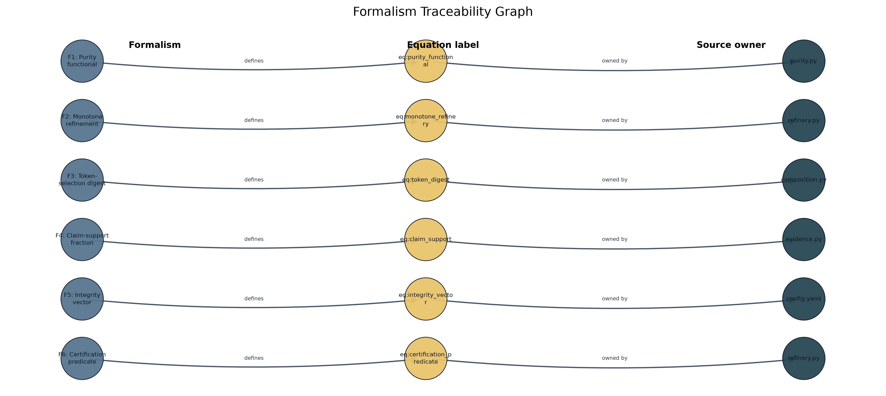
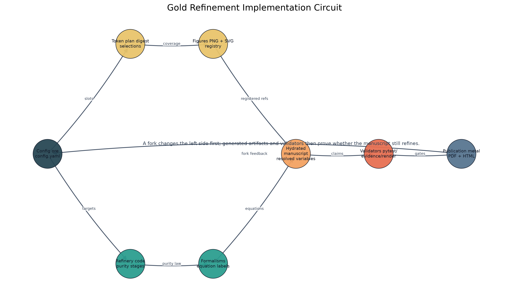
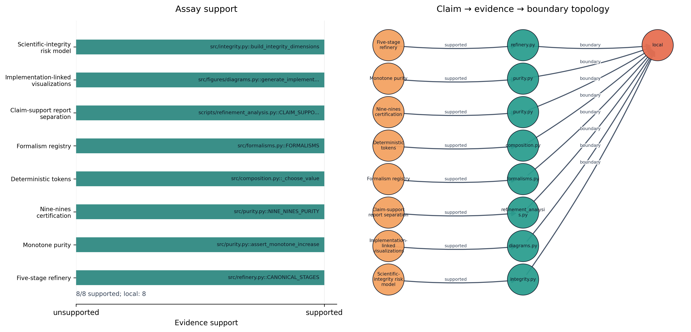
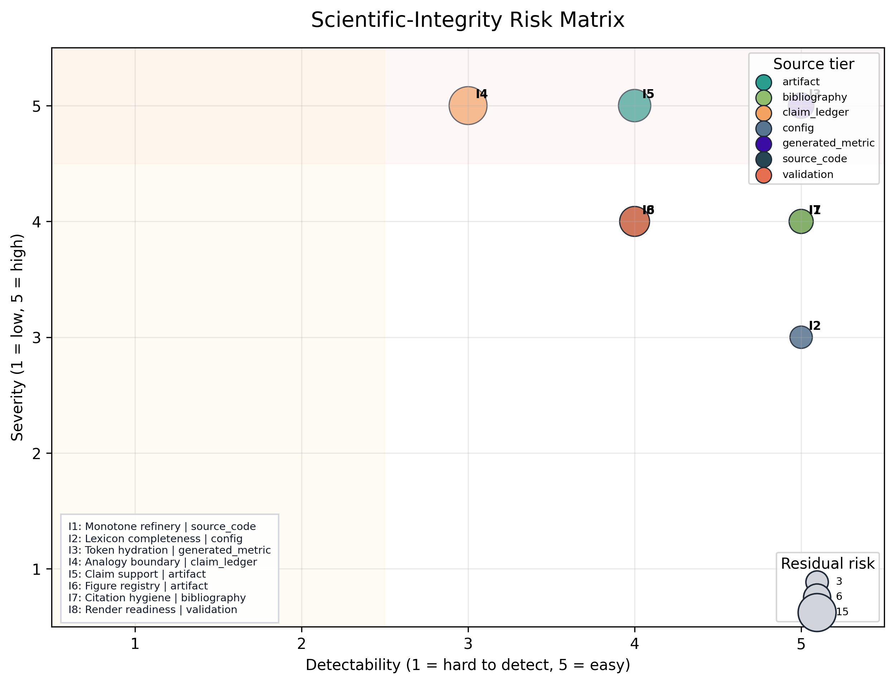
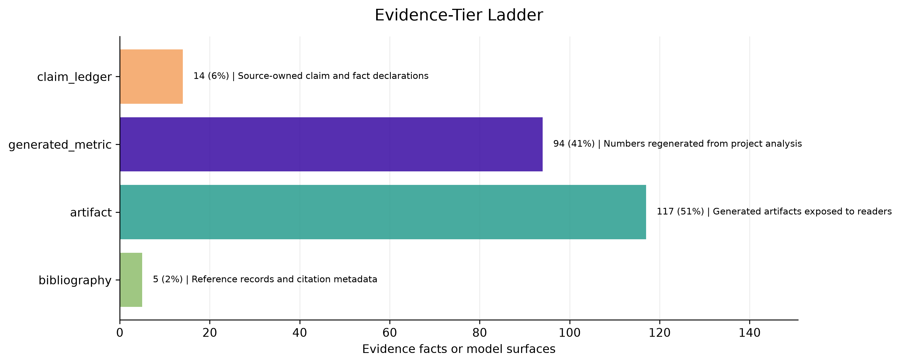

# Abstract {#sec:abstract}

This paper presents a metallurgical analogy for scientific manuscript composition, mapping gold-refining stages onto the template infrastructure pipeline. The refinery processes manuscript ore through 5 stages — from raw draft (9K, ~37.5% purity) through smelting, assaying, and cupellation — to nine-nines certification (99.9999999%), the ultra-high-purity standard of electronics-grade gold.

The analogy is **load-bearing**, not merely rhetorical: each metallurgical stage corresponds to a real template-infrastructure operation. Smelting removes dross (filler, unsupported claims); assaying tests claims against evidence; cupellation resolves cross-references; certification validates the full pipeline. The mega-madlib token engine selects 24 domain tokens deterministically via seeded SHA-256 digest over category inventories, ensuring every prose element is traceable and reproducible.

The contribution is also formalized: 6 equation-backed formalisms define purity, monotone refinement, token selection, claim support, gate vectors, and certification. The project-local claim assay reports 8/8 supported contribution claims (100.00%, passing), while the integrity model exposes 8 source-owned risk dimensions and the shared template evidence registry contributes 230 source-tiered facts when the validation gate has run.

**Results:** The refinery achieves final purity of 99.9999999% (nine-nines) (24K (nine-nines certified)) with a total purity gain of 90.00% across all stages. Nine-nines certification: Yes. The purity progression is shown in [@fig:purity_progression], and the karat grading scale in [@fig:karat_grading].

**Keywords:** gold refining, manuscript composition, mega-madlib, token injection, scientific purity, assaying, karat grading


---


# Introduction: Ore to Nine-Nines {#sec:introduction}

Gold refining is one of humanity's oldest purification technologies. From ancient cupellation to modern nine-nines electrolysis, the process of separating noble metal from base ore has evolved into a rigorous, staged pipeline with measurable purity at every step. This paper asks: can that pipeline serve as a **load-bearing** operational model for scientific manuscript composition — not merely a decorative analogy, but a real mapping from metallurgical stages to template-infrastructure operations?

## The problem

A scientific manuscript accumulates impurities through its drafting lifecycle: unsupported claims, unresolved references, redundant prose, and citation gaps. The template repository provides infrastructure to detect and remove these impurities — validation gates, cross-reference checks, evidence registries, and coverage enforcement. What it lacks is a unifying model that names the purification stages and measures purity progression.

This exemplar treats source tier and evidence spine as first-class manuscript objects. A claim is not considered refined because it sounds plausible; it is refined when its source path, generated variable, figure label, citation key, and validation gate can all be inspected.

## The analogy as pipeline

We map five gold-refining stages onto manuscript operations:

- 1. ore (9K)
- 2. smelting (18K)
- 3. assaying (22K)
- 4. cupellation (24K)
- 5. certification (24K (nine-nines certified))

Each stage has a metallurgical operation, a manuscript operation, an input purity, and an output purity. Purity increases monotonically — a constraint enforced by `src/refinery.py::assert_monotone_increase` and tested in `tests/test_refinery.py`.

## Mega-madlib token engine

The manuscript's domain vocabulary is not hand-authored prose but config-owned lexical data, selected deterministically by a seeded SHA-256 digest. The engine generates 24 tokens across 11 slots and 8 lexicon categories. Every token choice is reproducible, traceable to its config key, and bound to a manuscript section.

The deeper token inventory is deliberately spread across the paper. Introduction tokens name the integrity frame; methods tokens bind evidence validation, figure registry check, and citation validation to source-owned operations; results tokens surface artifact manifest, figure registry, and token provenance; discussion tokens mark the fork obligation and domain validator where the analogy must stop.

## Implementation circuit

The metaphor becomes operational only when every transformation has an implementation owner. In this exemplar, configuration creates the ore, `src/refinery.py` defines the purity stages, `src/composition.py` turns slots into deterministic tokens, `src/formalisms.py` owns the equation registry, `src/figures.py` turns those sources into registered visuals, and the template validators decide whether the hydrated manuscript can be treated as publication metal. The loop is deliberately closed: failures from the validators point back to source files, not to hand-polished output.

## Open question pinned

Is the analogy load-bearing or rhetorical? We assert it is **both**: it frames the methods paper (rhetorical) and operationalizes each stage against real infrastructure (load-bearing). The open question is not whether to use the analogy, but where the mapping breaks — a question the discussion addresses.


---


# Methodology: The Refinery Pipeline {#sec:methodology}

The refinery pipeline consists of 5 canonical stages, each mapping a metallurgical operation to a manuscript-composition operation. The pipeline is implemented in `src/refinery.py` and validated by `src/purity.py`. The methods surface now has three coupled layers: the refinery stages, the mega-madlib token plan, and the generated formalism registry.

## Stage definitions

| # | Stage | Output purity | Karat | Metallurgical operation |
|---|-------|-------------|-------|------------------------|
| 1 | ore | 37.50% | 9K | Extract raw gold-bearing ore from the earth |
| 2 | smelting | 75.00% | 18K | Heat ore to separate gold from slag and dross |
| 3 | assaying | 91.67% | 22K | Test a sample to determine gold content and impurities |
| 4 | cupellation | 99.900% | 24K | Refine by blowing air through molten lead-gold alloy |
| 5 | certification | 99.9999999% (nine-nines) | 24K (nine-nines certified) | Certify purity grade and stamp hallmark |

## Purity progression

The purity sequence across all stages is: 0.100000, 0.375000, 0.750000, 0.916700, 0.999000, 1.000000

Purity is strictly increasing — enforced by `assert_monotone_increase()` which raises `ValueError` if any stage's output purity does not exceed its input. Formally, for stages $s_1, \ldots, s_n$ with input purity $p_{\text{in}}^{(i)}$ and output purity $p_{\text{out}}^{(i)}$:

$$
p_{\text{out}}^{(i)} > p_{\text{in}}^{(i)} \quad \text{and} \quad p_{\text{in}}^{(i+1)} = p_{\text{out}}^{(i)} \quad \forall i \in \{1, \ldots, n-1\}
$$

The full purity progression is shown in [@fig:purity_progression] (see [@sec:results]).

## Formalism registry

The formal layer is generated from `src/formalisms.py`, not hand-numbered prose. [@tbl:formalism_registry] lists the source evidence for each equation, and the equation blocks below are auto-numbered by the renderer.

| ID | Formalism | Equation | Source |
|----|-----------|----------|--------|
| F1 | Purity functional | [@eq:purity_functional] | `src/purity.py::format_purity` |
| F2 | Monotone refinement | [@eq:monotone_refinery] | `src/refinery.py::assert_monotone_increase` |
| F3 | Token-selection digest | [@eq:token_digest] | `src/composition.py::_choose_value` |
| F4 | Claim-support fraction | [@eq:claim_support] | `src/evidence.py::EvidenceRegistry.support_rate` |
| F5 | Integrity vector | [@eq:integrity_vector] | `manuscript/config.yaml#gold_refinement.audit_rules` |
| F6 | Certification predicate | [@eq:certification_predicate] | `src/refinery.py::RefineryResult.is_nine_nines_certified` |
: Source-owned formalism registry. {#tbl:formalism_registry}

**F1: Purity functional.** Manuscript purity is treated as a bounded fraction mapped to a reader-facing grade.

$$
\pi(s) \in [0, 1], \qquad g(s) = \operatorname{karat}(\pi(s))
$$ {#eq:purity_functional}

The value is descriptive: it summarizes local validation state rather than external quality. Source: `src/purity.py::format_purity`.

**F2: Monotone refinement.** A valid refinery run requires every stage to improve the previous purity state.

$$
\pi_0 < \pi_1 < \cdots < \pi_n
$$ {#eq:monotone_refinery}

The test suite rejects equal or decreasing stage outputs. Source: `src/refinery.py::assert_monotone_increase`.

**F3: Token-selection digest.** Every mega-madlib token is selected from config-owned inventory by a deterministic digest.

$$
i = \operatorname{int}(\operatorname{SHA256}(seed \Vert slot \Vert category \Vert ordinal \Vert inventory)_{0:12}, 16) \bmod \lvert inventory \rvert
$$ {#eq:token_digest}

Changing the seed or inventory changes the plan; replaying both reproduces it. Source: `src/composition.py::_choose_value`.

**F4: Claim-support fraction.** Contribution claims are assayed by counting supported local evidence pointers.

$$
\sigma = \frac{\lvert\{c \in C : supported(c)\}\rvert}{\lvert C \rvert}
$$ {#eq:claim_support}

The numerator and denominator come from the project-local claim-support registry. Source: `src/evidence.py::EvidenceRegistry.support_rate`.

**F5: Integrity vector.** Scientific integrity is represented as a vector of gate outcomes rather than one scalar badge.

$$
\mathbf{v} = (v_{tokens}, v_{figures}, v_{claims}, v_{render}, v_{references})
$$ {#eq:integrity_vector}

A publication claim is only as strong as the weakest required gate. Source: `manuscript/config.yaml#gold_refinement.audit_rules`.

**F6: Certification predicate.** Certification is a predicate over final purity and validation readiness.

$$
\operatorname{certified}(r) \iff \pi_{final}(r) \geq 0.999999999 \land gates(r)
$$ {#eq:certification_predicate}

The predicate binds the nine-nines metaphor to the actual validation chain. Source: `src/refinery.py::RefineryResult.is_nine_nines_certified`.

## Token selection

The mega-madlib engine selects tokens from config-owned lexicon categories using a deterministic digest:

$$
\text{index} = \text{int}\left(\text{SHA-256}\left(\text{seed} \mid \text{slot} \mid \text{category} \mid \text{ordinal} \mid \text{inventory}\right)[:12], 16\right) \mod n
$$

where $n$ is the size of the lexicon category inventory. Selected metallurgical terms: hallmark, cupellation, assaying. Selected manuscript terms: evidence, evidence. The same digest rule is formalized in [@eq:token_digest], while the gate vocabulary for this section binds evidence validation, figure registry check, and citation validation to concrete validation surfaces.

## Config-owned lexicon

| Category | Count | Sample |
|----------|-------|--------|
| boundary_terms | 5 | local claim, analogy boundary, fork obligation... |
| evidence_terms | 5 | fact registry, artifact manifest, citation check... |
| gate_terms | 5 | prerender, evidence validation, figure registry check... |
| integrity_terms | 5 | evidence spine, source tier, validation gate... |
| manuscript_terms | 5 | draft, claim, citation... |
| metallurgical_terms | 5 | cupellation, assaying, smelting... |
| purity_adjectives | 5 | unrefined, purified, certified... |
| refinement_verbs | 5 | assaying, certifying, refining... |

## Karat grading

Karat grades map purity fractions to standard gold fineness:

- 9K = 37.5% (ore stage)
- 18K = 75.0% (smelting stage)
- 22K = 91.67% (assaying stage)
- 24K = 99.9% (cupellation stage)
- Nine-nines = 99.9999999% (certification stage)

The mapping is implemented in `src/purity.py::karat_for_purity()`. The karat grading chart is shown in [@fig:karat_grading] (see [@sec:results]).

## Pipeline phases

| Phase | Input | Transformation | Output | Guard |
|-------|-------|----------------|--------|-------|
| Schema intake | manuscript/config.yaml | Load and validate gold_refinement block | GoldRefinementConfig | config schema tests |
| Refinery execution | GoldRefinementConfig | Run five refinery stages with monotone purity | RefineryResult | monotone purity test |
| Token planning | GoldRefinementConfig | Expand slots into deterministic token choices | TokenPlan | seed-stability tests |
| Figure generation | RefineryResult and TokenPlan | Generate purity progression, karat grading, and token density figures | ../figures/*.png | nonblank figure tests |
| Integrity risk modeling | audit rules, failure modes, claims, and shared evidence registry | Score integrity dimensions and summarize evidence tiers | integrity tables and risk visualizations | tests/test_integrity.py |
| Manuscript hydration | manuscript shells and manuscript_variables.json | Resolve {{TOKEN}} placeholders into output/manuscript/ | hydrated Markdown manuscript | unresolved-token scan |
| Render and validate | output/manuscript | Render PDF, HTML through shared template pipeline | output/pdf and output/web | render command |

The pipeline table is intentionally operational rather than decorative: a fork that changes the stages must update the source function, generated variables, figures, and validation gates together.

## Implementation trace

The implementation circuit shown in [@fig:implementation_circuit] is the method's wiring diagram. It distinguishes three ownership layers. First, authored sources own intent: config declares vocabulary and claims, `src/` owns computation, and the claim ledger registers evidence facts. Second, generated artifacts own observation: token plans, figures, resolved Markdown, reports, and dashboards are rebuilt rather than edited. Third, template gates own permission to promote the manuscript: unresolved tokens, unsupported facts, missing citations, broken references, and invalid PDFs block certification.

This split keeps the gold metaphor honest. A fork is allowed to change the ore, the furnace, or the assay, but it must do so in the source layer and then let the generated and validation layers expose the consequences.

## Scientific integrity model

The integrity model converts manuscript risks into source-owned dimensions. It does not replace peer review or domain validation. It names the failure class, severity, detectability, evidence surface, owner, and validator so the manuscript can distinguish "the analogy is vivid" from "the claim is backed by a regenerable check." The current pass reports 8 integrity dimensions; highest residual risk is I4 (Analogy boundary) at 15.

| ID | Dimension | Residual risk | Owner | Validator |
|----|-----------|---------------|-------|-----------|
| I1 | Monotone refinery | 4 | source code | tests/test_refinery.py |
| I2 | Lexicon completeness | 3 | config | tests/test_config.py |
| I3 | Token hydration | 5 | generated variables | tests/test_manuscript_variables.py |
| I4 | Analogy boundary | 15 | claim ledger | infrastructure.validation.cli evidence --fail-on-issues |
| I5 | Claim support | 10 | evidence assay | output/reports/claim_support_registry.json |
| I6 | Figure registry | 8 | figure producer | tests/test_registry_integrity.py |
| I7 | Citation hygiene | 4 | bibliography | infrastructure.reference.citation validate |
| I8 | Render readiness | 8 | template pipeline | template pipeline render and validate stages |
: Source-owned scientific-integrity dimensions. {#tbl:integrity_dimensions}

The residual-risk score is deliberately simple: high severity and low detectability raise priority. The score is not a universal risk model; it is a local audit heuristic used to decide where a fork must add validators before expanding claims.

| Owner | Dimensions |
|-------|------------|
| bibliography | 1 |
| claim ledger | 1 |
| config | 1 |
| evidence assay | 1 |
| figure producer | 1 |
| generated variables | 1 |
| source code | 1 |
| template pipeline | 1 |
: Integrity dimensions by owning surface. {#tbl:integrity_owners}

This table also makes generated-number ownership explicit. Counts, support rates, and figure labels belong to regenerated reports and registries; the manuscript consumes them through variables. Authored prose may interpret those values, but it should not silently restate them as hand-maintained facts.


---


# Results: Purity Progression and Karat Grading {#sec:results}

The refinery pipeline produces a monotonically increasing purity sequence across 5 stages, reaching final purity of 99.9999999% (nine-nines) (24K (nine-nines certified)).

## Purity progression

{#fig:purity_progression}

| Stage | Name | Output purity | Karat | Gain |
|-------|------|--------------|-------|------|
| 1 | ore | 37.50% | 9K | Extract raw gold-bearing ore from the earth |
| 2 | smelting | 75.00% | 18K | Heat ore to separate gold from slag and dross |
| 3 | assaying | 91.67% | 22K | Test a sample to determine gold content and impurities |
| 4 | cupellation | 99.900% | 24K | Refine by blowing air through molten lead-gold alloy |
| 5 | certification | 99.9999999% (nine-nines) | 24K (nine-nines certified) | Certify purity grade and stamp hallmark |

## Karat grading scale

{#fig:karat_grading}

## Final certification

- **Final purity:** 99.9999999% (nine-nines)
- **Final karat:** 24K (nine-nines certified)
- **Total purity gain:** 90.00%
- **Nine-nines certified:** Yes
- **Nines count:** 9

## Token plan summary

The mega-madlib engine generated 24 tokens from seed 431 across 8 lexicon categories.

{#fig:token_density}

### Category distribution

| Category | Count |
|----------|-------|
| boundary_terms | 4 |
| evidence_terms | 5 |
| gate_terms | 5 |
| integrity_terms | 2 |
| manuscript_terms | 2 |
| metallurgical_terms | 3 |
| purity_adjectives | 2 |
| refinement_verbs | 1 |

### Section distribution

| Section | Token count |
|---------|-----------|
| authoring_contract | 2 |
| discussion | 3 |
| evaluation | 2 |
| introduction | 2 |
| methodology | 8 |
| reproducibility | 2 |
| results | 5 |

### Provenance trace

| Variable | Category | Value | Section | Source |
|----------|----------|-------|---------|--------|
| AUTHORING_BOUNDARY_TERM_1 | boundary_terms | analogy boundary | authoring_contract | manuscript/config.yaml#gold_refinement.lexicon.boundary_terms[1] |
| AUTHORING_BOUNDARY_TERM_2 | boundary_terms | non-claim | authoring_contract | manuscript/config.yaml#gold_refinement.lexicon.boundary_terms[4] |
| DISCUSSION_BOUNDARY_TERM_1 | boundary_terms | fork obligation | discussion | manuscript/config.yaml#gold_refinement.lexicon.boundary_terms[2] |
| DISCUSSION_BOUNDARY_TERM_2 | boundary_terms | domain validator | discussion | manuscript/config.yaml#gold_refinement.lexicon.boundary_terms[3] |
| DISCUSSION_REFINEMENT_VERB | refinement_verbs | smelting | discussion | manuscript/config.yaml#gold_refinement.lexicon.refinement_verbs[3] |
| EVALUATION_GATE_TERM_1 | gate_terms | prerender | evaluation | manuscript/config.yaml#gold_refinement.lexicon.gate_terms[0] |
| EVALUATION_GATE_TERM_2 | gate_terms | citation validation | evaluation | manuscript/config.yaml#gold_refinement.lexicon.gate_terms[3] |
| INTRO_INTEGRITY_TERM_1 | integrity_terms | source tier | introduction | manuscript/config.yaml#gold_refinement.lexicon.integrity_terms[1] |
| INTRO_INTEGRITY_TERM_2 | integrity_terms | evidence spine | introduction | manuscript/config.yaml#gold_refinement.lexicon.integrity_terms[0] |
| METHOD_GATE_TERM_1 | gate_terms | evidence validation | methodology | manuscript/config.yaml#gold_refinement.lexicon.gate_terms[1] |
| METHOD_GATE_TERM_2 | gate_terms | figure registry check | methodology | manuscript/config.yaml#gold_refinement.lexicon.gate_terms[2] |
| METHOD_GATE_TERM_3 | gate_terms | citation validation | methodology | manuscript/config.yaml#gold_refinement.lexicon.gate_terms[3] |
| METHOD_MANUSCRIPT_TERM_1 | manuscript_terms | evidence | methodology | manuscript/config.yaml#gold_refinement.lexicon.manuscript_terms[4] |
| METHOD_MANUSCRIPT_TERM_2 | manuscript_terms | evidence | methodology | manuscript/config.yaml#gold_refinement.lexicon.manuscript_terms[4] |
| METHOD_METAL_TERM_1 | metallurgical_terms | hallmark | methodology | manuscript/config.yaml#gold_refinement.lexicon.metallurgical_terms[4] |
| METHOD_METAL_TERM_2 | metallurgical_terms | cupellation | methodology | manuscript/config.yaml#gold_refinement.lexicon.metallurgical_terms[0] |
| METHOD_METAL_TERM_3 | metallurgical_terms | assaying | methodology | manuscript/config.yaml#gold_refinement.lexicon.metallurgical_terms[1] |
| REPRO_EVIDENCE_TERM_1 | evidence_terms | fact registry | reproducibility | manuscript/config.yaml#gold_refinement.lexicon.evidence_terms[0] |
| REPRO_EVIDENCE_TERM_2 | evidence_terms | figure registry | reproducibility | manuscript/config.yaml#gold_refinement.lexicon.evidence_terms[3] |
| RESULTS_EVIDENCE_TERM_1 | evidence_terms | artifact manifest | results | manuscript/config.yaml#gold_refinement.lexicon.evidence_terms[1] |
| RESULTS_EVIDENCE_TERM_2 | evidence_terms | figure registry | results | manuscript/config.yaml#gold_refinement.lexicon.evidence_terms[3] |
| RESULTS_EVIDENCE_TERM_3 | evidence_terms | token provenance | results | manuscript/config.yaml#gold_refinement.lexicon.evidence_terms[4] |
| RESULTS_PURITY_ADJ_1 | purity_adjectives | unrefined | results | manuscript/config.yaml#gold_refinement.lexicon.purity_adjectives[0] |
| RESULTS_PURITY_ADJ_2 | purity_adjectives | purified | results | manuscript/config.yaml#gold_refinement.lexicon.purity_adjectives[1] |

Selected purity adjectives for this section: unrefined, purified. Selected evidence terms: artifact manifest, figure registry, token provenance.

## Provenance flow

{#fig:provenance_sankey}

## Purity vs claim support

{#fig:purity_claim_scatter}

## Token selection sensitivity

{#fig:token_heatmap}

## Integrity gate matrix

The integrity gate matrix in [@fig:integrity_gate_matrix] makes the validation story visible: audit rules are not prose promises unless they connect to tests, manuscript surfaces, and generated artifacts.

{#fig:integrity_gate_matrix}

## Formalism traceability

The formalism traceability view in [@fig:formalism_traceability] links each equation-backed formalism to the source surface that owns it. This is the visual counterpart to [@tbl:formalism_registry].

{#fig:formalism_traceability}

## Implementation circuit

The implementation circuit in [@fig:implementation_circuit] shows how the concept is executed rather than merely described. Configuration feeds code; code emits variables, figures, and reports; manuscript hydration consumes those artifacts; validators feed errors back to source ownership. The figure is intentionally circular because the artifact is not complete after prose generation. It is complete only after the validation return path has no blocking evidence, citation, reference, or render failures.

{#fig:implementation_circuit}

## Claim-evidence assay

The claim-evidence assay in [@fig:claim_evidence_assay] turns the assaying stage into a reader-facing diagnostic. Each bar is a contribution claim from `manuscript/config.yaml`, and each annotation names the source file or symbol used to support it. This makes the contribution ledger inspectable at the same level as the purity plots: unsupported claims would appear as failed assays rather than remaining hidden in prose.

{#fig:claim_evidence_assay}

## Scientific-integrity risk matrix

The integrity risk matrix in [@fig:integrity_risk_matrix] plots severity against detectability for the 8 integrity dimensions in [@tbl:integrity_dimensions]. Bubble size encodes residual risk, while color encodes the source tier that owns the evidence surface. This makes boundary failures more visible than cosmetic source checks without hiding whether the support comes from config, source code, claim ledger, generated metric, artifact, bibliography, or validation gate. The matrix is intentionally local: it prioritizes where this exemplar needs source ownership, not where every future manuscript should focus.

{#fig:integrity_risk_matrix}

## Evidence-tier ladder

The evidence-tier ladder in [@fig:evidence_tier_ladder] summarizes the evidence surfaces available to the shared template evidence registry or, before that gate has run, the fallback source tiers from the integrity model. It gives a quick view of whether the manuscript is leaning on generated metrics, claim-ledger facts, bibliography records, source code, or disposable artifacts.

{#fig:evidence_tier_ladder}

| Source tier | Count | Role |
|-------------|-------|------|
| artifact | 117 | Generated artifacts exposed to readers |
| generated_metric | 94 | Numbers regenerated from project analysis |
| claim_ledger | 14 | Source-owned claim and fact declarations |
| bibliography | 5 | Reference records and citation metadata |
: Evidence tiers used by the integrity model and shared registry when available. {#tbl:evidence_tiers}

## Contribution claims

| Claim | Statement | Evidence | Boundary |
|-------|-----------|----------|----------|
| Five-stage refinery | The refinery pipeline has 5 canonical stages from ore to nine-nines. | src/refinery.py::CANONICAL_STAGES | local |
| Monotone purity | Purity increases strictly across all refinery stages. | src/refinery.py::assert_monotone_increase | local |
| Nine-nines certification | The certification stage achieves 99.9999999% purity. | src/purity.py::NINE_NINES_PURITY | local |
| Deterministic tokens | Token selection is deterministic via seeded SHA-256 digest. | src/composition.py::_choose_value | local |
| Formalism registry | The manuscript exposes 6 source-owned formalisms with equation labels. | src/formalisms.py::FORMALISMS | local |
| Claim-support report separation | The project-local contribution-claim report is written to claim_support_registry.json. | scripts/refinement_analysis.py::claim_support_registry | local |
| Implementation-linked visualizations | The manuscript includes generated visualizations that link the refinery analogy to source code, variables, evidence, and validation gates. | src/figures.py::generate_implementation_circuit | local |
| Scientific-integrity risk model | The manuscript includes a source-owned integrity risk model linking failure modes, validators, evidence surfaces, and fork obligations. | src/integrity.py::build_integrity_dimensions | local |

The project-local claim-support assay reports 8 supported claims out of 8 total claims, for 100.00% support. Unsupported claims: 0. The generated project report path is `output/reports/claim_support_registry.json`; the shared template evidence report remains `output/reports/evidence_registry.json`.

## Shared evidence registry summary

When the template evidence gate has run, the shared registry supplies source-tiered facts used by the evidence validator. Current fact count available to this variable pass: 230.

| Fact kind | Count |
|-----------|-------|
| artifact | 75 |
| citation | 5 |
| equation | 7 |
| figure | 27 |
| number | 100 |
| section | 10 |
| table | 6 |
: Shared evidence-registry fact kinds when available. {#tbl:shared_evidence_kinds}

## Figure quality report

The visualization registry is paired with `output/reports/figure_quality_report.json`, a generated QA report that checks PNG and SVG existence, file dimensions, nonblank pixel mass, color variance, and registry parity. Current status: passing with 12/12 registered figures passing and registry parity reported as Yes. PNG remains the manuscript render path; SVG is the companion technical artifact for inspection, reuse, and source-level debugging. [@tbl:figure_quality] summarizes the generated surface.

| Figure | PNG | SVG | Dimensions | Nonwhite | Variance | Status |
|--------|-----|-----|------------|----------|----------|--------|
| claim_evidence_assay | yes | yes | 3947x1904 | 0.211 | 0.05905715 | pass |
| evidence_tier_ladder | yes | yes | 3254x1319 | 0.194 | 0.05465268 | pass |
| formalism_traceability | yes | yes | 4170x1866 | 0.096 | 0.03165302 | pass |
| implementation_circuit | yes | yes | 3720x2129 | 0.049 | 0.01648025 | pass |
| integrity_gate_matrix | yes | yes | 1953x1559 | 0.457 | 0.17734427 | pass |
| integrity_risk_matrix | yes | yes | 2969x2069 | 0.402 | 0.01475595 | pass |
| karat_grading | yes | yes | 3241x1829 | 0.286 | 0.07357948 | pass |
| provenance_sankey | yes | yes | 3570x1400 | 0.059 | 0.01855784 | pass |
| purity_claim_scatter | yes | yes | 2587x1889 | 0.028 | 0.01227429 | pass |
| purity_progression | yes | yes | 3029x2125 | 0.182 | 0.03971092 | pass |
| token_density | yes | yes | 3865x1663 | 0.206 | 0.06115993 | pass |
| token_heatmap | yes | yes | 2648x2424 | 0.637 | 0.12747028 | pass |
: Figure-quality report generated from source-owned figure specs. {#tbl:figure_quality}


---


# Discussion: Load-Bearing vs Rhetorical Analogy {#sec:discussion}

## Load-bearing vs rhetorical

The gold-refining analogy operates on two levels. **Rhetorically**, it provides a memorable framing for a methods paper: purity progression, karat grading, and certification are vivid metaphors for manuscript quality. **Operationally**, each stage maps to a real template-infrastructure operation — smelting to claim removal, assaying to evidence validation, cupellation to cross-reference resolution, and certification to full pipeline validation.

The analogy is smelting the manuscript: it performs the refinement it describes. Its fork obligation is equally important. Gold refining can model staged purification, but it cannot certify domain truth unless the fork supplies a real domain validator and evidence source.

The added implementation and claim-assay figures sharpen that boundary. They show that "purity" is not a free-standing aesthetic judgment. It is a local statement about whether source-owned stages, generated artifacts, claim ledgers, figure registries, and validation commands agree. The figures therefore make a negative claim as important as the positive one: when a fork lacks a validator, a ledger, or a source artifact, the metaphor must stop at analogy and cannot be promoted to certification.

## Useful adaptation cases

- **Domain-specific refinement pipelines**: fork the exemplar and remap stages to domain operations (e.g., clinical evidence, legal citation, engineering specification).
- **Purity measurement**: adopt the purity fraction and karat grade vocabulary for any staged quality process.
- **Mega-madlib composition**: reuse the deterministic token engine for any config-owned lexical composition task.

## Misuse modes

| Mode | Risk | Detection | Mitigation |
|------|------|-----------|------------|
| Non-monotone purity | A stage has lower output purity than input. | assert_monotone_increase raises ValueError. | Fix stage purity targets in src/refinery.py. |
| Empty lexicon category | A required lexicon category is empty or missing. | Config validation raises GoldRefinementConfigError. | Add vocabulary to manuscript/config.yaml. |
| Unresolved token | A manuscript placeholder has no generated variable. | test_all_manuscript_tokens_are_generated fails. | Add variable in src/manuscript_variables.py. |
| Rhetorical-only analogy | The analogy is decorative with no operational mapping. | Review that each stage maps to a real infrastructure operation. | Connect stages to template pipeline operations. |
| Undetected integrity gap | A high-severity failure mode is present but no owner, validator, or generated artifact makes it visible. | build_integrity_dimensions lists severity, detectability, owner, validator, and evidence surface. | Add or revise the source-owned integrity dimension before promoting the manuscript. |

## Design principles

| Principle | Rationale |
|-----------|-----------|
| Analogy is load-bearing | Each metallurgical stage maps to a real template-infrastructure operation, not mere decoration. |
| Purity increases monotonically | The refinery pipeline guarantees strictly increasing purity from ore to certification. |
| Token selection is deterministic | A fixed seed and lexicon produce the same injection plan across reruns. |
| Configuration owns prose choices | Reviewers can inspect the declared language surface before generation. |
| Generated output is disposable | The durable artifact is the regeneration contract, not hand-edited output. |

## Analogy-break boundary

The analogy breaks when purity becomes a rhetorical grade detached from evidence. In this exemplar, [@eq:claim_support] and [@eq:integrity_vector] keep the grade tied to claim support and gate coverage. A fork that cannot provide comparable source-owned gates should keep the gold-refining language as metaphor only and avoid publication-strength claims.

The practical rule is simple: do not add an impressive figure unless its path through [@fig:implementation_circuit] is visible. A visual can summarize an idea, but it only supports a manuscript claim when the claim-evidence assay can point to the owning file, symbol, generated artifact, and validation surface.

The integrity risk matrix adds one more brake. A fork may have all figures registered and still be scientifically weak if its highest-severity risks are only weakly detectable. In this exemplar, [@tbl:integrity_dimensions] makes that weakness inspectable by pairing each dimension with an owner and validator. The useful question for a fork is therefore not "can the manuscript render?" but "which severe failures would the current pipeline miss, and what source-owned gate would expose them?"

The evidence-tier ladder also prevents a common drift in generated manuscripts: treating generated artifacts as if they were independent evidence. A generated metric can support an internal consistency claim, but a domain claim needs a domain source tier. The ladder makes that distinction visible without pretending that a large fact count is the same as stronger external validity.


---


# Conclusion: Certification and Forking {#sec:conclusion}

The gold-refinery pipeline demonstrates that a metallurgical analogy can be load-bearing: each stage maps to a real template-infrastructure operation, purity increases monotonically, and the final stage achieves nine-nines certification (99.9999999% (nine-nines)).

## Summary

- 5 refinery stages from ore (9K) to certification (nine-nines)
- Final purity: 99.9999999% (nine-nines) (24K (nine-nines certified))
- 24 tokens generated deterministically from seed 431
- Config hash: 646d8ce93d6d42bd
- 6 source-owned formalisms with equation labels: eq:purity_functional, eq:monotone_refinery, eq:token_digest, eq:claim_support, eq:integrity_vector, eq:certification_predicate
- Claim-support status: 8/8 supported (passing)
- 8 integrity dimensions with residual-risk scoring and owner/validator links.
- Registered visual evidence spans purity progression, token coverage, formalism traceability, implementation flow, claim-evidence assay, risk-matrix, and evidence-tier surfaces.

## Forking responsibilities

1. Remap metallurgical stages to domain operations
2. Update lexicon categories in `manuscript/config.yaml`
3. Add domain-specific evidence and validators
4. Regenerate all outputs through the pipeline
5. Do not hand-edit generated manuscript, PDFs, or figures

The durable result is not the current prose snapshot. It is the reproducible contract that can rebuild the prose, figures, formalisms, and validation reports from source.

That contract is the paper's central contribution. It demonstrates how an analogy can be useful without being loose: every metaphorical move either points to a source-owned implementation surface or stays explicitly inside the discussion boundary.

The added integrity model makes the same claim in a stricter form: every high-value visual or formal statement should have an owner, an evidence tier, and a validator. Without those three surfaces, the right outcome is not a more polished metaphor; it is a narrower claim.


---


# Reproducibility: Seeded Regeneration {#sec:reproducibility}

## Deterministic regeneration

The refinery pipeline is fully deterministic. Given the same `manuscript/config.yaml` and `src/` code, every run produces identical output.

- **Seed:** 431
- **Config hash:** 646d8ce93d6d42bd
- **Generation timestamp:** 2026-06-26T18:18:44Z
- **Python version:** 3.12.13

## Artifact inventory

| Category | Count |
|----------|-------|
| Figures | 24 |
| Data files | 3 |
| Reports | 11 |
| **Total** | 38 |

## Regeneration commands

```bash
# Run the refinery analysis
uv run python projects/templates/template_gold_refinement/scripts/refinement_analysis.py

# Generate manuscript variables
uv run python projects/templates/template_gold_refinement/scripts/z_generate_manuscript_variables.py

# Full pipeline (from repo root)
./run.sh --project templates/template_gold_refinement --pipeline --core-only
```

## Config ownership

All vocabulary, slots, and section conditions are declared in `manuscript/config.yaml` under `gold_refinement:`. The config is the source of truth; generated prose is disposable.

The reproducibility spine uses fact registry and figure registry as generated artifacts rather than reader trust signals. Variable generation records `646d8ce93d6d42bd`; analysis writes refinery, token, claim-support, dashboard, and figure artifacts; validation may add the shared evidence registry used by template scientific-integrity checks.

The implementation circuit gives a reproducibility checklist for future forks. A reader should be able to start at any rendered figure or claim, follow it to a generated variable or report, follow that artifact to `src/` or `manuscript/config.yaml`, and rerun the same stage command. If that path is broken, the fork has produced a static illustration rather than a reproducible refinement pipeline.

The same rule applies to visual polish. The figure registry is source-owned, every registered PNG now has a companion SVG, and `output/reports/figure_quality_report.json` records 12 PNG files, 12 SVG files, and 12 passing visual-quality checks for the current variable pass. A fork should treat [@tbl:figure_quality] as the figure-layer analogue of the claim-support registry: it proves that the visuals are regenerated, present in both raster and vector forms, nonblank, and aligned with the registry before prose promotes them.

## Evidence-registry separation

This exemplar now separates two evidence surfaces. `output/reports/claim_support_registry.json` is the project-local contribution-claim assay consumed by the dashboard and claim-support figure. `output/reports/evidence_registry.json` is reserved for the shared template evidence validator, which registers numbers, citations, equations, sections, figures, tables, generated data, and claim-ledger facts.

The evidence-tier ladder in [@fig:evidence_tier_ladder] is the reproducibility counterpart to that separation. It does not merely count files. It shows which tier owns each support surface, so a future fork can see whether a conclusion rests on config declarations, generated metrics, claim-ledger facts, bibliography records, or rendered artifacts. That distinction matters because only some tiers can support domain truth; others support reproducibility, formatting, or local consistency.


---


# Scope: Related Work and Limitations {#sec:scope}

## Scope limitations

This exemplar demonstrates the gold-refining analogy as a **methods paper**. It does not claim:

- Empirical validation of manuscript quality metrics against external standards
- Generalizability of specific purity fractions to all scientific domains
- That the analogy replaces domain-specific peer review or expert judgement

## Related work

The mega-madlib token injection pattern follows `template_madlib`'s deterministic lexical composition approach. The pipeline-staging model draws on `template_code_project`'s thin-orchestrator pattern. The refinement analogy is novel to this exemplar but builds on the template repository's existing validation and rendering infrastructure.

## Responsible forking

A fork must:

1. Add domain-specific evidence before making domain claims
2. Update lexicon categories to reflect domain vocabulary
3. Connect refinery stages to real domain operations
4. Add domain validators beyond the exemplar's generic gates
5. Regenerate all outputs through the pipeline

The formalism registry is local to this exemplar. It states how this project maps refinery stages, token selection, and evidence gates into equations; it does not prove that gold refining is a universal model of scientific writing. Domain forks should replace or narrow the formalism set before reusing the certification language.

The same limitation applies to the integrity risk model. The current 8 dimensions are tuned to a template exemplar: token hydration, figure registration, claim support, citation hygiene, render readiness, and analogy boundaries. A fork that studies a real domain must add domain-specific risks, domain evidence tiers, and validators before treating [@fig:integrity_risk_matrix] as a publication-readiness claim.


---


# Quality Probes {#sec:evaluation}

## QA probes

| Probe | Question | Passing signal | Artifact |
|-------|----------|---------------|----------|
| Monotone purity | Does purity increase strictly across all refinery stages? | assert_monotone_increase passes on the purity sequence. | src/refinery.py and output/data/refinery_results.json |
| Token provenance | Can every selected token be traced to a category, section, value, and config key? | The token plan contains one row for each generated token. | output/reports/token_plan.json |
| Karat grade correctness | Does each stage map to the correct karat grade? | karat_for_purity returns the expected grade for each stage. | src/purity.py |
| Integrity risk visibility | Can the manuscript identify high-severity integrity failures and the validator or artifact that detects them? | The integrity risk model emits dimensions, owners, residual risk scores, and evidence-tier rows. | src/integrity.py and ../figures/integrity_risk_matrix.png |

The selected evaluation gate terms are prerender and citation validation. They are intentionally narrower than peer review: they check source ownership, token coverage, figure registration, claim support, and rendering integrity before a human reviewer assesses the substantive analogy.

## Audit rules

| Rule | Check | Test |
|------|-------|------|
| Purity monotonicity | Purity must strictly increase from stage to stage | tests/test_refinery.py |
| Token determinism | Same seed and lexicon must produce same token plan | tests/test_composition.py |
| Token coverage | Every manuscript {{TOKEN}} must have a generated variable | tests/test_manuscript_variables.py |
| Config validation | Invalid config must raise GoldRefinementConfigError | tests/test_config.py |
| Figure generation | All figure generators must produce non-blank PNGs | tests/test_figures.py |
| Integrity model coverage | Integrity dimensions must have unique IDs, owners, validators, and evidence surfaces | tests/test_integrity.py |

The audit rules are summarized visually in [@fig:integrity_gate_matrix] and algebraically in [@eq:integrity_vector]. A failed audit rule should block certification language even if the PDF renders.

The risk model adds prioritization to the gate list. [@fig:integrity_risk_matrix] separates easy-to-detect implementation failures from severe boundary failures that need clearer ownership. This keeps the evaluation surface from becoming a checklist of equally weighted boxes: token coverage, citation validity, claim support, and render readiness all matter, but a high-severity low-detectability failure should shape the next source edit before cosmetic manuscript polish.


---


# Authoring Contract {#sec:authoring_contract}

## Obligations

| Obligation | Requirement |
|------------|-------------|
| Domain validator | Add domain-specific evidence before making domain claims beyond the exemplar. |
| Config ownership | Keep lexicon and slots in config.yaml, not in generated prose. |
| Regeneration contract | Regenerate outputs through the pipeline, not by hand-editing. |
| Risk review | Treat high-residual-risk integrity dimensions as fork obligations before publication claims are expanded. |

The authoring boundary tokens for this section are analogy boundary and non-claim. They mark the point where an author must either add new evidence and validators or lower the claim from certification to analogy.

## Fork checklist

1. Remap metallurgical stages to domain operations in `src/refinery.py`
2. Update lexicon categories in `manuscript/config.yaml` under `gold_refinement.lexicon`
3. Update `contribution_claims` with domain-specific evidence pointers
4. Add domain validators beyond the exemplar's generic gates
5. Replace or extend `src/integrity.py` dimensions when the fork introduces new failure modes
6. Regenerate all outputs through the pipeline:
   ```bash
   uv run python scripts/refinement_analysis.py
   uv run python scripts/z_generate_manuscript_variables.py
   ```
7. Do not hand-edit generated manuscript, PDFs, or figures

Do not hard-code equation, figure, or table numbers in prose. Use `[@eq:...]`, `[@fig:...]`, `[@tbl:...]`, and `[@sec:...]` so the renderer owns numbering and the tests can detect dangling references.

The authoring contract treats the risk matrix as a source checklist, not as a retrospective dashboard. If a fork cannot name who owns a high-severity integrity dimension, which validator detects it, and which evidence tier supports it, the fork should lower the claim boundary until that missing surface exists.
