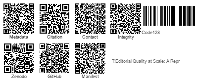
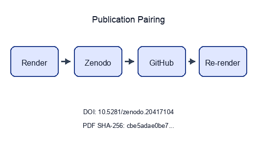

```{=latex}
\thispagestyle{empty}
\setlength{\parskip}{0pt}
\setlength{\itemsep}{0pt}
\begin{samepage}
\scriptsize
```

```{=latex}
\section*{BEGINNING OF TRANSMISSION}\label{beginning-of-transmission}
```

**State:** published

```{=latex}
\subsubsection*{Release metadata}
```

- **Title:** Editorial Quality at Scale: A Reproducible Prose-Review Pipeline
- **Version:** 0.4.0
- **DOI:** 10.5281/zenodo.20417104
- **GitHub:** https://github.com/docxology/template_prose_project/releases/tag/v0.4.0
- **Zenodo:** https://zenodo.org/records/20417104
- **SHA-256:** `cbe5adae0be78b58c77637042257e9faa61a21b6c5101da52600cf8e2e80c0e2`
- **SHA-512:** `45c0f0052a193397f8c877bf51b467040d731f23b6abf10500c2f91426c0ace3157dfd6ad5057b65c27a3987a4349a147f58db836ce4bfc1d9347a3ca9808b04`

**Pairing:** complete (DOI, GitHub, SHA-256, Zenodo URL)

{width=98%}

```{=latex}
\subsubsection*{Transmission manifest}
```

```
title=Editorial Quality at Scale: A Reproducible Prose
version=0.4.0 doi=10.5281/zenodo.20417104
sha256=cbe5adae0be78b58… manifest={"t":"Editorial Quality at Sca","v":"0.4.0","d":"10.5281/zenodo.20417104","s":"cbe5adae0be78b58"}
```

Structured manifest: `../data/transmission_manifest.json`

{width=35%}

**Stego:** off | overlays text | barcodes on | XMP on | manifest on → `./secure_run.sh`

```{=latex}
\end{samepage}
\newpage
```


<!-- BEGINNING OF TRANSMISSION -->