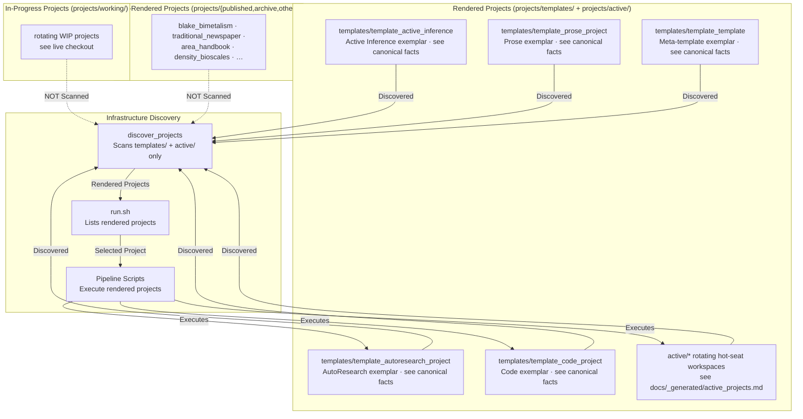
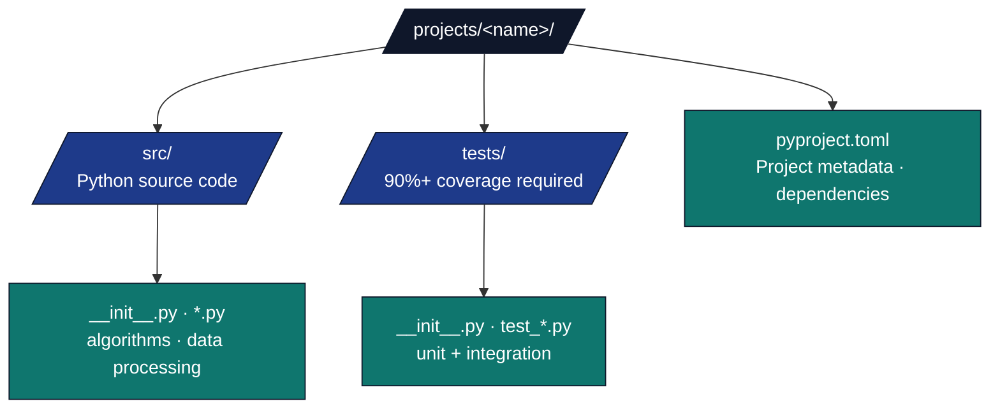
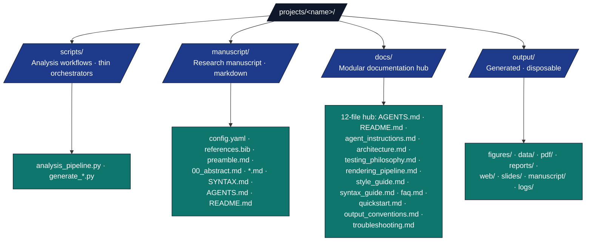
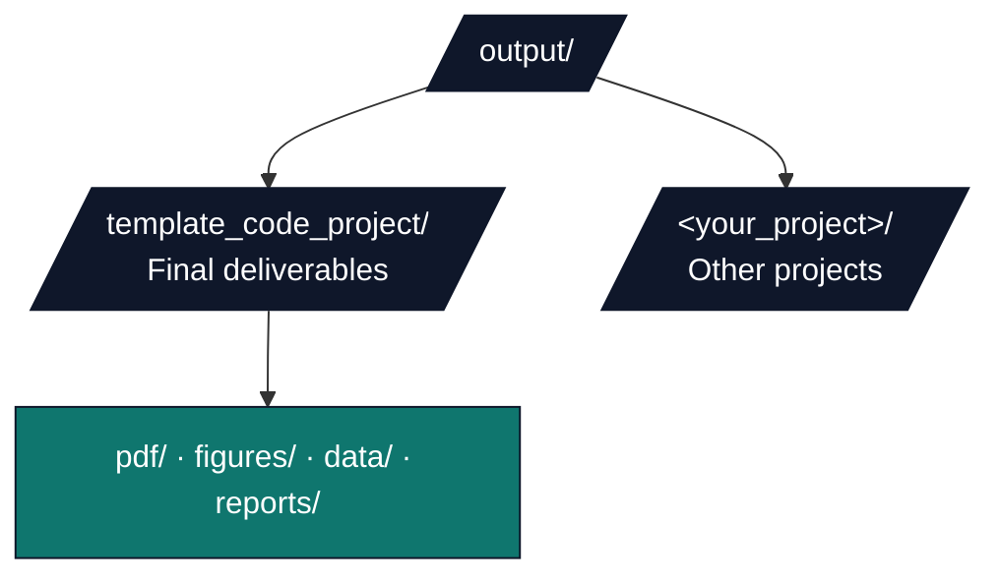
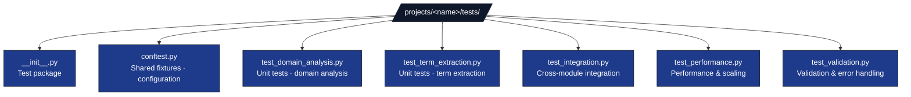
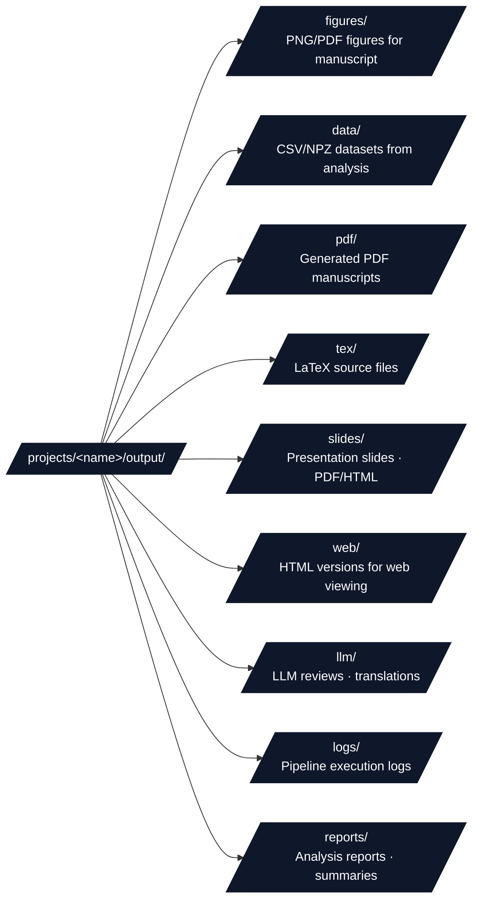
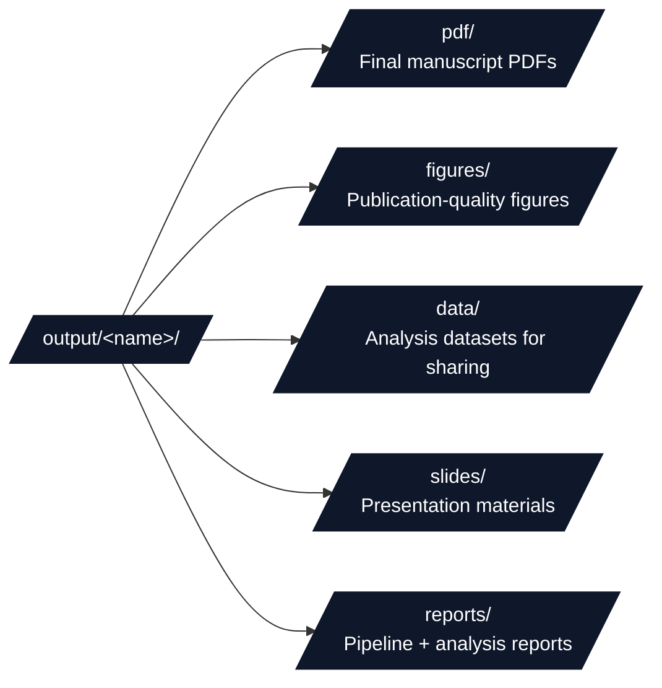

# Projects Directory - Technical Documentation

## Overview

The `projects/` directory implements a **standalone project paradigm** where each research project is completely self-contained with independent source code, tests, analysis scripts, and manuscripts, while leveraging shared infrastructure for common operations like testing, rendering, and validation.

## Standalone Project Paradigm

Each project in `projects/{name}/` provides **three critical guarantees**:

### 🔒 **Tests**: Independent Test Suites (90%+ Coverage, Data Only)

- **Location**: `projects/{name}/tests/`
- **Coverage**: 90% minimum for `projects/{name}/src/` code
- **Policy**: No mocks - all tests use data and computations
- **Execution**: Can run independently via `uv run pytest projects/{name}/tests/`
- **Infrastructure Integration**: Orchestrated by `scripts/01_run_tests.py`

### 🧠 **Methods**: Business Logic Isolation (No Cross-Project Imports)

- **Location**: `projects/{name}/src/`
- **Isolation**: Cannot import from other projects
- **Infrastructure Access**: Can import from `infrastructure/` modules
- **Script Pattern**: Thin orchestrators in `projects/{name}/scripts/` import from `src/`
- **Domain Independence**: Each project maintains unique scientific algorithms

### 📝 **Manuscript**: Independent Content (Own References, Metadata)

- **Location**: `projects/{name}/manuscript/`
- **Content**: Independent markdown sections, config.yaml, references.bib
- **Rendering**: Processed independently via `infrastructure.rendering`
- **References**: Own cross-reference system and bibliography
- **Metadata**: Project-specific publication information

## Permanent Canonical Exemplars and Optional Search Add-On

Five projects under `projects/templates/` are **permanent canonical exemplars**: `template_active_inference`, `template_autoresearch_project`, `template_code_project`, `template_prose_project`, and `template_template`. These are the public project trees allowed by `.gitignore`, `infrastructure.project.public_scope`, and `scripts/check_tracked_projects.py`. Authoritative names: [`docs/_generated/active_projects.md`](../docs/_generated/active_projects.md). **CONFIDENTIALITY INVARIANT (public repo):** every other path under `projects/` (the `active/` hot-seat set, the `working/`/`published/`/`archive/`/`other/` lifecycle folders, the search exemplar) is **local-only and must never be committed**. The guard runs in pre-push and CI, and a `git add -f` cannot bypass it. Together the permanent exemplars cover Active Inference multi-track research, computational, prose-review, deterministic AutoResearch, and the autopoietic meta-template. The `template_search_project` literature-search exemplar is local-only, rests under `projects/archive/template_search_project/`, and is copied under `projects/active/` *locally only* to run literature-search workflows (never committed):

| Exemplar | Shape | Algorithm? | Bibliography | Figures embedded | Tests | Coverage |
|---|---|---|---|---|---|---|
| [`templates/template_active_inference/`](templates/template_active_inference/) | Active Inference multi-track (analytical + pymdp + sheaf manuscript + Lean/GNN/ontology) | yes (`src/analytical/*`, `src/simulation/*`) | curated read-only | registry-backed | see canonical facts | see canonical facts |
| [`templates/template_autoresearch_project/`](templates/template_autoresearch_project/) | AutoResearch-centric (plan/evidence/claim/artifact/readiness loop) | yes (`src/loop.py`) | curated read-only (validated, never written) | 0 | see canonical facts | see canonical facts |
| [`templates/template_code_project/`](templates/template_code_project/) | Code-centric (numerical experiment + analysis) | yes (`src/optimizer.py`, `src/invariants.py`) | curated read-only | 6 figures | see canonical facts | see canonical facts |
| [`templates/template_prose_project/`](templates/template_prose_project/) | Prose-centric (editorial review) | no (orchestration over `infrastructure/prose`, `infrastructure/reference`) | curated read-only (validated, never written) | 0 (3 diagnostic PNGs in review report) | see canonical facts | see canonical facts |
| [`templates/template_template/`](templates/template_template/) | Meta-template (introspects `infrastructure/` and public exemplar roster) | yes (`src/template_template/introspection.py`) | curated read-only | architecture figures | see canonical facts | see canonical facts |
| [`archive/template_search_project/`](archive/template_search_project/) **(local-only — NOT git-tracked)** | Optional search-centric add-on (literature discovery + LLM synthesis) | no (orchestration over `infrastructure/search`, `infrastructure/reference`, `infrastructure/llm`) | auto-populated `references.bib` + `references_deep.bib` | 3 figures | see project docs when restored | see project docs when restored |

The permanent exemplars, and the optional search add-on when restored, share the **same** structural conventions:

- `src/`, `tests/`, `scripts/`, `manuscript/`, `docs/`, `output/`, `pyproject.toml`, root `README.md` + `AGENTS.md`.
- `domain_profile.yaml` + `experiment_plan.yaml` overlays for advisory review gates, artifact expectations, benchmark rubrics, declared conditions, primary metrics, baselines, and ablations.
- The same 12-file `docs/` hub: `AGENTS.md`, `README.md`, `agent_instructions.md`, `architecture.md`, `testing_philosophy.md`, `rendering_pipeline.md`, `style_guide.md`, `syntax_guide.md`, `faq.md`, `quickstart.md`, `output_conventions.md`, `troubleshooting.md`.
- Per-directory `AGENTS.md` + `README.md` (and, for `tests/`, a `PATTERNS.md`).
- Manuscript files `00_abstract.md` … `99_references.md` plus `config.yaml`, `preamble.md`, `references.bib`, `SYNTAX.md`, and a manuscript-level `AGENTS.md`/`README.md`.
- The same verification checklist: `pytest --cov`, no-mocks grep, layer-purity grep.

When a new project is bootstrapped, copy whichever exemplar is closest in shape and adjust from there. Examples in repo-wide docs default to `projects/templates/template_code_project/` unless the doc explicitly compares project shapes.

## Rendered vs Non-Rendered Subfolders

### Infrastructure Discovery Scope

Projects under `projects/` are organized into **typed subfolders**. Discovery renders only `templates/` and `active/`; the rest are linked for inspection.

#### ✅ **Rendered Projects (`projects/templates/` + `projects/active/`)**

Projects under `projects/templates/` (tracked exemplars) and `projects/active/` (hot-seat set) are:

- **Discovered** by `infrastructure.project.discovery.discover_projects()` with qualified names `templates/<name>` and `active/<name>`
- **Listed** in `run.sh` interactive menu
- **Executed** by all pipeline scripts (`01_run_tests.py`, `02_run_analysis.py`, etc.)
- **Rendered** by `03_render_pdf.py` with independent manuscript processing
- **Validated** by `04_validate_output.py`
- **Copied** to `output/<subfolder>/{name}/` by `05_copy_outputs.py`

Private lifecycle projects normally live in an external private repository:
its `active/*` is symlinked into `projects/active/` before discovery/rendering,
while `working/*`, `published/*`, `archive/*`, and `other/*` are symlinked into
the matching `projects/<subfolder>/` for non-rendered inspection. Preview with
`uv run python -m infrastructure.orchestration link-projects --dry-run`;
override the private root with `TEMPLATE_PRIVATE_PROJECTS_ROOT` or
`.private_projects_root`; disable one auto-sync with `TEMPLATE_SKIP_LINK_SYNC=1`.

#### ❌ **Non-Rendered Projects (`working/`, `published/`, `archive/`, `other/`)**

Projects under `projects/working/`, `projects/published/`, `projects/archive/`, and `projects/other/` are:

- **NOT discovered** by infrastructure discovery functions
- **NOT listed** in `run.sh` menu
- **NOT executed** by any pipeline scripts
- **Preserved** for historical reference and potential reactivation


```mermaid
graph TD
    subgraph Rendered["Rendered Projects (projects/templates/ + projects/active/)"]
        P0[templates/template_active_inference<br/>Active Inference exemplar · see canonical facts]
        P1[templates/template_autoresearch_project<br/>AutoResearch exemplar · see canonical facts]
        P2[templates/template_code_project<br/>Code exemplar · see canonical facts]
        P3[templates/template_prose_project<br/>Prose exemplar · see canonical facts]
        P4[templates/template_template<br/>Meta-template exemplar · see canonical facts]
        Pn[active/* rotating hot-seat workspaces<br/>see docs/_generated/active_projects.md]
    end

    subgraph Working["In-Progress Projects (projects/working/)"]
        IP["rotating WIP projects<br/>see live checkout"]
    end

    subgraph Archive["Non-Rendered Projects (projects/{published,archive,other}/)"]
        A[blake_bimetalism · traditional_newspaper ·<br/>area_handbook · density_bioscales · …]
    end

    subgraph Infrastructure["Infrastructure Discovery"]
        DISCOVER[discover_projects<br/>Scans templates/ + active/ only]
        RUNSH[run.sh<br/>Lists rendered projects]
        PIPELINE[Pipeline Scripts<br/>Execute rendered projects]
    end

    P0 -->|Discovered| DISCOVER
    P1 -->|Discovered| DISCOVER
    P2 -->|Discovered| DISCOVER
    P3 -->|Discovered| DISCOVER
    P4 -->|Discovered| DISCOVER
    Pn -->|Discovered| DISCOVER
    IP -.->|NOT Scanned| DISCOVER
    A -.->|NOT Scanned| DISCOVER

    DISCOVER -->|Rendered Projects| RUNSH
    RUNSH -->|Selected Project| PIPELINE
    PIPELINE -->|Executes| P1
    PIPELINE -->|Executes| P2
    PIPELINE -->|Executes| Pn
```

### Project Lifecycle

#### Archiving a Project

To archive a rendered project:

1. Move project from `projects/active/{name}/` to `projects/archive/{name}/`
2. Project will no longer appear in discovery or execution
3. Can be reactivated by moving back to `projects/active/`

#### Reactivating an Archived Project

To reactivate an archived project:

1. Move project from `projects/archive/{name}/` to `projects/active/{name}/`
2. Ensure project structure is valid (has `src/` and `tests/`)
3. Project will be automatically discovered on next `run.sh` execution

## Project Structure Requirements

### Required Directories (Must Exist)

Every valid project **must** have these directories:


```mermaid
flowchart TB
    P[/projects/&lt;name&gt;//]
    P --> SRC[/src/<br/>Python source code/]
    P --> T[/tests/<br/>90%+ coverage required/]
    P --> PY[pyproject.toml<br/>Project metadata · dependencies]

    SRC --> SRC_F[__init__.py · *.py<br/>algorithms · data processing]
    T --> T_F[__init__.py · test_*.py<br/>unit + integration]

    classDef d fill:#0f172a,stroke:#0f172a,color:#fff
    classDef pkg fill:#1e3a8a,stroke:#0f172a,color:#fff
    classDef f fill:#0f766e,stroke:#0f172a,color:#fff
    class P d
    class SRC,T pkg
    class SRC_F,T_F,PY f
```

### Optional Directories (Recommended for Full Functionality)


```mermaid
flowchart TB
    P[/projects/&lt;name&gt;//]
    P --> SC[/scripts/<br/>Analysis workflows · thin orchestrators/]
    P --> M[/manuscript/<br/>Research manuscript · markdown/]
    P --> DOCS[/docs/<br/>Modular documentation hub/]
    P --> OUT[/output/<br/>Generated · disposable/]

    SC --> SC_F[analysis_pipeline.py · generate_*.py]
    M --> M_F[config.yaml · references.bib · preamble.md ·<br/>00_abstract.md · *.md · SYNTAX.md ·<br/>AGENTS.md · README.md]
    DOCS --> DOCS_F[12-file hub: AGENTS.md · README.md ·<br/>agent_instructions.md · architecture.md ·<br/>testing_philosophy.md · rendering_pipeline.md ·<br/>style_guide.md · syntax_guide.md · faq.md ·<br/>quickstart.md · output_conventions.md ·<br/>troubleshooting.md]
    OUT --> OUT_F[figures/ · data/ · pdf/ · reports/ ·<br/>web/ · slides/ · manuscript/ · logs/]

    classDef d fill:#0f172a,stroke:#0f172a,color:#fff
    classDef pkg fill:#1e3a8a,stroke:#0f172a,color:#fff
    classDef f fill:#0f766e,stroke:#0f172a,color:#fff
    class P d
    class SC,M,DOCS,OUT pkg
    class SC_F,M_F,DOCS_F,OUT_F f
```

### Stub directory (not discovered)

[`projects/_test_project/`](_test_project/) contains only `output/` for validation tests that reference a fixed project name. It does **not** satisfy the required `src/` + `tests/` layout and is omitted from `discover_projects()`.

## Infrastructure Compliance

Projects are **operated upon** by infrastructure modules while maintaining independence:

### 🔍 **Project Discovery** (`infrastructure.project.discovery`)

```python
from infrastructure.project import discover_projects, validate_project_structure

# Discover all valid projects in projects/ directory
repo_root = Path("/path/to/template")
projects = discover_projects(repo_root)

for project in projects:
    print(f"✓ {project.name}: {project.path}")
    print(f"  Valid: {project.is_valid}")
    print(f"  Has manuscript: {project.has_manuscript}")
    print(f"  Has scripts: {project.has_scripts}")

# Validate specific project
is_valid, message = validate_project_structure(Path("projects/templates/template_code_project"))
assert is_valid  # (True, "Valid project structure")
```

**Key Functions:**

- `discover_projects(repo_root)` - Scans `projects/` for valid project directories
- `validate_project_structure(project_dir)` - Checks required directories exist
- `get_project_metadata(project_dir)` - Extracts metadata from pyproject.toml/config.yaml

### 🧪 **Test Execution** (`scripts/01_run_tests.py`)

```bash
# Execute project tests via infrastructure
uv run python scripts/01_run_tests.py --project {name}

# Infrastructure performs:
# 1. Validates project structure
# 2. Runs project tests with coverage:
#    uv run pytest projects/{name}/tests/ --cov=projects/{name}/src
# 3. Enforces 90% coverage requirement
# 4. Generates coverage reports
```

**Infrastructure Operations:**

- Validates project has required `src/` and `tests/` directories
- Sets PYTHONPATH to include project source and infrastructure modules
- Runs pytest with coverage collection
- Fails pipeline if coverage below 90% for project code

### ⚙️ **Analysis Execution** (`scripts/02_run_analysis.py`)

```bash
# Execute project analysis scripts via infrastructure
uv run python scripts/02_run_analysis.py --project {name}

# Infrastructure discovers and runs:
# - projects/{name}/scripts/analysis_pipeline.py
# - projects/{name}/scripts/generate_figures.py
```

**Script Discovery Process:**

1. Infrastructure validates project structure exists
2. Scans `projects/{name}/scripts/` for executable Python files
3. Sets PYTHONPATH including project `src/` and `infrastructure/`
4. Executes each script in order with proper environment
5. Collects outputs to `projects/{name}/output/`

### 📄 **Manuscript Rendering** (`scripts/03_render_pdf.py`)

```bash
# Render project manuscript via infrastructure
uv run python scripts/03_render_pdf.py --project {name}

# Infrastructure processes:
# - Validates markdown references and structure
# - Combines manuscript sections into single document
# - Generates LaTeX with cross-references and citations
# - Compiles to PDF with figure integration
# - Validates output quality
```

**Rendering Pipeline:**

1. **Markdown Validation**: Checks references and structure via `infrastructure.validation`
2. **Content Assembly**: Combines sections from `projects/{name}/manuscript/`
3. **LaTeX Generation**: Converts via pandoc with template processing
4. **Figure Integration**: Embeds registered figures with captions
5. **PDF Compilation**: XeLaTeX rendering with bibliography processing
6. **Quality Validation**: PDF integrity checks via `infrastructure.validation`

### ✅ **Quality Validation** (`scripts/04_validate_output.py`)

```bash
# Validate project outputs via infrastructure
uv run python scripts/04_validate_output.py --project {name}

# Infrastructure validates:
# - PDF rendering quality (no unresolved references)
# - Markdown structure integrity
# - File integrity and checksums
# - Cross-reference resolution
```

**Validation Checks:**

- **PDF Validation**: Unresolved references, LaTeX errors, document structure
- **Markdown Validation**: Image references, cross-references, equation labels
- **Integrity Validation**: File checksums, data consistency, academic standards

### 📋 **Output Management** (`scripts/05_copy_outputs.py`)

```bash
# Organize final deliverables via infrastructure
uv run python scripts/05_copy_outputs.py --project {name}

# Infrastructure operations:
# - Cleans root-level output/ directories (keeps only project folders)
# - Copies from projects/{name}/output/ to output/{name}/
# - Validates all files copied successfully
# - Organizes by project for distribution
```

**Output Organization:**


```mermaid
flowchart TB
    OUT[/output//]
    OUT --> CP[/template_code_project/<br/>Final deliverables/]
    OUT --> YP[/&lt;your_project&gt;/<br/>Other projects/]

    CP --> CP_FILES[pdf/ · figures/ · data/ · reports/]

    classDef d fill:#0f172a,stroke:#0f172a,color:#fff
    classDef f fill:#0f766e,stroke:#0f172a,color:#fff
    class OUT,CP,YP d
    class CP_FILES f
```

## Import Patterns and Dependencies

### ✅ **Correct Import Patterns**

**Within Project (Business Logic):**

```python
# projects/{name}/src/my_module.py
from .my_module import my_algorithm               # ✅ Import from same project
from .my_module import AnalysisResult              # ✅ Import from same project

# Infrastructure utilities (allowed)
from infrastructure.core.logging.utils import get_logger  # ✅ Infrastructure access
from infrastructure.figure_manager import FigureManager   # ✅ Infrastructure access
```

**Project Scripts (Thin Orchestrators):**

```python
# projects/{name}/scripts/analysis_pipeline.py
from src.my_module import my_algorithm               # ✅ Import project algorithms
from src.my_module import helper_function             # ✅ Import project methods
from infrastructure.core.logging.utils import get_logger # ✅ Infrastructure utilities
```

### ❌ **Incorrect Import Patterns (Violate Isolation)**

**Cross-Project Imports (Forbidden):**

```python
# ❌ NEVER: Import from other projects
from projects.other_project.src.module import SomeClass
from projects.another_project.src.module import some_function
```

**Infrastructure Business Logic (Forbidden):**

```python
# ❌ NEVER: Import infrastructure algorithms (infrastructure is utilities only)
from infrastructure.rendering.core import RenderManager  # ❌ Business logic
from infrastructure.validation.content.pdf_validator import PDFValidator  # ❌ Business logic

# ✅ ALLOWED: Infrastructure utilities
from infrastructure.core.logging.utils import get_logger  # ✅ Utility
from infrastructure.core.config.loader import load_config  # ✅ Utility
```

## Testing Standards and Requirements

### Coverage Requirements

**Project Code (`projects/{name}/src/`):**

- **90%+ coverage**: All active projects achieve required coverage thresholds
- **data only**: All tests use computations, no mocks
- **Infrastructure Code**: 60% minimum (measured baseline → [`docs/development/coverage-gaps.md`](../docs/development/coverage-gaps.md))

**Coverage Verification:**

```bash
# Check project coverage
uv run pytest projects/{name}/tests/ --cov=projects/{name}/src --cov-fail-under=90

# Generate coverage report
uv run pytest projects/{name}/tests/ --cov=projects/{name}/src --cov-report=html
open htmlcov/index.html
```

### No Mocks Policy (Absolute Requirement)

**ABSOLUTE PROHIBITION**: Under no circumstances use `MagicMock`, `mocker.patch`, `unittest.mock`, or any mocking framework.

**Rationale:**

- Tests must validate actual behavior, not mocked behavior
- Integration points must be truly tested
- Code must work with data and computations
- No false confidence from mocked tests

**Correct Testing Patterns:**

```python
# ✅ GOOD: Test with data and computations
def test_term_extraction_real_data():
    """Test term extraction with real entomological texts."""
    extractor = TerminologyExtractor()
    real_texts = [
        "Ant colonies exhibit complex social behavior with division of labor.",
        "The queen ant lays eggs while worker ants forage for food."
    ]
    terms = extractor.extract_terms(real_texts, min_frequency=2)
    assert len(terms) > 0
    assert "ant" in terms.lower() or "colony" in terms.lower()

# ❌ ABSOLUTELY FORBIDDEN: Never use mocks
# def test_term_extraction_mock():
#     mock_extractor = MagicMock()
#     mock_extractor.extract_terms.return_value = {"ant": 5, "colony": 3}
```

**Network-Dependent Testing:**

```python
# ✅ GOOD: Use pytest-httpserver for HTTP testing
@pytest.mark.requires_ollama
def test_llm_integration_real_http(ollama_test_server):
    """Test LLM integration with HTTP server."""
    config = OllamaClientConfig(base_url=ollama_test_server.url_for("/"))
    client = LLMClient(config)
    response = client.query("test prompt")  # HTTP request
    assert "response" in response.lower()
```

### Test Organization

**Directory Structure:**


```mermaid
flowchart TB
    T[/projects/&lt;name&gt;/tests//]
    T --> INIT[__init__.py<br/>Test package]
    T --> CFG[conftest.py<br/>Shared fixtures · configuration]
    T --> DA[test_domain_analysis.py<br/>Unit tests · domain analysis]
    T --> TE[test_term_extraction.py<br/>Unit tests · term extraction]
    T --> INT[test_integration.py<br/>Cross-module integration]
    T --> PERF[test_performance.py<br/>Performance &amp; scaling]
    T --> VAL[test_validation.py<br/>Validation &amp; error handling]

    classDef d fill:#0f172a,stroke:#0f172a,color:#fff
    classDef code fill:#1e3a8a,stroke:#0f172a,color:#fff
    class T d
    class INIT,CFG,DA,TE,INT,PERF,VAL code
```

**Test Categories:**

- **Unit Tests**: Individual functions and methods
- **Integration Tests**: Cross-module interactions
- **Performance Tests**: Algorithm efficiency and scaling
- **Validation Tests**: Error handling and edge cases

## Validation and Structure Checking

### Project Structure Validation

**Infrastructure Validation:**

```python
from infrastructure.project import validate_project_structure

# Check if directory is valid project
project_dir = Path("projects/{name}")
is_valid, message = validate_project_structure(project_dir)

if is_valid:
    print("✅ Valid project structure")
else:
    print(f"❌ Invalid: {message}")
    # Common errors:
    # - "Missing required directory: src"
    # - "src/ directory contains no Python files"
    # - "Missing required directory: tests"
```

**Validation Rules:**

- ✅ **Must have**: `src/` directory with at least one `.py` file
- ✅ **Must have**: `tests/` directory
- ✅ **Optional but recommended**: `scripts/`, `manuscript/`
- ✅ **Metadata**: `pyproject.toml` for project information
- ❌ **Forbidden**: Cross-project imports or dependencies

### Script Discovery and Execution

**Analysis Script Discovery:**

```python
# Infrastructure discovers executable scripts
from infrastructure.core.script_discovery import discover_analysis_scripts

project_root = Path("projects/{name}")
scripts = discover_analysis_scripts(project_root)

for script in scripts:
    print(f"Found script: {script.name}")
    # Output: analysis_pipeline.py, domain_analysis_script.py, etc.
```

**Script Execution Environment:**

- **PYTHONPATH**: Includes project `src/` and `infrastructure/`
- **Working Directory**: Set to project root
- **Environment Variables**: MPLBACKEND=Agg for headless plotting
- **Error Handling**: Captures stdout/stderr, returns exit codes

## Output Management

### Working Directory (`projects/{name}/output/`)

**Generated during pipeline execution:**


```mermaid
flowchart LR
    OUT[/projects/&lt;name&gt;/output//]
    OUT --> FIG[/figures/<br/>PNG/PDF figures for manuscript/]
    OUT --> DATA[/data/<br/>CSV/NPZ datasets from analysis/]
    OUT --> PDF[/pdf/<br/>Generated PDF manuscripts/]
    OUT --> TEX[/tex/<br/>LaTeX source files/]
    OUT --> SLIDES[/slides/<br/>Presentation slides · PDF/HTML/]
    OUT --> WEB[/web/<br/>HTML versions for web viewing/]
    OUT --> LLM[/llm/<br/>LLM reviews · translations/]
    OUT --> LOG[/logs/<br/>Pipeline execution logs/]
    OUT --> REP[/reports/<br/>Analysis reports · summaries/]

    classDef d fill:#0f172a,stroke:#0f172a,color:#fff
    class OUT,FIG,DATA,PDF,TEX,SLIDES,WEB,LLM,LOG,REP d
```

**Characteristics:**

- **Disposable**: Regenerated on each pipeline run
- **Working**: Used during analysis and rendering
- **Not in git**: Added to `.gitignore`
- **Project-specific**: Isolated per project

### Final Directory (`output/{name}/`)

**Copied by `scripts/05_copy_outputs.py`:**


```mermaid
flowchart LR
    OUT[/output/&lt;name&gt;//]
    OUT --> PDF[/pdf/<br/>Final manuscript PDFs/]
    OUT --> FIG[/figures/<br/>Publication-quality figures/]
    OUT --> DATA[/data/<br/>Analysis datasets for sharing/]
    OUT --> SLIDES[/slides/<br/>Presentation materials/]
    OUT --> REP[/reports/<br/>Pipeline + analysis reports/]

    classDef d fill:#0f172a,stroke:#0f172a,color:#fff
    class OUT,PDF,FIG,DATA,SLIDES,REP d
```

**Characteristics:**

- **Persistent**: Final deliverables for distribution
- **Organized**: All project outputs in one location
- **Ready for distribution**: Can be archived or shared independently
- **Cross-project**: Multiple projects in `output/` directory

## Repository standards compliance

Project trees follow the template discipline described in the root **[`.cursorrules`](../.cursorrules)** file (Cursor / IDE agents) and the expanded norms under **[`docs/rules/`](../docs/rules/)** (testing, code style, logging, and related guides — not a `.cursorrules/` directory).

### ✅ **Testing Standards Compliance**

- **90%+ coverage**: All active projects achieve required coverage thresholds
- **data only**: All tests use computations, no mocks
- **integration**: Tests cover algorithm convergence, mathematical functions, and figure generation
- **Deterministic results**: Fixed seeds ensure reproducible test outcomes

### ✅ **Documentation Standards Compliance**

- **AGENTS.md + README.md**: technical documentation in each directory
- **Type hints**: All public APIs have type annotations
- **Docstrings**: docstrings with examples for all functions
- **Cross-references**: Links between related documentation sections

### ✅ **Type Hints Standards Compliance**

- **annotations**: All public functions have type hints
- **Generic types**: Uses `List`, `Dict`, `Optional`, `Callable` appropriately
- **Consistent patterns**: Follows template conventions throughout

### ✅ **Error Handling Standards Compliance**

- **Custom exceptions**: Uses infrastructure exception hierarchy when available
- **Context preservation**: Exception chaining with `from` keyword
- **Informative messages**: Clear error messages with actionable guidance

### ✅ **Logging Standards Compliance**

- **Unified logging**: Uses `infrastructure.core.logging.utils.get_logger(__name__)`
- **Appropriate levels**: DEBUG, INFO, WARNING, ERROR as appropriate
- **Context-rich messages**: Includes relevant context in log messages

### ✅ **Code Style Standards Compliance**

- **Ruff format + Ruff lint** (mirrors CI): consistent formatting and import order
- **Descriptive names**: Clear variable and function names
- **Import organization**: Standard library, third-party, local imports properly organized

### Compliance Verification Results

Current status, coverage, and project roster are documented in `docs/_generated/canonical_facts.md` (updated from discovery and test runs).

All projects follow the standalone paradigm, thin orchestrator pattern, no-mocks policy, and coverage requirements (60% infrastructure, 90% projects).

Authoritative project names: `docs/_generated/active_projects.md` (regenerate with `uv run python scripts/generate_active_projects_doc.py`).

- **Ruff formatting and lint**: Applied consistently across exemplar projects ✅
- **Import organization**: Standard library, third-party, local imports properly organized ✅
- **Error handling**: Context preservation with `from` keyword usage ✅
- **Logging**: Unified logging system throughout ✅

#### Pipeline Integration Results

- **Import errors**: Fixed in `infrastructure/validation/output_validator.py` ✅
- **Figure generation**: Active projects generate and register figures where applicable ✅
- **Manuscript integration**: Equations and figures referenced per project manuscript ✅

```bash
# Canonical — one pytest process per project (avoids tests/conftest.py basename collisions):
uv run python scripts/01_run_tests.py --project template_code_project

# Manual single-workspace example:
uv run pytest projects/templates/template_code_project/tests/ --cov=projects/templates/template_code_project/src --cov-report=html
```

## Best Practices and Compliance

### Standards index (`docs/rules/`)

Use **[`docs/rules/`](../docs/rules/)** for checklists and conventions: [testing_standards.md](../docs/rules/testing_standards.md), [documentation_standards.md](../docs/rules/documentation_standards.md), [type_hints_standards.md](../docs/rules/type_hints_standards.md), [error_handling.md](../docs/rules/error_handling.md), [python_logging.md](../docs/rules/python_logging.md), [code_style.md](../docs/rules/code_style.md).

At minimum for a project under `projects/`:

- [ ] 90%+ coverage for `src/`; real data / subprocess / HTTP fixtures — no mocks ([testing standards](../docs/rules/testing_standards.md))
- [ ] `AGENTS.md` + `README.md` where this repo expects directory-level docs ([documentation standards](../docs/rules/documentation_standards.md))
- [ ] Type hints and unified logging per [type hints](../docs/rules/type_hints_standards.md) / [python_logging](../docs/rules/python_logging.md)
- [ ] Ruff + mypy clean on paths enforced in CI ([code style](../docs/rules/code_style.md), root [CLAUDE.md](../CLAUDE.md))

### Thin Orchestrator Pattern

**Project Scripts (Correct Pattern):**

```python
# projects/{name}/scripts/analysis_pipeline.py
from src.my_module import MyAnalyzer     # ✅ Import business logic
from src.utils import Utils              # ✅ Import algorithms
from infrastructure.figure_manager import FigureManager  # ✅ Import utilities

def main():
    """Run analysis pipeline."""
    # Import and use project algorithms
    analyzer = MyAnalyzer()
    results = analyzer.analyze(data)
    
    # Use infrastructure utilities
    fm = FigureManager()
    fm.register_figure("analysis_results.png", "Analysis results")

if __name__ == "__main__":
    main()
```

**Anti-Patterns (Violate Architecture):**

```python
# ❌ WRONG: Business logic in scripts
def analyze_terms(texts):  # Should be in src/
    # Algorithm implementation in script
    pass

# ❌ WRONG: No infrastructure utilities
import matplotlib.pyplot as plt  # Should use infrastructure.figure_manager
plt.savefig("figure.png")
```

## API Reference

### infrastructure.project Module

**Project Discovery:**

```python
def discover_projects(repo_root: Path | str) -> list[ProjectInfo]:
    """Discover all valid projects in projects/ directory.

    Args:
        repo_root: Repository root directory

    Returns:
        List of ProjectInfo objects for valid projects
    """

def validate_project_structure(project_dir: Path) -> tuple[bool, str]:
    """Validate that directory has required project structure.

    Args:
        project_dir: Path to potential project directory

    Returns:
        Tuple of (is_valid, message)
    """

def get_project_metadata(project_dir: Path) -> dict:
    """Extract project metadata from pyproject.toml and config.yaml.

    Args:
        project_dir: Project directory path

    Returns:
        Dictionary with project metadata
    """
```

**ProjectInfo Dataclass:**

```python
@dataclass
class ProjectInfo:
    """Information about a discovered project."""
    name: str
    path: Path
    has_src: bool
    has_tests: bool
    has_scripts: bool
    has_manuscript: bool
    metadata: dict

    @property
    def is_valid(self) -> bool:
        """Check if project has minimum required structure."""
        return self.has_src and self.has_tests
```

## Troubleshooting

### "Project directory not found"

**Symptoms:**

- Infrastructure scripts fail with "Project directory not found"
- Project not listed in `./run.sh` menu

**Solutions:**

```bash
# Check project exists
ls -la projects/

# Verify project name spelling
./run.sh  # Shows available projects

# Check for hidden directories or incorrect naming
find projects/ -maxdepth 1 -type d -not -path '*/.*'
```

### "Missing required directory: src"

**Symptoms:**

- `validate_project_structure()` returns `(False, "Missing required directory: src")`
- Pipeline fails at validation stage

**Solutions:**

```bash
# Create required directories
mkdir -p projects/myproject/src projects/myproject/tests

# Add minimal Python module
touch projects/myproject/src/__init__.py
echo '"""Research algorithms."""' > projects/myproject/src/example.py

# Validate
uv run python -c "from infrastructure.project import validate_project_structure; print(validate_project_structure(Path('projects/myproject')))"
```

### "src/ directory contains no Python files"

**Symptoms:**

- Project has `src/` directory but validation fails
- Empty or non-Python files in `src/`

**Solutions:**

```bash
# Check src/ contents
ls -la projects/myproject/src/

# Add Python files with proper extensions
touch projects/myproject/src/__init__.py
touch projects/myproject/src/algorithms.py

# Remove non-Python files if present
find projects/myproject/src/ -not -name "*.py" -type f
```

### "Test coverage below 90%"

**Symptoms:**

- Pipeline fails at test stage with coverage error
- `pytest --cov-fail-under=90` exits with failure

**Solutions:**

```bash
# Run tests with coverage report
uv run pytest projects/myproject/tests/ --cov=projects/myproject/src --cov-report=html

# Open coverage report to identify gaps
open htmlcov/index.html

# Add missing test cases
vim projects/myproject/tests/test_missing_functionality.py

# Verify coverage meets requirements
uv run pytest projects/myproject/tests/ --cov=projects/myproject/src --cov-fail-under=90
```

### "No analysis scripts found"

**Symptoms:**

- `scripts/02_run_analysis.py` reports "No analysis scripts found"
- Optional `scripts/` directory missing or empty

**Solutions:**

```bash
# Create scripts directory (optional but recommended)
mkdir -p projects/myproject/scripts

# Add analysis script following thin orchestrator pattern
cat > projects/myproject/scripts/analysis_pipeline.py << 'EOF'
#!/usr/bin/env python3
"""Analysis pipeline for myproject."""

from src.algorithms import MyAlgorithm
from infrastructure.core.logging.utils import get_logger

logger = get_logger(__name__)

def main():
    """Run analysis pipeline."""
    logger.info("Starting analysis")
    algo = MyAlgorithm()
    results = algo.run()
    logger.info(f"Analysis: {results}")

if __name__ == "__main__":
    main()
EOF

# Make executable
chmod +x projects/myproject/scripts/analysis_pipeline.py
```

### "Import errors in scripts"

**Symptoms:**

- Analysis scripts fail with import errors
- "ModuleNotFoundError" for local or infrastructure modules

**Solutions:**

```bash
# Check PYTHONPATH setup by infrastructure
# Infrastructure sets: repo_root + infrastructure/ + project/src/

# Verify imports in script
uv run python -c "
import sys
sys.path.insert(0, '.')
sys.path.insert(0, 'infrastructure')
from projects.myproject.src.algorithms import MyAlgorithm
print('Import successful')
"

# Fix import paths if needed
# Correct: from src.algorithms import MyAlgorithm
# Wrong: from algorithms import MyAlgorithm
```

### "Manuscript rendering issues"

**Symptoms:**

- PDF generation fails with LaTeX errors
- Missing references or figures in output

**Solutions:**

```bash
# Validate markdown before rendering
uv run python -m infrastructure.validation.cli markdown projects/myproject/manuscript/

# Check for missing figure registrations
uv run python -m infrastructure.validation.cli pdf projects/myproject/output/pdf/

# Render with verbose logging
LOG_LEVEL=0 uv run python scripts/03_render_pdf.py --project myproject

# Check LaTeX compilation logs
ls projects/myproject/output/pdf/*_compile.log
```

## Real Project Examples

### Cognitive Security Theory (`projects/archive/cognitive_integrity/`)

**Standalone Guarantees:**

- **Tests**: Trust calculus, firewall, consensus validation with 90%+ coverage
- **Methods**: Formal trust bounds, defense composition algebra
- **Manuscript**: Independent formal foundations with mathematical proofs

**Note:** This project has been archived. Reactivate by moving from `projects/archive/` to `projects/active/`.

### Optimization Research Exemplar (`projects/templates/template_code_project/`)

**Standalone Guarantees:**

- **Tests**: Test suite validating analysis algorithms
- **Methods**: Optimization and invariant logic in `src/`
- **Manuscript**: Research manuscript with analysis and figures

**Infrastructure Operations:**

```bash
uv run python scripts/01_run_tests.py --project template_code_project
uv run python scripts/02_run_analysis.py --project template_code_project
uv run python scripts/03_render_pdf.py --project template_code_project
```

### Area handbook (archived: `projects/archive/area_handbook/`)

**Standalone Guarantees** (when reactivated under `projects/active/`):

- **Tests**: Corpus and synthesis code covered in `src/` with zero mocks
- **Methods**: Corpus I/O, outline template, synthesis, Markdown builders, metrics (`src/`)
- **Manuscript**: Multi-section handbook-style markdown and fixtures

```bash
# After moving the project back to projects/area_handbook/
uv run python scripts/01_run_tests.py --project area_handbook
uv run python scripts/02_run_analysis.py --project area_handbook
uv run python scripts/03_render_pdf.py --project area_handbook
```

## See Also

- [README.md](README.md) - Quick reference and getting started
- [PROJECTS_PARADIGM.md](PROJECTS_PARADIGM.md) - Philosophical explanation of standalone paradigm
- [../infrastructure/project/AGENTS.md](../infrastructure/project/AGENTS.md) - Infrastructure project management
- [../infrastructure/project/README.md](../infrastructure/project/README.md) - Project management quick reference
- [docs/rules/AGENTS.md](../docs/rules/AGENTS.md) - Development standards overview
- [../AGENTS.md](../AGENTS.md) - template documentation

## Summary

The `projects/` directory implements **standalone project paradigm** with infrastructure compliance:

### 🔒 **Standalone Guarantees**

- **Tests**: Independent 90%+ coverage test suites with data only
- **Methods**: Isolated business logic with no cross-project dependencies
- **Manuscript**: Independent content with own references and publication metadata

### 🔧 **Infrastructure Integration**

- **Discovery**: Automatic project detection via `infrastructure.project.discovery`
- **Validation**: Structure and quality compliance checking
- **Execution**: Test/analysis/rendering via root `scripts/` orchestrators
- **Quality Assurance**: PDF/markdown validation and integrity checking

### 📋 **Compliance Framework**

- **Repository standards**: [`.cursorrules`](../.cursorrules) and [`docs/rules/`](../docs/rules/) for testing, documentation, type hints, error handling, and logging
- **Quality Gates**: Automated coverage checks, documentation validation, type safety verification
- **Operational Patterns**: Thin orchestrator scripts, infrastructure utility imports, project isolation

Each project maintains independence while benefiting from shared infrastructure for common research operations, ensuring reproducible, high-quality scientific computing with rigorous testing and validation.
