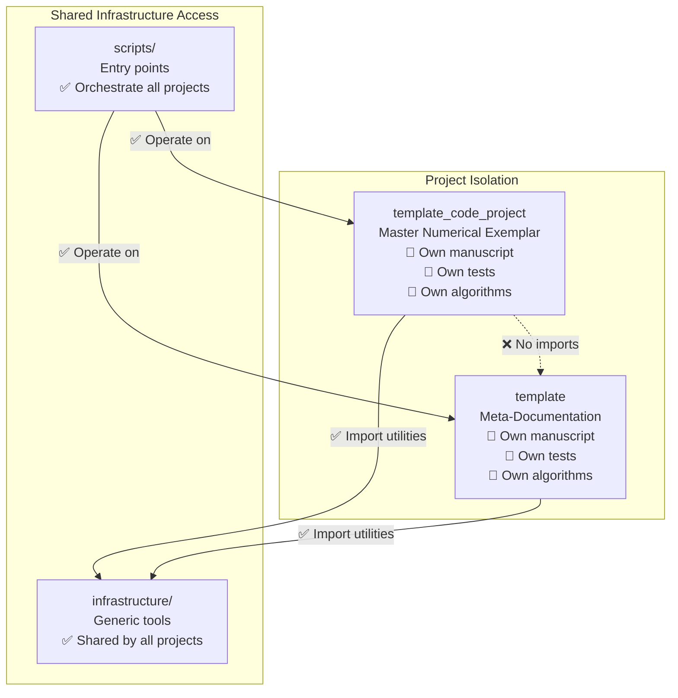
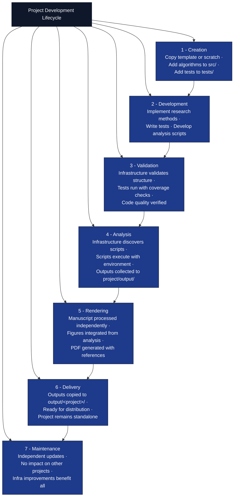
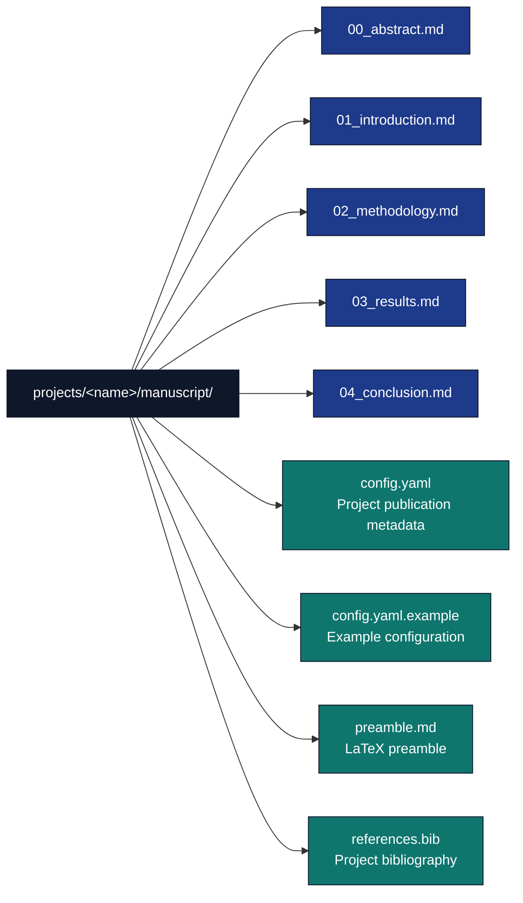

# Projects Paradigm - Standalone Research Projects

## Paradigm Overview

The **standalone project paradigm** represents a fundamental architectural principle where each research project in the `projects/` directory is a **complete, self-sufficient unit** that can be developed, tested, analyzed, and published independently, while benefiting from shared infrastructure for common operations.

### What "Standalone" Means

A standalone project provides **three critical guarantees**:

#### 🔒 **Tests Guarantee**: Independent Test Suites

Each project maintains its own test suite that validates its algorithms with data, achieving 90%+ code coverage without relying on external test infrastructure.

#### 🧠 **Methods Guarantee**: Algorithmic Independence

Each project contains business logic for its research domain, with no dependencies on other projects' algorithms or methods.

#### 📝 **Manuscript Guarantee**: Content Independence

Each project maintains its own research manuscript, references, and publication metadata, rendered independently through shared infrastructure.

## Isolation Principles

### Independence Between Projects

Projects are **architecturally isolated** - each operates as if it were the only project in the repository:


```mermaid
graph TD
    subgraph "Project Isolation"
        P1[template_code_project<br/>Master Numerical Exemplar<br/>📝 Own manuscript<br/>🧪 Own tests<br/>🧠 Own algorithms]
        P2[template<br/>Meta-Documentation<br/>📝 Own manuscript<br/>🧪 Own tests<br/>🧠 Own algorithms]

        P1 -.->|❌ No imports| P2
    end

    subgraph "Shared Infrastructure Access"
        INFRA[infrastructure/<br/>Generic tools<br/>✅ Shared by all projects]
        SCRIPTS[scripts/<br/>Entry points<br/>✅ Orchestrate all projects]

        P1 -->|✅ Import utilities| INFRA
        P2 -->|✅ Import utilities| INFRA

        SCRIPTS -->|✅ Operate on| P1
        SCRIPTS -->|✅ Operate on| P2
    end
```

### No Cross-Project Dependencies

**Architectural Invariant**: Projects cannot import from each other.

**Correct Pattern:**

```python
# ✅ ALLOWED: Import from own project
from src.term_extraction import TerminologyExtractor

# ✅ ALLOWED: Import from infrastructure
from infrastructure.core.logging.utils import get_logger
from infrastructure.figure_manager import FigureManager

# ❌ FORBIDDEN: Import from other projects
# from projects.other_project.src.module import SomeClass
```

**Rationale:**

- **Scientific Integrity**: Each project maintains independent scientific validity
- **Modularity**: Projects can be copied, moved, or removed without affecting others
- **Reusability**: Projects can be used as standalone research units
- **Maintenance**: Changes to one project don't break others

## Infrastructure Integration

### How Projects Leverage Shared Infrastructure

While projects are completely independent, they benefit from **shared infrastructure** for common research operations:

#### 🔍 **Project Discovery and Validation**

```python
from infrastructure.project import discover_projects

# Infrastructure discovers all projects automatically
projects = discover_projects(Path("."))
# Returns: [template_code_project, ...]

# Infrastructure validates each project independently
for project in projects:
    assert project.is_valid  # Each project validates itself
```

#### 🧪 **Test Orchestration**

```bash
# Infrastructure runs each project's tests independently
uv run python scripts/pipeline/stage_01_test.py --project {name}
# - Validates project structure
# - Runs project tests with coverage:
#   uv run pytest projects/{name}/tests/ --cov=projects/{name}/src
# - Enforces 90% coverage requirement
# - Generates coverage reports
```

#### ⚙️ **Analysis Execution**

```bash
# Infrastructure discovers and executes each project's scripts
uv run python scripts/pipeline/stage_02_analysis.py --project {name}
# - Finds all scripts in projects/{name}/scripts/
# - Sets PYTHONPATH: repo_root + infrastructure/ + project/src/
# - Executes each script with proper environment
# - Collects outputs to projects/{name}/output/
```

#### 📄 **Manuscript Rendering**

```bash
# Infrastructure renders each project's manuscript independently
uv run python scripts/pipeline/stage_03_render.py --project {name}
# - Validates markdown in projects/{name}/manuscript/
# - Combines sections using project-specific config.yaml
# - Generates LaTeX with project-specific references.bib
# - Compiles PDF with project-specific figures
```

### Infrastructure as Utilities, Not Business Logic

**Critical Distinction:**

- **Infrastructure**: Provides **utilities** (logging, validation, rendering, file operations)
- **Projects**: Contain **business logic** (research algorithms, analysis methods)

**Infrastructure Scope:**

- ✅ File operations and directory management
- ✅ Logging and error handling utilities
- ✅ Configuration loading and validation
- ✅ PDF rendering and markdown processing
- ✅ Test orchestration and coverage reporting
- ✅ Quality validation and integrity checking

**Project Scope:**

- ✅ Research algorithms and scientific methods
- ✅ Domain-specific data processing
- ✅ Analysis pipelines and workflows
- ✅ Figure generation and visualization
- ✅ Manuscript content and academic writing

## Template standards compliance as paradigm requirement

The standalone project paradigm requires alignment with the repository root **[`.cursorrules`](../.cursorrules)** file (Cursor / IDE routing) and with **[`docs/rules/`](../docs/rules/)** (normative Markdown guides). This alignment is not optional — it is a core requirement of the paradigm.

### ✅ **Testing Standards Compliance (Required)**

- **90%+ coverage**: Each project must achieve 90% minimum coverage
- **data only**: Absolute prohibition on mocks - all tests use computations
- **integration**: Tests cover critical workflows and edge cases
- **Deterministic results**: Fixed seeds ensure reproducible test outcomes

### ✅ **Documentation Standards Compliance (Required)**

- **AGENTS.md + README.md**: documentation in each directory
- **Type hints**: All public APIs have type annotations
- **Docstrings**: documentation with examples
- **Cross-references**: Links between related sections

### ✅ **Code Quality Standards Compliance (Required)**

- **Ruff format/check**: CI-scoped lint/format (`uv run ruff check`, `uv run ruff format`; line length 88 by default)
- **Descriptive naming**: Clear variable and function names
- **Import organization**: Proper organization of imports
- **Error handling**: Context preservation and informative messages
- **Unified logging**: Consistent logging throughout

### Compliance Verification

```bash
# Run tests via orchestrator (one pytest invocation per discovered project):
uv run python scripts/pipeline/stage_01_test.py --project-only --all-projects

# Manual coverage spot-check — replace NAME with an active project (never aggregate glob SRC paths):
uv run pytest projects/templates/template_code_project/tests/ \
  --cov=projects/templates/template_code_project/src \
  --cov-fail-under=90

find projects/ -name "*.py" -exec grep -L '"""' {} \;  # Check for missing docstrings (representative)
```

## Compliance Framework

### Alignment with docs/rules standards

Every standalone project must comply with development standards documented under **[`docs/rules/`](../docs/rules/)**, guided by the root **[`.cursorrules`](../.cursorrules)** entry rule:

#### ✅ **Testing Standards Compliance**

- **90%+ Coverage**: Each project achieves 90% minimum test coverage
- **Data Only**: No mocks - all tests use data and computations
- **Independent Validation**: Each project's tests validate its own algorithms
- **Integration Testing**: Cross-module interactions within project boundaries

#### ✅ **Documentation Standards Compliance**

- **AGENTS.md**: technical documentation for each project
- **README.md**: Quick reference with Mermaid diagrams and examples
- **Docstrings**: documentation for all public APIs
- **Cross-References**: Links between related documentation sections

#### ✅ **Code Quality Standards Compliance**

- **Type Hints**: type annotations on all public functions
- **Error Handling**: Custom exception hierarchy with context preservation
- **Logging**: Unified logging system throughout project code
- **Code Style**: Consistent formatting and naming conventions

### Quality Gates and Validation

**Automated Validation:**

```bash
# Infrastructure validates compliance during pipeline
uv run python scripts/pipeline/stage_01_test.py --project {name}
# ✓ Tests pass with 90%+ coverage
# ✓ No mock methods detected
# ✓ Type hints validated
# ✓ Documentation completeness checked

uv run python scripts/pipeline/stage_04_validate.py --project {name}
# ✓ PDF integrity verified
# ✓ Markdown references resolved
# ✓ File integrity maintained
# ✓ Academic standards met
```

## Operational Model

### How Infrastructure Operates on Projects

The operational model follows the **thin orchestrator pattern** where infrastructure acts as a **facilitator**, not a **director**:

#### 1. **Discovery Phase**

Infrastructure discovers projects and validates their structure:

```python
# Infrastructure finds projects
projects = discover_projects(repo_root)

# Infrastructure validates each independently
for project in projects:
    is_valid, message = validate_project_structure(project.path)
    if not is_valid:
        logger.error(f"Project {project.name}: {message}")
        continue
```

#### 2. **Execution Phase**

Infrastructure provides execution environment for each project:

```python
# Infrastructure sets up execution environment
env = {
    'PYTHONPATH': f"{repo_root}:{repo_root}/infrastructure:{project.path / 'src'}",
    'MPLBACKEND': 'Agg',  # Headless matplotlib
}

# Infrastructure executes project scripts
for script in project_scripts:
    subprocess.run([python_cmd, script], cwd=project.path, env=env)
```

#### 3. **Integration Phase**

Infrastructure integrates project outputs into unified deliverables:

```python
# Infrastructure organizes final outputs
copy_final_deliverables(project.path / "output", output_root / project.name)
# Result: output/{name}/ contains all project deliverables
```

### Project Lifecycle Under Infrastructure


```mermaid
flowchart TB
    LC[Project Development Lifecycle]
    LC --> S1[1 - Creation<br/>Copy template or scratch ·<br/>Add algorithms to src/ ·<br/>Add tests to tests/]
    LC --> S2[2 - Development<br/>Implement research methods ·<br/>Write tests · Develop analysis scripts]
    LC --> S3[3 - Validation<br/>Infrastructure validates structure ·<br/>Tests run with coverage checks ·<br/>Code quality verified]
    LC --> S4[4 - Analysis<br/>Infrastructure discovers scripts ·<br/>Scripts execute with environment ·<br/>Outputs collected to project/output/]
    LC --> S5[5 - Rendering<br/>Manuscript processed independently ·<br/>Figures integrated from analysis ·<br/>PDF generated with references]
    LC --> S6[6 - Delivery<br/>Outputs copied to output/&lt;project&gt;/ ·<br/>Ready for distribution ·<br/>Project remains standalone]
    LC --> S7[7 - Maintenance<br/>Independent updates ·<br/>No impact on other projects ·<br/>Infra improvements benefit all]

    S1 --> S2 --> S3 --> S4 --> S5 --> S6 --> S7

    classDef root fill:#0f172a,stroke:#0f172a,color:#fff
    classDef phase fill:#1e3a8a,stroke:#0f172a,color:#fff
    class LC root
    class S1,S2,S3,S4,S5,S6,S7 phase
```

## Testing Philosophy

### Standalone Test Suites with Data

Each project's test suite validates its algorithms using **data and computations**:

#### **No Mocks Policy (Absolute)**

```python
# ✅ CORRECT: Test with data
def test_term_extraction():
    extractor = TerminologyExtractor()
    real_texts = ["ant colony behavior", "eusocial insects"]
    terms = extractor.extract_terms(real_texts, min_frequency=1)
    assert len(terms) > 0

# ❌ ABSOLUTELY FORBIDDEN: Never use mocks
# def test_term_extraction():
#     mock_extractor = MagicMock(return_value={"ant": 5})
#     # This violates the testing philosophy
```

#### **Integration Testing Within Project Boundaries**

```python
# ✅ CORRECT: Test cross-module integration within project
def test_complete_analysis_pipeline():
    # Import from same project
    from src.term_extraction import TerminologyExtractor
    from src.domain_analysis import DomainAnalyzer

    # data processing
    extractor = TerminologyExtractor()
    analyzer = DomainAnalyzer()

    terms = extractor.extract_terms(texts)
    results = analyzer.analyze_all_domains(terms, texts)

    assert len(results) == 6  # Six Ento-Linguistic domains
```

#### **Coverage Requirements**

- **90% minimum** for project code (`projects/{name}/src/`)
- **Real execution paths** - all critical algorithms tested
- **Edge cases** - error conditions and boundary values
- **Integration scenarios** - multi-module workflows

## Manuscript Independence

### Each Project Has Its Own Manuscript

Every project maintains **manuscript independence**:

#### **Independent Content Structure**


```mermaid
flowchart LR
    M[projects/&lt;name&gt;/manuscript/]
    M --> S00[00_abstract.md]
    M --> S01[01_introduction.md]
    M --> S02[02_methodology.md]
    M --> S03[03_results.md]
    M --> S04[04_conclusion.md]
    M --> CFG[config.yaml<br/>Project publication metadata]
    M --> CFGEX[config.yaml.example<br/>Example configuration]
    M --> PRE[preamble.md<br/>LaTeX preamble]
    M --> BIB[references.bib<br/>Project bibliography]

    classDef d fill:#0f172a,stroke:#0f172a,color:#fff
    classDef sect fill:#1e3a8a,stroke:#0f172a,color:#fff
    classDef cfg fill:#0f766e,stroke:#0f172a,color:#fff
    class M d
    class S00,S01,S02,S03,S04 sect
    class CFG,CFGEX,PRE,BIB cfg
```

#### **Independent References**

- **Own bibliography**: `references.bib` with domain-specific citations
- **Project DOI**: Independent publication identifier
- **Author information**: Project-specific authorship
- **Publication metadata**: Journal, volume, pages specific to project

#### **Independent Rendering**

```bash
# Each project renders independently
uv run python scripts/pipeline/stage_03_render.py --project {name}
# - Uses projects/{name}/manuscript/config.yaml
# - Processes projects/{name}/manuscript/references.bib
# - Generates projects/{name}/output/pdf/
```

## Dependency Management

### Projects Share Infrastructure, Not Each Other

#### **Shared Infrastructure Dependencies**

All projects can import from `infrastructure/` for common utilities:

```python
# ✅ ALLOWED: All projects can use infrastructure
from infrastructure.core.logging.utils import get_logger
from infrastructure.figure_manager import FigureManager
from infrastructure.validation import validate_pdf_rendering
from infrastructure.rendering import RenderManager
```

#### **No Project-to-Project Dependencies**

Projects maintain **zero coupling** between each other:

```python
# ❌ FORBIDDEN: Projects cannot import from each other
# from projects.another_project.src.module import some_function
# from projects.other_project.src.module import SomeClass
```

#### **Infrastructure as Common Good**

Infrastructure modules are **domain-independent utilities** that benefit all projects without creating coupling:

- **Logging**: Unified logging system for all projects
- **Figure Management**: Consistent figure registration and cross-referencing
- **Validation**: Common quality checks for PDFs, markdown, integrity
- **Rendering**: Shared PDF generation with project-specific customization
- **File Operations**: Common utilities for output management

## Real Project Example

### Stable Code Exemplar Paradigm

**Standalone Guarantees:**

- **Tests**: Zero-Mock test suite rigorously testing bounds, precision, and state.
- **Methods**: Pure scientific logic in `src/`, with thin orchestrators in `scripts/`.
- **Manuscript**: Research manuscript meticulously mapping to specific code artifacts.
- **Docs**: Modular documentation hub detailing exact infrastructure bounds.

**Infrastructure Integration:**

```bash
# Infrastructure operates on project independently
uv run python scripts/runner/execute_pipeline.py --project template_code_project --core-only

# Result: Complete analysis pipeline executed
# - Tests validate analysis algorithms
# - Scripts generate analysis figures
# - Manuscript renders with equations
# - Outputs organized in output/template_code_project/
```

## Benefits of Standalone Paradigm

### Scientific Integrity

- **Independent Validation**: Each project proves its scientific validity separately
- **Reproducible Research**: Projects can be executed and verified independently
- **Academic Standards**: Each project maintains its own scholarly rigor

### Development Flexibility

- **Parallel Development**: Multiple researchers can work on different projects simultaneously
- **Independent Deployment**: Projects can be published or shared without affecting others
- **Technology Choices**: Each project can use appropriate tools for its domain

### Maintenance Simplicity

- **Isolated Changes**: Modifications to one project don't affect others
- **Independent Testing**: Project issues don't block other project development
- **Clean Dependencies**: No complex inter-project dependency management

### Research Scalability

- **Template Reuse**: New projects start from proven templates
- **Infrastructure Evolution**: Shared infrastructure improvements benefit all projects
- **Knowledge Transfer**: Successful patterns can be adapted across projects

## Paradigm Evolution

### Version 1.0: Single Project Template

- Original template with hardcoded project structure
- All code in root-level directories
- Limited to one research project per repository

### Version 2.0: Multi-Project Template

- Projects moved to `projects/` directory
- Infrastructure layer extracted for reusability
- Multiple projects supported but with some coupling

### Version 2.1+: Standalone Project Paradigm

- **isolation** between projects
- **Infrastructure compliance** framework
- **Three guarantees** (tests, methods, manuscript)
- **Operational independence** with shared utilities

## Future Evolution

### Isolation

- **Container Support**: Docker-based project isolation
- **Virtual Environments**: Per-project dependency management
- **Resource Quotas**: CPU/memory limits per project

### Advanced Infrastructure

- **Parallel Execution**: Multiple projects run simultaneously
- **Resource Management**: Intelligent scheduling based on dependencies
- **Cross-Project Analytics**: Meta-analysis across all projects

### Collaboration Features

- **Project Templates**: Domain-specific starting templates
- **Knowledge Base**: Shared best practices across projects
- **Review Integration**: Automated quality checks and peer review workflows

## Project Lifecycle and Archiving

### Rendered projects (`projects/templates/`, optional `projects/active/`)

Rendered projects are discovered and executed by infrastructure:

- **Discovered** by `infrastructure.project.discovery.discover_projects()`
- **Listed** in `run.sh` interactive menu
- **Executed** by pipeline scripts (`01_run_tests.py`, `02_run_analysis.py`, etc.)
- **Outputs** generated in `projects/<subfolder>/{name}/output/` and `output/<subfolder>/{name}/`

`projects/templates/` is the permanent public exemplar set. `projects/active/`
is an optional hot-seat mirror for private sidecar projects that should enter
normal discovery.

### Non-rendered projects (`projects/working/`, `archive/`, optional legacy mirrors)

Non-rendered projects are preserved but not executed by default:

- **NOT discovered** by default infrastructure discovery functions
- **NOT listed** in the normal `run.sh` menu
- **NOT executed** by all-project pipeline scripts
- **Preserved** for historical reference, explicit qualified renders, or later
  deliberate restoration into optional `active/`

The simplified private sidecar requires `working/` and `archive/`; optional
legacy `active/`, `published/`, and `other/` folders are still linked when
present.

### Retiring or resuming a sidecar project

Use the sidecar lifecycle folders, not git-tracked project copies:

1. Retire: move `../projects/working/{name}/` to `../projects/archive/{name}/`.
2. Resume: move `../projects/archive/{name}/` back to `../projects/working/{name}/`.
3. Re-sync with `uv run python -m infrastructure.orchestration link-projects`.

### Rendering a sidecar project

For a one-off render, keep the project under `working/` and run an explicit
qualified command such as:

```bash
uv run python scripts/pipeline/stage_03_render.py --project working/{name}
```

To include a private project in default discovery and the normal `run.sh` menu,
deliberately place it under the sidecar's optional `active/{name}/` folder so it
syncs into `projects/active/{name}/`.

### Project Lifecycle Workflow

```mermaid
graph TD
    subgraph "Project States"
        TEMPLATES[Permanent public exemplars<br/>projects/templates/{name}/]
        ACTIVE[Optional rendered hot-seat<br/>projects/active/{name}/]
        WORKING[Non-rendered WIP<br/>projects/working/{name}/]
        ARCHIVED[Non-rendered archive<br/>projects/archive/{name}/]
    end

    subgraph "Infrastructure Operations"
        DISCOVER["discover_projects()<br/>Scans templates/ + active/ only"]
        EXECUTE[Pipeline Execution<br/>Tests, Analysis, Rendering]
        LIST[List in run.sh menu<br/>Interactive selection]
    end

    WORKING -->|Retire in sidecar| ARCHIVED
    ARCHIVED -->|Resume in sidecar| WORKING
    WORKING -->|Explicit --project working/name| EXECUTE
    WORKING -->|Deliberately restore optional active/| ACTIVE

    TEMPLATES -->|Discovered| DISCOVER
    ACTIVE -->|Discovered| DISCOVER
    DISCOVER -->|Listed| LIST
    LIST -->|Selected| EXECUTE
    EXECUTE -->|Executed| ACTIVE
    EXECUTE -->|Executed| TEMPLATES

    WORKING -.->|NOT default-discovered| DISCOVER
    ARCHIVED -.->|NOT default-discovered| DISCOVER
```

## Conclusion

The standalone project paradigm represents a **fundamental architectural principle** that balances independence with shared infrastructure benefits. Each project maintains scientific and operational autonomy while benefiting from common research utilities, creating a scalable, maintainable, and scientifically rigorous research environment.

**Key Principle**: Projects are **architecturally isolated** but **operationally integrated** through shared infrastructure, providing the best of both worlds - independence and efficiency.
