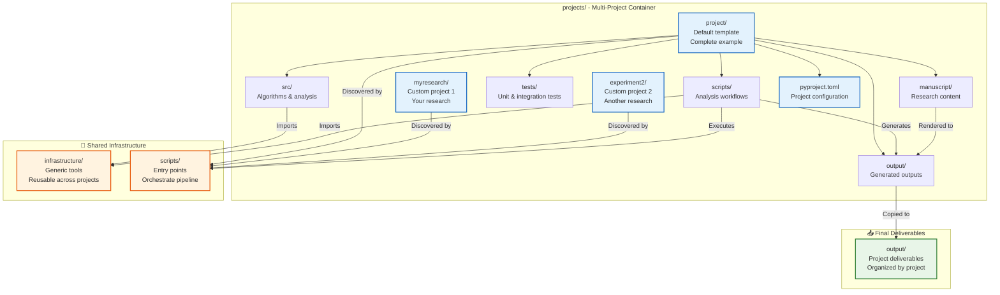

# Projects Directory

This directory contains multiple research projects, each with independent source code, tests, analysis scripts, and manuscripts.



## Directory Structure

Each project follows this structure:

```
projects/
├── project/              # Default template project
│   ├── src/              # Source code
│   ├── tests/            # Test suite
│   ├── scripts/          # Analysis scripts
│   ├── manuscript/       # Research manuscript
│   ├── output/           # Generated outputs (not in git)
│   └── pyproject.toml    # Project configuration
├── myresearch/           # Custom project 1
│   ├── src/
│   ├── tests/
│   ├── manuscript/
│   └── pyproject.toml
└── experiment2/          # Custom project 2
    └── ...
```

## Creating a New Project

### Option 1: Copy the Template

```bash
# Copy the default template project
cp -r projects/project projects/myresearch

# Customize pyproject.toml
vim projects/myresearch/pyproject.toml

# Update project name and metadata
# name = "myresearch"
# description = "My research project"

# Add your code
vim projects/myresearch/src/mymodule.py

# Write your manuscript
vim projects/myresearch/manuscript/01_introduction.md
```

### Option 2: Manual Creation

```bash
# Create project structure
mkdir -p projects/myresearch/{src,tests,scripts,manuscript}

# Create pyproject.toml
cat > projects/myresearch/pyproject.toml << 'EOF'
[project]
name = "myresearch"
version = "0.1.0"
description = "My research project"

[build-system]
requires = ["setuptools>=61.0"]
build-backend = "setuptools.build_meta"
EOF

# Add initial modules
touch projects/myresearch/src/__init__.py
touch projects/myresearch/src/mymodule.py

# Add initial tests
touch projects/myresearch/tests/__init__.py
touch projects/myresearch/tests/test_mymodule.py

# Add manuscript files
touch projects/myresearch/manuscript/01_introduction.md
```

## Workspace Management

This template uses uv workspaces for unified dependency management across projects. All projects share common dependencies while maintaining project-specific packages.

### Workspace Commands

```bash
# Sync all workspace dependencies
uv sync

# Add dependency to specific project
uv run python scripts/manage_workspace.py add numpy --project project

# Show workspace status
uv run python scripts/manage_workspace.py status

# Update all dependencies
uv run python scripts/manage_workspace.py update
```

### Workspace Benefits

- **Unified Dependencies**: Shared packages managed centrally
- **Faster Builds**: Single dependency resolution
- **Consistent Environments**: Same versions across projects
- **Simplified Maintenance**: Update once, benefit all projects

## Running the Pipeline

### Interactive Menu

```bash
# Launch interactive menu
./run.sh

# Select project from list
# Then select pipeline operation
```

### Command Line - Single Project

```bash
# Run complete pipeline for specific project
./run.sh --project myresearch --pipeline

# Run individual stages
python3 scripts/01_run_tests.py --project myresearch
python3 scripts/02_run_analysis.py --project myresearch
python3 scripts/03_render_pdf.py --project myresearch
python3 scripts/04_validate_output.py --project myresearch
```

### Command Line - All Projects

```bash
# Run pipeline for all projects
./run.sh --all-projects --pipeline

# Run tests for all projects
./run.sh --all-projects --tests
```

### Default Project

When no `--project` is specified, the default template project is used:

```bash
# These are equivalent:
./run.sh --pipeline
./run.sh --project project --pipeline
```

## Project Requirements

Each project must have:
- ✅ `src/` directory with Python modules
- ✅ `tests/` directory with test files

Optional but recommended:
- `scripts/` - Analysis scripts (discovered by `02_run_analysis.py`)
- `manuscript/` - Manuscript markdown files (rendered by `03_render_pdf.py`)
- `pyproject.toml` - Project configuration
- `README.md` - Project documentation

## Output Structure

Each project's outputs are stored in two locations:

### Working Directory: `projects/{name}/output/`
Generated during pipeline execution:
- `pdf/` - PDF manuscripts
- `figures/` - Generated figures
- `data/` - Data files
- `reports/` - Analysis reports
- `slides/` - Presentation slides
- `web/` - HTML outputs
- `llm/` - LLM reviews
- `logs/` - Pipeline logs

### Final Directory: `output/{name}/`
Copied by `05_copy_outputs.py`:
- Same structure as working directory
- All project outputs in one place
- Ready for distribution

**Important**: The root `output/` directory should only contain project-specific folders. Root-level directories (`data/`, `figures/`, `pdf/`, etc.) are automatically cleaned during the pipeline to maintain proper organization.

Example:
```
output/
├── project/           # Default template
│   ├── pdf/
│   ├── figures/
│   └── ...
├── myresearch/        # Custom project 1
│   ├── pdf/
│   └── ...
└── experiment2/       # Custom project 2
    └── ...
```

## Project Isolation

Each project is completely independent:
- ✅ Separate source code
- ✅ Separate test suites
- ✅ Separate outputs
- ✅ Separate dependencies (via pyproject.toml)
- ❌ No cross-project imports

For shared utilities, use the `infrastructure/` modules.

## Validation

Check if your project is valid:

```python
from infrastructure.project import validate_project_structure

is_valid, message = validate_project_structure(Path("projects/myresearch"))
print(f"Valid: {is_valid}, Message: {message}")
```

Required checks:
- Directory exists
- Has `src/` with Python files
- Has `tests/` directory

## Best Practices

### Do's ✅

- Keep each project independent
- Use meaningful project names (not `project1`, `project2`)
- Include `README.md` in each project
- Add `pyproject.toml` with metadata
- Write comprehensive tests
- Document your code

### Don'ts ❌

- Don't share code between projects (use `infrastructure/`)
- Don't commit `output/` directories (in `.gitignore`)
- Don't use spaces or special characters in project names
- Don't create projects without `src/` and `tests/`

## Migration from Single Project

If you have an existing single-project template:

```bash
# Check if migration needed
if [[ -d "project" ]] && [[ ! -d "projects" ]]; then
    echo "Migrating to multi-project structure..."
    mkdir -p projects
    mv project projects/project
    echo "✓ Migration complete"
fi
```

The template automatically defaults to `projects/project/` for backward compatibility.

## Examples

### Example 1: Machine Learning Project

```bash
cp -r projects/project projects/ml_optimization
cd projects/ml_optimization

# Update pyproject.toml
# name = "ml_optimization"
# description = "Machine learning optimization research"

# Add your ML code
vim src/optimizer.py
vim src/neural_network.py

# Add tests
vim tests/test_optimizer.py

# Write manuscript
vim manuscript/01_introduction.md
vim manuscript/02_methodology.md

# Run pipeline
cd ../..
./run.sh --project ml_optimization --pipeline
```

### Example 2: Data Analysis Project

```bash
cp -r projects/project projects/data_analysis
cd projects/data_analysis

# Add analysis code
vim src/data_loader.py
vim src/statistical_analysis.py

# Add analysis scripts
vim scripts/exploratory_analysis.py
vim scripts/generate_plots.py

# Run analysis
cd ../..
python3 scripts/02_run_analysis.py --project data_analysis
```

## Troubleshooting

### "Project directory not found"

```bash
# Check project exists
ls -la projects/

# Verify project name
./run.sh  # Interactive menu shows available projects
```

### "Missing required directory: src"

```bash
# Create missing directories
mkdir -p projects/myproject/src
mkdir -p projects/myproject/tests

# Add at least one Python file
touch projects/myproject/src/__init__.py
```

### "No analysis scripts found"

This is not an error - `scripts/` directory is optional. Create it if needed:

```bash
mkdir -p projects/myproject/scripts
touch projects/myproject/scripts/analysis.py
```

## See Also

- [Infrastructure Project Discovery](../infrastructure/project/AGENTS.md) - Project discovery API
- [Scripts Documentation](../scripts/AGENTS.md) - Pipeline orchestration
- [Root AGENTS.md](../AGENTS.md) - Complete system documentation

## Summary

The `projects/` directory enables multi-project support:
- ✅ Multiple independent research projects
- ✅ Shared infrastructure utilities
- ✅ Project selection via menu or CLI
- ✅ Isolated outputs per project
- ✅ Default template for quick start
- ✅ Backward compatible with single-project usage
