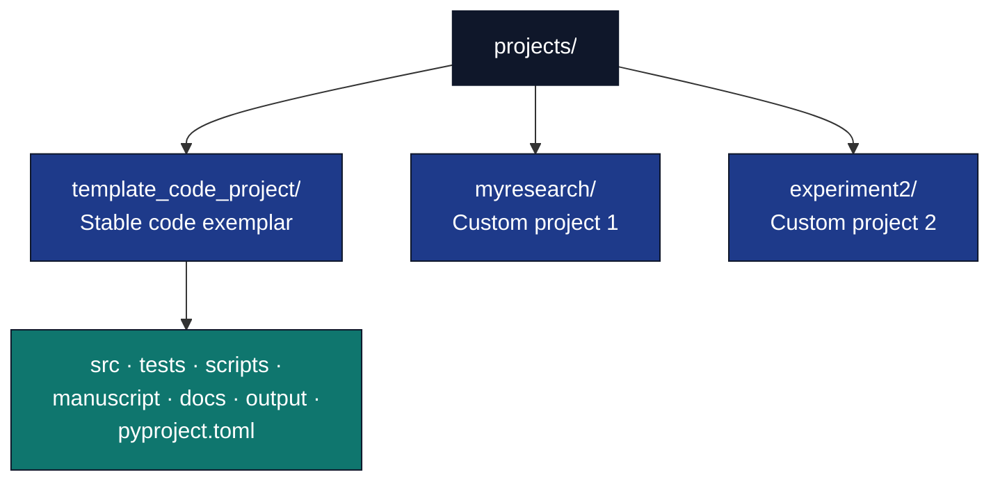
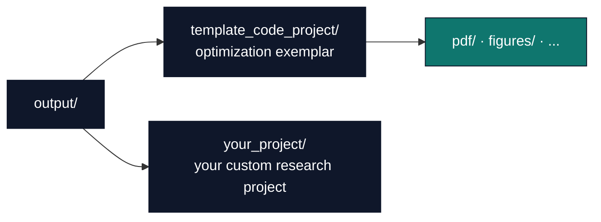

# Projects Directory

This directory contains multiple **forkable research projects**, each with
independent source code, tests, analysis scripts, and manuscripts. Projects are
executed, tested, and rendered by the overarching
**[docxology/template](https://github.com/docxology/template/)** infrastructure;
some exemplars are fully project-local, while others intentionally depend on
shared `infrastructure/` modules.

## Run surface

All public canonical exemplars under `projects/templates/` are **tested, analyzed,
PDF-rendered, and CI-gated only through the public
[docxology/template](https://github.com/docxology/template) monorepo**. Clone
that repository, run `uv sync` at the repository root, then drive any exemplar
with `./run.sh --project templates/<name>` (see [`docs/RUN_GUIDE.md`](../docs/RUN_GUIDE.md)).
Several exemplars also publish standalone GitHub/Zenodo release mirrors for
citation; those are pipeline outputs — the monorepo remains the canonical build
and render checkout.

## Active Projects

Paths under `projects/` are organized as **typed subfolders** (`templates/`, `active/`, `working/`, `published/`, `archive/`, `other/`) and **change over time** as projects rotate between lifecycle folders. The set guaranteed to remain as **permanent canonical exemplars** — git-tracked under `projects/templates/` — is mirrored in [`docs/_generated/active_projects.md`](../docs/_generated/active_projects.md):

- [`templates/template_code_project/`](templates/template_code_project/) — code-centric exemplar (numerical optimization, dashboards, JSON-backed invariants)
- [`templates/template_data_descriptor/`](templates/template_data_descriptor/) — dataset descriptor/data-paper exemplar (schema, inventory, provenance, quality checks, license boundary)
- [`templates/template_gold_refinement/`](templates/template_gold_refinement/) — metallurgical gold-refining analogy for manuscript composition (ore → nine-nines, mega-madlib token injection)
- [`templates/template_literature_meta_analysis/`](templates/template_literature_meta_analysis/) — generic literature meta-analysis (multi-engine retrieval, de-dup, full-text, embeddings, bibliometrics; default term `modafinil`)
- [`templates/template_methods_paper/`](templates/template_methods_paper/) — controlled-method specification DSL with staged validation and deterministic compilation
- [`templates/template_prose_project/`](templates/template_prose_project/) — prose-centric exemplar (editorial review, BibTeX validation, readability metrics)
- [`templates/template_redacted_report/`](templates/template_redacted_report/) — formal redaction and release-review exemplar (classification ceiling, authority, ledger, mosaic-risk checks)
- [`templates/template_registered_report/`](templates/template_registered_report/) — registered-report/preregistration exemplar (hypotheses, outcomes, analysis plan, deviations)
- [`templates/template_autoresearch_project/`](templates/template_autoresearch_project/) — AutoResearch exemplar (deterministic plan/evidence/claim/artifact/readiness loop)
- [`templates/template_autoscientists/`](templates/template_autoscientists/) — AutoScientists coordination-mechanism testbed
- [`templates/template_active_inference/`](templates/template_active_inference/) — Active Inference multi-track exemplar (analytical, pymdp, sheaf manuscript, Lean/GNN/ontology)
- [`templates/template_advanced_literature_review/`](templates/template_advanced_literature_review/) — advanced multi-phase literature-review exemplar with phase provenance and deterministic offline replay
- [`templates/template_autopoiesis/`](templates/template_autopoiesis/) — combinatoric grammar generating whole runnable child projects (src/tests/scripts/manuscript) from a seed
- [`templates/template_eda_notebook/`](templates/template_eda_notebook/) — EDA notebook exemplar with notebook-to-src binding and deterministic analysis outputs
- [`templates/template_madlib/`](templates/template_madlib/) — conditional token-injection manuscript generator with QA probes and authoring contract
- [`templates/template_newspaper/`](templates/template_newspaper/) — newspaper layout/typography exemplar
- [`templates/template_pitch_deck/`](templates/template_pitch_deck/) — pitch deck / slide deck scaffold exemplar
- [`templates/template_pools_rules_tools/`](templates/template_pools_rules_tools/) — fonds/rules/tools resource-pool integration exemplar
- [`templates/template_search_project/`](templates/template_search_project/) — literature-search pipeline with auto-populated BibTeX and optional local LLM synthesis
- [`templates/template_sia/`](templates/template_sia/) — SIA self-improvement harness exemplar
- [`templates/template_storybook/`](templates/template_storybook/) — full-page illustrated storybook PDF exemplar
- [`templates/template_template/`](templates/template_template/) — meta-template (introspects `infrastructure/` and the public exemplar roster)
- [`templates/template_textbook/`](templates/template_textbook/) — modular fillable textbook scaffold
- [`templates/template_formal/`](templates/template_formal/) — strongly-typed multiagent ant-robot colony exemplar (ADTs, session types, affine-discipline resource handles, decentralized per-agent storage/network)

They share the same core layout (`src/`, `tests/`, `scripts/`, `manuscript/`,
root `README.md`/`AGENTS.md`) plus a tested forkability contract:
`STANDALONE.md`, `domain_profile.yaml`, and `experiment_plan.yaml`. Exact
validation commands and infrastructure dependencies are exemplar-specific; read
the chosen exemplar's `STANDALONE.md`. This is a public repo: only the public
canonical exemplars under `templates/` are tracked; every other lifecycle folder
under `projects/` remains local-only and is blocked by the project constituent
of `scripts/audit/check_tracked_all.py` in pre-push + CI. Examples in this
documentation default to
`projects/templates/template_code_project/` unless a doc explicitly compares
projects.

**Current public CI/documentation names** are listed in
[`docs/_generated/active_projects.md`](../docs/_generated/active_projects.md)
(regenerate after layout changes). Runtime `discover_projects()` may include
local private symlinks and is intentionally broader.

### The permanent exemplars at a glance

| Exemplar | Purpose | Algorithm? | Mutates `references.bib`? | Embeds figures? | Tests | Coverage |
|---|---|---|---|---|---|---|
| [`template_code_project`](templates/template_code_project/) | Numerical experiment + analysis dashboard | yes (`src/optimizer.py`, `src/invariants.py`) | no (curated) | yes (6 figures) | see canonical facts | see canonical facts |
| [`template_data_descriptor`](templates/template_data_descriptor/) | Dataset descriptor/data-paper contract | yes (`src/data_descriptor/*`) | no (curated) | no | see canonical facts | see canonical facts |
| [`template_gold_refinement`](templates/template_gold_refinement/) | Metallurgical gold-refining analogy for manuscript composition | yes (`src/refinery.py`, `src/composition.py`) | no (curated) | no (planned) | see canonical facts | see canonical facts |
| [`template_literature_meta_analysis`](templates/template_literature_meta_analysis/) | Generic literature meta-analysis (multi-engine retrieval + de-dup + full-text + embeddings + bibliometrics) | yes (`src/retrieval.py`) | no (curated) | yes (bibliometric figures) | see canonical facts | see canonical facts |
| [`template_prose_project`](templates/template_prose_project/) | Editorial review (readability + structure + bibliography) | no | no (read-only validation) | no (3 diagnostic PNGs in review report) | see canonical facts | see canonical facts |
| [`template_autoresearch_project`](templates/template_autoresearch_project/) | Deterministic AutoResearch loop | yes (`src/loop.py`) | no (read-only validation) | no | see canonical facts | see canonical facts |
| [`template_autoscientists`](templates/template_autoscientists/) | Coordination-mechanism testbed | yes (`src/coordination/*`) | no (curated) | no | see canonical facts | see canonical facts |
| [`template_active_inference`](templates/template_active_inference/) | Active Inference multi-track research | yes (multiple tracks) | no (curated) | yes | see canonical facts | see canonical facts |
| [`template_advanced_literature_review`](templates/template_advanced_literature_review/) | Advanced multi-phase literature review | yes (`src/multi_phase/*`) | fixture-backed | yes | see canonical facts | see canonical facts |
| [`template_eda_notebook`](templates/template_eda_notebook/) | Exploratory data analysis notebook | yes (`src/eda/*`) | n/a | yes (analysis figures) | see canonical facts | see canonical facts |
| [`template_formal`](templates/template_formal/) | Strongly-typed multiagent ant-robot colony (ADTs, session types, affine-discipline handles) | yes (`src/template_formal/colony/*`) | no (curated) | yes (2 figures) | see canonical facts | see canonical facts |
| [`template_madlib`](templates/template_madlib/) | Conditional token-injection manuscript generator | yes (`src/tokens.py`, `src/composition.py`) | no (curated) | token-density figure | see canonical facts | see canonical facts |
| [`template_methods_paper`](templates/template_methods_paper/) | Controlled-method specification DSL with staged validation | yes (`src/methods_dsl/*`) | no (curated) | step-count figure | see canonical facts | see canonical facts |
| [`template_redacted_report`](templates/template_redacted_report/) | Formal redaction and release-review report | yes (`src/redacted_report/*`) | no (curated) | no | see canonical facts | see canonical facts |
| [`template_registered_report`](templates/template_registered_report/) | Registered report / preregistration workflow | yes (`src/registered_report/*`) | no (curated) | no | see canonical facts | see canonical facts |
| [`template_newspaper`](templates/template_newspaper/) | Newspaper layout engine | no (layout orchestration) | n/a | yes (page-layout output) | see canonical facts | see canonical facts |
| [`template_pitch_deck`](templates/template_pitch_deck/) | Pitch deck / slide deck scaffold | see canonical facts | see canonical facts | see canonical facts | see canonical facts |
| [`template_search_project`](templates/template_search_project/) | Literature-search pipeline with auto-populated BibTeX | no (orchestration over search/reference/LLM infrastructure) | yes (`references.bib` + `references_deep.bib`) | 3 figures | see canonical facts | see canonical facts |
| [`template_sia`](templates/template_sia/) | Self-Improvement Agent harness | yes (`src/loop.py`) | no (curated) | registry-backed | see canonical facts | see canonical facts |
| [`template_storybook`](templates/template_storybook/) | Full-page illustrated storybook PDF | yes (`src/storybook/*`) | n/a | yes (full-page story art) | see canonical facts | see canonical facts |
| [`template_template`](templates/template_template/) | Meta-template (infrastructure introspection) | yes (`src/template_template/introspection.py`) | no (curated) | yes (architecture figures) | see canonical facts | see canonical facts |
| [`template_textbook`](templates/template_textbook/) | Book-length scaffold with labs/question banks | yes (`src/textbook/*`) | no (curated) | deterministic figures/diagrams | see canonical facts | see canonical facts |
| [`template_autopoiesis`](templates/template_autopoiesis/) | Combinatoric grammar generating whole runnable child projects from a seed | yes (`src/grammar.py`, `src/expand.py`, `src/materialize.py`) | no (curated, 5 live-verified) | yes (4 figures) | see canonical facts | see canonical facts |
| [`template_pools_rules_tools`](templates/template_pools_rules_tools/) | Fonds/rules/tools resource-pool integration | yes (`src/fonds_reader.py`, `src/rules_applier.py`, `src/tools_invoker.py`) | no (curated) | no | see canonical facts | see canonical facts |

The measured test and coverage totals drift as the exemplars evolve; confirm
current numbers in
[`docs/_generated/COUNTS.md`](../docs/_generated/COUNTS.md).
The permanent exemplars cover Active Inference, computational research,
dataset descriptor/data-paper release, prose-review, registered reports,
formal redaction/release review, deterministic AutoResearch, AutoScientists
coordination tests, conditional token injection, newspaper layout, SIA
harnesses, meta-template introspection, modular fillable textbooks, and
literature discovery with auto-populated BibTeX or optional LLM synthesis.
**Important:** run each
project's `tests/` in **its own** `pytest` invocation — pointing pytest at
`projects/*/tests/` simultaneously triggers `ImportPathMismatchError` because
every project ships a `tests/conftest.py`.

Projects under `projects/active/` today are real projects for this checkout,
not permanent fixtures. They are usually symlinks from an external private
lifecycle repo's `active/` tree; inspect planned syncs with
`uv run python -m infrastructure.orchestration link-projects --dry-run`.

### In-progress projects (under `projects/working/`)

These are actively being developed under [`working/`](working/) but are not yet pipeline-ready. The roster is deliberately not copied here; use `ls projects/working/` for the current checkout and [`docs/_generated/active_projects.md`](../docs/_generated/active_projects.md) for projects actually discovered by `./run.sh`.

**Note:** Use `projects/templates/template_code_project/` for concrete paths, commands, and layout examples unless a document explicitly compares project shapes. Keep ordinary private work in the sidecar's `working/` or `archive/` folders; render it explicitly with qualified names such as `working/<name>`, or deliberately restore it to optional sidecar `active/` only when it should enter default discovery.

### Archived exemplars (under `projects/archive/`)

Preserved under [`archive/`](archive/) until moved back; the pipeline does not discover them. The archive roster is checkout-specific, especially when lifecycle symlinks are synced from the private sidecar repo. Use `ls projects/archive/` for local inspection and [`docs/_generated/COUNTS.md`](../docs/_generated/COUNTS.md) for the public policy — do not hard-code names here.

## Standalone Project Paradigm

Each project in `projects/` carries three critical guarantees while remaining
clear about any intentional shared-infrastructure dependencies:

### 🔒 **Tests**: Independent Test Suites

- Each project has its own `tests/` directory with 90%+ coverage requirement
- Tests use data only (no mocks policy)
- Tests import from `projects/{name}/src/` and `infrastructure/`
- Can be run independently: `uv run pytest projects/{name}/tests/`

### 🧠 **Methods**: Business Logic Isolation

- All research algorithms in `projects/{name}/src/`
- No cross-project imports or dependencies
- Can import from `infrastructure/` modules for shared utilities
- Scripts in `projects/{name}/scripts/` are thin orchestrators

### 📝 **Manuscript**: Independent Content

- Each project has its own `manuscript/` directory
- Independent config.yaml, references.bib, and markdown sections
- Rendered independently via infrastructure.rendering
- Own publication metadata and cross-references

## Rendered vs Non-Rendered Projects

### 📁 **Project Organization**

The template organizes projects into **typed subfolders** under `projects/`. Two are rendered (`templates/`, `active/`); the rest are linked for inspection only.

#### ✅ **Rendered Projects (`projects/templates/` + `projects/active/`)**

Projects under `projects/templates/` (the tracked exemplars) and `projects/active/` (the hot-seat set) are **actively discovered and executed** by infrastructure:

- **Discovered** by `infrastructure.project.discovery.discover_projects()` with qualified names `templates/<name>` and `active/<name>`
- **Listed** in `run.sh` interactive menu for selection
- **Executed** by all pipeline scripts (`scripts/pipeline/stage_01_test.py`, `scripts/pipeline/stage_02_analysis.py`, etc.)
- **Rendered** independently with project-specific manuscripts
- **Outputs** organized in `projects/<subfolder>/{name}/output/` and `output/<subfolder>/{name}/`

#### 📦 **Non-Rendered Projects (`working/`, `archive/`, optional legacy mirrors)**

Projects under `projects/working/` and `projects/archive/` are **preserved but not executed by default**. Optional legacy `projects/published/` and `projects/other/` mirrors are treated the same way when present:

- **NOT discovered** by infrastructure discovery functions
- **NOT listed** in `run.sh` menu
- **NOT executed** by any pipeline scripts
- **Preserved** for historical reference, explicit qualified renders, or deliberate restoration into optional `active/`

```bash
# Retire a private sidecar project
mv ../projects/working/myproject ../projects/archive/myproject

# Run a non-rendered working project explicitly from this checkout
uv run python scripts/pipeline/stage_03_render.py --project working/myproject

# To enter default discovery, restore it through optional sidecar active/
mv ../projects/working/myproject ../projects/active/myproject
```

For confidential work, prefer the configured external private lifecycle repo:
the simplified sidecar uses `working/` and `archive/` by default; optional
legacy `active/`, `published/`, and `other/` folders are linked when present.
Only `templates/` and optional `active/` are discovered/rendered by default; the
other mirrors are for inspection or explicit targeted work. Move private work
between lifecycle folders instead of committing it here.

| Directory            | Role                      | Tests | Coverage |
|----------------------|---------------------------|-------|----------|
| `templates/template_active_inference/` | Active Inference multi-track exemplar (analytical + pymdp + sheaf manuscript) | see canonical facts | see canonical facts |
| `templates/template_advanced_literature_review/` | Advanced multi-phase literature-review exemplar with phase provenance and offline replay | see canonical facts | see canonical facts |
| `templates/template_autopoiesis/` | Combinatoric-grammar project-generation exemplar | see canonical facts | see canonical facts |
| `templates/template_code_project/`    | Code-centric exemplar (optimization + dashboard) | see canonical facts | see canonical facts |
| `templates/template_data_descriptor/` | Dataset descriptor/data-paper exemplar | see canonical facts | see canonical facts |
| `templates/template_gold_refinement/` | Gold-refining analogy exemplar (ore → nine-nines, mega-madlib token injection) | see canonical facts | see canonical facts |
| `templates/template_literature_meta_analysis/` | Generic literature meta-analysis exemplar (multi-engine retrieval, de-dup, full-text, embeddings) | see canonical facts | see canonical facts |
| `templates/template_prose_project/`   | Prose-centric exemplar (review + BibTeX validation) | see canonical facts | see canonical facts |
| `templates/template_autoresearch_project/` | AutoResearch exemplar (deterministic readiness loop) | see canonical facts | see canonical facts |
| `templates/template_autoscientists/` | AutoScientists coordination-mechanism testbed | see canonical facts | see canonical facts |
| `templates/template_eda_notebook/` | EDA notebook exemplar (notebook imports tested `src/eda/*`) | see canonical facts | see canonical facts |
| `templates/template_formal/` | Strongly-typed multiagent ant-robot colony exemplar (ADTs, session types, affine-discipline handles) | see canonical facts | see canonical facts |
| `templates/template_madlib/` | Conditional token-injection manuscript exemplar | see canonical facts | see canonical facts |
| `templates/template_methods_paper/` | Methods-paper exemplar (controlled-method specification DSL) | see canonical facts | see canonical facts |
| `templates/template_newspaper/` | Newspaper layout/typography exemplar | see canonical facts | see canonical facts |
| [`template_pitch_deck`](templates/template_pitch_deck/) | Pitch deck / slide deck scaffold | see canonical facts | see canonical facts | see canonical facts | see canonical facts |
| `templates/template_pools_rules_tools/` | Fonds/rules/tools resource-pool integration exemplar | see canonical facts | see canonical facts |
| `templates/template_redacted_report/` | Redacted release-review exemplar | see canonical facts | see canonical facts |
| `templates/template_registered_report/` | Registered report / preregistration exemplar | see canonical facts | see canonical facts |
| `templates/template_search_project/` | Literature-search pipeline (search → BibTeX → optional local LLM synthesis) | see canonical facts | see canonical facts |
| `templates/template_sia/` | SIA self-improvement harness exemplar | see canonical facts | see canonical facts |
| `templates/template_storybook/` | Full-page illustrated storybook PDF exemplar | see canonical facts | see canonical facts |
| `templates/template_template/` | Meta-template (introspects infrastructure and public exemplar roster) | see canonical facts | see canonical facts |
| `templates/template_textbook/` | Modular fillable textbook scaffold | see canonical facts | see canonical facts |

The permanent exemplars share the same core `src/`, `tests/`, `scripts/`, and
`manuscript/` boundaries plus root `README.md`, `AGENTS.md`, `STANDALONE.md`,
`domain_profile.yaml`, and `experiment_plan.yaml`. Their `docs/` folders are
fit-for-purpose; do not assume every specialized exemplar implements the older
12-file docs hub.

**Private lifecycle projects** live outside this public repo and are linked into
the corresponding local lifecycle mirrors automatically by `run.sh`/orchestration.
Set `TEMPLATE_PRIVATE_PROJECTS_ROOT` or `.private_projects_root` to use another
private repo; set `TEMPLATE_SKIP_LINK_SYNC=1` to skip one auto-sync.
**In-progress projects** live in `projects/working/` (including private
`working/` symlinks).
**Archived projects** live in `projects/archive/` (including private `archive/`
symlinks).


```mermaid
graph TD
    subgraph projects["projects/ - Multi-Project Container"]
        PROJ[template_code_project/<br/>Stable code exemplar]
        CUSTOM[your_project/<br/>Custom research<br/>Your algorithms here]

        PROJ --> PROJ_SRC[src/<br/>Pure scientific logic]
        PROJ --> PROJ_TESTS[tests/<br/>Zero-mock test suite]
        PROJ --> PROJ_SCRIPTS[scripts/<br/>Thin orchestrators]
        PROJ --> PROJ_MANUSCRIPT[manuscript/<br/>Research paper]
        PROJ --> PROJ_DOCS[docs/<br/>Modular documentation]
        PROJ --> PROJ_OUTPUT[output/<br/>Generated outputs<br/>Disposable]
        PROJ --> PROJ_CONFIG[pyproject.toml<br/>Project metadata]
    end

    subgraph Infrastructure["🔧 Shared Infrastructure"]
        INFRA[infrastructure/<br/>Generic tools<br/>Reusable across projects]
        SCRIPTS_ROOT[scripts/<br/>Entry points<br/>Orchestrate pipeline]
        VALIDATION[validation/<br/>Quality assurance<br/>PDF/markdown checks]
        RENDERING[rendering/<br/>Multi-format output<br/>PDF/HTML generation]
        REPORTING[reporting/<br/>Pipeline metrics<br/>Error aggregation]
    end

    subgraph Compliance["Template standards"]
        STANDARDS[Root .cursorrules + docs/rules/<br/>Development norms<br/>Testing · docs · style]
        RULEFILES[testing_standards.md<br/>documentation_standards.md<br/>under docs/rules/]
    end

    PROJ -->|Validated by| VALIDATION
    PROJ -->|Rendered by| RENDERING
    PROJ -->|Reported by| REPORTING
    PROJ -->|Discovered by| SCRIPTS_ROOT

    PROJ_SRC -->|Imports from| INFRA
    PROJ_SCRIPTS -->|Imports from| INFRA
    PROJ_SCRIPTS -->|Orchestrated by| SCRIPTS_ROOT

    PROJ -->|Complies with| STANDARDS
    STANDARDS --> RULEFILES

    PROJ_MANUSCRIPT -->|Rendered to| PROJ_OUTPUT

    classDef project fill:#e3f2fd,stroke:#1565c0,stroke-width:2px
    classDef infra fill:#fff3e0,stroke:#e65100,stroke-width:2px
    classDef compliance fill:#e8f5e8,stroke:#2e7d32,stroke-width:2px

    class PROJ,PROJ_SRC,PROJ_TESTS,PROJ_SCRIPTS,PROJ_MANUSCRIPT,PROJ_OUTPUT,PROJ_CONFIG project
    class INFRA,SCRIPTS_ROOT,VALIDATION,RENDERING,REPORTING infra
    class STANDARDS,RULEFILES compliance
```

## Infrastructure Compliance

Each project is **operated upon** by infrastructure modules while maintaining independence:

### 🔍 **Project Discovery** (`infrastructure.project.discovery`)

```python
from infrastructure.project import discover_projects, validate_project_structure

# Automatically discovers all valid projects
projects = discover_projects(Path("."))  # Finds template_code_project, etc.

# Validates project structure
is_valid, message = validate_project_structure(Path("projects/templates/template_code_project"))
# Returns: (True, "Valid project structure")
```

### 🧪 **Test Execution** (`scripts/pipeline/stage_01_test.py`)

```bash
# Runs project-specific tests with infrastructure orchestration
uv run python scripts/pipeline/stage_01_test.py --project {name}

# Infrastructure validates structure, then runs:
# uv run pytest projects/{name}/tests/ --cov=projects/{name}/src --cov-fail-under=90
```

### ⚙️ **Analysis Scripts** (`scripts/pipeline/stage_02_analysis.py`)

```bash
# Discovers and executes project scripts
uv run python scripts/pipeline/stage_02_analysis.py --project {name}

# Infrastructure finds and runs:
# projects/{name}/scripts/analysis_pipeline.py
# projects/{name}/scripts/generate_figures.py
```

### 📄 **PDF Rendering** (`scripts/pipeline/stage_03_render.py`)

```bash
# Renders project manuscript using infrastructure.rendering
uv run python scripts/pipeline/stage_03_render.py --project {name}

# Infrastructure processes:
# projects/{name}/manuscript/*.md -> PDF with figures
```

### ✅ **Quality Validation** (`scripts/pipeline/stage_04_validate.py`)

```bash
# Validates project outputs using infrastructure.validation
uv run python scripts/pipeline/stage_04_validate.py --project {name}

# Checks PDF integrity, markdown references, file integrity
```

### 📋 **Output Management** (`scripts/pipeline/stage_05_copy.py`)

```bash
# Organizes final deliverables
uv run python scripts/pipeline/stage_05_copy.py --project {name}

# Copies from projects/{name}/output/ to output/{name}/
```

## Project Isolation Principles

### ✅ **Independence**

- **Source Code**: Each project has independent `src/` with unique algorithms
- **Test Suites**: Separate `tests/` directories with project-specific coverage
- **Manuscripts**: Independent `manuscript/` with own content and references
- **Dependencies**: Can specify project-specific requirements in `pyproject.toml`

### ✅ **Shared Infrastructure Access**

- **Import Pattern**: Projects import from `infrastructure/` but not from each other
- **Common Utilities**: Logging, validation, rendering, reporting shared across projects
- **Quality Standards**: Projects align with root **[`.cursorrules`](../.cursorrules)** and **[`docs/rules/`](../docs/rules/)**

### ❌ **No Cross-Project Dependencies**

- Projects cannot import from other projects
- No shared business logic between projects
- Each project maintains its own scientific domain and methodology

## Standards compliance checklist

Every project aligns with the root **[`.cursorrules`](../.cursorrules)** file (Cursor routing) and the guides under **[`docs/rules/`](../docs/rules/)**:

### Testing Standards ([`docs/rules/testing_standards.md`](../docs/rules/testing_standards.md))

- [ ] **90% minimum coverage** for project code (`projects/{name}/src/`)
- [ ] **data only** - No mocks in test suites
- [ ] **integration tests** for critical workflows
- [ ] **Deterministic results** with seeded randomness

### Documentation Standards ([`docs/rules/documentation_standards.md`](../docs/rules/documentation_standards.md))

- [ ] **`AGENTS.md`** in each directory with technical documentation
- [ ] **`README.md`** in each directory with quick reference and Mermaid diagrams
- [ ] **docstrings** with examples for all public APIs
- [ ] **Cross-references** to related documentation sections

### Type Hints Standards ([`docs/rules/type_hints_standards.md`](../docs/rules/type_hints_standards.md))

- [ ] **type annotations** on all public APIs
- [ ] **Generic types** where appropriate (List, Dict, Optional, etc.)
- [ ] **Consistent type hint patterns** across modules

### Error Handling Standards ([`docs/rules/error_handling.md`](../docs/rules/error_handling.md))

- [ ] **Custom exception hierarchy** from `infrastructure.core.exceptions`
- [ ] **Context preservation** with exception chaining
- [ ] **Informative error messages** with actionable guidance

### Logging Standards ([`docs/rules/python_logging.md`](../docs/rules/python_logging.md))

- [ ] **Unified logging** via `infrastructure.core.logging.utils.get_logger(__name__)`
- [ ] **Appropriate log levels** (DEBUG, INFO, WARNING, ERROR)
- [ ] **Context-rich messages** for debugging

### Infrastructure Module Standards ([`docs/rules/infrastructure_modules.md`](../docs/rules/infrastructure_modules.md))

- [ ] **Thin orchestrator pattern** in scripts (import from `src/`, handle I/O only)
- [ ] **Business logic isolation** in `src/` modules
- [ ] **Infrastructure imports** for shared utilities
- [ ] **Domain independence** in imported infrastructure modules

### Code Style Standards ([`docs/rules/code_style.md`](../docs/rules/code_style.md))

- [ ] **Ruff format/check** on CI-scoped paths (`uv run ruff format`, `uv run ruff check`; line length 88 by default)
- [ ] **Descriptive variable names** and clear function signatures
- [ ] **Consistent import organization** (stdlib, third-party, local)
- [ ] **PEP 8 compliance** with template-specific extensions

## Directory Structure

Each project follows this structure:


```mermaid
flowchart TB
    PR[projects/]
    PR --> CP[template_code_project/<br/>Stable code exemplar]
    PR --> MY[myresearch/<br/>Custom project 1]
    PR --> EX[experiment2/<br/>Custom project 2]

    CP --> CP_F[src · tests · scripts ·<br/>manuscript · docs · output ·<br/>pyproject.toml]

    classDef d fill:#0f172a,stroke:#0f172a,color:#fff
    classDef pkg fill:#1e3a8a,stroke:#0f172a,color:#fff
    classDef f fill:#0f766e,stroke:#0f172a,color:#fff
    class PR d
    class CP,MY,EX pkg
    class CP_F f
```

## Creating a New Project

### Option 1: Clean-Copy an Exemplar

```bash
# Copy an existing project as a starting point without caches or outputs
uv run python scripts/audit/copy_exemplar.py \
  --source templates/template_code_project \
  --dest projects/working/myresearch \
  --new-name myresearch

# Customize pyproject.toml
vim projects/working/myresearch/pyproject.toml

# Update project name and metadata
# name = "myresearch"
# description = "My research project"

# Add your code
vim projects/working/myresearch/src/mymodule.py

# Write your manuscript
vim projects/working/myresearch/manuscript/01_introduction.md
```

### Option 2: Manual Creation

```bash
# Create project structure
mkdir -p projects/myresearch/{src,tests,scripts,manuscript}

# Create pyproject.toml
cat > projects/myresearch/pyproject.toml << 'EOF'
[project]
name = "myresearch"
version = "0.1.0"
description = "My research project"

[build-system]
requires = ["setuptools>=61.0"]
build-backend = "setuptools.build_meta"
EOF

# Add initial modules
touch projects/myresearch/src/__init__.py
touch projects/myresearch/src/mymodule.py

# Add initial tests
touch projects/myresearch/tests/__init__.py
touch projects/myresearch/tests/test_mymodule.py

# Add manuscript files
touch projects/myresearch/manuscript/01_introduction.md
```

## Workspace Management

This template uses uv workspaces for unified dependency management across projects. All projects share common dependencies while maintaining project-specific packages.

### Workspace Commands

```bash
# Sync all workspace dependencies
uv sync

# Add dependency to specific project
uv run python scripts/maintenance/manage_workspace.py add numpy --project project

# Show workspace status
uv run python scripts/maintenance/manage_workspace.py status

# Update all dependencies
uv run python scripts/maintenance/manage_workspace.py update
```

### Workspace Benefits

- **Unified Dependencies**: Shared packages managed centrally
- **Faster Builds**: Single dependency resolution
- **Consistent Environments**: Same versions across projects
- **Simplified Maintenance**: Update once, benefit all projects

## Running the Pipeline

### Interactive Menu

```bash
# Launch interactive menu
./run.sh

# Select project from list
# Then select pipeline operation
```

### Command Line - Single Project

```bash
# Run pipeline for specific project
./run.sh --project myresearch --pipeline

# Run individual stages
uv run python scripts/pipeline/stage_01_test.py --project myresearch
uv run python scripts/pipeline/stage_02_analysis.py --project myresearch
uv run python scripts/pipeline/stage_03_render.py --project myresearch
uv run python scripts/pipeline/stage_04_validate.py --project myresearch
```

### Command Line - All Projects

```bash
# Run pipeline for all projects
./run.sh --all-projects --pipeline

# Run tests for all projects
./run.sh --all-projects --tests
```

**Note**: In multi-project mode (`--all-projects`), infrastructure tests run **once** for all projects at the start, then are **skipped** for individual project executions. This avoids redundant testing while ensuring infrastructure quality across all projects.

### Project selection

For non-interactive runs, pass an explicit `--project` unless you are using
`--all-projects`. Running `./run.sh` with no flags opens the interactive menu
and lists the currently discovered projects.

## Project Requirements

Each project must have:

- ✅ `src/` directory with Python modules
- ✅ `tests/` directory with test files

Optional but recommended:

- `scripts/` - Analysis scripts (discovered by `scripts/pipeline/stage_02_analysis.py`)
- `manuscript/` - Manuscript markdown files (rendered by `scripts/pipeline/stage_03_render.py`)
- `pyproject.toml` - Project configuration
- `README.md` - Project documentation

## Output Structure

Each project's outputs are stored in two locations:

### Working Directory: `projects/{name}/output/`

Generated during pipeline execution:

- `pdf/` - PDF manuscripts
- `figures/` - Generated figures
- `data/` - Data files
- `reports/` - Analysis reports
- `slides/` - Presentation slides
- `web/` - HTML outputs
- `llm/` - LLM reviews
- `logs/` - Pipeline logs

### Final Directory: `output/{name}/`

Copied by `scripts/pipeline/stage_05_copy.py`:

- Same structure as working directory
- All project outputs in one place
- Ready for distribution

**Important**: The root `output/` directory should only contain project-specific folders. Root-level directories (`data/`, `figures/`, `pdf/`, etc.) are automatically cleaned during the pipeline to maintain proper organization.

Example:


```mermaid
flowchart LR
    OUT[output/]
    OUT --> CP[template_code_project/<br/>optimization exemplar]
    OUT --> YP[your_project/<br/>your custom research project]
    CP --> CP_F[pdf/ · figures/ · ...]

    classDef d fill:#0f172a,stroke:#0f172a,color:#fff
    classDef f fill:#0f766e,stroke:#0f172a,color:#fff
    class OUT,CP,YP d
    class CP_F f
```

## Project Isolation

Each project is completely independent:

- ✅ Separate source code
- ✅ Separate test suites
- ✅ Separate outputs
- ✅ Separate dependencies (via pyproject.toml)
- ❌ No cross-project imports

For shared utilities, use the `infrastructure/` modules.

## Validation

Check if your project is valid:

```python
from infrastructure.project import validate_project_structure

is_valid, message = validate_project_structure(Path("projects/myresearch"))
print(f"Valid: {is_valid}, Message: {message}")
```

Required checks:

- Directory exists
- Has `src/` with Python files
- Has `tests/` directory

## .cursorrules Compliance

### ✅ **Standards Compliance Across Public Exemplars**

The public canonical exemplars in this directory are expected to comply with
template development standards. Local-only symlinked projects may carry their
own project-level contracts.

- **Testing**: 90%+ coverage, data only, integration tests
- **Documentation**: AGENTS.md + README.md in each directory
- **Type Safety**: Full type hints on all public APIs
- **Code Quality**: Ruff formatting/checks, descriptive naming, proper imports
- **Error Handling**: Context preservation, informative messages
- **Logging**: Unified logging system throughout

### Compliance Verification

```bash
# Run tests across all projects (prefer per-project invocation to avoid conftest collisions)
uv run python scripts/pipeline/stage_01_test.py --project-only --all-projects

# Check public template source paths
uv run python -m infrastructure.project.public_scope source-paths | xargs uv run ruff check
uv run python -m infrastructure.project.public_scope source-paths | xargs uv run mypy
```

## Best Practices

### Do's ✅

- Keep each project independent
- Use meaningful project names (not `project1`, `project2`)
- Include `README.md` in each project
- Add `pyproject.toml` with metadata
- Write tests
- Document your code
- Follow .cursorrules standards for all development

### Don'ts ❌

- Don't share code between projects (use `infrastructure/`)
- Don't commit `output/` directories (in `.gitignore`)
- Don't use spaces or special characters in project names
- Don't create projects without `src/` and `tests/`
- Don't violate .cursorrules standards (testing, documentation, type hints, etc.)

## Migration from Single Project

If you have an existing single-project template:

```bash
# Check if migration needed
if [[ -d "project" ]] && [[ ! -d "projects" ]]; then
    echo "Migrating to multi-project structure..."
    mkdir -p projects
    mv project projects/project
    echo "✓ Migration"
fi
```

Available projects are automatically discovered - use `--project {name}` to specify which project to run.

## Real Project Examples

### **Stable Code Exemplar** (`projects/templates/template_code_project/`)

The code-centric exemplar demonstrates numerical analysis, dashboard outputs,
manuscript-variable hydration, and thin project scripts.

**Standalone Guarantees:**

- **Tests**: Test suite validating analysis algorithms
- **Methods**: Optimization and invariant logic in `src/`
- **Manuscript**: Research manuscript with analysis and figures

**Infrastructure Operations:**

```bash
# Pipeline execution
uv run python scripts/runner/execute_pipeline.py --project template_code_project --core-only
```

## Creating New Projects

### Method 1: Clean-Copy Existing Project (Recommended)

```bash
# Copy an existing project as template
uv run python scripts/audit/copy_exemplar.py \
  --source templates/template_code_project \
  --dest projects/working/my_research \
  --new-name my_research
cd projects/working/my_research

# Update project metadata
vim pyproject.toml  # Change name, description, authors

# Customize research content
vim manuscript/01_abstract.md
vim manuscript/02_introduction.md

# Add your algorithms
vim src/my_algorithm.py

# Add corresponding tests
vim tests/test_my_algorithm.py

# Run infrastructure validation
cd ../../..
uv run python -c "from pathlib import Path; from infrastructure.project import validate_project_structure; print(validate_project_structure(Path('projects/working/my_research')))"
```

### Method 2: Start from Scratch

```bash
# Create minimal project structure
mkdir -p projects/my_new_project/{src,tests,scripts,manuscript}
touch projects/my_new_project/src/__init__.py
touch projects/my_new_project/tests/__init__.py

# Add your research algorithms
vim projects/my_new_project/src/my_algorithm.py

# Add corresponding tests
vim projects/my_new_project/tests/test_my_algorithm.py

# Update manuscript content
vim projects/my_new_project/manuscript/01_introduction.md
vim projects/my_new_project/manuscript/02_methodology.md
```

## Troubleshooting

### "Project directory not found"

```bash
# Check project exists and has required structure
ls -la projects/

# Use infrastructure to list all valid projects
uv run python -c "
from infrastructure.project import discover_projects
projects = discover_projects(Path('.'))
for p in projects:
    print(f'✓ {p.name}: {p.path} (valid: {p.is_valid})')
"

# Interactive menu shows available projects
./run.sh
```

### "Project not found - is it archived?"

```bash
# Check if project is in the archive subfolder
ls -la projects/archive/

# If found in archive, either render explicitly or resume it through sidecar working/
uv run python scripts/pipeline/stage_03_render.py --project archive/myproject
mv ../projects/archive/myproject ../projects/working/myproject

# Verify project structure is valid
uv run python -c "from pathlib import Path; from infrastructure.project import validate_project_structure; print(validate_project_structure(Path('projects/working/myproject')))"

# To put it in the normal run.sh menu, deliberately restore optional active/
mv ../projects/working/myproject ../projects/active/myproject
```

**Symptoms:**

- Project exists but not listed in `run.sh` menu
- Infrastructure reports "project not found"
- Project appears to be missing from the rendered subfolders

**Solution:**

1. Check if project exists in `projects/archive/` (or `working/`, `other/`)
2. Render it explicitly with a qualified name (`archive/<name>` or `working/<name>`) when you do not want default discovery
3. Validate project structure (must have `src/` and `tests/`)
4. Move through optional sidecar `active/` only when it should appear in the normal menu and all-project runs

### "Missing required directory: src" or "src/ directory contains no Python files"

```bash
# Create required directories and files
mkdir -p projects/myproject/src projects/myproject/tests

# Add minimal Python module
cat > projects/myproject/src/__init__.py << 'EOF'
"""My research project."""
EOF

cat > projects/myproject/src/example.py << 'EOF'
"""Example research module."""

def hello_research():
    """Return a research greeting."""
    return "Hello, research world!"
EOF

# Add minimal test
cat > projects/myproject/tests/__init__.py << 'EOF'
"""Test suite for my research project."""
EOF

cat > projects/myproject/tests/test_example.py << 'EOF'
"""Test example module."""
from src.example import hello_research

def test_hello_research():
    """Test hello_research function."""
    result = hello_research()
    assert "research" in result
EOF

# Validate with infrastructure
uv run python -c "from infrastructure.project import validate_project_structure; print(validate_project_structure(Path('projects/myproject')))"
```

### "No analysis scripts found"

This is not an error - `scripts/` directory is optional. Create it for computational workflows:

```bash
# Create scripts directory with analysis pipeline
mkdir -p projects/myproject/scripts

cat > projects/myproject/scripts/analysis_pipeline.py << 'EOF'
#!/usr/bin/env python3
"""Analysis pipeline for my research project."""

from src.example import hello_research
from infrastructure.core.logging.utils import get_logger

logger = get_logger(__name__)

def main():
    """Run analysis pipeline."""
    logger.info("Starting analysis pipeline")
    result = hello_research()
    logger.info(f"Analysis result: {result}")
    print(f"Pipeline completed: {result}")

if __name__ == "__main__":
    main()
EOF

# Make executable and run via infrastructure
chmod +x projects/myproject/scripts/analysis_pipeline.py
uv run python scripts/pipeline/stage_02_analysis.py --project myproject
```

### "Test coverage below 90%"

```bash
# Run tests with coverage report
uv run pytest projects/myproject/tests/ --cov=projects/myproject/src --cov-report=html

# Open coverage report
open htmlcov/index.html

# Add missing tests
vim projects/myproject/tests/test_missing_functionality.py
```

### "Infrastructure compliance issues"

```bash
# Check markdown validation compliance
uv run python -m infrastructure.validation.cli markdown projects/myproject/manuscript/

# Check type hints with mypy
uv run mypy projects/myproject/src/
```

### "Manuscript rendering issues"

```bash
# Validate markdown before rendering
uv run python -m infrastructure.validation.cli markdown projects/myproject/manuscript/

# Check for missing references or figures
uv run python -m infrastructure.validation.cli pdf projects/myproject/output/pdf/

# Render with verbose output
LOG_LEVEL=0 uv run python scripts/pipeline/stage_03_render.py --project myproject
```

## See Also

- [Infrastructure Project Discovery](../infrastructure/project/AGENTS.md) - Project discovery API
- [Scripts Documentation](../scripts/AGENTS.md) - Pipeline orchestration
- [Root AGENTS.md](../AGENTS.md) - system documentation

## Summary

The `projects/` directory implements a **forkable project paradigm** with
infrastructure compliance:

### 🔒 **Forkability Guarantees**

- **Tests**: Independent test suites (90%+ coverage, data only)
- **Methods**: Isolated business logic with no cross-project imports
- **Manuscript**: Independent content with own references and metadata

### 🔧 **Infrastructure Integration**

- **Discovery**: Automatic project detection via `infrastructure.project.discovery`
- **Validation**: Structure compliance checking
- **Execution**: Test/analysis/rendering via root `scripts/`
- **Quality Assurance**: PDF/markdown validation via `infrastructure.validation`

### 📋 **Compliance Framework**

- **.cursorrules Standards**: Testing, documentation, type hints, error handling, logging
- **Quality Gates**: 90% coverage, documentation, type safety
- **Infrastructure Access**: Import from `infrastructure/` modules for shared utilities

### 🎯 **Permanent Exemplars**

- **template_active_inference**: Active Inference multi-track exemplar (measured tests/coverage in `docs/_generated/COUNTS.md`)
- **template_advanced_literature_review**: Advanced multi-phase literature-review exemplar (measured tests/coverage in `docs/_generated/COUNTS.md`)
- **template_autopoiesis**: Combinatoric-grammar project-generation exemplar (measured tests/coverage in `docs/_generated/COUNTS.md`)
- **template_autoresearch_project**: AutoResearch exemplar (measured tests/coverage in `docs/_generated/COUNTS.md`)
- **template_autoscientists**: AutoScientists coordination exemplar (measured tests/coverage in `docs/_generated/COUNTS.md`)
- **template_code_project**: Optimization research exemplar (measured tests/coverage in `docs/_generated/COUNTS.md`)
- **template_data_descriptor**: Dataset descriptor/data-paper exemplar (measured tests/coverage in `docs/_generated/COUNTS.md`)
- **template_eda_notebook**: EDA notebook exemplar (measured tests/coverage in `docs/_generated/COUNTS.md`)
- **template_formal**: Strongly-typed multiagent ant-robot colony exemplar (measured tests/coverage in `docs/_generated/COUNTS.md`)
- **template_gold_refinement**: Metallurgical gold-refining analogy exemplar (measured tests/coverage in `docs/_generated/COUNTS.md`)
- **template_literature_meta_analysis**: Generic literature meta-analysis exemplar (measured tests/coverage in `docs/_generated/COUNTS.md`)
- **template_madlib**: Conditional token-injection manuscript exemplar (measured tests/coverage in `docs/_generated/COUNTS.md`)
- **template_methods_paper**: Methods-paper exemplar (measured tests/coverage in `docs/_generated/COUNTS.md`)
- **template_newspaper**: Newspaper layout exemplar (measured tests/coverage in `docs/_generated/COUNTS.md`)
- **template_pitch_deck**: Pitch deck exemplar (measured tests/coverage in `docs/_generated/COUNTS.md`)
- **template_pools_rules_tools**: Fonds/rules/tools resource-pool integration exemplar (measured tests/coverage in `docs/_generated/COUNTS.md`)
- **template_prose_project**: Prose-review exemplar (measured tests/coverage in `docs/_generated/COUNTS.md`)
- **template_redacted_report**: Redacted release-review exemplar (measured tests/coverage in `docs/_generated/COUNTS.md`)
- **template_registered_report**: Registered report / preregistration exemplar (measured tests/coverage in `docs/_generated/COUNTS.md`)
- **template_search_project**: Literature-search exemplar (measured tests/coverage in `docs/_generated/COUNTS.md`)
- **template_sia**: SIA harness exemplar (measured tests/coverage in `docs/_generated/COUNTS.md`)
- **template_storybook**: Full-page illustrated storybook exemplar (measured tests/coverage in `docs/_generated/COUNTS.md`)
- **template_template**: Meta-template exemplar (measured tests/coverage in `docs/_generated/COUNTS.md`)
- **template_textbook**: Textbook scaffold exemplar (measured tests/coverage in `docs/_generated/COUNTS.md`)

Additional rotating projects are discovered from `docs/_generated/active_projects.md`.

**Note:** In-progress projects are in `projects/working/`; archived projects are preserved in `projects/archive/`.

### 🚀 **Workflow**

1. **Create**: Copy existing project or start from template
2. **Develop**: Add algorithms to `src/`, tests to `tests/`, content to `manuscript/`
3. **Validate**: Ensure .cursorrules compliance and infrastructure integration
4. **Execute**: Run via infrastructure scripts for testing, analysis, rendering
5. **Deliver**: Final outputs organized in `output/{project}/`

Each project is **completely independent** yet integrated with the template's infrastructure for quality assurance, rendering, and validation.
