# Projects Directory

This directory contains multiple **standalone research projects**, each with independent source code, tests, analysis scripts, and manuscripts. Each project operates completely independently while being executed, tested, and rendered by the overarching **[docxology/template](https://github.com/docxology/template/)** infrastructure.

## Active Projects

This directory contains **one active project**:

### **act_inf_metaanalysis**: Active Inference Meta-Analysis

An Active Inference meta-analysis research project.

**Note:** Archived projects are preserved in `projects_archive/` for reference but are not actively executed.

## Standalone Project Paradigm

Each project in `projects/` is **completely self-contained** with three critical guarantees:

### 🔒 **Tests**: Independent Test Suites

- Each project has its own `tests/` directory with 90%+ coverage requirement
- Tests use data only (no mocks policy)
- Tests import from `projects/{name}/src/` and `infrastructure/`
- Can be run independently: `pytest projects/{name}/tests/`

### 🧠 **Methods**: Business Logic Isolation

- All research algorithms in `projects/{name}/src/`
- No cross-project imports or dependencies
- Can import from `infrastructure/` modules for shared utilities
- Scripts in `projects/{name}/scripts/` are thin orchestrators

### 📝 **Manuscript**: Independent Content

- Each project has its own `manuscript/` directory
- Independent config.yaml, references.bib, and markdown sections
- Rendered independently via infrastructure.rendering
- Own publication metadata and cross-references

## Active vs Archived Projects

### 📁 **Project Organization**

The template distinguishes between **active projects** and **archived projects**:

#### ✅ **Active Projects (`projects/`)**

Projects in the `projects/` directory are **actively discovered and executed** by infrastructure:

- **Discovered** by `infrastructure.project.discovery.discover_projects()`
- **Listed** in `run.sh` interactive menu for selection
- **Executed** by all pipeline scripts (`01_run_tests.py`, `02_run_analysis.py`, etc.)
- **Rendered** independently with project-specific manuscripts
- **Outputs** organized in `projects/{name}/output/` and `output/{name}/`

#### 📦 **Archived Projects (`projects_archive/`)**

Projects in the `projects_archive/` directory are **preserved but not executed**:

- **NOT discovered** by infrastructure discovery functions
- **NOT listed** in `run.sh` menu
- **NOT executed** by any pipeline scripts
- **Preserved** for historical reference and potential reactivation

# Move project to archive

mv projects/myproject projects_archive/myproject

# Move project back to active

mv projects_archive/myproject projects/myproject

# Project will be automatically discovered on next run.sh execution

| `act_inf_metaanalysis/` | Active Inference meta-analysis research | ✅ Active |

**Archived projects** are available in `projects_archive/` for historical reference (e.g., `code_project`, `blake_active_inference`, `cognitive_integrity`, `active_inference_meta_pragmatic`).

```mermaid
graph TD
    subgraph projects["projects/ - Multi-Project Container"]
        PROJ[act_inf_metaanalysis/<br/>Active Inference Meta-Analysis]
        CUSTOM[your_project/<br/>Custom research<br/>Your algorithms here]

        PROJ --> PROJ_SRC[src/<br/>Research algorithms]
        PROJ --> PROJ_TESTS[tests/<br/>Test suite]
        PROJ --> PROJ_SCRIPTS[scripts/<br/>Analysis pipeline]
        PROJ --> PROJ_MANUSCRIPT[manuscript/<br/>Research paper]
        PROJ --> PROJ_OUTPUT[output/<br/>Generated outputs<br/>Disposable]
        PROJ --> PROJ_CONFIG[pyproject.toml<br/>Project metadata]
    end

    subgraph Infrastructure["🔧 Shared Infrastructure"]
        INFRA[infrastructure/<br/>Generic tools<br/>Reusable across projects]
        SCRIPTS_ROOT[scripts/<br/>Entry points<br/>Orchestrate pipeline]
        VALIDATION[validation/<br/>Quality assurance<br/>PDF/markdown checks]
        RENDERING[rendering/<br/>Multi-format output<br/>PDF/HTML generation]
        REPORTING[reporting/<br/>Pipeline metrics<br/>Error aggregation]
    end

    subgraph Compliance["✅ .cursorrules Standards"]
        STANDARDS[.cursorrules/<br/>Development standards<br/>Testing, documentation,<br/>error handling]
        CURSORRULES[infrastructure_modules.md<br/>testing_standards.md<br/>documentation_standards.md]
    end

    PROJ -->|Validated by| VALIDATION
    PROJ -->|Rendered by| RENDERING
    PROJ -->|Reported by| REPORTING
    PROJ -->|Discovered by| SCRIPTS_ROOT

    PROJ_SRC -->|Imports from| INFRA
    PROJ_SCRIPTS -->|Imports from| INFRA
    PROJ_SCRIPTS -->|Orchestrated by| SCRIPTS_ROOT

    PROJ -->|Complies with| STANDARDS
    STANDARDS --> CURSORRULES

    PROJ_MANUSCRIPT -->|Rendered to| PROJ_OUTPUT

    classDef project fill:#e3f2fd,stroke:#1565c0,stroke-width:2px
    classDef infra fill:#fff3e0,stroke:#e65100,stroke-width:2px
    classDef compliance fill:#e8f5e8,stroke:#2e7d32,stroke-width:2px

    class PROJ,PROJ_SRC,PROJ_TESTS,PROJ_SCRIPTS,PROJ_MANUSCRIPT,PROJ_OUTPUT,PROJ_CONFIG project
    class INFRA,SCRIPTS_ROOT,VALIDATION,RENDERING,REPORTING infra
    class STANDARDS,CURSORRULES compliance
```



## Infrastructure Compliance

Each project is **operated upon** by infrastructure modules while maintaining independence:

### 🔍 **Project Discovery** (`infrastructure.project.discovery`)

```python
from infrastructure.project import discover_projects, validate_project_structure

# Automatically discovers all valid projects
projects = discover_projects(Path("."))  # Finds act_inf_metaanalysis, etc.

# Validates project structure
is_valid, message = validate_project_structure(Path("projects/act_inf_metaanalysis"))
# Returns: (True, "Valid project structure")
```

### 🧪 **Test Execution** (`scripts/01_run_tests.py`)

```bash
# Runs project-specific tests with infrastructure orchestration
python3 scripts/01_run_tests.py --project {name}

# Infrastructure validates structure, then runs:
# pytest projects/{name}/tests/ --cov=projects/{name}/src --cov-fail-under=90
```

### ⚙️ **Analysis Scripts** (`scripts/02_run_analysis.py`)

```python
# Discovers and executes project scripts
python3 scripts/02_run_analysis.py --project {name}

# Infrastructure finds and runs:
# projects/{name}/scripts/analysis_pipeline.py
# projects/{name}/scripts/generate_figures.py
```

### 📄 **PDF Rendering** (`scripts/03_render_pdf.py`)

```python
# Renders project manuscript using infrastructure.rendering
python3 scripts/03_render_pdf.py --project {name}

# Infrastructure processes:
# projects/{name}/manuscript/*.md -> PDF with figures
```

### ✅ **Quality Validation** (`scripts/04_validate_output.py`)

```python
# Validates project outputs using infrastructure.validation
python3 scripts/04_validate_output.py --project project

# Checks PDF integrity, markdown references, file integrity
```

### 📋 **Output Management** (`scripts/05_copy_outputs.py`)

```python
# Organizes final deliverables
python3 scripts/05_copy_outputs.py --project {name}

# Copies from projects/{name}/output/ to output/{name}/
```

## Project Isolation Principles

### ✅ **Independence**

- **Source Code**: Each project has independent `src/` with unique algorithms
- **Test Suites**: Separate `tests/` directories with project-specific coverage
- **Manuscripts**: Independent `manuscript/` with own content and references
- **Dependencies**: Can specify project-specific requirements in `pyproject.toml`

### ✅ **Shared Infrastructure Access**

- **Import Pattern**: Projects import from `infrastructure/` but not from each other
- **Common Utilities**: Logging, validation, rendering, reporting shared across projects
- **Quality Standards**: All projects follow same .cursorrules compliance

### ❌ **No Cross-Project Dependencies**

- Projects cannot import from other projects
- No shared business logic between projects
- Each project maintains its own scientific domain and methodology

## .cursorrules Compliance Checklist

Every project must comply with development standards defined in `.cursorrules/`:

### ✅ **Testing Standards** (`.cursorrules/testing_standards.md`)

- [ ] **90% minimum coverage** for project code (`projects/{name}/src/`)
- [ ] **data only** - No mocks in test suites
- [ ] **integration tests** for critical workflows
- [ ] **Deterministic results** with seeded randomness

### ✅ **Documentation Standards** (`.cursorrules/documentation_standards.md`)

- [ ] **`AGENTS.md`** in each directory with technical documentation
- [ ] **`README.md`** in each directory with quick reference and Mermaid diagrams
- [ ] **docstrings** with examples for all public APIs
- [ ] **Cross-references** to related documentation sections

### ✅ **Type Hints Standards** (`.cursorrules/type_hints_standards.md`)

- [ ] **type annotations** on all public APIs
- [ ] **Generic types** where appropriate (List, Dict, Optional, etc.)
- [ ] **Consistent type hint patterns** across modules

### ✅ **Error Handling Standards** (`.cursorrules/error_handling.md`)

- [ ] **Custom exception hierarchy** from `infrastructure.core.exceptions`
- [ ] **Context preservation** with exception chaining
- [ ] **Informative error messages** with actionable guidance

### ✅ **Logging Standards** (`.cursorrules/python_logging.md`)

- [ ] **Unified logging** via `infrastructure.core.logging_utils.get_logger(__name__)`
- [ ] **Appropriate log levels** (DEBUG, INFO, WARNING, ERROR)
- [ ] **Context-rich messages** for debugging

### ✅ **Infrastructure Module Standards** (`.cursorrules/infrastructure_modules.md`)

- [ ] **Thin orchestrator pattern** in scripts (import from `src/`, handle I/O only)
- [ ] **Business logic isolation** in `src/` modules
- [ ] **Infrastructure imports** for shared utilities
- [ ] **Domain independence** in imported infrastructure modules

### ✅ **Code Style Standards** (`.cursorrules/code_style.md`)

- [ ] **Black formatting** with 88-character line limits
- [ ] **Descriptive variable names** and clear function signatures
- [ ] **Consistent import organization** (stdlib, third-party, local)
- [ ] **PEP 8 compliance** with template-specific extensions

## Directory Structure

Each project follows this structure:

```
projects/
├── act_inf_metaanalysis/  # Active Inference meta-analysis
│   ├── src/              # Source code
│   ├── tests/            # Test suite
│   ├── scripts/          # Analysis scripts
│   ├── manuscript/       # Research manuscript
│   ├── output/           # Generated outputs (not in git)
│   └── pyproject.toml    # Project configuration
├── myresearch/           # Custom project 1
│   └── ...
└── experiment2/          # Custom project 2
    └── ...
```

## Creating a New Project

### Option 1: Copy the Template

```bash
# Copy an existing project as a starting point
cp -r projects/act_inf_metaanalysis projects/myresearch

# Customize pyproject.toml
vim projects/myresearch/pyproject.toml

# Update project name and metadata
# name = "myresearch"
# description = "My research project"

# Add your code
vim projects/myresearch/src/mymodule.py

# Write your manuscript
vim projects/myresearch/manuscript/01_introduction.md
```

### Option 2: Manual Creation

```bash
# Create project structure
mkdir -p projects/myresearch/{src,tests,scripts,manuscript}

# Create pyproject.toml
cat > projects/myresearch/pyproject.toml << 'EOF'
[project]
name = "myresearch"
version = "0.1.0"
description = "My research project"

[build-system]
requires = ["setuptools>=61.0"]
build-backend = "setuptools.build_meta"
EOF

# Add initial modules
touch projects/myresearch/src/__init__.py
touch projects/myresearch/src/mymodule.py

# Add initial tests
touch projects/myresearch/tests/__init__.py
touch projects/myresearch/tests/test_mymodule.py

# Add manuscript files
touch projects/myresearch/manuscript/01_introduction.md
```

## Workspace Management

This template uses uv workspaces for unified dependency management across projects. All projects share common dependencies while maintaining project-specific packages.

### Workspace Commands

```bash
# Sync all workspace dependencies
uv sync

# Add dependency to specific project
uv run python scripts/manage_workspace.py add numpy --project project

# Show workspace status
uv run python scripts/manage_workspace.py status

# Update all dependencies
uv run python scripts/manage_workspace.py update
```

### Workspace Benefits

- **Unified Dependencies**: Shared packages managed centrally
- **Faster Builds**: Single dependency resolution
- **Consistent Environments**: Same versions across projects
- **Simplified Maintenance**: Update once, benefit all projects

## Running the Pipeline

### Interactive Menu

```bash
# Launch interactive menu
./run.sh

# Select project from list
# Then select pipeline operation
```

### Command Line - Single Project

```bash
# Run pipeline for specific project
./run.sh --project myresearch --pipeline

# Run individual stages
python3 scripts/01_run_tests.py --project myresearch
python3 scripts/02_run_analysis.py --project myresearch
python3 scripts/03_render_pdf.py --project myresearch
python3 scripts/04_validate_output.py --project myresearch
```

### Command Line - All Projects

```bash
# Run pipeline for all projects
./run.sh --all-projects --pipeline

# Run tests for all projects
./run.sh --all-projects --tests
```

**Note**: In multi-project mode (`--all-projects`), infrastructure tests run **once** for all projects at the start, then are **skipped** for individual project executions. This avoids redundant testing while ensuring infrastructure quality across all projects.

### Default Project

When no `--project` is specified, the default template project is used:

```bash
# These are equivalent:
./run.sh --pipeline
./run.sh --project project --pipeline
```

## Project Requirements

Each project must have:

- ✅ `src/` directory with Python modules
- ✅ `tests/` directory with test files

Optional but recommended:

- `scripts/` - Analysis scripts (discovered by `02_run_analysis.py`)
- `manuscript/` - Manuscript markdown files (rendered by `03_render_pdf.py`)
- `pyproject.toml` - Project configuration
- `README.md` - Project documentation

## Output Structure

Each project's outputs are stored in two locations:

### Working Directory: `projects/{name}/output/`

Generated during pipeline execution:

- `pdf/` - PDF manuscripts
- `figures/` - Generated figures
- `data/` - Data files
- `reports/` - Analysis reports
- `slides/` - Presentation slides
- `web/` - HTML outputs
- `llm/` - LLM reviews
- `logs/` - Pipeline logs

### Final Directory: `output/{name}/`

Copied by `05_copy_outputs.py`:

- Same structure as working directory
- All project outputs in one place
- Ready for distribution

**Important**: The root `output/` directory should only contain project-specific folders. Root-level directories (`data/`, `figures/`, `pdf/`, etc.) are automatically cleaned during the pipeline to maintain proper organization.

Example:

```
output/
├── act_inf_metaanalysis/  # Active Inference meta-analysis
│   ├── pdf/
│   ├── figures/
│   └── ...
└── your_project/          # Your custom research project
    └── ...
```

## Project Isolation

Each project is completely independent:

- ✅ Separate source code
- ✅ Separate test suites
- ✅ Separate outputs
- ✅ Separate dependencies (via pyproject.toml)
- ❌ No cross-project imports

For shared utilities, use the `infrastructure/` modules.

## Validation

Check if your project is valid:

```python
from infrastructure.project import validate_project_structure

is_valid, message = validate_project_structure(Path("projects/myresearch"))
print(f"Valid: {is_valid}, Message: {message}")
```

Required checks:

- Directory exists
- Has `src/` with Python files
- Has `tests/` directory

## .cursorrules Compliance

### ✅ **Standards Compliance Across All Projects**

All projects in this directory comply with template development standards:

- **Testing**: 90%+ coverage, data only, integration tests
- **Documentation**: AGENTS.md + README.md in each directory
- **Type Safety**: Full type hints on all public APIs
- **Code Quality**: Black formatting, descriptive naming, proper imports
- **Error Handling**: Context preservation, informative messages
- **Logging**: Unified logging system throughout

### Compliance Verification

```bash
# Run tests across all projects
python3 -m pytest projects/*/tests/ --cov=projects/*/src --cov-report=html

# Verify documentation completeness
find projects/ -name "*.py" -exec grep -L '"""' {} \;

# Check type hints
python3 -c "import ast; import inspect; # Type checking logic"
```

## Best Practices

### Do's ✅

- Keep each project independent
- Use meaningful project names (not `project1`, `project2`)
- Include `README.md` in each project
- Add `pyproject.toml` with metadata
- Write tests
- Document your code
- Follow .cursorrules standards for all development

### Don'ts ❌

- Don't share code between projects (use `infrastructure/`)
- Don't commit `output/` directories (in `.gitignore`)
- Don't use spaces or special characters in project names
- Don't create projects without `src/` and `tests/`
- Don't violate .cursorrules standards (testing, documentation, type hints, etc.)

## Migration from Single Project

If you have an existing single-project template:

```bash
# Check if migration needed
if [[ -d "project" ]] && [[ ! -d "projects" ]]; then
    echo "Migrating to multi-project structure..."
    mkdir -p projects
    mv project projects/project
    echo "✓ Migration"
fi
```

Available projects are automatically discovered - use `--project {name}` to specify which project to run.

## Real Project Examples

### **Active Inference Meta-Analysis** (`projects/act_inf_metaanalysis/`)

Active Inference meta-analysis research project:

**Standalone Guarantees:**

- **Tests**: Test suite validating analysis algorithms
- **Methods**: Meta-analysis implementation in `src/`
- **Manuscript**: Research manuscript with analysis and figures

**Infrastructure Operations:**

```bash
# Pipeline execution
python3 scripts/execute_pipeline.py --project act_inf_metaanalysis --core-only
```

## Creating New Projects

### Method 1: Copy Existing Project (Recommended)

```bash
# Copy an existing project as template
cp -r projects/act_inf_metaanalysis projects/my_research
cd projects/my_research

# Update project metadata
vim pyproject.toml  # Change name, description, authors

# Customize research content
vim manuscript/01_abstract.md
vim manuscript/02_introduction.md

# Add your algorithms
vim src/my_algorithm.py

# Add corresponding tests
vim tests/test_my_algorithm.py

# Run infrastructure validation
cd ../..
python3 -c "from infrastructure.project import validate_project_structure; print(validate_project_structure(Path('projects/my_research')))"
```

### Method 2: Start from Scratch

```bash
# Create minimal project structure
mkdir -p projects/my_new_project/{src,tests,scripts,manuscript}
touch projects/my_new_project/src/__init__.py
touch projects/my_new_project/tests/__init__.py

# Add your research algorithms
vim projects/my_new_project/src/my_algorithm.py

# Add corresponding tests
vim projects/my_new_project/tests/test_my_algorithm.py

# Update manuscript content
vim projects/my_new_project/manuscript/01_introduction.md
vim projects/my_new_project/manuscript/02_methodology.md
```

## Troubleshooting

### "Project directory not found"

```bash
# Check project exists and has required structure
ls -la projects/

# Use infrastructure to list all valid projects
python3 -c "
from infrastructure.project import discover_projects
projects = discover_projects(Path('.'))
for p in projects:
    print(f'✓ {p.name}: {p.path} (valid: {p.is_valid})')
"

# Interactive menu shows available projects
./run.sh
```

### "Project not found - is it archived?"

```bash
# Check if project is in archive directory
ls -la projects_archive/

# If found in archive, reactivate it
mv projects_archive/myproject projects/myproject

# Verify project structure is valid
python3 -c "from infrastructure.project import validate_project_structure; print(validate_project_structure(Path('projects/myproject')))"

# Project should now be discoverable
./run.sh
```

**Symptoms:**

- Project exists but not listed in `run.sh` menu
- Infrastructure reports "project not found"
- Project appears to be missing from `projects/` directory

**Solution:**

1. Check if project exists in `projects_archive/` directory
2. If archived, move it back to `projects/` directory
3. Validate project structure (must have `src/` and `tests/`)
4. Project will be automatically discovered on next execution

### "Missing required directory: src" or "src/ directory contains no Python files"

```bash
# Create required directories and files
mkdir -p projects/myproject/src projects/myproject/tests

# Add minimal Python module
cat > projects/myproject/src/__init__.py << 'EOF'
"""My research project."""
EOF

cat > projects/myproject/src/example.py << 'EOF'
"""Example research module."""

def hello_research():
    """Return a research greeting."""
    return "Hello, research world!"
EOF

# Add minimal test
cat > projects/myproject/tests/__init__.py << 'EOF'
"""Test suite for my research project."""
EOF

cat > projects/myproject/tests/test_example.py << 'EOF'
"""Test example module."""
from src.example import hello_research

def test_hello_research():
    """Test hello_research function."""
    result = hello_research()
    assert "research" in result
EOF

# Validate with infrastructure
python3 -c "from infrastructure.project import validate_project_structure; print(validate_project_structure(Path('projects/myproject')))"
```

### "No analysis scripts found"

This is not an error - `scripts/` directory is optional. Create it for computational workflows:

```bash
# Create scripts directory with analysis pipeline
mkdir -p projects/myproject/scripts

cat > projects/myproject/scripts/analysis_pipeline.py << 'EOF'
#!/usr/bin/env python3
"""Analysis pipeline for my research project."""

from src.example import hello_research
from infrastructure.core.logging_utils import get_logger

logger = get_logger(__name__)

def main():
    """Run analysis pipeline."""
    logger.info("Starting analysis pipeline")
    result = hello_research()
    logger.info(f"Analysis result: {result}")
    print(f"Pipeline completed: {result}")

if __name__ == "__main__":
    main()
EOF

# Make executable and run via infrastructure
chmod +x projects/myproject/scripts/analysis_pipeline.py
python3 scripts/02_run_analysis.py --project myproject
```

### "Test coverage below 90%"

```bash
# Run tests with coverage report
pytest projects/myproject/tests/ --cov=projects/myproject/src --cov-report=html

# Open coverage report
open htmlcov/index.html

# Add missing tests
vim projects/myproject/tests/test_missing_functionality.py
```

### "Infrastructure compliance issues"

```bash
# Check .cursorrules compliance
python3 -m infrastructure.validation.cli markdown projects/myproject/manuscript/

# Validate type hints
python3 -c "
import ast
import inspect
from pathlib import Path

# Check for missing type hints
src_files = list(Path('projects/myproject/src').glob('*.py'))
for file in src_files:
    with open(file) as f:
        tree = ast.parse(f.read())
    # Add type hint validation logic here
"
```

### "Manuscript rendering issues"

```bash
# Validate markdown before rendering
python3 -m infrastructure.validation.cli markdown projects/myproject/manuscript/

# Check for missing references or figures
python3 -m infrastructure.validation.cli integrity projects/myproject/output/

# Render with verbose output
LOG_LEVEL=0 python3 scripts/03_render_pdf.py --project myproject
```

## See Also

- [Infrastructure Project Discovery](../infrastructure/project/AGENTS.md) - Project discovery API
- [Scripts Documentation](../scripts/AGENTS.md) - Pipeline orchestration
- [Root AGENTS.md](../AGENTS.md) - system documentation

## Summary

The `projects/` directory implements a **standalone project paradigm** with infrastructure compliance:

### 🔒 **Standalone Guarantees**

- **Tests**: Independent test suites (90%+ coverage, data only)
- **Methods**: Isolated business logic with no cross-project imports
- **Manuscript**: Independent content with own references and metadata

### 🔧 **Infrastructure Integration**

- **Discovery**: Automatic project detection via `infrastructure.project.discovery`
- **Validation**: Structure compliance checking
- **Execution**: Test/analysis/rendering via root `scripts/`
- **Quality Assurance**: PDF/markdown validation via `infrastructure.validation`

### 📋 **Compliance Framework**

- **.cursorrules Standards**: Testing, documentation, type hints, error handling, logging
- **Quality Gates**: 90% coverage, documentation, type safety
- **Infrastructure Access**: Import from `infrastructure/` modules for shared utilities

### 🎯 **Active Project**

- **act_inf_metaanalysis**: Active Inference meta-analysis research

**Note:** Archived projects are preserved in `projects_archive/` for reference.

### 🚀 **Workflow**

1. **Create**: Copy existing project or start from template
2. **Develop**: Add algorithms to `src/`, tests to `tests/`, content to `manuscript/`
3. **Validate**: Ensure .cursorrules compliance and infrastructure integration
4. **Execute**: Run via infrastructure scripts for testing, analysis, rendering
5. **Deliver**: Final outputs organized in `output/{project}/`

Each project is **completely independent** yet integrated with the template's infrastructure for quality assurance, rendering, and validation.
