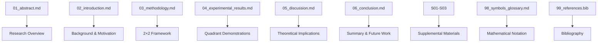

# manuscript/ - Research Manuscript

Research manuscript for "Active Inference as a Meta-Pragmatic and Meta-Epistemic Method".

## Manuscript Structure

This project includes the following sections:

### Main Sections (01-09)
- `01_abstract.md` - Research overview and key contributions
- `02_introduction.md` - Motivation, background, and research questions
- `03_methodology.md` - Core 2×2 framework and theoretical development
- `04_experimental_results.md` - Quadrant demonstrations and validation
- `05_discussion.md` - Theoretical implications and interpretations
- `06_conclusion.md` - Summary, contributions, and future directions
- `08_acknowledgments.md` - Funding and acknowledgments
- `09_appendix.md` - Technical details and extended derivations

### Supplemental Sections (S01-S03)
- `S01_supplemental_methods.md` - Extended methodological details
- `S02_supplemental_results.md` - Additional examples and analysis
- `S03_supplemental_analysis.md` - Advanced theoretical analysis

### Reference Sections (98-99)
- `98_symbols_glossary.md` - Mathematical notation and symbols
- `99_references.bib` - Bibliography in BibTeX format

### Configuration Files
- `config.yaml` - Paper metadata and rendering configuration
- `preamble.md` - LaTeX preamble customizations

## Rendering Process

The manuscript is rendered through these stages:

1. **Discovery**: All `.md` files are discovered and categorized
2. **Individual Rendering**: Each section rendered to PDF separately
3. **Combination**: All sections combined into single manuscript PDF
4. **Output**: Generated files placed in `../../output/pdf/`

View detailed rendering logs to see which sections were included.

## Quick Start

```bash
# Edit manuscript sections
vim 03_methodology.md

# Generate PDF
python3 ../../scripts/03_render_pdf.py --project active_inference_meta_pragmatic

# View result
open ../../output/active_inference_meta_pragmatic/pdf/active_inference_meta_pragmatic_combined.pdf
```

## Key Features

- **Academic paper structure** (abstract, introduction, methods, results, discussion, conclusion)
- **LaTeX mathematical notation** (equations, matrices, cross-references)
- **Cross-references** to figures, equations, and sections
- **BibTeX bibliography** with academic citations
- **Supplemental materials** for extended analysis

## Common Commands

### Edit Sections
```bash
vim 01_abstract.md       # Research summary
vim 03_methodology.md   # Theoretical framework
vim 04_experimental_results.md  # Demonstrations
vim 05_discussion.md     # Implications
```

### Generate PDF
```bash
python3 ../../scripts/03_render_pdf.py --project active_inference_meta_pragmatic
```

### Validate Content
```bash
python3 -m infrastructure.validation.cli markdown .
```

## Architecture



## More Information

See [AGENTS.md](AGENTS.md) for complete technical documentation.
