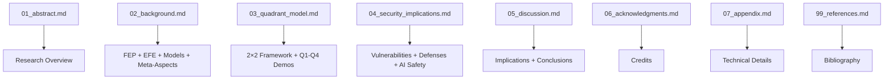

# manuscript/ - Research Manuscript

Research manuscript for "Active Inference as a Meta-Pragmatic and Meta-Epistemic Method".

## Manuscript Structure

### Main Sections

| Section | File | Description |
|---------|------|-------------|
| Abstract | `01_abstract.md` | Research overview and key contributions |
| **Background** | `02_background.md` | FEP, EFE, generative models, meta-aspects |
| **Quadrant Model** | `03_quadrant_model.md` | 2×2 framework with inline visualizations |
| **Security** | `04_security_implications.md` | Cognitive security and AI safety |
| **Discussion** | `05_discussion.md` | Implications, limitations, conclusions |
| Acknowledgments | `06_acknowledgments.md` | Credits and acknowledgments |
| Appendix | `07_appendix.md` | Technical details and derivations |

### Reference Sections

- `98_symbols_glossary.md` - Mathematical notation and symbols
- `99_references.md` - Bibliography references

### Configuration Files

- `config.yaml` - Paper metadata and rendering configuration
- `preamble.md` - LaTeX preamble customizations
- `references.bib` - BibTeX bibliography

## Key Features

- **Consolidated 4-section structure** (Background, Quadrant Model, Security, Discussion)
- **Inline figures** placed with their introductions, not at document end
- **LaTeX mathematical notation** (equations, matrices, cross-references)
- **Academic citations** via BibTeX

## Rendering

```bash
# Generate PDF
python3 ../../scripts/03_render_pdf.py --project active_inference_meta_pragmatic

# View result
open ../../output/active_inference_meta_pragmatic/pdf/active_inference_meta_pragmatic_combined.pdf
```

## Validation

```bash
python3 -m infrastructure.validation.cli markdown .
```

## Architecture



## More Information

See [AGENTS.md](AGENTS.md) for technical documentation.
