# src/ - Active Inference Meta-Pragmatic Framework

Core implementation of Active Inference as a meta-(pragmatic/epistemic) methodology.

## Quick Start

```python
from active_inference import ActiveInferenceFramework
from generative_models import GenerativeModel

# Create generative model
model = GenerativeModel(
    A_matrix=np.array([[0.8, 0.2], [0.3, 0.7]]),
    B_matrix=np.array([[0.9, 0.1], [0.1, 0.9]]),
    C_matrix=np.array([[0.7, 0.3], [0.4, 0.6]]),
    D_matrix=np.array([0.5, 0.5])
)

# Initialize framework
framework = ActiveInferenceFramework(model)

# Calculate Expected Free Energy
efe = framework.calculate_expected_free_energy(
    current_state=np.array([0.5, 0.5]),
    policy=np.array([0.6, 0.4])
)
```

## Key Features

- **Active Inference Framework**: EFE calculations and policy selection
- **Free Energy Principle**: System boundary analysis and structure preservation
- **Quadrant Framework**: 2×2 matrix for cognitive process analysis
- **Generative Models**: Probabilistic models with A, B, C, D matrices
- **Meta-Cognition**: Confidence assessment and adaptive control
- **Modeler Perspective**: Dual role analysis (architect and subject)

## Common Commands

### Import Core Modules
```python
from active_inference import ActiveInferenceFramework
from free_energy_principle import FreeEnergyPrinciple
from quadrant_framework import QuadrantFramework
from generative_models import GenerativeModel
from meta_cognition import MetaCognitiveSystem
from modeler_perspective import ModelerPerspective
```

### Run Tests
```bash
pytest ../tests/ -v
```

## Architecture

```mermaid
graph TD
    A[ActiveInferenceFramework] --> B[EFE Calculation]
    A --> C[Policy Selection]
    A --> D[Perception as Inference]
    
    E[FreeEnergyPrinciple] --> F[System Boundary]
    E --> G[Structure Preservation]
    
    H[QuadrantFramework] --> I[2×2 Matrix]
    H --> J[Processing Levels]
    
    K[GenerativeModel] --> L[A, B, C, D Matrices]
    K --> M[Bayesian Inference]
    
    N[MetaCognitiveSystem] --> O[Confidence Assessment]
    N --> P[Adaptive Control]
    
    Q[ModelerPerspective] --> R[Epistemic Framework]
    Q --> S[Pragmatic Framework]
```



## More Information

See [AGENTS.md](AGENTS.md) for technical documentation.
