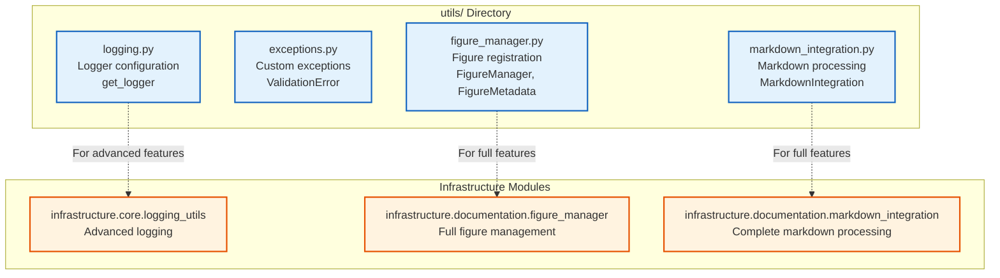

# utils/ - Project Utility Modules

Quick reference for project-specific utility modules in the Active Inference Meta-Pragmatic Framework.

## Overview

The `utils/` directory provides lightweight utility modules for logging, exception handling, figure management, and markdown integration. These utilities complement the generic infrastructure modules with project-specific functionality.

## Quick Start

```python
# Logging
from projects.active_inference_meta_pragmatic.src.utils.logging import get_logger
logger = get_logger(__name__)
logger.info("Starting analysis")

# Exception Handling
from projects.active_inference_meta_pragmatic.src.utils.exceptions import ValidationError
raise ValidationError("Validation failed", context={"data": data})

# Figure Management
from projects.active_inference_meta_pragmatic.src.utils.figure_manager import FigureManager
fig_manager = FigureManager()
metadata = fig_manager.register_figure("plot.png", "Convergence analysis")
```

## Module Structure



## Modules

### logging.py
- `get_logger(name: str) -> logging.Logger` - Get configured logger

### exceptions.py
- `ValidationError` - Custom exception with context and suggestions

### figure_manager.py
- `FigureManager` - Register and manage figures
- `FigureMetadata` - Figure metadata dataclass

### markdown_integration.py
- `MarkdownIntegration` - Basic markdown processing (stub implementation)

## Usage Examples

### Logging
```python
from projects.active_inference_meta_pragmatic.src.utils.logging import get_logger

logger = get_logger(__name__)
logger.info("Processing data")
logger.debug("Detailed debug info")
```

### Figure Registration
```python
from projects.active_inference_meta_pragmatic.src.utils.figure_manager import FigureManager

fig_manager = FigureManager()
metadata = fig_manager.register_figure(
    filename="convergence.png",
    caption="Optimization convergence",
    section="Results"
)
```

## Integration with Infrastructure

For advanced features, use infrastructure modules:
- **Logging**: `infrastructure.core.logging_utils` for advanced logging
- **Figures**: `infrastructure.documentation.figure_manager` for full figure management
- **Markdown**: `infrastructure.documentation.markdown_integration` for complete markdown processing

## See Also

- [AGENTS.md](AGENTS.md) - Complete technical documentation
- [../AGENTS.md](../AGENTS.md) - Project source documentation
- [../../../../infrastructure/core/AGENTS.md](../../../../infrastructure/core/AGENTS.md) - Infrastructure utilities
